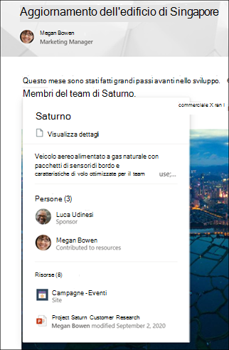

# Panoramica delle esperienze degli argomenti (anteprima)

> [!Note] 
> Il contenuto di questo articolo è relativo all'anteprima privata di Project Cortex. [Altre informazioni su Project Cortex](https://aka.ms/projectcortex).

L'argomento Experiences utilizza la tecnologia Microsoft AI, Microsoft 365, Microsoft Graph, Search e altri componenti e servizi per creare una rete di conoscenze nell'ambiente Microsoft 365. 

 

> [!VIDEO https://www.microsoft.com/videoplayer/embed/RE4LhZP]  

 

L'obiettivo è quello di convertire le informazioni in conoscenza e recapitarle agli utenti nelle app che utilizzano tutti i giorni, ad esempio le pagine di SharePoint moderne e Microsoft Search.

L'argomento experiences contribuisce a risolvere un problema aziendale importante in molte società, fornendo le informazioni agli utenti quando necessario. Ad esempio, i nuovi dipendenti devono imparare rapidamente molte nuove informazioni e incontrare termini di cui non sanno nulla durante la lettura tramite le informazioni della società. Per ulteriori informazioni, è possibile che l'utente debba allontanarsi da quello che sta facendo e spendere tempo prezioso per la ricerca di dettagli, ad esempio per sapere quali sono i termini, per i quali l'organizzazione è un esperto in materia e, in alcuni casi, per i siti e i documenti correlati al termine.

L'argomento Experiences utilizza Ia per cercare e identificare automaticamente gli **argomenti** nell'organizzazione. Vengono compilate informazioni su di esse, ad esempio una descrizione breve, persone che lavorano sull'argomento e siti, file e pagine correlate. Un responsabile della conoscenza o un collaboratore può scegliere di aggiornare le informazioni sull'argomento in base alle esigenze. Gli argomenti sono disponibili per gli utenti, il che significa che per ogni istanza dell'argomento visualizzato in un sito di SharePoint moderno in notizie e pagine, il testo verrà evidenziato. Gli utenti possono scegliere di selezionare l'argomento per ulteriori informazioni su di esso tramite l'argomento dettagli. Gli argomenti possono essere trovati anche nella ricerca di SharePoint.

## Modalità di visualizzazione degli argomenti per gli utenti

Quando un argomento viene menzionato nel contenuto nelle notizie e nelle pagine di SharePoint, lo si vedrà evidenziato. È possibile aprire il riepilogo degli argomenti dall'evidenziazione. Aprire l'argomento dettagli dal titolo del riepilogo. L'argomento menzionato potrebbe essere identificato automaticamente o essere stato aggiunto alla pagina con un riferimento diretto all'argomento dall'autore della pagina. 

      

## Indicizzazione delle informazioni

L'argomento Experiences utilizza la tecnologia Microsoft AI per identificare gli **argomenti** nell'ambiente Microsoft 365.

Un argomento è una frase o un termine che è un'organizzazione significativa o importante. Ha un significato specifico per l'organizzazione e dispone di risorse correlate che possono aiutare gli utenti a capire cosa è e trovare ulteriori informazioni.

Quando viene identificato un argomento e AI determina che dispone di informazioni sufficienti affinché sia un argomento consigliato, viene creata una **pagina di argomento** contenente informazioni raccolte tramite l'indicizzazione degli argomenti, ad esempio:

- Nomi alternativi e/o acronimi.
- Breve descrizione dell'argomento.
- Utenti che potrebbero essere informati sull'argomento.
- File, pagine e siti correlati all'argomento.

Gli amministratori della Knowledge base possono scegliere di eseguire la ricerca per indicizzazione in tutti i siti di SharePoint del tenant per gli argomenti o solo per selezionare alcuni.

## Ruoli

Quando si utilizza l'argomento experiences nell'ambiente Microsoft 365, gli utenti avranno i ruoli seguenti:

- Visualizzatore argomenti: utenti che saranno in grado di visualizzare gli argomenti evidenziati nei siti moderni di SharePoint a cui hanno almeno accesso in *lettura* e in Microsoft Search. Saranno in grado di selezionare l'argomento Highlights per visualizzare i dettagli dell'argomento nelle pagine degli argomenti. Gli utenti visualizzatori potranno fornire commenti e suggerimenti sull'utilità di un argomento.

- Collaboratori: utenti che dispongono di diritti per modificare gli argomenti esistenti o crearne di nuovi. Gli amministratori delle informazioni assegnano le autorizzazioni per i collaboratori agli utenti tramite l'argomento experiences Settings nell'interfaccia di amministrazione di Microsoft 365. Tenere presente che è inoltre possibile scegliere di assegnare a tutti gli utenti l'autorizzazione per la modifica e la creazione di argomenti in modo che tutti possano contribuire agli argomenti visualizzati.

- Knowledge Manager: utenti che guidano gli argomenti tramite il ciclo di vita dell'argomento. Knowledge Manager utilizzare la pagina **Gestisci argomenti** del centro argomenti per confermare gli argomenti suggeriti da ai, rimuovere gli argomenti non più rilevanti, nonché modificare gli argomenti esistenti o crearne di nuovi e sono gli unici utenti che possono accedervi. Gli amministratori delle informazioni assegnano le autorizzazioni di Knowledge Manager agli utenti tramite l'argomento experiences admin Settings nell'interfaccia di amministrazione di Microsoft 365. 

- Knowledge Admins: gli amministratori delle informazioni configurano e gestiscono l'argomento tramite i controlli di amministratore nell'interfaccia di amministrazione di Microsoft 365. Attualmente, un amministratore di Microsoft 365 Global o SharePoint può fungere da amministratore della conoscenza.

Per ulteriori informazioni, vedere [Topic Experience Roles](topic-experiences-roles.md) .

## Gestione degli argomenti

La gestione degli argomenti viene svolta nella pagina **Gestisci temi** del **centro tematico** dell'organizzazione. L'argomento centro viene creato durante l'installazione e funge da centro di conoscenza per la propria organizzazione. 

Anche se tutti gli utenti con licenza saranno in grado di visualizzare gli argomenti a cui sono connessi nel centro argomenti, solo gli utenti con autorizzazioni *gestione argomenti* (Knowledge Manager) potranno visualizzare e utilizzare la pagina Gestisci argomenti.

I Knowledge Manager saranno in grado di:

- Confermare o rimuovere gli argomenti individuati nel tenant.
- Creare manualmente nuovi argomenti in base alle esigenze (ad esempio, se non sono state fornite informazioni sufficienti per essere scoperte tramite AI).
- Modificare le pagine degli argomenti esistenti. 

Per ulteriori informazioni, vedere [gestire gli argomenti nel centro](manage-topics.md) argomenti.  

## Controlli di amministratore

I controlli di amministratore nell'interfaccia di amministrazione di Microsoft 365 consentono di gestire la rete delle informazioni. Consentono a un amministratore di Microsoft 365 globale o di SharePoint di eseguire le operazioni seguenti:

- Controllare gli utenti dell'organizzazione autorizzati a visualizzare gli argomenti nelle pagine moderne di SharePoint o nei risultati della ricerca di SharePoint.
- Controllare i siti di SharePoint sottoposti a ricerca per indicizzazione per cercare gli argomenti.
- Configure topic Discovery per escludere gli argomenti specifici da trovare.
- Controllare quali utenti possono gestire gli argomenti nell'argomento centro.
- Controllare quali utenti possono creare e modificare gli argomenti nel centro argomenti.
- Controllare quale utente sarà in grado di visualizzare gli argomenti.

Per ulteriori informazioni sui controlli di amministratore, vedere [assegnare autorizzazioni utente](https://docs.microsoft.com/microsoft-365/knowledge/plan-topic-experiences#user-permissions), [gestire la visibilità degli argomenti](https://docs.microsoft.com/microsoft-365/knowledge/topic-experiences-knowledge-rules)e gestire l'individuazione degli [argomenti](https://docs.microsoft.com/microsoft-365/knowledge/topic-experiences-discovery) .

## & commenti e suggerimenti per la cura dell'argomento

L'AI continuerà a funzionare continuamente per fornire suggerimenti per migliorare gli argomenti in base alle modifiche apportate all'ambiente. 

Gli utenti a cui è consentito l'accesso per visualizzare gli argomenti nel lavoro giornaliero potrebbero essere richiesti se l'argomento è stato utile. Il sistema analizza queste risposte e le utilizza per determinare cosa viene mostrato nei riassunti degli argomenti e nei dettagli sull'argomento.

Gli utenti che dispongono di autorizzazioni di modifica o creazione di argomenti possono rendere gli aggiornamenti alle pagine dell'argomento direttamente se desiderano apportare correzioni o aggiungere altre informazioni. 

Inoltre, gli utenti con autorizzazioni appropriate possono contrassegnare elementi quali la conversazione di Yammer rilevanti per un argomento e aggiungerli a un argomento specifico. 

## Vedere anche

