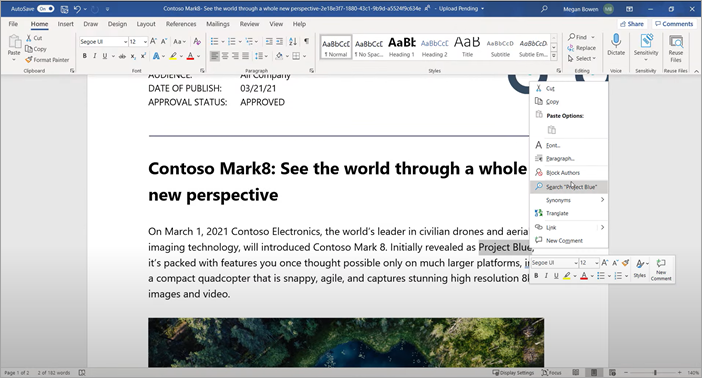

# Panoramica di Microsoft Viva Topics 

Viva Topics usa la tecnologia Microsoft AI, Microsoft 365, Microsoft Graph, Ricerca e altri componenti e servizi per far conoscere gli utenti nelle app di Microsoft 365 che usano ogni giorno SharePoint, a partire da pagine moderne, Microsoft Search e Ricerca in Word, PowerPoint, Outlook e Excel.

 

> [!VIDEO https://www.microsoft.com/videoplayer/embed/RE4LhZP]  

 

Viva Topics aiuta a risolvere un problema aziendale chiave in molte aziende, fornendo le informazioni agli utenti quando ne hanno bisogno. Ad esempio, i nuovi dipendenti devono apprendere rapidamente molte nuove informazioni e incontrano termini di cui non sanno nulla quando leggono le informazioni aziendali. Per saperne di più, l'utente potrebbe dover allontanarsi da ciò che sta facendo e dedicare tempo prezioso alla ricerca di dettagli, come informazioni su quale sia il termine, chi nell'organizzazione è un esperto in materia e forse siti e documenti relativi al termine.

Viva Topics utilizza l'intelligenza artificiale per cercare e identificare automaticamente *argomenti* nell’organizzazione. Compila informazioni su di essi, come una breve descrizione, persone che lavorano sull'argomento e siti, file e pagine ad esso correlati. Un responsabile informazioni o un collaboratore può scegliere di aggiornare le informazioni sull'argomento secondo necessità. Gli argomenti sono disponibili per gli utenti, il che significa che per ogni istanza dell'argomento che appare in un sito moderno di SharePoint nelle notizie e nelle pagine, il testo verrà evidenziato. Gli utenti possono scegliere di selezionare l'argomento per saperne di più attraverso i dettagli dell'argomento. Gli argomenti sono disponibili anche in SharePoint Search.

## Come vengono visualizzati gli argomenti agli utenti

Gli argomenti vengono visualizzati agli utenti tramite:

- [Evidenziazioni degli argomenti](topic-experiences-overview.md#topic-highlights) SharePoint pagine
- Risposte all'argomento nei [risultati della ricerca](topic-experiences-overview.md#search-results)
- Ricerca nelle [applicazioni di Office](topic-experiences-overview.md#office-application-search)
- [Home](topic-experiences-overview.md#topic-center) page del Centro argomenti

### Highlight degli argomenti

Quando un argomento viene menzionato nel contenuto delle notizie e delle pagine di SharePoint, lo vedrai evidenziato. È possibile aprire il riepilogo dell'argomento dagli highlight. Apri i dettagli dell'argomento dal titolo del riepilogo per visualizzare la pagina completa dell'argomento. L'argomento menzionato potrebbe essere identificato automaticamente o potrebbe essere stato aggiunto alla pagina con un riferimento diretto all'argomento dall'autore della pagina. 

    

### Risultati di ricerca

È possibile  visualizzare una risposta all'argomento nei risultati della ricerca quando si esegue una ricerca dalla pagina iniziale di SharePoint, si esegue una ricerca in Office.com o si esegue una ricerca da un sito di SharePoint dopo aver modificato l'ambito di ricerca in modo da includere l'organizzazione completa. La risposta all'argomento verrà visualizzata nell'argomento dell'elenco dei risultati e offrirà un breve set di informazioni relative a tale argomento. 

    

### Office applicazione di ricerca

Quando si utilizza la ricerca in app di Office quali Word, PowerPoint, Outlook o Excel, tramite la  casella di ricerca o selezionando Cerca nel menu di scelta rapida, nei risultati della ricerca vengono visualizzate le risposte all'argomento.

   

   

### Centro argomenti

Gli utenti possono visualizzare gli argomenti dell'organizzazione a cui hanno una connessione nella [home page del Centro argomenti.](topic-center-overview.md#home-page)

## Indicizzazione informazioni

Viva Topics utilizza la tecnologia Microsoft AI per identificare *argomenti* nell’ambiente Microsoft 365.

Un argomento è una frase o un termine significativo o importante dal punto di vista organizzativo. Ha un significato specifico per l'organizzazione e dispone di risorse ad essa correlate che possono aiutare le persone a capire di cosa si tratta e trovare maggiori informazioni al riguardo. Ci sono molti tipi di argomenti importanti per la tua organizzazione. Inizialmente, la tecnologia Microsoft AI si concentra sui seguenti tipi:

- Project
- Evento
- Organizzazione
- Posizione
- Prodotto
- Lavoro creativo
- Campo di studio

Quando un argomento viene identificato e l'IA determina di avere informazioni sufficienti perché esso sia un argomento suggerito, una *pagina dell’argomento* visualizza le informazioni raccolte tramite l'indicizzazione dell'argomento, come ad esempio:

- Nomi e acronimi alternativi.
- Una breve descrizione dell'argomento.
- Persone che potrebbero essere informate sull'argomento.
- File, pagine e siti correlati all'argomento.

Gli amministratori delle informazioni possono scegliere di eseguire la ricerca per indicizzazione di tutti i siti di SharePoint nel tenant o di selezionarne solo alcuni.

Per ulteriori informazioni, vedere [Individuazione e cura degli argomenti](./topic-experiences-discovery-curation.md).

## Ruoli

Quando utilizzi Viva Topics nel tuo ambiente Microsoft 365, gli utenti avranno i seguenti ruoli:

- Visualizzatori di argomenti: utenti che possono vedere gli highlights degli argomenti nei siti moderni di SharePoint a cui hanno almeno accesso in *Lettura* e in Microsoft Search. Possono selezionare gli highlights dell'argomento per visualizzarne i dettagli nelle pagine degli argomenti. I visualizzatori di argomenti possono fornire feedback sull'utilità di un argomento.

- Collaboratori: utenti che dispongono dei diritti per modificare argomenti esistenti o crearne di nuovi. Gli amministratori delle informazioni autorizzano gli utenti a collaborare tramite le impostazioni di Viva Topics nell'interfaccia di amministrazione di Microsoft 365. Si noti che è possibile anche concedere a tutti i visualizzatori di argomenti l'autorizzazione a modificare e creare argomenti in modo che tutti possano contribuire agli argomenti che vedono.

- Responsabili informazioni: utenti che guidano gli argomenti attraverso il ciclo di vita degli argomenti. I knowledge  manager utilizzano la pagina Gestisci argomenti nel Centro argomenti per confermare gli argomenti suggeriti dall'IA, rimuovere gli argomenti non più rilevanti, nonché modificare gli argomenti esistenti o crearne di nuovi e sono gli unici utenti ad accedervi. Gli amministratori delle informazioni autorizzano i responsabili delle informazioni a collaborare tramite le impostazioni di Viva Topics nell'interfaccia di amministrazione di Microsoft 365. 

- Amministratori della knowledge base: gli amministratori configurano Viva Topics e lo gestiscono tramite i controlli di amministrazione nell'Microsoft 365 di amministrazione. Attualmente, un amministratore globale di Microsoft 365 o di SharePoint può fungere da amministratore delle informazioni.

Per ulteriori informazioni, vedere [Viva Topics roles.](topic-experiences-roles.md)

## Gestione degli argomenti

La gestione degli argomenti viene eseguita nella **pagina Gestisci** argomenti nel Centro argomenti *dell'organizzazione.* Il centro argomenti viene creato durante l'installazione e funge da centro di conoscenza per l'organizzazione. 

Mentre tutti gli utenti con licenza possono visualizzare gli argomenti  a cui sono connessi nel Centro argomenti, solo gli utenti con autorizzazioni Gestione argomenti (responsabili della conoscenza) possono visualizzare e utilizzare la pagina Gestisci **argomenti.**

I responsabili informazioni possono:

- Confermare o rimuovere gli argomenti rilevati nel tuo tenant.
- Creare nuovi argomenti manualmente in base alle necessità (ad esempio, se non sono state fornite informazioni sufficienti per scoprirlo tramite IA).
- Modificare le pagine degli argomenti esistenti.

Per ulteriori informazioni, vedere [Gestire gli argomenti nel Centro argomenti.](manage-topics.md)  

## Controlli amministratore

I controlli di amministrazione nell'Microsoft 365 di amministrazione consentono di gestire Viva Topics. Consentono a un amministratore globale di Microsoft 365 o di SharePoint di:

- Controllare quali utenti dell'organizzazione possono visualizzare gli argomenti nelle pagine moderne di SharePoint o nei risultati della ricerca di SharePoint.
- Controllare quali siti di SharePoint verranno sottoposti a ricerca per indicizzazione per identificare gli argomenti.
- Escludere argomenti specifici dalla ricerca.
- Controllare quali utenti possono gestire gli argomenti nel Centro argomenti.
- Controllare quali utenti possono creare e modificare gli argomenti.
- Controllare quale utente può visualizzare gli argomenti.

Per ulteriori informazioni sui controlli di amministrazione, vedere [assegnare autorizzazioni utente,](./plan-topic-experiences.md#user-permissions) [gestire la](./topic-experiences-knowledge-rules.md)visibilità degli argomenti e [gestire l'individuazione degli argomenti.](./topic-experiences-discovery.md)

## Cura degli argomenti e feedback

L'IA lavorerà continuamente per fornirti suggerimenti per migliorare gli argomenti man mano che si verificano cambiamenti nel tuo ambiente. 

Gli utenti con autorizzazioni di modifica o creazione di argomenti possono aggiornare direttamente le pagine degli argomenti se desiderano apportare correzioni o aggiungere ulteriori informazioni. Possono anche aggiungere nuovi argomenti che l'IA non è stato in grado di identificare. Se sono disponibili informazioni sufficienti su questi argomenti aggiunti manualmente e l'intelligenza artificiale è in grado di identificare questo tipo di argomento, ulteriori suggerimenti dell'IA potrebbero migliorare questi argomenti aggiunti manualmente.

Agli utenti a cui consenti l'accesso per visualizzare gli argomenti nel lavoro quotidiano potrebbe essere chiesto se l'argomento gli è stato utile. Il sistema esamina queste risposte e le utilizza per migliorare gli highlight dell'argomento e aiutare a determinare cosa viene mostrato nei riepiloghi degli argomenti e nei dettagli dell'argomento.

Inoltre, gli utenti con le autorizzazioni appropriate possono taggare elementi come conversazioni di Yammer che sono rilevanti per un argomento e aggiungerli a un argomento specifico. 

Per ulteriori informazioni, vedere [Individuazione e cura degli argomenti](./topic-experiences-discovery-curation.md).

## Vedere anche

[Usare Microsoft Search per trovare argomenti in Viva Topics](./search.md)