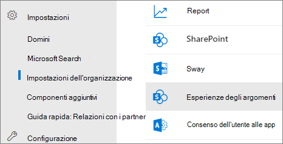
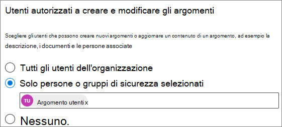
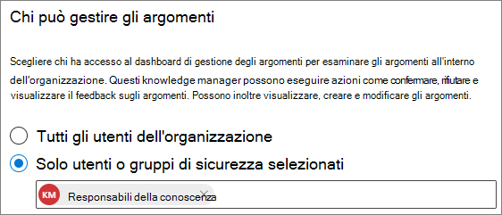

# Gestire le autorizzazioni per gli argomenti negli argomenti di Microsoft VivaManage topic permissions in Microsoft Viva Topics

È possibile gestire le impostazioni delle autorizzazioni per gli argomenti [nell'interfaccia di amministrazione di Microsoft 365.](https://admin.microsoft.com)You can manage topic permissions settings in the [Microsoft 365 admin center](https://admin.microsoft.com). Per eseguire queste attività, è necessario essere un amministratore globale o un amministratore di SharePoint.You must be a global administrator or SharePoint administrator to perform these tasks.

Con le impostazioni delle autorizzazioni per gli argomenti è possibile scegliere:With topic permissions settings you can choose:

- Quali utenti possono creare e modificare gli argomenti: creare nuovi argomenti che non sono stati trovati durante l'individuazione o modificare i dettagli degli argomenti esistenti.Which users can create and edit topics: Create new topics that were not found during discovery or edit existing topic details.
- Quali utenti possono gestire gli argomenti: accedere al Centro gestione argomenti e visualizzare il feedback sugli argomenti, nonché spostare gli argomenti nel ciclo di vita.Which users can manage topics: Access the topic management center and view feedback on topics as well as move topics through the lifecycle.

## Per accedere alle impostazioni di gestione degli argomenti:To access topics management settings:

1. Nell'interfaccia di amministrazione di Microsoft 365 fare clic su **Impostazioni** e **quindi su Impostazioni organizzazione.**In the Microsoft 365 admin center, click **Settings**, then **Org settings**.
2. Nella scheda **Servizi** fare clic su **Esperienze argomento.**On the **Services** tab, click **Topic experiences**.

     

3. Selezionare la **scheda Autorizzazioni argomento.** Per informazioni su ogni impostazione, vedere le sezioni seguenti.Select the **Topic permissions** tab. See the following sections for information about each setting.

     

## Modificare chi dispone delle autorizzazioni per aggiornare i dettagli dell'argomentoChange who has permissions to update topic details

Per aggiornare chi dispone delle autorizzazioni per creare e modificare gli argomenti:To update who has permissions to create and edit topics:

1. Nella scheda **Autorizzazioni argomento,** in **Chi può creare e modificare gli argomenti,** selezionare **Modifica.**On the **Topic permissions** tab, under **Who can create and edit topics**, select **Edit**.
2. Nella pagina **Chi può creare e modificare gli argomenti,** è possibile selezionare:On the **Who can create and edit topics** page, you can select:
    - **Tutti gli utenti dell'organizzazione****Everyone in your organization**
    - **Solo utenti o gruppi di sicurezza selezionati****Only selected people or security groups**
    - **Nessuno****No one**

      

3. Selezionare **Salva**.Select **Save**.

Per aggiornare chi dispone delle autorizzazioni per gestire gli argomenti:To update who has permissions to manage topics:

1. Nella scheda **Autorizzazioni argomento,** in **Chi può gestire gli argomenti,** selezionare **Modifica.**On the **Topic permissions** tab, under **Who can manage topics**, select **Edit**.
2. Nella pagina **Chi può gestire gli argomenti** è possibile selezionare:On the **Who can manage topics** page, you can select:
    - **Tutti gli utenti dell'organizzazione****Everyone in your organization**
    - **Utenti o gruppi di sicurezza selezionati****Selected people or security groups**

      

3. Selezionare **Salva**.Select **Save**.

## Vedere ancheSee also

[Gestire l'individuazione degli argomenti negli argomenti di Microsoft VivaManage topic discovery in Microsoft Viva Topics](topic-experiences-discovery.md)

[Gestire la visibilità degli argomenti negli argomenti di Microsoft VivaManage topic visibility in Microsoft Viva Topics](topic-experiences-knowledge-rules.md)

[Modificare il nome del Centro argomenti in Microsoft Viva TopicsChange the name of the topic center in Microsoft Viva Topics](topic-experiences-administration.md)
