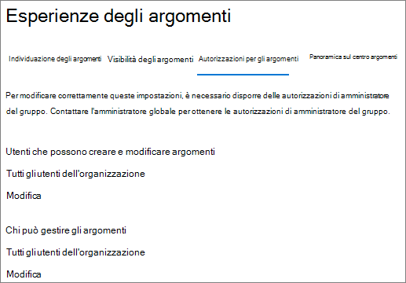

# Gestire le autorizzazioni per l'argomento in Microsoft 365

È possibile gestire le impostazioni delle autorizzazioni per l'argomento nell'interfaccia di [amministrazione di Microsoft 365](https://admin.microsoft.com). Per eseguire queste attività, è necessario essere un amministratore globale o un amministratore di SharePoint.

Con le impostazioni relative alle autorizzazioni per gli argomenti è possibile scegliere:

- Quali utenti possono creare e modificare gli argomenti: creare nuovi argomenti che non sono stati rilevati durante l'individuazione o modificare i dettagli degli argomenti esistenti.
- Quali utenti possono gestire gli argomenti: accedere all'argomento Management Center e visualizzare commenti e suggerimenti sugli argomenti, nonché spostare gli argomenti nel ciclo di vita.

## Per accedere alle impostazioni di gestione degli argomenti:

1. Nell'interfaccia di amministrazione di Microsoft 365 fare clic su **Impostazioni** e quindi su **Impostazioni org**.
2. Nella scheda **Servizi** , fare clic su **Knowledge Network**.

     

3. Selezionare la scheda autorizzazioni per l' **argomento** . Per informazioni su ogni impostazione, vedere le sezioni seguenti.

     

## Modificare gli utenti che dispongono delle autorizzazioni per aggiornare i dettagli degli argomenti

Per aggiornare gli utenti che dispongono delle autorizzazioni per la creazione e la modifica degli argomenti:

1. Nella scheda **autorizzazioni dell'argomento** , in **utenti autorizzati a creare e modificare gli argomenti**, selezionare **modifica**.
2. Nella pagina **utenti autorizzati a creare e modificare gli argomenti** è possibile selezionare:
    - **Tutti gli utenti dell'organizzazione**
    - **Solo persone o gruppi di sicurezza selezionati**
    - **Nessuno**

      

3. Selezionare **Salva**.

Per aggiornare gli utenti che dispongono delle autorizzazioni per gestire gli argomenti:

1. Nella scheda **autorizzazioni dell'argomento** , in **utenti autorizzati a gestire gli argomenti**, selezionare **modifica**.
2. Nella pagina **chi** è in grado di gestire gli argomenti, è possibile selezionare:
    - **Tutti gli utenti dell'organizzazione**
    - **Utenti o gruppi di sicurezza selezionati**

      

3. Selezionare **Salva**.

## Vedere anche

[Gestire l'individuazione degli argomenti in Microsoft 365](topic-experiences-discovery.md)

[Gestire la visibilità degli argomenti in Microsoft 365](topic-experiences-knowledge-rules.md)

[Modificare il nome del centro argomenti in Microsoft 365](topic-experiences-administration.md)
