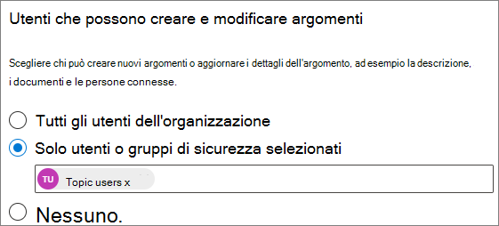

# Gestire le autorizzazioni per l'argomento in Microsoft 365Manage topic permissions in Microsoft 365

È possibile gestire le impostazioni delle autorizzazioni per l'argomento nell'interfaccia di [amministrazione di Microsoft 365](https://admin.microsoft.com).You can manage topic permissions settings in the [Microsoft 365 admin center](https://admin.microsoft.com). Per eseguire queste attività, è necessario essere un amministratore globale o un amministratore di SharePoint.You must be a global administrator or SharePoint administrator to perform these tasks.

Con le impostazioni relative alle autorizzazioni per gli argomenti è possibile scegliere:With topic permissions settings you can choose:

- Quali utenti possono creare e modificare gli argomenti: creare nuovi argomenti che non sono stati rilevati durante l'individuazione o modificare i dettagli degli argomenti esistenti.Which users can create and edit topics: Create new topics that were not found during discovery or edit existing topic details.
- Quali utenti possono gestire gli argomenti: accedere all'argomento Management Center e visualizzare commenti e suggerimenti sugli argomenti, nonché spostare gli argomenti nel ciclo di vita.Which users can manage topics: Access the topic management center and view feedback on topics as well as move topics through the lifecycle.

## Per accedere alle impostazioni di gestione degli argomenti:To access topics management settings:

1. Nell'interfaccia di amministrazione di Microsoft 365 fare clic su **Impostazioni** e quindi su **Impostazioni org**.In the Microsoft 365 admin center, click **Settings**, then **Org settings**.
2. Nella scheda **Servizi** , fare clic su **Knowledge Network**.On the **Services** tab, click **Knowledge network**.

     

3. Selezionare la scheda autorizzazioni per l' **argomento** . Per informazioni su ogni impostazione, vedere le sezioni seguenti.Select the **Topic permissions** tab. See the following sections for information about each setting.

     

## Modificare gli utenti che dispongono delle autorizzazioni per aggiornare i dettagli degli argomentiChange who has permissions to update topic details

Per aggiornare gli utenti che dispongono delle autorizzazioni per la creazione e la modifica degli argomenti:To update who has permissions to create and edit topics:

1. Nella scheda **autorizzazioni dell'argomento** , in **utenti autorizzati a creare e modificare gli argomenti**, selezionare **modifica**.On the **Topic permissions** tab, under **Who can create and edit topics**, select **Edit**.
2. Nella pagina **utenti autorizzati a creare e modificare gli argomenti** è possibile selezionare:On the **Who can create and edit topics** page, you can select:
    - **Tutti gli utenti dell'organizzazione****Everyone in your organization**
    - **Solo persone o gruppi di sicurezza selezionati****Only selected people or security groups**
    - **Nessuno****No one**

      

3. Selezionare **Salva**.Select **Save**.

Per aggiornare gli utenti che dispongono delle autorizzazioni per gestire gli argomenti:To update who has permissions to manage topics:

1. Nella scheda **autorizzazioni dell'argomento** , in **utenti autorizzati a gestire gli argomenti**, selezionare **modifica**.On the **Topic permissions** tab, under **Who can manage topics**, select **Edit**.
2. Nella pagina **chi** è in grado di gestire gli argomenti, è possibile selezionare:On the **Who can manage topics** page, you can select:
    - **Tutti gli utenti dell'organizzazione****Everyone in your organization**
    - **Utenti o gruppi di sicurezza selezionati****Selected people or security groups**

      

3. Selezionare **Salva**.Select **Save**.

## Vedere ancheSee also

[Gestire l'individuazione degli argomenti in Microsoft 365Manage topic discovery in Microsoft 365](topic-experiences-discovery.md)

[Gestire la visibilità degli argomenti in Microsoft 365Manage topic visibility in Microsoft 365](topic-experiences-knowledge-rules.md)

[Modificare il nome del centro argomenti in Microsoft 365Change the name of the topic center in Microsoft 365](topic-experiences-administration.md)
