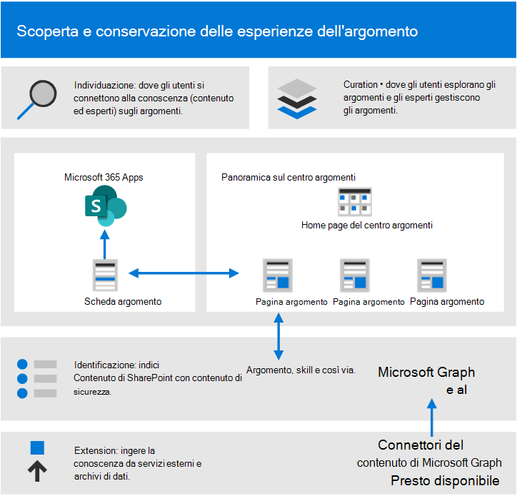
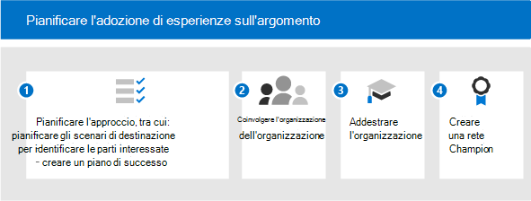

# Guida introduttiva all'adozione di esperienze di argomento (anteprima)Get started driving adoption of Topic Experiences (Preview)

> [!Note]
> Il contenuto di questo articolo è relativo all'anteprima privata di Project Cortex.The content in this article is for Project Cortex Private Preview. [Altre informazioni su Project Cortex](https://aka.ms/projectcortex).[Find out more about Project Cortex](https://aka.ms/projectcortex).

Prima di iniziare a utilizzare l'adozione, è necessario comprendere i concetti coinvolti nella gestione della conoscenza e nelle esperienze degli argomenti.Before you get started with adoption, you need to understand the concepts involved in knowledge management and topic experiences. Nel diagramma seguente vengono illustrate le operazioni eseguite durante l'individuazione e la cura di un argomento:The following diagram shows what happens during topic discovery and curation:

- **Individuazione**: gli utenti possono scoprire le conoscenze nelle app che utilizzano ogni giorno tramite le schede di argomento, ma possono anche individuare gli argomenti in Microsoft Search.**Discovery**: Users can discover knowledge in the apps they use every day through topic cards - they can also discover topics in Microsoft Search.
- **Curation**: gli esperti in materia (PMI) affinano gli argomenti tramite le pagine degli argomenti e ai apprende dal loro input.**Curation**: Subject matter experts (SMEs) refine topics through topic pages, and AI learns from their input. Il centro argomenti contiene le pagine degli argomenti che gli utenti possono esplorare e gli esperti possono gestire.The Topic center contains topic pages that users can explore and experts can manage.
- **Identificazione**: con Microsoft Graph and Intelligent Intelligence (ai) le conoscenze e le persone (argomenti, competenze e così via) vengono identificate e organizzate automaticamente in argomenti correlati.**Identification**: With Microsoft Graph and Artificial Intelligence (AI) knowledge and people (topics, skills, an so on) are identified and automatically organized into related topics. Il contenuto di SharePoint è indicizzato con contenuto di sicurezza.SharePoint content is indexed with security content.
- **Extension**: con i connettori del contenuto di Microsoft Graph (prossimamente), è possibile ingerire la conoscenza da servizi esterni e archivi di dati.**Extension**: With Microsoft Graph content connectors (coming soon), you can ingest knowledge from external services and data repositories.

Per ulteriori informazioni, è possibile esaminare la [Panoramica](knowledge-management-overview.md) di un'introduzione.For more information, you can review the [overview](knowledge-management-overview.md) for an introduction.

Tenere presente che:Keep in mind that:

- L'individuazione degli argomenti è migliorata quando è disponibile più contenuto.Topic discovery is improved when more content is available.
- La sicurezza, la privacy e la posizione dei dati vengono mantenute anche se le informazioni vengono presentate in una nuova esperienza.The security, privacy, and location of your data is preserved even though the information is presented in a new experience.
- Gli utenti hanno bisogno di una licenza per visualizzare le esperienze sugli argomenti.Users need a license to view topic experiences.
- Discovery è inizialmente sul contenuto in lingua inglese.Discovery is initially on English language content.

Per contribuire alla preparazione, riflettere su queste domande:To help prepare, think through these questions:

- Quali contenuti devono essere utilizzati per l'individuazione degli argomenti?What content should be used for topic discovery?
- Chi gestirà gli argomenti?Who will manage topics?
- Chi vedrà le schede e i punti salienti dell'argomento?Who will see topic cards and highlights?
- Quali sono gli argomenti previsti?Which topics are expected?

Esaminare l'elenco dei prerequisiti per ottenere il massimo dalle esperienze sugli argomenti seguenti:Review this list of prerequisites for getting the most out of topic experiences:

|Prodotto o caratteristicaProduct or feature |DescrizioneDescription |
|:-------|:--------|
|SharePoint Online con le pagine di SharePoint moderneSharePoint Online with modern SharePoint pages |L'argomento data mining include solo il contenuto nei siti di SharePoint e le schede degli argomenti possono essere riportate solo nelle pagine moderne.Topic mining only includes content on SharePoint sites, and topic cards can only be surfaced on modern pages.|
|Microsoft GraphMicrosoft Graph |È possibile controllare se gli argomenti sono inclusi o esclusi dalla ricerca o dall'approfondimento con le impostazioni di Microsoft Graph.You can control whether topics are included or excluded from Search or Delve with the Microsoft Graph settings. |

## Pianificare l'adozionePlan for adoption

Per pianificare l'adozione di esperienze sugli argomenti, è necessario:To plan for adoption of Topic Experiences, you need to:

1. Pianificare gli scenari di approccio e di destinazione:Plan your approach and target scenarios:
    - Considerare la definizione e la priorità degli [scenari](#target-scenarios).Think about defining and prioritizing the [scenarios](#target-scenarios).
    - Si pensi alle [parti interessate](#identify-stakeholders) e ai membri del team di progetto che devono essere coinvolti.Think about the [stakeholders](#identify-stakeholders) and project team members you need to have involved.  
    - Capire quale impatto aziendale si vuole guidare verso e come si intende [misurare il successo](#create-a-success-plan).Figure out what business impact you want to drive towards and how you're going to [measure success](#create-a-success-plan).

2. Coinvolgere la propria organizzazione:Engage your organization:
    - Identificare i gruppi aziendali e i team aziendali che devono essere coinvolti e ottenere l'allineamento tra quelli e gli scenari che si sta pianificando.Identify the business groups and business teams that need to be involved and gain alignment across those and the scenarios that you're planning.
    - Iniziare a pensare a come coinvolgere alcuni early adopter per ottenere commenti critici e tempestivi in modo da poter iterare fino a raggiungere la soluzione migliore.Start thinking about how to engage some early adopters to get critical, early feedback so you can iterate to get to the best solution.
    - Iniziare a creare la community e riflettere su come gli argomenti possono essere utilizzati all'interno dell'organizzazione da questi diversi gruppi.Start building the community and think about how Topic Experiences can be used across your organization by these different groups.

3. Formare la propria organizzazione: la maggior parte delle persone comprenderà in modo intuitivo il concetto degli argomenti e le modalità di compilazione delle informazioni rilevanti e di comprensione e visualizzazione del valore.Train your organization: Most people will intuitively understand the concept of topics and how topic cards compile relevant information, and understand and see the value. Tuttavia, è possibile creare una formazione adatta alla propria cultura e all'organizzazione, in modo da mostrare come si desidera utilizzare l'argomento nell'org. Alcune risorse di formazione:But you might want to create training that is tailored to your own culture and organization, to show how you want Topic Experiences to be used in your org. Some training resources:
    - [Centro risorse di Project Cortex](https://aka.ms/projectcortex).[Project Cortex Resource Center](https://aka.ms/projectcortex). Include panoramiche e informazioni sulle caratteristiche, video e presentazioni di Office hour registrate e informazioni sui partner e sulle loro offerte.Includes overviews and feature information, recorded office hour videos and presentations, and information about partners and their offerings.
    - Prossimamente, video per la formazione e assistenza per gli utenti finali.Coming soon, training videos and help for end users.

4. [Creare una rete Champion](#build-a-champion-network):[Build a champion network](#build-a-champion-network):
    - È possibile che si disponga di community di network di pratica o campione già in vigore.You might have communities of practice or champion networks already in place. Questi sono i modi migliori per socializzare ed evangelizzare ed ottenere peer coinvolti nell'aiutarsi a vicenda.These are great ways to socialize and evangelize and get peers involved in helping each other. E possono condividere storie di successo che possono essere davvero utili.And they can share success stories which can be really valuable. Sono in grado di offrire consulenza e generare emozioni.They can offer advice and generate excitement.

### Scenari di destinazioneTarget scenarios

Il perché aiuta a determinare quale modello sarà necessario e come strutturare l'organizzazione in base alla posizione in cui verrà applicato il modello.The why helps determine what model will be needed, and how to structure your org based on where the model will be applied. Di seguito sono illustrati alcuni scenari in cui la gestione delle informazioni può aiutare l'organizzazione:Here are a few scenarios where knowledge management can help your organization:

- Addestramento & di ruolo onboarding: informazioni sulla terminologia di una nuova organizzazione, sui progetti principali e sulla cultura sono passaggi importanti nell'onboarding.Role onboarding & training: Understanding a new organization's terminology, key projects, and culture are important steps in onboarding. La facile individuazione degli argomenti può consentire ai nuovi dipendenti di velocizzare la ricerca di nuovi processi, ruoli o progetti rapidamente.Easy discovery of topics can help new employees get up to speed on new job, roles, or projects quickly.
- Individuazione delle competenze e condivisione delle informazioni: quando gli argomenti vengono gestiti e condivisi, gli utenti delle organizzazioni possono trovare più facilmente informazioni ed esperti per aiutarli a lavorare quotidianamente.Expertise finding and information sharing: When topics are managed and shared, people in your organizations can more easily find information and experts to help them in their day to day work.
- Il processo decisionale esteso e il tempo migliorato per il mercato: quando le informazioni e gli esperti sono facili da raggiungere, è possibile prendere decisioni più facilmente e radere i progetti.Expanded decision making and improved time to market: When information and experts are easy to reach, you can make decisions more easily and shave time off projects.

Ad esempio, di seguito viene descritto uno scenario per l'onboarding dei ruoli:For example, here's a scenario for role onboarding:

- Un dipendente (Giordania) sta assumendo un nuovo ruolo o è stato appena assunto e inizia solo con un ruolo.An employee (Jordan) is taking on a new role, or has been newly hired and is just starting with a role. Jordan vuole essere coinvolto e produttivo il più velocemente possibile.Jordan wants to get involved and productive as quickly as possible. Ma anche la Giordania ha bisogno di assistenza per trovare una posizione iniziale.But Jordan also need help finding a starting place.
- Un collega (Kim) che ha partecipato al ruolo prima che Jordan abbia creato le pagine degli argomenti in grado di aiutare i nuovi dipendenti e chiunque altro a cercare tali informazioni.A colleague (Kim) who was in the role before Jordan created topic pages that can help out new employees and anyone else looking for that information.
- Kim era una SME e aveva le autorizzazioni per esaminare le pagine degli argomenti non confermate.Kim was an SME and had permissions to look at unconfirmed topic pages. Le pagine degli argomenti non confermate sono un ottimo punto di partenza per ciò che l'AI ha individuato e creato e Kim è stato in grado di modificarle per aggiungere risorse, definizioni e pin di altre risorse.Unconfirmed topic pages are great starting points for what the AI has discovered and created, and Kim was able to edit them to add expert resources, definitions, and pin other resources.
- Come Jordan legge attraverso un nuovo post su SharePoint, Jordan Visualizza un argomento evidenziato e passa il mouse su di esso per ottenere rapidamente una definizione del termine e chi contattare con altre domande.As Jordan reads through a new post on SharePoint, Jordan sees a topic highlight, and hovers over it to quickly get a definition of the term and who to contact with more questions. Prima, Jordan potrebbe aver dovuto cacciare in giro per queste informazioni e contattare i colleghi per vedere chi chiedere qualcosa.Before, Jordan might have had to hunt around for this information and contact colleagues to see who to ask about something.
- L'esposizione di queste informazioni tramite l'argomento può essere potente perché, anche se queste informazioni potrebbero essere già disponibili, potrebbero essere state individuate e difficilmente reperibili.Exposing this information through Topic Experiences can be powerful, because although this information may have been available before, it might have been siloed and hard to find. Introducendo le applicazioni che Jordan utilizza e aiutando Jordan a trovare questi esperti può anche guidare un senso di fidanzamento e comunità.Bringing it into the applications that Jordan is using and helping Jordan find these experts can also drive a sense of engagement and community. È inoltre possibile aiutare Jordan a sentirsi più abilitati quando si tratta del nuovo ruolo.It can also help Jordan feel more empowered when dealing with the new role.

Dopo aver identificato gli scenari, è possibile assegnare la priorità agli scenari:After you identify your scenarios, you can prioritize the scenarios:

Un modo per assegnare la priorità è tracciare gli scenari in una griglia che mostra l'impatto e la facilità di implementazione.One way to prioritize it is to plot your scenarios out in a grid showing impact vs. ease of implementation. Cercare gli scenari che hanno un impatto elevato e che sono facili da implementare.Look for scenarios that have both high impact and are easy to implement. Rendere tali la priorità principale.Make those your top priority. Gli scenari a basso impatto e di difficile implementazione sono la priorità più bassa.Low impact and hard to implement scenarios are your lowest priority. Quando si ha una vittoria rapida con un impatto elevato, uno scenario di facile implementazione, aiuta gli utenti a essere entusiasti e a vedere le possibilità di usare gli argomenti.When you have a quick win with a high impact, easy to implement scenario, it helps people get excited and see the possibilities of using topics.

Scegliere un paio di scenari chiave su cui concentrarsi inizialmente, collaborare con i primi adottanti per ottenere commenti e suggerimenti, quindi eseguire il rollback in fasi.Pick a couple of key scenarios to focus on initially, work with your early adopters to get some feedback, and then roll out in stages. In questo modo è possibile eseguire un'iterazione, apportare miglioramenti e ottenere commenti e suggerimenti per aumentare l'adozione nel tempo.This way you can iterate, make improvements, and gain feedback so you can grow adoption over time. 

### Identificare le parti interessateIdentify stakeholders

Identificare le parti interessate per il progetto.Identify the stakeholders for your project. I ruoli principali sono lo sponsor esecutivo, il proprietario del successo e i campioni.The key roles are the Executive sponsor, Success owner, and Champions.

|RuoloRole |ResponsabilitàResponsibilities |RepartoDepartment |
|:-------|:-------|:--------|
| Sponsor esecutivo (s)Executive sponsor(s)   | Comunicare la visione e i valori di alto livello all'aziendaCommunicate high-level vision and values to the company   |  Leadership esecutivaExecutive leadership   |
| Lead del progettoProject lead(s) | Sovrintendere all'intero processo di esecuzione e implementazione del lancioOversee the entire launch execution and rollout process | Gestione dei progettiProject management |
| Amministratori della Knowledge baseKnowledge administrators| Impostare e configurare le esperienze degli argomentiSet up and configure Topic experiences | Reparto ITIT department |
| Knowledge ManagerKnowledge managers | Gestire gli argomenti e controllare la tassonomiaManage topics and oversee the taxonomy | Qualsiasi repartoAny department |
| Responsabili della tassonomiaTaxonomy managers | Controllare la tassonomiaOversee the taxonomy | Qualsiasi repartoAny department |
| Addetti agli argomenti e collaboratori dell'argomentoSubject-matter experts and topic contributors | Generare o rivedere argomenti e descrizioniGenerate or review topics and descriptions | Qualsiasi repartoAny department |
| PromotoriChampions | Contribuire a evangelizzare e gestire la gestione delle obiezioniHelp evangelize and manage objection handling | Qualsiasi reparto (personale)Any department (staff) |
| Amministratore tenantTenant administrator | Configurare le impostazioni a livello di tenantConfigure tenant-level settings | Reparto ITIT department |
| Amministratore di Power PlatformPower Platform administrator| Configurare l'ambiente dei servizi dati comuniConfigure common data services environment | Reparto ITIT department |
| Amministratore o responsabile della ricercaSearch administrator or manager | Configurare le impostazioni di ricercaConfigure search settings | Reparto ITIT department |

In un'organizzazione di dimensioni maggiori, è possibile che siano presenti più utenti in questi ruoli e che sia necessario guidare la coordinazione tra di essi.In a larger organization, you might also have multiple people in these roles, and you'll need to drive coordination amongst them. In una società di dimensioni ridotte, una singola persona può eseguire alcuni di questi ruoli.In a smaller company, a single person might perform several of these roles. I ruoli diversi potrebbero essere più coinvolti in diverse fasi del progetto.Different roles might be more involved in different phases of the project. Ad esempio, alcuni utenti sono più coinvolti nell'impostazione delle funzionalità (amministratori tenant), mentre altri non vengono coinvolti finché non si inizia a definire gli argomenti che sono più coinvolti in Sustainment (subject-matter experts and Champions).For example, some people are more involved in setting up the features (Tenant administrators), while others don't get involved until you start defining topics ore are more involved in sustainment (Subject-matter experts and Champions).
 
Se si consiglia di soddisfare tutti questi ruoli durante l'implementazione, è possibile che non siano necessari tutti per iniziare a utilizzare la soluzione identificata.Though we recommend having each of these roles fulfilled throughout your rollout, you may find that you don't require them all to get started with your identified solution.

### Creare un piano di successoCreate a success plan

Utilizzare questi indicatori per misurare il successo delle esperienze di argomento nell'organizzazione.Use these indicators to measure the success of Topic Experiences in your organization. Guardare:Look at:

1. Utilizzo argomento:Topic usage:
      - Impressioni sull'argomentoTopic impressions
      - Quantità di argomenti – sia confermata che non confermata nell'elenco dei topic curati.Quantity of topics – both confirmed and unconfirmed in your curated topic list.
      - Numero di pagine degli argomenti pubblicati.Number of published topic pages.
1. Commenti degli utenti finali dalle schede degli argomenti.End user feedback from topic cards.
1. Eseguire indagini sulla soddisfazione dei dipendenti.Do employee satisfaction surveys. Gli argomenti devono migliorare la capacità dei dipendenti di trovare informazioni, quindi trovare i modi per raccogliere i propri input e commenti e suggerimenti su questo argomento.Topics should improve employees' ability to find information, so find ways to gather their input and feedback on that.
1. Impatto positivo sull'analisi delle ricerche.Positive impact to search analytics. Poiché gli argomenti vengono visualizzati nell'esperienza di ricerca, è possibile che nel tempo vengano visualizzate tariffe abbassate delle ricerche abbandonate perché gli utenti sono più facilmente in grado di trovare gli argomenti in search.Because topics appear in the search experience, over time you might see lowered rates of abandoned searches because people are more easily able to find the topics in search. 

### Creare una rete ChampionBuild a champion network

Creare una rete Champion nell'organizzazione.Build a champion network in your organization. I campioni sono importanti perché possono:Champions are important because they can:

- Creare un cerchio di influenza tra i teamCreate a circle of influence amongst their teams
- Gestione degli argomenti dell'unità & manutenzioneDrive topic management & maintenance

È possibile reclutare campioni provenienti da ruoli diversi – Knowledge Manager e esperti in materia.You can recruit champions from different roles – Knowledge Managers and subject-matter experts.

Molte reti di campioni sfruttano Yammer come piattaforma.Lots of champion networks leverage Yammer as their platform. In Yammer, gli utenti possono postare domande e ottenere risposte e condividere storie di successo.In Yammer, people can post questions and get answers, and share success stories. È difficile ottenere la parola da solo, quindi è possibile fare affidamento sulla rete di persone in tutta la società per offrire consulenza ai propri coetanei e mostrare in che modo il team utilizza le esperienze degli argomenti per consentire ad altri team di riflettere sui propri scenari.It's hard to get the word out alone, so you can rely on the network of people throughout your company to offer advice to their peers and show how their team is using Topic Experiences so other teams can think about their own scenarios.

Alcune organizzazioni utilizzano hackathons (formale o informale, virtuale o di persona) per raccogliere gruppi di persone per lavorare a un progetto specifico.Some organizations are using hackathons (formal or informal, virtual or in person) to gather groups of people to work on a specific project. Ad esempio, è possibile riunire gli esperti del soggetto e farli collaborare per curare un insieme di pagine di argomento.For example, you could gather your subject-matter experts and have them work together to curate a set of topic pages.

Pensa a come riuscire a riconoscere i campioni.Think about how you can recognize your champions. Premiare le loro attività, dare loro un certo riconoscimento e generare una sensazione e un impegno comuni visibili in modo che si sentano come stanno contribuendo a qualcosa e stanno anche ottenendo qualcosa di nuovo da esso.Reward their activities, give them some recognition, and generate a visible community feeling and engagement so that they feel like they're contributing to something and they're also getting something back from it.

Ora che si è pronti per l'implementazione, si vuole essere sicuri di incoraggiare l'impegno in continuazione.Now that you're ready to roll out, you want to make sure that you're encouraging ongoing engagement.

- Mantenere i gruppi di Yammer attivi per i campioni.Maintain active Yammer groups for your champions.
- Condividere storie di successo.Share success stories.
- Ospitare periodicamente ulteriori eventi di fidanzamento per condividere storie o introdurre nuove funzionalità.Periodically host additional engagement events to share stories or introduce new features.
- Impostare le sfide per gli utenti e eseguire le competizioni.Set challenges for people and run competitions.

## Passaggi successiviNext steps

Quando si è pronti a implementare l'argomento, è necessario coinvolgere gli utenti.When you're ready to roll out Topic Experiences, you'll need to get people involved.

- Iniziare a introdurre il set di caratteristiche e a convincerli a riflettere sugli scenari.Start introducing the feature set and getting them to think about their scenarios.
- Raccogliere le parti interessate e creare scenari.Gather the stakeholders and create scenarios.
- Guidare la community e riflettere su come si intende coinvolgerli.Drive the community and think about how you're going to engage them.
- Quindi completare la procedura di preparazione.Then complete preparation steps. Alcuni possono essere tecnici e una certa prontezza aziendale.Some may be technical readiness, and some business readiness.
- Infine, socializzare e promuovere.Finally, socialize and promote.
