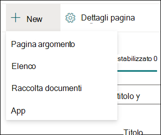

# Utilizzare gli argomenti nell'argomento centro (anteprima)

> [!Note] 
> Il contenuto di questo articolo è relativo all'anteprima privata di Project Cortex. [Altre informazioni su Project Cortex](https://aka.ms/projectcortex).

Nel centro argomenti, un responsabile della Knowledge base può esaminare gli argomenti che sono stati estratti e scoperti nei percorsi di origine di SharePoint specificati e può confermarli o rifiutarli. Un responsabile della Knowledge base può inoltre creare e pubblicare nuove pagine degli argomenti se non si è trovato nell'argomento Discovery o modificare quelli esistenti se è necessario aggiornarli.

## Requisiti

Per poter utilizzare il centro argomenti, è necessario disporre delle autorizzazioni necessarie. L'amministratore può aggiungervi durante la [configurazione della Knowledge Management](set-up-knowledge-network.md)oppure è possibile aggiungere nuovi utenti in un momento [successivo](give-user-permissions-to-the-topic-center.md).

Agli utenti del centro argomenti possono essere assegnati due set di autorizzazioni:

- Creare e modificare gli argomenti: creare nuovi argomenti o aggiornare il contenuto dell'argomento, ad esempio la descrizione, i documenti e le persone associate.

- Gestire gli argomenti: utilizzare l'argomento Management Dashboard per esaminare gli argomenti nell'organizzazione. Gli utenti possono eseguire azioni quali gli argomenti Confirm e Reject.

## Esaminare gli argomenti consigliati

Nella Home page del centro argomenti, gli argomenti che sono stati individuati nei percorsi di origine di SharePoint specificati saranno elencati nella scheda **suggerito** . Un utente con autorizzazioni per la gestione degli argomenti può esaminare gli argomenti non confermati e scegliere di confermarli o rifiutarli.

Per esaminare un argomento consigliato:

1. Nella scheda **suggerito** selezionare l'argomento per aprire la pagina dell'argomento. 

2. Nella pagina dell'argomento esaminare la pagina dell'argomento e selezionare **modifica** se è necessario apportare modifiche alla pagina.

3. Nella Home page del centro informazioni, per l'argomento selezionato, è possibile:

    1. Selezionare la casella di controllo per confermare che si desidera mantenere l'argomento.
    
    1. Selezionare la **x** se si desidera rifiutare l'argomento.

    Gli argomenti confermati verranno rimossi dall' **elenco non confermato e** verranno visualizzati nella scheda **confermata** .

    Gli argomenti rifiutati verranno rimossi dall'elenco non **confermato** e verranno visualizzati nella scheda **rifiutata o esclusa** .

## Esaminare gli argomenti confermati

Nella Home page del centro argomenti, gli argomenti che sono stati individuati nei percorsi di origine di SharePoint specificati e che sono stati confermati da un responsabile della Knowledge base o in crowdsourcing confermati da 2 o più persone tramite il meccanismo di commenti e suggerimenti della scheda saranno elencati nella scheda **confermata** . Un utente con autorizzazioni per la gestione degli argomenti può esaminare gli argomenti confermati e scegliere di rifiutarli.

Per esaminare un argomento confermato:

1. Nella scheda **confermata** selezionare l'argomento per aprire la pagina dell'argomento. 

2. Nella pagina dell'argomento esaminare la pagina dell'argomento e selezionare **modifica** se è necessario apportare modifiche alla pagina.

3. È possibile rifiutarla troppo

## Esaminare gli argomenti pubblicati
Gli argomenti pubblicati sono stati modificati in modo che le informazioni di speific vengano sempre visualizzate a chiunque incontri la pagina. Gli argomenti creati manualmente sono riportati di seguito.

   
## Creare un nuovo argomento

Se necessario, è possibile creare un nuovo argomento in un utente con le autorizzazioni Crea o modifica argomento. Potrebbe essere necessario eseguire questa operazione se l'argomento non è stato individuato tramite Discovery o se la tecnologia AI non ha trovato prove sufficienti per stabilirlo come argomento.

Per creare un nuovo argomento:

1. Nella pagina Centro argomenti selezionare **nuovo** e quindi **pagina argomento**.

    

2. Nella pagina nuovo argomento, è possibile inserire le informazioni nel nuovo modello di argomento:

    1. Nella sezione **nome in questo argomento** Digitare il nome del nuovo argomento.
    
    1. Nella sezione **Alternate Names** Digitare nomi o acronimi utilizzati anche per fare riferimento all'argomento.
    
    1. Nella sezione **Descrizione breve** Digitare una descrizione di una o due frasi dell'argomento. Questo testo verrà utilizzato per la scheda argomento associato.
    
    1. Nella sezione **utenti** Digitare i nomi degli esperti dell'argomento.
    
    1. Nella sezione **file e pagine** selezionare **Aggiungi** e quindi nella pagina successiva è possibile selezionare i file di OneDrive associati o le pagine di SharePoint Online.
    
    1. Nella sezione **siti** selezionare **Aggiungi**. Nel riquadro  **siti** che viene visualizzato selezionare i siti associati all'argomento.

    
    
3. Se è necessario aggiungere altri componenti alla pagina, ad esempio testo, immagini, WebParts, collegamenti e così via, selezionare l'icona Canvas al centro della pagina per individuarla e aggiungerla.

    

4. Al termine, fare clic su **pubblica** per pubblicare la pagina dell'argomento. Verranno visualizzate le pagine degli argomenti pubblicati nella scheda **pagine** .

> [!Note] 
> La pagina nuovo argomento è costituita da Web part che sono *Knowledge Network Aware*. Questo significa che, poiché AI riunisce altre informazioni sull'argomento, le informazioni contenute in queste web part verranno aggiornate con suggerimenti per rendere la pagina più utile agli utenti.

## Modificare una pagina di un argomento esistente

Le pagine degli argomenti esistenti sono disponibili nella pagina **pagine** . 

1. Nella pagina Centro argomenti selezionare **pagine**.

2. Nella pagina **pagine** verrà visualizzato un elenco delle pagine degli argomenti. Utilizzare la casella di ricerca per trovare la pagina di argomento che si desidera aggiornare. Fare clic sul nome della pagina dell'argomento che si desidera modificare.

3. Nella pagina dell'argomento selezionare **modifica**.

4. Apportare le modifiche necessarie per la pagina. Sono inclusi gli aggiornamenti per i seguenti campi:

    1. Nomi alternativi
    1. Descrizione
    1. Persone
    1. File e pagine
    1. Siti
    1. È inoltre possibile aggiungere elementi statici alla pagina, ad esempio testo, immagini o collegamento, selezionando l'icona Canvas.

5. Selezionare **Ripubblica** per salvare le modifiche.

<!--## See also-->

