# Presto disponibile: Configurare SharePoint come origine di contenuto di apprendimento per Microsoft Viva Learning (anteprima)

> [!NOTE]
> Le informazioni contenute in questo articolo si riferiscono a un prodotto di anteprima che potrebbe essere sostanzialmente modificato prima che venga rilasciato commercialmente. 

È possibile configurare SharePoint come origine di contenuto di apprendimento per rendere disponibile il contenuto dell'organizzazione in Viva Learning (Anteprima).

## Panoramica

L'amministratore della knowledge base (o amministratore globale) fornisce un URL del sito in cui il servizio di apprendimento può creare una posizione centralizzata vuota, ovvero l'archivio di contenuto app di apprendimento, sotto forma di un elenco SharePoint strutturato. Questo elenco può essere utilizzato dall'organizzazione per ospitare collegamenti a cartelle SharePoint che contengono contenuto didattico. Gli amministratori sono responsabili della raccolta e della cura di un elenco di URL per le cartelle. Queste cartelle devono includere solo il contenuto che può essere reso disponibile in Viva Learning (Anteprima).

Viva Learning (Anteprima) supporta i tipi di documento seguenti:

- Word, PowerPoint, Excel, PDF
- Audio (.m4a)
- Video (.mov, .mp4, .avi)

Per ulteriori informazioni, vedere la documentazione [SharePoint Online](/office365/servicedescriptions/sharepoint-online-service-description/sharepoint-online-limits?redirectSourcePath=%252farticle%252fSharePoint-Online-limits-8f34ff47-b749-408b-abc0-b605e1f6d498). 

## Autorizzazioni

Gli URL delle cartelle delle raccolte documenti possono essere raccolti da qualsiasi SharePoint dell'organizzazione. Viva Learning (Anteprima) segue tutte le autorizzazioni di contenuto esistenti. Di conseguenza, solo il contenuto per cui un utente dispone dell'autorizzazione di accesso è disponibile per la ricerca e può essere utilizzato in Viva Learning (Anteprima). Qualsiasi contenuto all'interno di queste cartelle sarà disponibile per la ricerca, ma è possibile utilizzare solo il contenuto per cui il singolo dipendente dispone delle autorizzazioni.

L'eliminazione del contenuto dall'archivio dell'organizzazione non è attualmente supportata.

Per rimuovere il contenuto inavvicinatamente in superficie, attenersi alla seguente procedura:

1.  Per limitare l'accesso alla raccolta documenti, selezionare **l'opzione Mostra** azioni e quindi selezionare **Gestisci accesso.**
     
     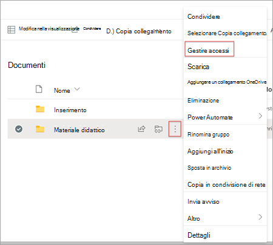

2.  Eliminare il documento originale all'interno della raccolta documenti.

Per ulteriori informazioni, vedere [Sharing and permissions in the SharePoint modern experience](/sharepoint/modern-experience-sharing-permissions). 

## Learning Service

Il servizio di apprendimento usa gli URL delle cartelle forniti per ottenere i metadati da tutto il contenuto archiviato in tali cartelle. Entro 24 ore dalla fornitura dell'URL della cartella nel repository centralizzato, i dipendenti possono cercare e utilizzare il contenuto dell'organizzazione all'interno di Viva Learning (Anteprima). Tutte le modifiche apportate al contenuto, inclusi i metadati e le autorizzazioni aggiornati, verranno applicate anche nel servizio di apprendimento entro 24 ore.

## Configurare SharePoint come origine

Per eseguire queste attività, è Microsoft 365 amministratore globale, SharePoint amministratore o amministratore della knowledge base.

Per configurare SharePoint come origini di contenuto di apprendimento in Viva Learning (Preview), attenersi alla seguente procedura:

1.  Nel riquadro di spostamento sinistro dell'Microsoft 365 di amministrazione passare **a** Impostazioni  >  **Impostazioni organizzazione**.
 
2.  Nella scheda **Servizi della**  pagina Impostazioni organizzazione selezionare **App di apprendimento (anteprima).**

     

3.  Nel pannello App di apprendimento **(anteprima),** in SharePoint, fornisce l'URL del sito del SharePoint in cui vuoi che Viva Learning crei un repository centralizzato.

     

4.  Un SharePoint viene creato automaticamente all'interno del sito SharePoint specificato.

     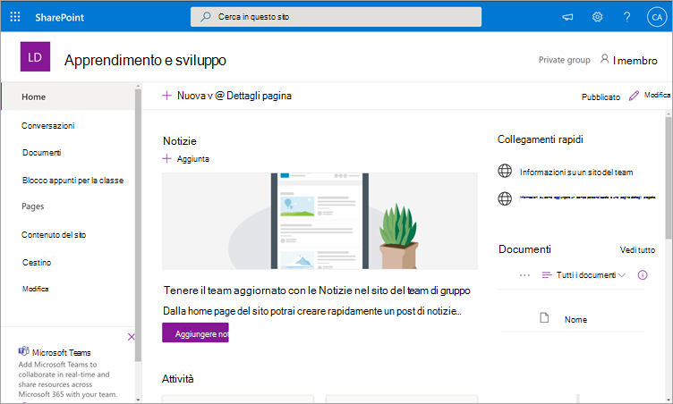

     Nel riquadro di spostamento sinistro del sito SharePoint, selezionare **Contenuto** del sito  >  **Learning App Content Repository**. 

     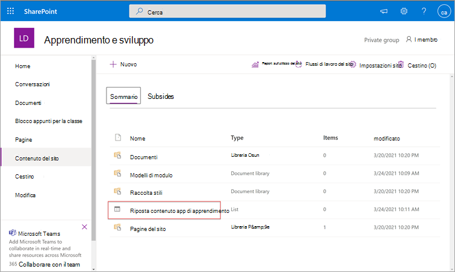 

5. Nella pagina **Archivio contenuto app** di apprendimento popolare l'SharePoint degli URL nelle cartelle del contenuto di apprendimento.

   1. Seleziona **Nuovo** per visualizzare il **pannello Nuovo** elemento. 

       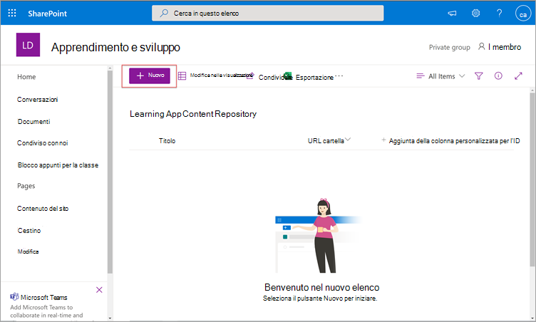
 
   2. Nel campo **Titolo del**  riquadro Nuovo elemento aggiungere un nome di directory di propria scelta. Nel campo **URL cartella** aggiungere l'URL alla cartella del contenuto di apprendimento. Selezionare **Salva**.

       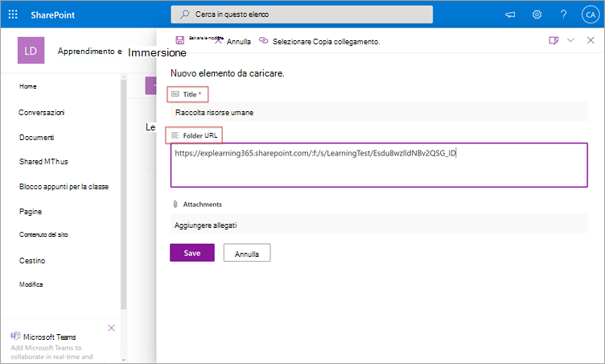

   3. La **pagina Archivio contenuto app di** apprendimento viene aggiornata con il nuovo contenuto di apprendimento.

       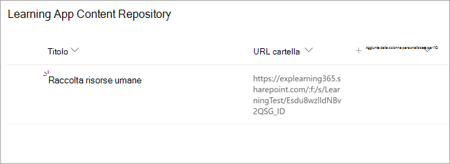

> [!NOTE]
> Per consentire un accesso più ampio all'archivio di contenuto app di apprendimento, presto sarà disponibile un collegamento all'elenco nell'interfaccia Viva Learning (anteprima), in cui gli utenti possono richiedere l'accesso e, in ultima analisi, aiutare a popolare l'elenco. I proprietari del sito e gli amministratori globali saranno tenuti a concedere l'accesso all'elenco. Access è specifico solo per l'elenco e non si applica al sito in cui è archiviato l'elenco. Per ulteriori informazioni, vedere [Fornire il contenuto dell'organizzazione](#provide-your-own-organizations-content) più avanti in questo articolo.

### Gestione raccolta documenti URL cartella

I metadati predefiniti (ad esempio la data di modifica, creati da, il nome del documento, il tipo di contenuto e il nome dell'organizzazione) vengono automaticamente estratti in Viva Learning (Anteprima) dall'API di Microsoft Graph.
 
Per migliorare l'individuazione complessiva e la pertinenza della ricerca del contenuto, è consigliabile aggiungere una **colonna Descrizione.**

Per aggiungere una **colonna Description** alla pagina della raccolta documenti, attenersi alla seguente procedura:

1.  Nella pagina **Documenti** selezionare **Aggiungi colonna.**

2. Selezionare **l'opzione** Mostra azioni e quindi selezionare **Riga di testo singola.**

     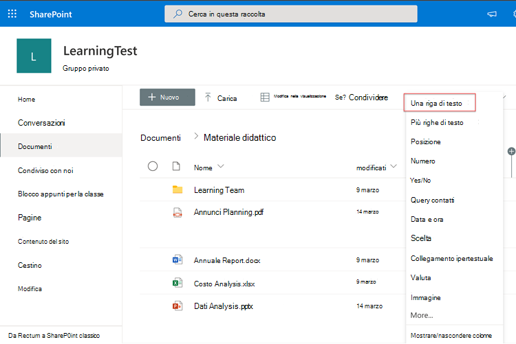

3. Nel campo **Nome del** riquadro  Crea colonna aggiungere un nome descrittivo per la colonna. Selezionare **Salva**.

     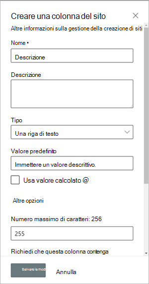
 
4. Nella **colonna** Descrizione della **pagina** Documenti aggiungere descrizioni personalizzate per ogni elemento. Se non viene fornita alcuna descrizione, Viva Learning (Anteprima) fornirà un messaggio predefinito che evidenzia il contenuto come da una raccolta SharePoint personale. 

     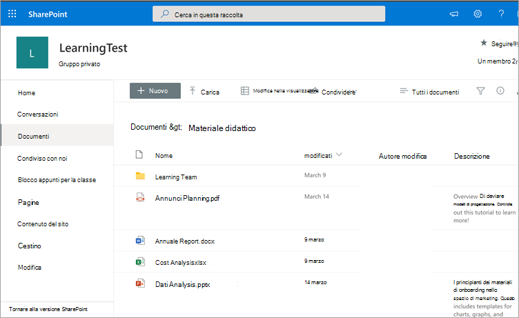
 
### Fornire il contenuto dell'organizzazione

Gli amministratori delle conoscenze possono accedere all'archivio di contenuto app di apprendimento dell'organizzazione in SharePoint, dove possono fornire riferimenti a raccolte documenti tra organizzazioni. Il contenuto all'interno di queste raccolte verrà quindi visualizzato come contenuto di apprendimento in Viva Learning (Anteprima).

1. In Viva Learning (anteprima) seleziona **Altre opzioni** (**...**) e quindi seleziona **Impostazioni**.

     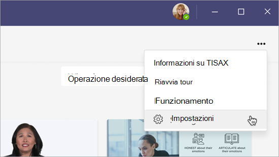
     
2. In **Impostazioni** selezionare **Autorizzazioni.**

     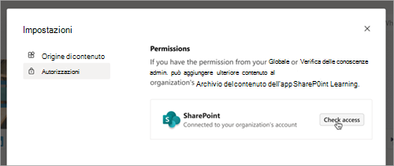

3. Selezionare **Controlla accesso** per connettersi alla raccolta centralizzata dell'organizzazione.
     
