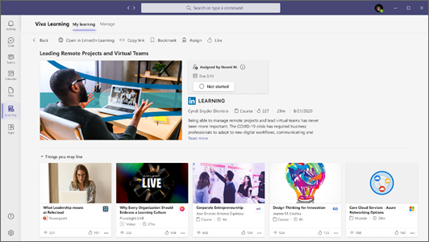

# Panoramica di Microsoft Viva Learning (anteprima) 

> [!NOTE]
> Le informazioni contenute in questo articolo si riferiscono a un prodotto di anteprima che potrebbe essere sostanzialmente modificato prima che venga rilasciato commercialmente. 

Viva Learning (Preview) è un hub di apprendimento centralizzato in Microsoft Teams che ti consente di integrare facilmente l'apprendimento e la creazione di competenze nella tua giornata. In Viva Learning (Anteprima), il team può individuare, condividere, assegnare e imparare dalle raccolte contenuto fornite dall'organizzazione e dai partner. Possono eseguire tutto questo senza lasciare Microsoft Teams.

   
 
I dipendenti hanno maggiori probabilità di segnalare di essere soddisfatti e di rimanere in un'organizzazione più a lungo quando hanno la possibilità di imparare e crescere. Viva Learning (Anteprima) semplifica la creazione di queste opportunità per l'organizzazione senza dover allontanarsi dagli strumenti di comunicazione già in uso.

## Informazioni durante l'uso

### Tutti

Viva Learning (Anteprima) semplifica l'integrazione dell'apprendimento nella giornata. Quando apri Viva Learning (Preview) in Microsoft Teams, vedrai una visualizzazione personalizzata del contenuto di apprendimento dell'organizzazione e dei partner come LinkedIn Learning. Continuando a cercare e completare ulteriori corsi di formazione, il contenuto consigliato verrà aggiornato in base agli interessi dell'utente.

- Trova facilmente opportunità di apprendimento offerte dall'organizzazione.
- Sfoglia i corsi da LinkedIn Learning, Microsoft Learn, Microsoft 365 Training, Skillsoft, Coursera, edX, Pluralsight e altri partner di apprendimento di terze parti.
- Cerca contenuti di apprendimento specifici che ti attrae o supportano i tuoi obiettivi di carriera.
- Condividere contenuti di apprendimento rilevanti, interessanti e importanti con i membri o i gruppi del team in Microsoft Teams chat o canale.
- Organizza le selezioni personalizzate del contenuto di apprendimento in Microsoft Teams e schede.
- Mi piace e salva i corsi che ti interessano.
- Riprodurre i corsi linkedIn Learning nel lettore incorporato senza uscire Microsoft Teams.

### Responsabili

Mantenere il team impegnato e aggiornato con le competenze necessarie senza dover coordinare l'apprendimento su più piattaforme. Puoi assegnare contenuti di apprendimento a singoli o gruppi, condividere contenuti con il team e tenere traccia dello stato di completamento dell'apprendimento che hai assegnato.

## Ruoli di amministratore

Gli amministratori impostano le autorizzazioni e consentono l'apprendimento delle origini di contenuto per Viva Learning (Anteprima). Per configurare Viva Learning (Anteprima), sono necessarie le autorizzazioni seguenti:

- Microsoft Teams amministratore
- Microsoft 365 amministratore globale o SharePoint amministratore
- Amministratore delle informazioni

### Amministratore delle informazioni

L'amministratore della knowledge base è un nuovo ruolo Azure Active Directory (Azure AD) nell'interfaccia di amministrazione di Microsoft 365 che può essere assegnato a tutti gli utenti dell'organizzazione. Questo ruolo gestisce le origini di contenuto di apprendimento dell'organizzazione tramite l'Microsoft 365 di amministrazione. Per ulteriori informazioni, vedere [Ruoli predefiniti di Azure AD.](/azure/active-directory/roles/permissions-reference#knowledge-administrator)

L'amministratore della knowledge base deve essere moderatamente tecnico e disporre delle credenziali SharePoint amministratore. L'amministratore della conoscenza deve essere esperto nella formazione, nell'apprendimento, nella formazione o nell'esperienza dei dipendenti nell'organizzazione.

## Per iniziare

Quando sei pronto per configurare Viva Learning (Preview) nell'ambiente Microsoft 365:

- Utilizzare l'Microsoft Teams di amministrazione per [gestire Viva Learning (Anteprima) nell'organizzazione.](set-up-teams-admin-center.md)
- Utilizzare l'Microsoft 365 di amministrazione per [configurare le origini di apprendimento disponibili per gruppi specifici.](content-sources-365-admin-center.md)
- Utilizzare l'SharePoint di amministrazione per [gestire e archiviare il proprio contenuto di apprendimento.](configure-sharepoint-content-source.md)

