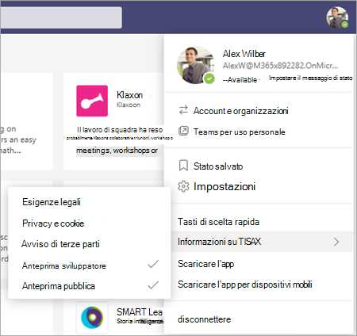
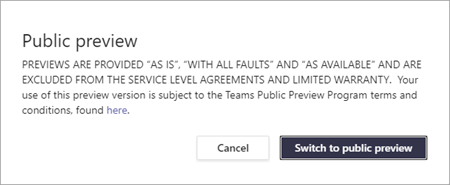
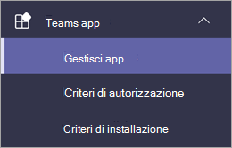
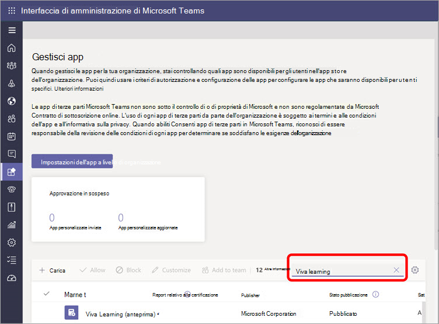
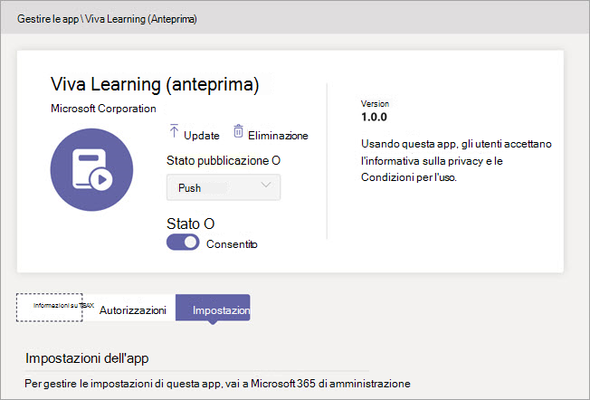

# Configurare Microsoft Viva Learning (anteprima) nell'Teams di amministrazioneSet up Microsoft Viva Learning (Preview) in the Teams admin center

> [!NOTE]
> Le informazioni contenute in questo articolo si riferiscono a un prodotto di anteprima che potrebbe essere sostanzialmente modificato prima che venga rilasciato commercialmente.The information in this article relates to a preview product that may be substantially modified before it's commercially released. 

L Teams amministratore deve eseguire alcuni passaggi per abilitare Viva Learning (Anteprima) per gli utenti nel tenant.The Teams administrator needs to perform certain steps to enable Viva Learning (Preview) for their users in the tenant. Questi passaggi variano in base alla modalità di a attivazione del tenant: [*Anteprima*](set-up-teams-admin-center.md#public-preview-tenants) pubblica [ *o Anteprima privata* (o Beta).](set-up-teams-admin-center.md#private-preview-tenants)These steps vary based on how the tenant is enabled:  [*Public Preview*](set-up-teams-admin-center.md#public-preview-tenants) or [*Private Preview* (or Beta)](set-up-teams-admin-center.md#private-preview-tenants).

## Tenant di anteprima pubblicaPublic Preview tenants

### Passaggi dell'amministratore per i tenant di anteprima pubblicaAdministrator steps for Public Preview tenants

Poiché viva Learning (anteprima) non è ancora disponibile in genere, sono necessari alcuni passaggi per abilitare le funzionalità e impostare le autorizzazioni per utenti o gruppi specifici.Because the Viva Learning (Preview) is not yet generally available, certain steps are required to enable the features and set permissions for specific users or groups. 

1. Abilita le funzionalità di anteprima pubblica per gli utenti viva Learning (anteprima).Enable Public Preview features for Viva Learning (Preview) users.

    a.a. Modificare Teams di aggiornamento per abilitare le funzionalità di anteprima pubblica.Modify Teams update policy to enable Public Preview features. Vedi [Microsoft Teams Public Preview](/microsoftteams/public-preview-doc-updates).See [Microsoft Teams Public Preview](/microsoftteams/public-preview-doc-updates).

    b.b. Abilitare i criteri di aggiornamento per gli utenti o i gruppi che eseguiranno il test Viva Learning (anteprima).Enable the update policy for users or groups who will perform Viva Learning (Preview) testing. Vedere [Assegnare criteri a utenti e gruppi.](/microsoftteams/assign-policies-users-and-groups)See [Assign policies to users and groups](/microsoftteams/assign-policies-users-and-groups).

2. Modifica i criteri di autorizzazione dell'app per gli utenti viva Learning (anteprima).Modify the app permission policy for Viva Learning (Preview) users.

    a.a. A meno che non sia attualmente parte del criterio globale, consenti tutte le app Microsoft nei criteri di autorizzazione delle app.Unless it's currently part of the global policy, allow all Microsoft apps in the app permission policy. Vedi [Gestire i criteri di autorizzazione delle app in Microsoft Teams](/microsoftteams/teams-app-permission-policies).See [Manage app permission policies in Microsoft Teams](/microsoftteams/teams-app-permission-policies). 

    b.b. Abilita i criteri di autorizzazione dell'app per gli utenti o i gruppi che eseguiranno il test viva Learning (anteprima).Enable the app permission policy for users or groups who will perform Viva Learning (Preview) testing. Vedere [Assegnare criteri a utenti e gruppi.](/microsoftteams/assign-policies-users-and-groups)See [Assign policies to users and groups](/microsoftteams/assign-policies-users-and-groups).

3. Informare gli utenti che testeranno Viva Learning (Anteprima) di passare al client di compilazione [in Anteprima pubblica per Teams](set-up-teams-admin-center.md#user-steps-for-public-preview-tenants).Notify users who will test Viva Learning (Preview) to [switch their build client to Public Preview for Teams](set-up-teams-admin-center.md#user-steps-for-public-preview-tenants).

> [!IMPORTANT]
> Per i tenant di anteprima pubblica, Viva Learning (Anteprima) non verrà visualizzato **nelle** app gestite nell'interfaccia di amministrazione di Teams fino al rilascio finale del prodotto.For Public Preview tenants, Viva Learning (Preview) will not be displayed in **Managed apps** in the Teams admin center until final product release. Tuttavia, gli utenti abilitati per l'anteprima pubblica possono trovare Viva Learning (Anteprima) nell'app store di Teams e usarlo, dopo aver configurato i criteri e le autorizzazioni corretti.However, enabled Public Preview users can find Viva Learning (Preview) in the Teams app store and use it, once the correct policies and permissions have been set up.

### Passaggi utente per i tenant di anteprima pubblicaUser steps for Public Preview tenants

Gli utenti abilitati per il test dell'anteprima pubblica, abilitando i criteri descritti [in](/microsoftteams/public-preview-doc-updates#enable-public-preview) [precedenza,](set-up-teams-admin-center.md#administrator-steps-for-public-preview-tenants) devono passare all'anteprima pubblica nel Teams client.Users who have been enabled for Public Preview testing — by enabling the [policies previously described](set-up-teams-admin-center.md#administrator-steps-for-public-preview-tenants) — need to [switch to Public Preview](/microsoftteams/public-preview-doc-updates#enable-public-preview) in their Teams client.

1. Gli utenti devono selezionare l'immagine del > **informazioni**  >  **sull'anteprima pubblica.**Users must select their profile image > **About** > **Public Preview**.

    

2. Gli utenti devono accettare i termini e le condizioni dell'anteprima pubblica.Users must accept the Public Preview terms and conditions.

    

3. Gli utenti possono ora trovare Viva Learning (anteprima) nell'app store Teams e iniziare a usarlo.Users can now find Viva Learning (Preview) in the Teams app store and start using it.

## Tenant di anteprima privatiPrivate Preview tenants

### Passaggi dell'amministratore per i tenant di Anteprima privata (o Beta)Administrator steps for Private Preview (or Beta) tenants

Per i tenant di anteprima privata, non è necessario che siano abilitati altri criteri.For Private Preview tenants, there are no additional policies that need to be enabled. Tuttavia, Viva Learning (Anteprima) deve essere reso disponibile per gli utenti dell'organizzazione.However, Viva Learning (Preview) must be made available for users in your organization.

1. Nel riquadro di spostamento sinistro dell'Teams di amministrazione passare a Teams  >  **app Gestisci app**.In the left navigation of the Teams admin center, go to **Teams apps** > **Manage apps**.

   

2. Nella casella **di ricerca della** pagina Gestisci app digitare Viva *Learning* e quindi selezionare Viva **Learning (anteprima).**On the **Manage apps** page, in the search box, type *Viva Learning*, and then select **Viva Learning (Preview)**.

   

3. Nella pagina **Viva Learning (anteprima),** in **Stato,** **selezionare** Consentito per attivare Viva Learning (anteprima).On the **Viva Learning (Preview)** page, under **Status**, select **Allowed** to turn on Viva Learning (Preview).

   

<!---
The Teams admin installs Viva Learning (Preview) and applies permission policies through the Teams admin center.

1. For Viva Learning (Preview), you must first set the Update policy in Teams. For more information, see [Microsoft Teams Public Preview](/MicrosoftTeams/public-preview-doc-updates).

    1. Sign in to the Teams admin center.

    2. Select **Teams** > **Update policies**.

    3. Select **Add**. 

    4. Name the update policy, add a policy, and turn on **Show preview features**.

2. The admin must notify users of the policy update so that they move their build into the Public Preview for Teams. 

    1. Users must select their profile image > **About** > **Public Preview**.
   
        
    
    2. Users must accept the **Public preview** terms and conditions.

        
 
3. For organizations that have restrictive policies and need to enable Viva Learning (Preview), follow the process in the next section.

## Manage settings for Viva Learning (Preview)

You must be an administrator in the Teams admin center to perform these tasks.

To make Viva Learning (Preview) available for users in your organization, follow these steps:

1. In the left navigation of the Teams admin center, go to **Teams apps** > **Manage apps**.

   

2. On the **Manage apps** page, in the search box, type *Viva learning*, and then select **Viva Learning (Preview)**.

   

3. On the **Viva Learning (Preview)** page:

   1. Under **Status**, select **Allowed** to turn on Viva Learning (Preview).

   2. On the **Settings** tab, under **App settings**, go to the Microsoft 365 admin center to [configure learning content sources](content-sources-365-admin-center.md).

   

4. After **Manage app** settings, go to **Permission policies** and **Setup policies** to grant permission to employees who should have access to Viva Learning (Preview) as part of your organization's participation in the preview.

> [!NOTE]
>  If your organization is in Ring 4.0 as part of Teams TAP100 program, you might need to enable approved users in Ring 3.0 to access Viva Learning (Preview).   As part of the preview, Viva Learning (Preview) is released in Ring 3.0. If your organization is in Ring 4.0, you won’t see Viva Learning (Preview) on the **Manage apps** page. To test the app, you need to create a custom apps permission policy, set it to **Allow all apps**, and assign it to Ring 3.0 approved users.      

--->

## Passaggio successivoNext step

[Configurare le origini di contenuto di apprendimento per Viva Learning (Anteprima) nella interfaccia di amministrazione di Microsoft 365Configure learning content sources for Viva Learning (Preview) in the Microsoft 365 admin center](content-sources-365-admin-center.md)
