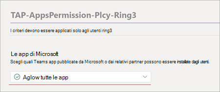

# Configurare Microsoft Viva Learning (anteprima) nell'Teams di amministrazione

> [!NOTE]
> Le informazioni contenute in questo articolo si riferiscono a un prodotto di anteprima che potrebbe essere sostanzialmente modificato prima che venga rilasciato commercialmente. 

L Teams admin installa Viva Learning (Preview) e applica i criteri di autorizzazione tramite l'Teams di amministrazione.

1. Per Viva Learning (Anteprima), devi prima impostare i criteri di aggiornamento in Teams. Per ulteriori informazioni, vedere [Microsoft Teams Public Preview](/MicrosoftTeams/public-preview-doc-updates).

    1. Accedere all'interfaccia Teams di amministrazione.

    2. Selezionare **Teams**  >  **Criteri di aggiornamento**.

    3. Selezionare **Aggiungi**. 

    4. Assegnare un nome al criterio di aggiornamento, aggiungere un criterio e attivare **Mostra funzionalità di anteprima.**

2. L'amministratore deve informare gli utenti dell'aggiornamento dei criteri in modo che spostino la build nell'anteprima pubblica per Teams. 

    1. Gli utenti devono selezionare l'immagine del > **informazioni**  >  **sull'anteprima pubblica.**
   
        
    
    2. Gli utenti devono accettare i **termini e le condizioni di anteprima** pubblica.

        
 
3. Per le organizzazioni che hanno criteri restrittivi e devono abilitare Viva Learning (Preview), seguire il processo nella sezione successiva.

## Gestire le impostazioni per Viva Learning (anteprima)

Per eseguire queste attività, è Teams amministratore dell'interfaccia di amministrazione.

Per rendere Viva Learning (Anteprima) disponibile per gli utenti dell'organizzazione, attenersi alla seguente procedura:

1. Nel riquadro di spostamento sinistro dell'Teams di amministrazione passare a Teams  >  **app Gestisci app**.

   

2. Nella casella **di ricerca della** pagina Gestisci app digitare Viva *learning* e quindi selezionare Viva **Learning (anteprima).**

   

3. Nella pagina **Viva Learning (Anteprima):**

   1. In **Stato** seleziona **Consentito per** attivare Viva Learning (Anteprima).

   2. Nella scheda **Impostazioni,** in **Impostazioni app,** passare all'interfaccia di amministrazione Microsoft 365 per [configurare le origini di contenuto didattiche.](content-sources-365-admin-center.md)

   

4. Dopo Gestire le impostazioni   **dell'app,** vai a Criteri di autorizzazione e Criteri di installazione per concedere l'autorizzazione ai dipendenti che devono avere accesso a Viva Learning (Preview) come parte della partecipazione dell'organizzazione all'anteprima.

> [!NOTE]
>  Se l'organizzazione si trova nel Circuito 4.0 come parte del programma TAP100 di Teams, potrebbe essere necessario abilitare gli utenti approvati nel Circuito 3.0 per accedere a Viva Learning (Anteprima).   Come parte dell'anteprima, Viva Learning (Preview) viene rilasciato nel Circuito 3.0. Se l'organizzazione si trova nel Circuito 4.0, viva learning (anteprima) non verrà visualizzato nella **pagina Gestisci** app. Per testare l'app, devi creare un criterio di autorizzazione per le app personalizzate, impostarlo su Consenti tutte le app e assegnarlo agli utenti approvati di Ring 3.0.      

## Passaggio successivo

[Configurare le origini di contenuto di apprendimento per Viva Learning (anteprima) nell'Microsoft 365 di amministrazione](content-sources-365-admin-center.md)
