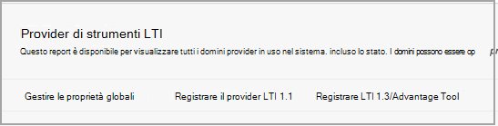

# Usare Microsoft Teams classi con Blackboard

> [!IMPORTANT]
> Alcune informazioni fanno riferimento alle caratteristiche del prodotto prima del rilascio, e possono essere modificate sostanzialmente prima della distribuzione al pubblico. Microsoft non fornisce alcuna garanzia, esplicita o implicita, in relazione alle informazioni contenute in questo documento.

Microsoft Teams classi è un'app LTI (Learning Tools Interoperability) che consente a docenti e studenti di spostarsi facilmente tra il Learning Management System (LMS) e il Teams. Gli utenti possono accedere ai team di classe associati al corso direttamente dall'LMS.

## Approvare l'app nel tenant Microsoft Azure app

Le attività seguenti vengono completate dall'amministratore Microsoft Office 365 e dall'amministratore di Blackboard Learn Ultra.

Prima di gestire l'integrazione all'interno di Blackboard Learn Ultra, l'amministratore di Microsoft Office 365 deve approvare la blackboard **MSFT Teams for Learn Ultra Azure** app for the institution's Microsoft Azure tenant.

1. Trovare l'ID tenant Microsoft. Vedere [come trovare il tenant](/azure/active-directory/fundamentals/active-directory-how-to-find-tenant).

2. Reindirizzare l'endpoint di consenso dell'amministratore di Microsoft Identity Platform in base all'esempio seguente:

   `https://login.microsoftonline.com/{tenant}/adminconsent?client_id=2d94989f-457a-47c1-a637-e75acdb11568`

   > [!NOTE]
   > Sostituire {tenant} con l'ID tenant Microsoft dell'organizzazione.

## Registrare le app di integrazione

Come amministratore di Blackboard Learn Ultra, dovrai registrare 2 app di integrazione LTI 1.3 nell'ambiente di testing:

- La blackboard Learn Class Teams integrazione per supportare la sincronizzazione dell'elenco

- App LTI Microsoft Teams team di classe

1. Prendere nota degli ID client LTI seguenti per entrambe le app:

    - Lavagna - f1561daa-1b21-4693-ba90-6c55f1a0eb41

    - Microsoft - 027328b7-c2e3-4c9e-aaa1-07802dae6c89

2. Accedere al Pannello di amministrazione e in **Integrazioni** individuare i provider di strumenti LTI.

   

3. Selezionare **Register LTI1.3/Advantage Tool**.

4. Immetti il primo degli ID client forniti (Blackboard o Microsoft) e seleziona **Invia.**

5. Esaminare le impostazioni precompilato e verificare che lo stato dello strumento sia contrassegnato come approvato.

6. Scorrere verso il basso e quindi selezionare **Invia.**

7. Ripeti i passaggi precedenti per registrare la seconda delle app LTI nell'ambiente.

## Configurare l'applicazione REST e la condivisione delle risorse tra origini

L'amministratore di Blackboard Learn Ultra dovrà anche configurare l'applicazione REST e la configurazione di Condivisione risorse tra origini.

Completare le operazioni seguenti per configurare l'applicazione REST

1. Accedi agli strumenti di amministrazione di Learn e quindi seleziona **Integrazioni API REST** nella **sezione Integrazioni.**

2. Seleziona **Crea integrazioni** e immetti lo stesso ID applicazione/client immesso per lo strumento Blackboard Learn Class Teams Integration LTI.

3. Immetti Learn User (potrebbe essere il tuo nome utente amministratore learn) o seleziona **Sfoglia** per individuarlo.

4. Selezionare **Sì** per **Accesso utente finale.**

5. Selezionare **Sì** per **Autorizzato ad agire come utente**

6. Selezionare **Invia** al termine.

## Configurare condivisione risorse tra origini

1. Accedere a Strumenti di amministrazione di Learn e selezionare **Condivisione risorse tra** origini nella sezione **Integrazioni.**

2. Selezionare **Crea configurazione**.

3. Immettere `https://bb-ms-teams-ultra-ext.api.blackboard.com` l'origine.

4. Aggiungere la parola **Autorizzazione** nelle **intestazioni consentite.**

5. Impostare **Disponibile** su **Sì**.

6. Selezionare **Invia** al termine.

## Enable Class Teams in Blackboard Learn

Dopo aver abilitato gli strumenti LTI, il passaggio successivo consisterà nel configurare l'integrazione di Microsoft Class Teams dal tenant Microsoft Office 365 proprio. Puoi farlo seguendo questi passaggi come amministratore di Blackboard Learn Ultra.

1. In **Learn Admin** Tools and  >  **Utilities** selezionare Microsoft Teams Integration **Admin.**

   

2. Selezionare la casella di controllo **Abilita Microsoft Teams**.

3. Immetti l'ID tenant come riferimento nella sezione in Amministratore di Microsoft O365

 > [!NOTE]
 > Non potrai salvare le impostazioni finché l'app non viene approvata dall'amministratore di O365. Vedi [Approvare l'app in Microsoft Azure tenant](#approve-the-app-in-the-microsoft-azure-tenant).

4. Quando l'amministratore globale di O365 ha approvato l'applicazione blackboard Teams nel tenant Microsoft, selezionare **Invia**.
