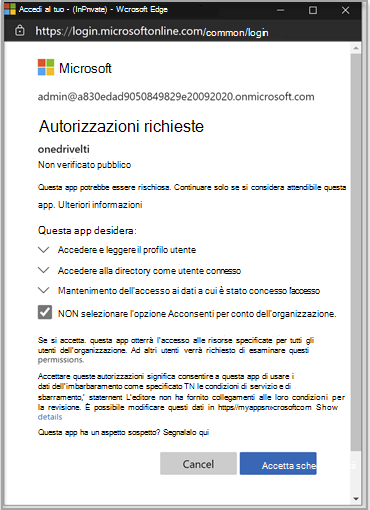

# Usare Microsoft OneDrive LTI con Canvas

> [!IMPORTANT]
> Alcune informazioni fanno riferimento alle caratteristiche del prodotto prima del rilascio, e possono essere modificate sostanzialmente prima della distribuzione al pubblico. Microsoft non fornisce alcuna garanzia, esplicita o implicita, in relazione alle informazioni contenute in questo documento.

## Integrazione con Canvas

La persona che esegue questa integrazione deve essere un amministratore di Canvas e un amministratore del tenant Microsoft 365 tenant.

1. Accedi al portale di Microsoft Azure con l'account di amministratore tenant. Anche l'amministratore tenant di Azure deve avere il ruolo di amministratore del gruppo.

    

2. Accedere al portale di Microsoft [OneDrive LTI](https://odltiappnl.azurewebsites.net/admin).

3. Accettare le autorizzazioni per completare l'accesso.

    

4. Selezionare **Aggiungi tenant LTI**.

     

5. Seleziona **Piattaforma consumer LTI** come **canvas nell'elenco** a discesa.

6. Seleziona **URL di base** canvas e quindi seleziona **Avanti.**

    

   Nella schermata successiva vengono mostrati i campi riservati all'utente.

7. Selezionare **Avanti** da ?? pagina. I REVISORI POSSONO COMPILARE LO SPAZIO VUOTO QUI?

8. Seleziona **Avanti** nella schermata che mostra informazioni riservate all'utente.

   La schermata finale del portale di Azure mostra i passaggi successivi per aggiungere l'istanza canvas.

9. Copia le chiavi per sviluppatori da questa schermata. Userai quando crei l'istanza Canvas.

## Aggiungere l'istanza canvas

1. Nell'istanza canvas deseleziona **Admin**  >  **Developer Keys.**

2. Scegli **LTI Key** nell'elenco a discesa in **Developer Key.**

   

3. Incolla qui le chiavi per sviluppatori.

     

   Il tasto viene creato in **modalità OFF**

   

4. Copiare il testo evidenziato.
    Questo viene utilizzato come ID client Microsoft OneDrive portale LTI.

5. Incollare il testo nel **campo ID client** Microsoft OneDrive portale LTI e quindi selezionare **Avanti.**

6. Selezionare **Salva**.

7. Visualizzare le impostazioni selezionando **Visualizza tenant LTI**.
