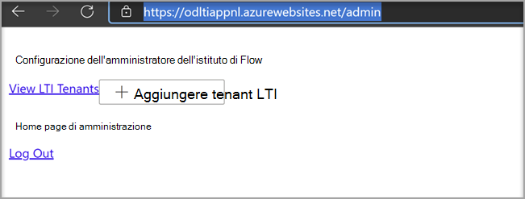

# Usare Microsoft OneDrive LTI con CanvasUse Microsoft OneDrive LTI with Canvas

> [!IMPORTANT]
> Alcune informazioni fanno riferimento alle caratteristiche del prodotto prima del rilascio, e possono essere modificate sostanzialmente prima della distribuzione al pubblico.Some information relates to prereleased product which may be substantially modified before it's commercially released. Microsoft non fornisce alcuna garanzia, esplicita o implicita, in relazione alle informazioni contenute in questo documento.Microsoft makes no warranties, express or implied, with respect to the information provided here.

## Integrazione con CanvasIntegrate with Canvas

La persona che esegue questa integrazione deve essere un amministratore di Canvas e un amministratore del tenant Microsoft 365 tenant.The person who performs this integration should be an admin of Canvas and an admin of the Microsoft 365 tenant.

1. Accedi al portale di Microsoft Azure con l'account di amministratore tenant.Sign in to the Microsoft Azure portal with the tenant admin account. Anche l'amministratore tenant di Azure deve avere il ruolo di amministratore del gruppo.The Azure tenant administrator should also have the Group administrator role.

    

2. Accedere al portale di Microsoft [OneDrive LTI](https://odltiappnl.azurewebsites.net/admin).Sign in to the Microsoft [OneDrive LTI portal](https://odltiappnl.azurewebsites.net/admin).

3. Accettare le autorizzazioni per completare l'accesso.Accept the permissions to complete the sign-in.

    

4. Selezionare **Aggiungi tenant LTI**.Select **Add LTI Tenant**.

     

5. Seleziona **Piattaforma consumer LTI** come **canvas nell'elenco** a discesa.Select **LTI Consumer Platform** as **Canvas** from the dropdown.

6. Seleziona **URL di base** canvas e quindi seleziona **Avanti.**Select **Canvas Base URL** and then select **Next**.

    

   Nella schermata successiva vengono mostrati i campi riservati all'utente.The next screen shows fields that are confidential to you.

7. Selezionare **Avanti** da ??Select **Next** from ?? pagina.page. I REVISORI POSSONO COMPILARE LO SPAZIO VUOTO QUI?CAN REVIEWERS FILL IN THE BLANK HERE?

8. Seleziona **Avanti** nella schermata che mostra informazioni riservate all'utente.Select **Next** in the screen that shows information that's confidential to you.

   La schermata finale del portale di Azure mostra i passaggi successivi per aggiungere l'istanza canvas.The final screen of the Azure portal shows the next steps for adding your Canvas instance.

9. Copia le chiavi per sviluppatori da questa schermata.Copy the Developer Keys from this screen. Userai quando crei l'istanza Canvas.You'll use when you create the Canvas instance.

## Aggiungere l'istanza canvasAdd the Canvas instance

1. Nell'istanza canvas deseleziona **Admin**  >  **Developer Keys.**In your Canvas instance, deselect **Admin** > **Developer Keys**.

2. Scegli **LTI Key** nell'elenco a discesa in **Developer Key.**Choose **LTI Key** in the dropdown on **Developer Key**.

   

3. Incolla qui le chiavi per sviluppatori.Paste the developer keys here.

     

   Il tasto viene creato in **modalità OFF**The key gets created in **OFF** mode

   

4. Copiare il testo evidenziato.Copy the highlighted text.
    Questo viene utilizzato come ID client Microsoft OneDrive portale LTI.This serves as Client ID in Microsoft OneDrive LTI portal.

5. Incollare il testo nel **campo ID client** Microsoft OneDrive portale LTI e quindi selezionare **Avanti.**Paste the text into the **Client ID** field in Microsoft OneDrive LTI portal, and then select **Next**.

6. Selezionare **Salva**.Select **Save**.

7. Visualizzare le impostazioni selezionando **Visualizza tenant LTI**.View the settings by selecting **View LTI Tenants**.
