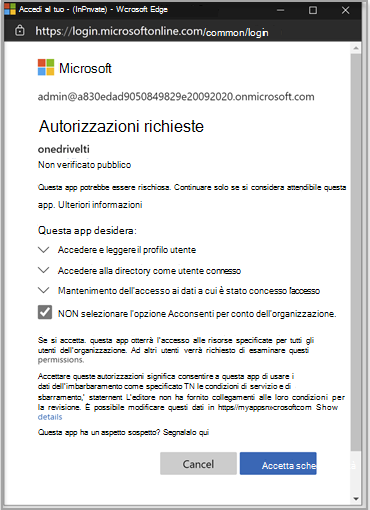
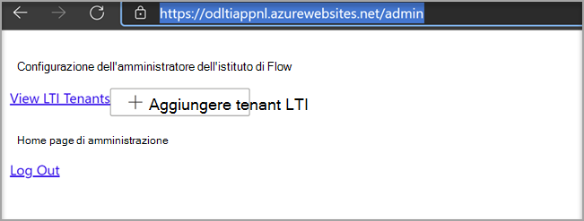
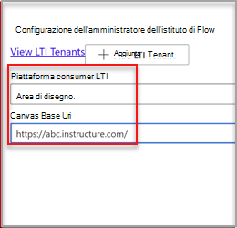
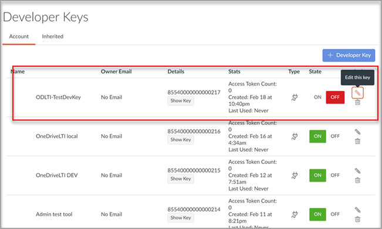

# Usare Microsoft OneDrive con il sistema di gestione dell'apprendimento

> [!IMPORTANT]
> Alcune informazioni fanno riferimento alle caratteristiche del prodotto prima del rilascio, e possono essere modificate sostanzialmente prima della distribuzione al pubblico. Microsoft non fornisce alcuna garanzia, esplicita o implicita, in relazione alle informazioni contenute in questo documento.

Scopri i vantaggi dell'uso Microsoft OneDrive con il sistema LMS (Learning Management System).

**Consente Microsoft Office 365 direttamente nei flussi di lavoro**

L'app Microsoft OneDrive Learning Tools Interoperability (LTI) si integra con il sistema LMS per portare Microsoft OneDrive e Microsoft Office 365 direttamente nei flussi di lavoro più importanti che includono:

- Allegare risorse e organizzare il contenuto.
- Avvio di documenti di collaborazione.
- Creazione e classificazione delle assegnazioni.

**Sicuro e completamente conforme agli standard LTI più recenti**

L Microsoft OneDrive app LTI è compatibile con LTI 1.3 e LTI Advantage. Questo vantaggio consente un'esperienza utente altamente sicura e strettamente integrata.

**Esperienza utente moderna e ricca**

L Microsoft OneDrive app LTI offre il meglio di Microsoft direttamente nell'esperienza LMS. Stiamo migliorando l'integrazione di Office 365 esistente nel sistema LMS offrendo un'esperienza utente più moderna, completa di una selezione file Microsoft OneDrive nuova ed estesa e di esperienze di modifica più complete per i file Office. Microsoft sarà anche completamente proprietaria dell'Microsoft OneDrive LTI App in futuro, il che significa che potrai sempre ottenere automaticamente le versioni più recenti e più recenti di Microsoft.

L Microsoft OneDrive app LTI consente di:

- Allegare Office 365 file di Word, inclusi documenti di Word, PowerPoint presentazioni e Excel dall'Editor contenuto rtf.

- Distribuire Office 365 assegnazioni cloud.

- Visualizzare e organizzare i file personali e Microsoft OneDrive corso.

- Creare collaborazioni in cui i membri del corso possono collaborare a documenti condivisi in tempo reale.

- Accedere a più Microsoft OneDrive, inclusi gli account personali e dell'istituto di istruzione.

- Integrare Office 365 file con i moduli del corso.

- Usa il tuo account Microsoft per l'accesso Single #A0 con il sistema LMS.

## Integrazione con Canvas

La persona che esegue questa integrazione deve essere un amministratore di Canvas e un amministratore del tenant Microsoft 365 tenant.

1. Accedi al portale di Microsoft Azure con l'account di amministratore tenant. Anche l'amministratore tenant di Azure deve avere il ruolo di amministratore del gruppo.

    

2. Accedere al portale di Microsoft [OneDrive LTI](https://odltiappnl.azurewebsites.net/admin).

3. Accettare le autorizzazioni per completare l'accesso.

    

4. Selezionare **Aggiungi tenant LTI**.

     

5. Seleziona **Piattaforma consumer LTI** come **canvas nell'elenco** a discesa.

6. Seleziona **URL di base** canvas e quindi seleziona **Avanti.**

    

   Nella schermata successiva vengono mostrati i campi riservati all'utente.

7. Selezionare **Avanti** da ?? pagina. I REVISORI POSSONO COMPILARE LO SPAZIO VUOTO QUI?

8. Seleziona **Avanti** nella schermata che mostra informazioni riservate all'utente.

   La schermata finale del portale di Azure mostra i passaggi successivi per aggiungere l'istanza canvas.

9. Copia le chiavi per sviluppatori da questa schermata. Userai quando crei l'istanza Canvas.

## Aggiungere l'istanza canvas

1. Nell'istanza canvas deseleziona **Admin**  >  **Developer Keys.**

2. Scegli **LTI Key** nell'elenco a discesa in **Developer Key.**

   

3. Incolla qui le chiavi per sviluppatori.

     

   Il tasto viene creato in **modalità OFF**

   

4. Copiare il testo evidenziato.
    Questo viene utilizzato come ID client Microsoft OneDrive portale LTI.

5. Incollare il testo nel **campo ID client** Microsoft OneDrive portale LTI e quindi selezionare **Avanti.**

6. Selezionare **Salva**.

7. Visualizzare le impostazioni selezionando **Visualizza tenant LTI**.
