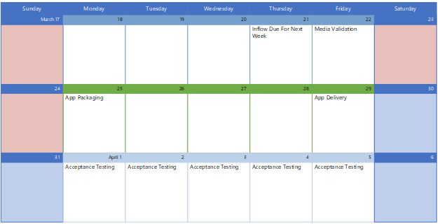

# Lavorare con Microsoft Consulting Services

Puoi interagire con Microsoft Consulting Services (MCS) per ottenere le tue app in pacchetto per l'uso con Microsoft Managed Desktop. Per dettagli esatti, contatta il rappresentante dell'account per contattare MCS e impostare l'ambito del progetto di creazione di pacchetti di app specifico.

## Ruoli e responsabilità

Per usare il pacchetto dell'app MCS, **devi fornire questi elementi:**

- I file del programma di installazione di origine(ad esempio, setup.exe o msi).
- Le istruzioni di installazione, che specificano i dettagli sull'aspetto dell'installazione finale. Ad esempio, dovrebbe essere presente un collegamento desktop all'app? Qual è la visibilità dell'app? L'app deve connettersi a un server e, in tal caso, quale? Per informazioni dettagliate, vedere il modello di richiesta [di creazione di pacchetti dell'applicazione](https://github.com/MicrosoftDocs/microsoft-365-docs/raw/public/microsoft-365/managed-desktop/get-ready/downloads/app-packaging-template.docx).
- Devi eseguire test di accettazione personalizzati per verificare che l'app funzioni come necessario nell'ambiente.

**MCS si occuperà di queste azioni:**

- Verifica se l'app è proibita o limitata nell'ambiente Microsoft Managed Desktop.
- Test di installazione, avvio e disinstallazione dell'app per garantire la compatibilità con Windows 10. Se MCS rileva un problema di compatibilità, l'app verrà consegnata al programma [Desktop App Assure](/fasttrack/win-10-desktop-app-assure) per la correzione.
- Creare il pacchetto dell'app per le specifiche e quindi testare la distribuzione dell'app tramite Microsoft Intune.

## Pianificazione recapito app

Avvia il processo di creazione di pacchetti caricando le informazioni sull'app nel portale Microsoft Managed Desktop. Il team di creazione di pacchetti rivede i nuovi invii ogni giovedì. Dopo la revisione e la creazione del pacchetto, le app in pacchetto vengono recapitate il venerdì seguente. L'avvio può contenere fino a cinque app a settimana, ma il servizio può essere ridimensionato in base alle proprie esigenze.

Una volta recapitata l'app, ti verrà notificato. A questo punto, hai 21 giorni per eseguire il test di accettazione e approvare il lavoro nel portale Microsoft Managed Desktop. Se rileva un problema con l'app durante il test di accettazione, rifiuta l'app nel portale Microsoft Managed Desktop e verrà connesso tramite posta elettronica con un packager MCS per comprendere e risolvere il problema.

## Test di account e ambiente

Per consentire al team di creazione di pacchetti di completare la migrazione a Microsoft Intune, è consigliabile fornire determinate autorizzazioni:
 
-   Accesso alle funzionalità di distribuzione delle app di Microsoft Intune per il programma di creazione di pacchetti per aggiungere e assegnare l'app 
-   Gruppi di test, account utente e licenze per i packager per poter testare le app

McS utilizzerà tali autorizzazioni per eseguire le azioni seguenti:
 
-   Verifica del funzionamento dell'app nella macchina virtuale configurata per Microsoft Managed Desktop
-   Caricamento dell'app in Microsoft Intune per la distribuzione agli utenti

Senza queste autorizzazioni, è possibile che MCS si sposti in avanti, ma non sarà in grado di caricare le applicazioni nell'ambiente.