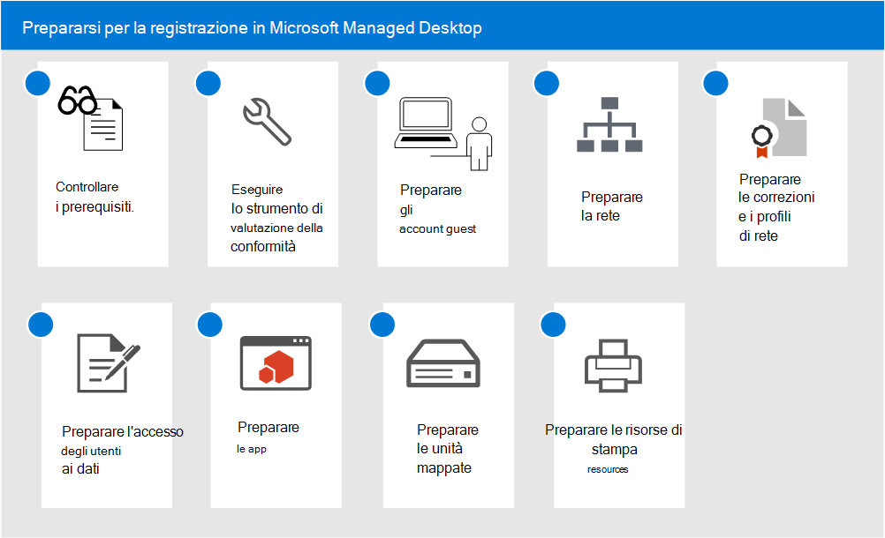

# Prepararsi per la registrazione in Microsoft Managed DesktopGet ready for enrollment in Microsoft Managed Desktop

Questi argomenti descrivono la procedura che è necessario eseguire nella propria organizzazione per prepararsi alla registrazione, incluso il controllo del rispetto dell'ambiente da parte dei prerequisiti principali, la configurazione delle reti, la configurazione dei certificati e la preparazione delle app per l'inclusione nel servizio.These topics describe the steps you'll need to take in your organization to prepare for enrollment, including checking that your environment meets key prerequisites, configuring networks, setting up certificates, and preparing your apps for inclusion in the service. Dopo aver eseguito gli strumenti di valutazione dell’idoneità, è possibile completare gli altri passaggi in qualsiasi ordine o in parallelo.Once you have run the readiness assessment tools, you can complete the other steps in any order or in parallel. A seconda dell'ambiente, alcuni passaggi potrebbero non essere pertinenti per l'utente.Depending on your environment, some of the steps might not be relevant to you.

1. Rivedere i [prerequisiti per Microsoft Managed Desktop](prerequisites.md).Review [prerequisites for Microsoft Managed Desktop](prerequisites.md).
2. Usare gli [strumenti di valutazione dell'idoneità](readiness-assessment-tool.md).Use [readiness assessment tools](readiness-assessment-tool.md).
3. [Prerequisiti per gli account GuestPrerequisites for guest accounts](guest-accounts.md)
4. [Configurazione rete in Microsoft Managed DesktopNetwork configuration for Microsoft Managed Desktop](network.md)
5. [Preparare certificati e profili di rete per Microsoft Managed DesktopPrepare certificates and network profiles for Microsoft Managed Desktop](certs-wifi-lan.md)
6. [Preparare l'accesso alle risorse locali per Microsoft Managed DesktopPrepare on-premises resources access for Microsoft Managed Desktop](authentication.md)
7. [App in Microsoft Managed DesktopApps in Microsoft Managed Desktop](apps.md)
8. [Preparare unità mappate per Microsoft Managed DesktopPrepare mapped drives for Microsoft Managed Desktop](mapped-drives.md)
9. [Preparare risorse di stampa per Microsoft Managed DesktopPrepare printing resources for Microsoft Managed Desktop](printing.md)
