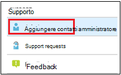

# Aggiungere e verificare i contatti degli amministratori nel portale di amministrazione

Esistono diversi modi in cui il servizio Microsoft Managed Desktop comunica con i clienti. Per semplificare la comunicazione e verificare che il controllo venga effettuato con gli utenti giusti, è necessario fornire un set di contatti di amministratore. Microsoft Managed Desktop IT Operations contatterà queste persone per risolvere i problemi di assistenza per il tenant.

> [!IMPORTANT]
> Potrebbe essere già stato aggiunto questi contatti nel portale di amministrazione. In caso affermativo, prendere un momento per verificare che l'elenco dei contatti sia accurato, in quanto Microsoft Managed Desktop **deve** essere in grado di raggiungerli se si verifica un grave incidente.

## Azure Active Directory Access per il portale di amministrazione di Microsoft Managed Desktop

Il portale di amministrazione di Microsoft Managed Desktop richiede che gli utenti che accedono al portale dispongano di uno di questi ruoli di Azure Active Directory (AD):
- Amministratore globale
- Amministratore del servizio Intune
- Ruolo con autorizzazioni di lettura globali
- Amministratore del supporto tecnico

È necessario che l'amministratore globale sia quello che deve registrare la propria organizzazione in Microsoft Managed Desktop. Tutti e cinque i ruoli dispongono dello stesso accesso all'interno del portale di amministrazione per avviare e visualizzare le attività. Per ulteriori informazioni sull'assegnazione di questi ruoli in Azure AD, vedere [autorizzazioni per il ruolo di amministratore in Azure Active Directory](https://docs.microsoft.com/azure/active-directory/users-groups-roles/directory-assign-admin-roles). 

## Aree di contatto di amministrazione dello stato attivo

I contatti amministrativi devono essere la persona o il gruppo migliore in grado di rispondere alle domande e prendere decisioni per diverse aree di interesse. **Microsoft Managed Desktop Operations contatterà questi contatti di amministrazione per le domande relative alle richieste di supporto presentate dal cliente.** Questi contatti di amministratore ricevono notifiche per gli aggiornamenti delle richieste di supporto e i nuovi messaggi. Tra queste aree sono incluse le seguenti:

Area di interesse | Per domande su
--- | ---
Pacchetti app | Risoluzione dei problemi relativi agli imballaggi delle app
Dispositivi | Integrità del dispositivo, risoluzione dei problemi con i dispositivi Microsoft Managed Desktop
Sicurezza | Risoluzione dei problemi di sicurezza con i dispositivi Microsoft Managed Desktop
Supporto tecnico IT | nei casi in cui il personale di supporto passa oltre i ticket degli utenti finali al di fuori delle aree di supporto di Microsoft Managed Desktop 
Altro | Per i problemi non coperti da altre aree

**Chiunque sia scelto per questi contatti deve avere le conoscenze e l'autorità necessarie per prendere decisioni per l'ambiente desktop Microsoft gestito.** Quando si esegue l'onboarding dell'ambiente Microsoft Managed Desktop, viene richiesto di aggiungere contatti per il supporto tecnico e la sicurezza locali. 

I contatti amministrativi sono necessari quando si [Invia una richiesta di supporto](../service-description/support.md). È necessario disporre di un contatto di amministrazione per l'area dello stato attivo della richiesta di supporto. 

**Per aggiungere contatti di amministratore**

1.  Accedere al [portale di amministrazione di Microsoft Managed Desktop](https://aka.ms/mwaasportal). 

2.  In **supporto**, selezionare **contatti di amministratore**. 

    

3. Seleziona **Aggiungi**.

    

4.  Selezionare un' **area di messa a fuoco** e immettere le informazioni per il contatto. 

    

5. Ripetere l'attività per ogni area di interesse. 

## Passaggi per iniziare a utilizzare Microsoft Managed Desktop

1. Aggiungere e verificare i contatti di amministratore nel portale di amministrazione (questo argomento)
2. [Modificare l'accesso condizionale](conditional-access.md)
3. [Assegnare licenze](assign-licenses.md)
4. [Installare il portale aziendale di Intune nei dispositivi](company-portal.md)
5. [Abilitare Enterprise State Roaming](enterprise-state-roaming.md)
6. [Configurare i dispositivi Microsoft Managed Desktop](set-up-devices.md)
7. [Preparare gli utenti a usare i dispositivi](get-started-devices.md)
8. [Distribuire le app ai dispositivi](deploy-apps.md)
