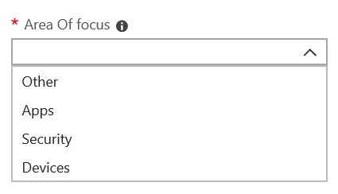

# Aggiungere e verificare i contatti degli amministratori nel portale di amministrazioneAdd and verify admin contacts in the Admin portal

Esistono diversi modi in cui Microsoft Managed Desktop servizio comunica con i clienti.There are several ways that Microsoft Managed Desktop service communicates with customers. Per semplificare la comunicazione e verificare che stiamo controllando con le persone giuste, è necessario fornire un set di contatti di amministratore.To streamline communication and ensure we’re checking with the right people, you need to provide a set of admin contacts. Microsoft Managed Desktop Le operazioni IT contattano queste persone per assistenza nella risoluzione dei problemi relativi al tenant.Microsoft Managed Desktop IT Operations will contact these people for assistance troubleshooting issues for your tenant.

> [!IMPORTANT]
> Questi contatti potrebbero essere già stati aggiunti nel portale di amministrazione.You might have already added these contacts in the Admin portal. In tal caso, è necessario verificare che l'elenco dei contatti  sia accurato, perché Microsoft Managed Desktop essere in grado di raggiungerli se si verifica un incidente grave.If so, take a moment now to double-check that the contact list is accurate, since Microsoft Managed Desktop **must** be able to reach them if a severe incident occurs.

## Azure Active Directory accesso per Microsoft Managed Desktop admin portalAzure Active Directory access for Microsoft Managed Desktop Admin portal

Microsoft Managed Desktop Il portale di amministrazione richiede che gli utenti che accedono al portale Azure Active Directory (AD):Microsoft Managed Desktop Admin portal requires that people accessing the portal have one of these Azure Active Directory (AD) roles:

- Amministratore globaleGlobal Administrator
- Amministratore del servizio IntuneIntune Service Administrator
- Ruolo con autorizzazioni di lettura globaliGlobal Reader
- Service Support AdministratorService Support Administrator

L'amministratore globale deve essere quello per registrare l'organizzazione in Microsoft Managed Desktop.The Global Administrator must be the one to enroll your organization in Microsoft Managed Desktop. Tutti e cinque i ruoli hanno lo stesso accesso nel portale di amministrazione per avviare e visualizzare le attività.All five roles have the same access within the Admin portal to initiate and view tasks. Per ulteriori informazioni sull'assegnazione di questi ruoli in Azure AD, vedere [Autorizzazioni del ruolo di amministratore in Azure Active Directory](/azure/active-directory/users-groups-roles/directory-assign-admin-roles).For more information on assigning these roles in Azure AD, see [Administrator role permissions in Azure Active Directory](/azure/active-directory/users-groups-roles/directory-assign-admin-roles).

## Aree di contatto dell'amministratoreAdmin contact areas of focus

I contatti dell'amministratore devono essere la persona o il gruppo migliori in grado di rispondere alle domande e prendere decisioni per diverse aree di interesse.Admin contacts should be the best person or group that can answer questions and make decisions for different areas of focus. **Microsoft Managed Desktop Le operazioni contattano questi contatti dell'amministratore per domande relative alle richieste di supporto inviate dal cliente.****Microsoft Managed Desktop Operations will contact these Admin contacts for questions involving support requests filed by the customer.** Questi contatti di amministratore riceveranno notifiche per gli aggiornamenti delle richieste di supporto e i nuovi messaggi.These Admin contacts will receive notifications for support request updates and new messages. Queste aree includono:These areas include:

Area di messa a fuocoArea of focus | Per domande suFor questions about
--- | ---
Creazione di pacchetti dell'appApp packaging | Risoluzione dei problemi di creazione di pacchetti delle appTroubleshooting app packaging
DispositiviDevices | Integrità dei dispositivi, risoluzione dei problemi con Microsoft Managed Desktop dispositiviDevice health, troubleshooting with Microsoft Managed Desktop devices
SicurezzaSecurity | Risoluzione dei problemi di sicurezza Microsoft Managed Desktop dispositiviTroubleshooting security issues with Microsoft Managed Desktop devices
Help desk ITIT help desk | nei casi in cui il personale di supporto si tasser i ticket utente al di fuori Microsoft Managed Desktop aree di supportoin cases where our Support staff hands over user tickets outside of Microsoft Managed Desktop support areas 
AltroOther | Per problemi non coperti da altre areeFor issues not covered by other areas

**Chiunque scegli per questi contatti deve avere le conoscenze e l'autorità necessarie per prendere decisioni per il tuo Microsoft Managed Desktop ambiente.****Whoever you choose for these contacts needs to have the knowledge and authority to make decisions for your Microsoft Managed Desktop environment.** Quando si esegue l'onboard Microsoft Managed Desktop locale, viene richiesto di aggiungere contatti per l'helpdesk locale e la sicurezza.When you onboard your Microsoft Managed Desktop environment, you’re prompted to add contacts for your local Helpdesk and Security. 

I contatti di amministratore sono necessari quando [invii una richiesta di supporto](../service-description/support.md).Admin contacts are required when you [submit a Support request](../service-description/support.md). Dovrai avere un contatto amministratore per l'area di interesse della richiesta di supporto.You’ll need to have an admin contact for the focus area of the Support request.

**Per aggiungere contatti di amministratore****To add admin contacts**

1. Accedi a [Microsoft Endpoint Manager](https://endpoint.microsoft.com).Sign in to [Microsoft Endpoint Manager](https://endpoint.microsoft.com).

2. In **Amministrazione tenant** cerca la sezione Microsoft Managed Desktop quindi seleziona Contatti di **amministratore.** Under **Tenant administration**, look for the **Microsoft Managed Desktop** section then select **Admin contacts**.

3. Seleziona **Aggiungi**.Select **Add**.

4. Seleziona **un'area di stato attivo** e immetti le informazioni per il contatto.Select an **Area of focus** and enter the info for the contact. 

    

5. Ripetere l'operazione per ogni area dello stato attivo.Repeat for each area of focus.

## Passaggi per iniziare a usare Microsoft Managed DesktopSteps to get started with Microsoft Managed Desktop

1. Aggiungere e verificare i contatti di amministratore nel portale di amministrazione (questo argomento)Add and verify admin contacts in the Admin portal (this topic)
2. [Modificare l'accesso condizionaleAdjust conditional access](conditional-access.md)
3. [Assegnare licenzeAssign licenses](assign-licenses.md)
4. [Installare il portale aziendale di Intune sui dispositiviInstall Intune Company Portal on on devices](company-portal.md)
5. [Abilitare Enterprise State RoamingEnable Enterprise State Roaming](enterprise-state-roaming.md)
6. [Configurare dispositivi Microsoft Managed DesktopSet up Microsoft Managed Desktop devices](set-up-devices.md)
7. [Preparare gli utenti a usare i dispositiviGet your users ready to use devices](get-started-devices.md)
8. [Distribuire le app sui dispositiviDeploy apps to devices](deploy-apps.md)
