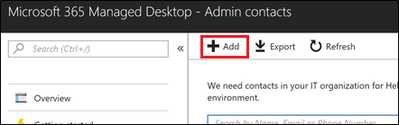

# Aggiungere e verificare i contatti degli amministratori nel portale di amministrazione

Esistono diversi modi in cui il servizio Microsoft Managed Desktop comunica con i clienti. Per semplificare la comunicazione e verificare che stiamo controllando con le persone giuste, è necessario fornire un set di contatti di amministratore. Microsoft Managed Desktop IT Operations contatta queste persone per assistenza nella risoluzione dei problemi relativi al tenant.

> [!IMPORTANT]
> Questi contatti potrebbero essere già stati aggiunti nel portale di amministrazione. In tal caso, è necessario verificare che l'elenco dei contatti sia accurato, poiché Microsoft Managed **Desktop** deve essere in grado di raggiungerli in caso di incidenti gravi.

## Accesso ad Azure Active Directory per il portale di amministrazione di Microsoft Managed Desktop

Il portale di amministrazione di Microsoft Managed Desktop richiede che gli utenti che accedono al portale dispongono di uno dei ruoli di Azure Active Directory (AD):
- Amministratore globale
- Amministratore del servizio Intune
- Lettore globale
- Service Support Administrator

L'amministratore globale deve essere quello per registrare l'organizzazione in Microsoft Managed Desktop. Tutti e cinque i ruoli hanno lo stesso accesso nel portale di amministrazione per avviare e visualizzare le attività. Per ulteriori informazioni sull'assegnazione di questi ruoli in Azure AD, vedere [Autorizzazioni dei ruoli di amministratore in Azure Active Directory.](/azure/active-directory/users-groups-roles/directory-assign-admin-roles) 

## Aree di contatto dell'amministratore

I contatti dell'amministratore devono essere la persona o il gruppo migliori in grado di rispondere alle domande e prendere decisioni per diverse aree di interesse. **Microsoft Managed Desktop Operations contatta questi contatti dell'amministratore per le domande relative alle richieste di supporto inviate dal cliente.** Questi contatti di amministratore riceveranno notifiche per gli aggiornamenti delle richieste di supporto e i nuovi messaggi. Queste aree includono:

Area di messa a fuoco | Per domande su
--- | ---
Creazione di pacchetti dell'app | Risoluzione dei problemi di creazione di pacchetti delle app
Dispositivi | Integrità dei dispositivi, risoluzione dei problemi con i dispositivi Microsoft Managed Desktop
Sicurezza | Risoluzione dei problemi di sicurezza con i dispositivi Microsoft Managed Desktop
Help desk IT | nei casi in cui il personale del supporto tecnico manita i ticket utente al di fuori delle aree di supporto di Microsoft Managed Desktop 
Altro | Per problemi non coperti da altre aree

**Chiunque scegli per questi contatti deve avere le conoscenze e l'autorità necessarie per prendere decisioni per l'ambiente Microsoft Managed Desktop.** Quando si esegue l'onboardboard dell'ambiente Microsoft Managed Desktop, viene richiesto di aggiungere contatti per l'helpdesk locale e la sicurezza. 

I contatti di amministratore sono necessari quando [invii una richiesta di supporto](../service-description/support.md). Dovrai avere un contatto amministratore per l'area di interesse della richiesta di supporto. 

**Per aggiungere contatti di amministratore**

1.  Accedere al [portale di amministrazione di Microsoft Managed Desktop](https://aka.ms/mwaasportal). 

2.  In **Supporto** selezionare **Contatti di amministrazione.** 

    

3. Selezionare **Aggiungi**.

    

4.  Seleziona **un'area di stato attivo** e immetti le informazioni per il contatto. 

    

5. Ripetere l'operazione per ogni area dello stato attivo. 

## Passaggi per iniziare a usare Microsoft Managed Desktop

1. Aggiungere e verificare i contatti di amministratore nel portale di amministrazione (questo argomento)
2. [Modificare l'accesso condizionale](conditional-access.md)
3. [Assegnare licenze](assign-licenses.md)
4. [Installare il portale aziendale di Intune sui dispositivi](company-portal.md)
5. [Abilitare Enterprise State Roaming](enterprise-state-roaming.md)
6. [Configurare dispositivi Microsoft Managed Desktop](set-up-devices.md)
7. [Preparare gli utenti a usare i dispositivi](get-started-devices.md)
8. [Distribuire le app sui dispositivi](deploy-apps.md)