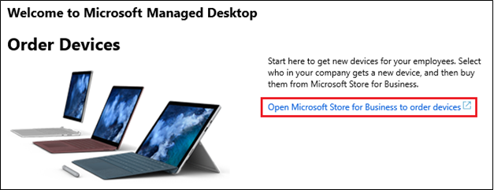

# Dispositivi Desktop gestiti Microsoft ordineOrder Microsoft Managed Desktop devices

Microsoft è attualmente sperimentazione un'esperienza acquisto su scala ridotta negli Stati Uniti (US), come descritto di seguito. Se si è di fuori degli Stati Uniti o l'ordine di dispositivi è per i dispositivi più di 50, è consigliabile utilizzo di uno dei partner di dispositivi approvati. È possibile raggiungere al contatto di account Microsoft per ulteriori informazioni sull'impostazione di una relazione del dispositivo.Microsoft is currently piloting a small-scale shopping experience in the United States (US), as described below. If you’re outside of the US or your device order is for more than 50 devices, we recommend working with one of our approved device partners. You can reach out to your Microsoft account contact for more help setting up a device partnership.

Come deve essere implementata Ordina dispositivi per Desktop gestiti Microsoft?How should I order devices for Microsoft Managed Desktop?

  |   
 --- | ---
Da Stati Uniti ordinamento dispositivi inferiore a 50From within the United States, ordering less than 50 devices | [Ordine dal portale di amministrazione di Desktop gestiti MicrosoftOrder from Microsoft Managed Desktop Admin portal](https://aka.ms/mmdportal)
Di fuori degli Stati UnitiOutside of the United States | Rivolgersi al team di Account MicrosoftContact your Microsoft Account team
Ordinamento dei dispositivi più di 50Ordering more than 50 devices | Rivolgersi al team di Account MicrosoftContact your Microsoft Account team

## Ordinare dispositiviOrder devices
Utilizzare queste istruzioni per i dispositivi ordine negli Stati Uniti. Iniziare nel **portale di amministrazione di Desktop gestiti**Microsoft, ma sarà effettuare gli acquisti tramite **Microsoft Store for Business**.Use these instructions to order devices in the United States. You'll start in the Microsoft **Managed Desktop Admin portal**, but you'll make the purchases through **Microsoft Store for Business**. 

 **Per i dispositivi ordine****To order devices**
 1. Accedere al [portale di amministrazione di Desktop gestiti Microsoft](https://aka.ms/mmdportal)Sign in to [Microsoft Managed Desktop Admin portal](https://aka.ms/mmdportal)
 2. Informazioni introduttive in ordine di dispositivi, selezionare **Open Microsoft Store for Business per i dispositivi ordine**.On Getting Started, under Order Devices, select **Open Microsoft Store for Business to order devices**.
 
    
    
3. In Microsoft Store for Business, è possibile esaminare informazioni su Microsoft Desktop gestiti e una tabella di confronto dei dispositivi disponibili. Fare clic su **Acquista** per scegliere un dispositivo.In Microsoft Store for Business, you can review info about Microsoft Managed Desktop and a comparison chart of the devices available. Click **Buy** to choose a device. 

    

4. In **Selezionare il dispositivo**, selezionare il dispositivo desiderato.On **Pick your device**, select the device you want. 

    

5. In **scegliere le funzionalità del dispositivo**, selezionare un **Servizio di pianificazione**, digitare il numero di dispositivi e quindi fare clic su **Aggiungi al carrello**.On **Choose device features**, select a **Service Plan**, type the number of devices, and then click **Add to Cart**.

6. Esaminare carrello e quindi selezionare **estrazione**o **aggiungere un altro dispositivo**.Review your Cart and then select **Checkout**, or **Add another device**. 

7. Continuare il processo di estrazione, esaminare i prezzi, accetta le condizioni di licenze e selezionare **accesso e l'ordine di posizione**.Continue the checkout process, review your pricing, accept licensing terms, and select **Sign and Place Order**. 

I dispositivi inclusi in genere all'interno di tre giorni.Devices usually ship within three days. 

Al termine ordinamento dispositivi, è possibile controllare i dispositivi che sono stati ordinati nel [portale di amministrazione di Desktop gestiti Microsoft](https://aka.ms/mmdportal). In **inventario**, selezionare **i dispositivi**.When you're done ordering devices, you can check the devices you ordered in [Microsoft Managed Desktop Admin portal](https://aka.ms/mmdportal). Under **Inventory**, select **Devices**. 

All'arrivano di dispositivi, distribuirli ai dipendenti. Non è disponibile impostare ulteriori o configurazione necessari.When devices arrive, distribute them to your employees. There's no additional set up, or configuration required. 

