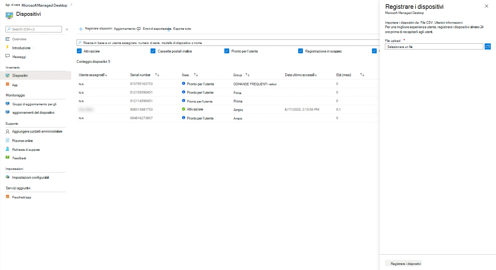

# Registrare manualmente i nuovi dispositiviRegister new devices yourself

Microsoft Managed Desktop può funzionare con dispositivi nuovi o puoi riutilizzare i dispositivi che potresti già avere (che richiederanno di ricrearne l'immagine).Microsoft Managed Desktop can work with brand-new devices or you can reuse devices you might already have (which will require that you reimage them). Puoi registrare i dispositivi con Microsoft Managed Desktop nel portale di Microsoft Endpoint Manager.You can register devices with Microsoft Managed Desktop in the Microsoft Endpoint Manager portal.

> [!NOTE]
> Collaborare con un partner per ottenere dispositivi?Working with a partner to obtain devices? In tal caso, non è necessario preoccuparsi di ottenere gli hash hardware; si occuperà di questo per te.If so, you don't need to worry about getting the hardware hashes; they'll take care of that for you. Assicurati che il partner stabilirà una relazione con te nel [Centro per i partner.](https://partner.microsoft.com/dashboard)Make sure your partner establishes a relationship with you at the [Partner Center](https://partner.microsoft.com/dashboard). Per altre informazioni, vedere la Guida [del Centro per i partner.](/partner-center/request-a-relationship-with-a-customer)Your partner can learn more at [Partner Center help](/partner-center/request-a-relationship-with-a-customer). Una volta stabilita questa relazione, il partner registrerà semplicemente i dispositivi per conto dell'utente. Non sono necessarie ulteriori azioni da parte dell'utente.Once this relationship established, your partner will simply register devices on your behalf – no further action required from you. Se vuoi visualizzare i dettagli o il tuo partner ha domande, vedi Passaggi per i [partner per registrare i dispositivi.](register-devices-partner.md)If you want to see the details, or your partner has questions, see [Steps for Partners to register devices](register-devices-partner.md). Una volta registrati i dispositivi, puoi procedere con il [controllo dell'immagine](#check-the-image) e [la consegna dei dispositivi](#deliver-the-device) agli utenti.Once the devices are registered, you can proceed with [checking the image](#check-the-image) and [delivering the devices](#deliver-the-device) to your users.

## Preparare la registrazione di nuovi dispositiviPrepare to register brand-new devices

Una volta che hai a disposizione i nuovi dispositivi, segui questi passaggi:Once you have the new devices in hand, you'll follow these steps:

1. [Ottenere l'hash hardware per ogni dispositivo.Obtain the hardware hash for each device.](#obtain-the-hardware-hash)
2. [Unire i dati hashMerge the hash data](#merge-hash-data)
3. [Registrare i dispositivi in Microsoft Managed Desktop.](#register-devices-by-using-the-admin-portal)[Register the devices in Microsoft Managed Desktop](#register-devices-by-using-the-admin-portal).
4. [Verificare che l'immagine sia corretta.Double-check that the image is correct.](#check-the-image)
5. [Recapita il dispositivoDeliver the device](#deliver-the-device)

### Ottenere l'hash hardwareObtain the hardware hash

Microsoft Managed Desktop identifica ogni dispositivo in modo univoco facendo riferimento al relativo hash hardware.Microsoft Managed Desktop identifies each device uniquely by referencing its hardware hash. Sono disponibili tre opzioni per ottenere queste informazioni:You have three options for getting this information:

- Chiedere al fornitore OEM il file di registrazione AutoPilot, che includerà gli hash hardware.Ask your OEM supplier for the AutoPilot registration file, which will include the hardware hashes.
- Esegui uno [script Windows PowerShell su](#powershell-script-method) ogni dispositivo e raccogli i risultati in un file.Run a [Windows PowerShell script](#powershell-script-method) on each device and collect the results in a file.
- Avviare ogni dispositivo, ma non completare l'esperienza di installazione di Windows, e raccogliere gli [hash in un'unità flash rimovibile.](#flash-drive-method)Start each device--but don't complete the Windows setup experience--and [collect the hashes on a removable flash drive](#flash-drive-method).

#### Metodo script di PowerShellPowerShell script method

È possibile utilizzare lo script [Get-WindowsAutoPilotInfo.ps1](https://www.powershellgallery.com/packages/Get-WindowsAutoPilotInfo) PowerShell nel sito Web PowerShell Gallery.You can use the [Get-WindowsAutoPilotInfo.ps1](https://www.powershellgallery.com/packages/Get-WindowsAutoPilotInfo) PowerShell script on the PowerShell Gallery website. Per altre informazioni sull'identificazione del dispositivo e sull'hash hardware, vedi [Aggiunta di dispositivi a Windows Autopilot.](/mem/autopilot/add-devices#device-identification)For more information about device identification and hardware hash, see [Adding devices to Windows Autopilot](/mem/autopilot/add-devices#device-identification).

1.  Aprire un prompt di PowerShell con diritti amministrativi.Open a PowerShell prompt with administrative rights.
2.  Correre `Install-Script -Name Get-WindowsAutoPilotInfo`Run `Install-Script -Name Get-WindowsAutoPilotInfo`
3.  Correre `powershell -ExecutionPolicy Unrestricted Get-WindowsAutoPilotInfo -OutputFile <path>\hardwarehash.csv`Run `powershell -ExecutionPolicy Unrestricted Get-WindowsAutoPilotInfo -OutputFile <path>\hardwarehash.csv`
4.  Eseguire `powershell -ExecutionPolicy restricted` per impedire l'esecuzione di script senza restrizioni successivi.Run `powershell -ExecutionPolicy restricted` to prevent subsequent unrestricted scripts from running.

#### Flash drive, metodoFlash drive method

1. In un dispositivo diverso da quello che stai registrando, inserisci un'unità USB.On a device other than the one you're registering, insert a USB drive.
2. Aprire un prompt di PowerShell con diritti amministrativi.Open a PowerShell prompt with administrative rights.
3. Correre `Save-Script -Name Get-WindowsAutoPilotInfo -Path <pathToUsb>`Run `Save-Script -Name Get-WindowsAutoPilotInfo -Path <pathToUsb>`
4. Attivare il dispositivo che si sta registrando, ma *non avviare l'esperienza di installazione.*Turn on the device you are registering, but *do not start the setup experience*. Se si avvia accidentalmente l'esperienza di installazione, sarà necessario reimpostare o ricreare l'immagine del dispositivo.If you accidentally start the setup experience, you'll have to reset or reimage the device.
5. Inserire l'unità USB e quindi premere MAIUSC + F10.Insert the USB drive, and then press SHIFT + F10.
6. Aprire un prompt di PowerShell con diritti amministrativi e quindi eseguire `cd <pathToUsb>` .Open a PowerShell prompt with administrative rights, and then run `cd <pathToUsb>`.
7. Correre `Set-ExecutionPolicy -ExecutionPolicy Unrestricted`Run `Set-ExecutionPolicy -ExecutionPolicy Unrestricted`
8. Correre `.\Get-WindowsAutoPilotInfo -OutputFile <path>\hardwarehash.csv`Run `.\Get-WindowsAutoPilotInfo -OutputFile <path>\hardwarehash.csv`
9. Rimuovere l'unità USB e quindi arrestare il dispositivo eseguendo `shutdown -s -t 0`Remove the USB drive, and then shut down the device by running `shutdown -s -t 0`

>[!IMPORTANT]
>Non alimentare il dispositivo che stai registrando di nuovo finché non hai completato la registrazione.Do not power on the device you are registering again until you've completed registration for it. 

### Unire dati hashMerge hash data

Dovrai combinare i dati nei file CSV in un singolo file per completare la registrazione.You'll need to have the data in the CSV files combined into a single file to complete registration. Ecco uno script di PowerShell di esempio per semplificare:Here's a sample PowerShell script to make it easy:

`Import-CSV -Path (Get-ChildItem -Filter *.csv) | ConvertTo-Csv -NoTypeInformation | % {$_.Replace('"', '')} | Out-File .\aggregatedDevices.csv`

#### Registrare i dispositivi tramite il portale di amministrazioneRegister devices by using the Admin Portal

In [Microsoft Endpoint Manager](https://endpoint.microsoft.com/)seleziona Dispositivi **nel** riquadro di spostamento a sinistra.In [Microsoft Endpoint Manager](https://endpoint.microsoft.com/), select **Devices** in the left navigation pane. Cerca la sezione Microsoft Managed Desktop del menu e seleziona **Dispositivi.**Look for the Microsoft Managed Desktop section of the menu and select **Devices**. Nell'area di lavoro Dispositivi desktop gestiti Microsoft seleziona **+ Registra dispositivi**, che apre un riquadro a comparsa per registrare nuovi dispositivi.In the Microsoft Managed Desktop Devices workspace, Select **+ Register devices**, which opens a fly-in to register new devices.

<!--  -->

<!--Registering any existing devices with Managed Desktop will completely re-image them; make sure you've backed up any important data prior to starting the registration process.-->

Eseguire la procedura seguente:Follow these steps:

1. In **Caricamento file** specificare il percorso del file CSV creato in precedenza.In **File upload**, provide a path to the CSV file you created previously.
3. Selezionare **Registra dispositivi**.Select **Register devices**. Il sistema aggiungerà i dispositivi all'elenco dei dispositivi in **Dispositivi**, contrassegnati come **Registrazione in sospeso**.The system will add the devices to your list of devices on **Devices**, marked as **Registration Pending**. La registrazione in genere richiede meno di 10 minuti e quando il dispositivo ha esito positivo il dispositivo viene visualizzato come **Pronto** per l'utente, ovvero è pronto e in attesa che un utente inizi a usare.Registration typically takes less than 10 minutes, and when successful the device will show as **Ready for user** meaning it's ready and waiting for a user to start using.

Puoi monitorare l'avanzamento della registrazione del dispositivo nella pagina principale.You can monitor the progress of device registration on the main page. Tra i possibili stati segnalati vi sono:Possible states reported there include:

| StatoState | DescrizioneDescription |
|---------------|-------------|
| Registrazione in sospesoRegistration Pending | La registrazione non è ancora stata eseguita.Registration is not done yet. Eseguire il check back in un secondo momento.Check back later. |
| Registrazione non riuscitaRegistration failed | Impossibile completare la registrazione.Registration could not be completed. Per ulteriori [informazioni, vedere Risoluzione dei](#troubleshooting-device-registration) problemi di registrazione dei dispositivi.Refer to [Troubleshooting device registration](#troubleshooting-device-registration) for more information. |
| Pronto per l'utenteReady for user | La registrazione ha avuto esito positivo e il dispositivo è ora pronto per essere recapitato all'utente.Registration succeeded and the device is now ready to be delivered to the user. Microsoft Managed Desktop li guiderà nella configurazione della prima volta, quindi non è necessario eseguire ulteriori operazioni di preparazione.Microsoft Managed Desktop will guide them through first-time set-up, so there’s no need for you to do any further preparations. |
| AttivoActive | Il dispositivo è stato recapitato all'utente e si è registrato nel tenant.The device has been delivered to the user and they have registered with your tenant. Questo stato indica anche che usano regolarmente il dispositivo.This state also indicates that they are regularly using the device. |
| InattivoInactive | Il dispositivo è stato recapitato all'utente e si è registrato nel tenant.The device has been delivered to the user and they have registered with your tenant. Tuttavia, non hanno usato il dispositivo di recente (negli ultimi 7 giorni).However, they have not used the device recently (in the last 7 days).  | 

#### Risoluzione dei problemi di registrazione dei dispositiviTroubleshooting device registration

| Messaggio di erroreError message | DettagliDetails |
|---------------|-------------|
| Dispositivo non trovatoDevice not found | Non è stato possibile registrare questo dispositivo perché non è stata trovata una corrispondenza per il produttore, il modello o il numero di serie specificato.We couldn’t register this device because we could not find a match for the provided manufacturer, model, or serial number. Conferma questi valori con il fornitore del dispositivo.Confirm these values with your device supplier. |
| Hash hardware non validoHardware hash not valid | L'hash hardware specificato per questo dispositivo non è stato formattato correttamente.The hardware hash you provided for this device was not formatted correctly. Controlla due volte l'hash hardware e quindi invia di nuovo.Double-check the hardware hash and then resubmit. |
| Dispositivo già registratoDevice already registered | Questo dispositivo è già registrato nell'organizzazione.This device is already registered to your organization. Non sono necessarie ulteriori azioni.No further action required. |
| Dispositivo richiesto da un'altra organizzazioneDevice claimed by another organization | Questo dispositivo è già stato rivendicato da un'altra organizzazione.This device has already been claimed by another organization. Rivolgersi al fornitore del dispositivo.Check with your device supplier. |
| Errore imprevistoUnexpected error | Impossibile elaborare automaticamente la richiesta.Your request could not be automatically processed. Contattare il supporto tecnico e fornire l'ID richiesta: <requestId>Contact Support and provide the Request ID: <requestId> |

### Controllare l'immagineCheck the image

Se il dispositivo è stato utilizzato da un fornitore di partner Microsoft Managed Desktop, l'immagine deve essere corretta.If your device has come from a Microsoft Managed Desktop partner supplier, the image should be correct.

Se preferisci, puoi anche applicare l'immagine da solo.You’re also welcome to apply the image on your own if you prefer. To get started, contact the Microsoft representative you're working with and they will provide you the location and steps for applying the image.To get started, contact the Microsoft representative you’re working with and they will provide you the location and steps for applying the image.

### Recapita il dispositivoDeliver the device

> [!IMPORTANT]
> Prima di consegnare il dispositivo all'utente, assicurati di aver ottenuto e applicato le [licenze appropriate](../get-ready/prerequisites.md) per tale utente.Before you hand off the device to your user, make sure you have obtained and applied the [appropriate licenses](../get-ready/prerequisites.md) for that user.

Se vengono applicate tutte le licenze, puoi ottenere gli utenti pronti per l'uso dei dispositivi [e](get-started-devices.md)quindi l'utente può avviare il dispositivo e procedere con l'esperienza di installazione di Windows.If all the licenses are applied, you can [get your users ready to use devices](get-started-devices.md), and then your user can start up the device and proceed through the Windows setup experience.