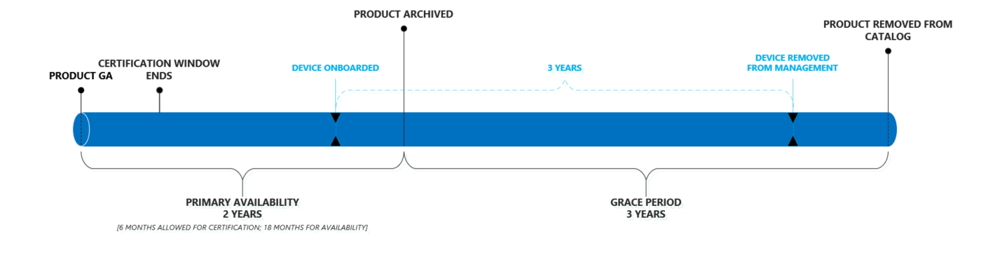

# Ciclo di vita del prodotto Microsoft Managed DesktopMicrosoft Managed Desktop product lifecycle

Vantaggi per gli utenti finali di Microsoft Managed Desktop garantire che utilizzino sempre dispositivi che offrono le migliori funzionalità di prestazioni, affidabilità, progettazione e sicurezza (come il supporto di funzionalità come Windows Hello).Microsoft Managed Desktop benefits end-users assuring that they always use devices that offer the best performance, reliability, design, and security capabilities (such as support for features like Windows Hello). Per ottenere questo risultato, Microsoft Managed Desktop gestisce un breve catalogo di [dispositivi](device-list.md)approvati continuamente aggiornati.To accomplish this, Microsoft Managed Desktop maintains a short catalog of continuously updated [approved devices](device-list.md). 
 
In questo argomento vengono illustrati in dettaglio il ciclo di vita dei dispositivi che vengono aggiunti e rimossi dal catalogo approvato.This topic details the lifecycle of devices as they are added and removed from the approved catalog. 

> [!NOTE]
> In questo argomento, si farà una distinzione tra un "dispositivo" e un "prodotto".In this topic, we'll make a distinction between a "device" and a "product." Per "dispositivo" si intende un singolo computer specifico.By “device,” we mean one individual, specific computer. Ad esempio, "serial number 1234", "Bill ' s laptop", "Shared VM XYZ" si riferiscono a dispositivi specifici.For example, “Serial number 1234”, “Bill’s laptop”, “Shared VM XYZ” refer to specific devices. Un "prodotto", tuttavia, si riferisce a un insieme o a una famiglia di dispositivi.A “product”, however, refers to a collection or family of devices. Ad esempio, "Fabrikam laptop", "adatum ZX450 laptop" e così via. Questo è importante perché i prodotti vengono aggiunti a un elenco o a un catalogo [approvato](device-list.md), mentre i dispositivi vengono registrati in Microsoft Managed Desktop.For example, “Fabrikam Laptop”, “Adatum ZX450 Laptop”, etc. This is important because products are added to our [approved list](device-list.md), or catalog, and devices are what get enrolled into Microsoft Managed Desktop.

## Ciclo di vita del prodottoProduct lifecycle

 In generale, i prodotti passano attraverso queste fasi del ciclo di vita:Generally, products move through these lifecycle phases:

- [Rilascio e valutazione del prodottoProduct release and evaluation](#product-release-and-evaluation)
- [Periodo di disponibilità principale del prodottoProduct primary availability period](#product-primary-availability-period)
- [Periodo di tolleranza del prodottoProduct grace period](#product-grace-period)
- [Pensionamento del prodottoProduct retirement](#product-retirement)

La sequenza intera è illustrata in questa figura:The entire sequence is depicted in this illustration:

I prodotti rimangono nel catalogo per un massimo di 24 mesi, ma i *dispositivi* restano in gestione per 3 anni in base alle date di registrazione individuali.Products remain on the catalog for up to 24 months, but *devices* remain under management for 3 years based on their individual enrollment dates. In effetti, ogni prodotto ha tre date importanti, ma ogni dispositivo ne ha uno solo.Effectively, each product has three important dates, but each device has only one. Per i prodotti, tutte e tre le date vengono calcolate in base alla *Data di approvazione*e pertanto si pubblicano queste date al momento dell'approvazione, in modo da poter sempre guardare avanti e pianificare adeguatamente l'intero ciclo di vita del prodotto.For products, all three of these dates are calculated based on the *approval date*, and therefore we publish these dates upon approval so that you can always look ahead and plan appropriately for the product's entire lifecycle.

In questa tabella vengono riportate le date di esempio per un prodotto teorico:This table shows example dates for a theoretical product:

|ProdottoProduct  |Data approvazioneApproved date  |Fine della disponibilità principaleEnd of primary availability  |Fine di eligiblityEnd of eligiblity  |
|---------|---------|---------|---------|
|Computer portatile FabrikamFabrikam Laptop    | 1/1/20171/1/2017 | 6/1/20196/1/2019 | 6/1/20226/1/2022 |
|Computer portatile adatumAdatum Laptop   | 1/1/20181/1/2018 | 6/1/20206/1/2020 | 6/1/20236/1/2023  |

In questa tabella vengono illustrate le date di esempio per i *dispositivi*teorici:This table shows example dates for theoretical *devices*:

|ID dispositivoDevice ID  |Data di registrazioneEnrollment date  |Data di pensionamentoRetirement date  |
|---------|---------|---------|
|#123412 laptopLaptop #123412     |  2/3/20182/3/2018       |  2/3/20212/3/2021       |
|#321513 desktopDesktop #321513     | 6/2/20186/2/2018        |  6/2/20216/2/2021       |

## Rilascio e valutazione del prodottoProduct release and evaluation

Il ciclo di vita del prodotto inizia quando un produttore rilascia pubblicamente il prodotto:The product lifecycle starts when a manufacturer publicly releases the product:

Durante questa fase, il team di ingegneri di Microsoft Managed Desktop esegue la valutazione e la certificazione di un prodotto.During this stage, the Microsoft Managed Desktop engineering team does their evaluation and certification of a product. Il team valuta elementi quali l'affidabilità e le prestazioni di Windows, la conformità con una linea di base hardware, il sentimento di mercato e l'inventario e la preparazione dei canali, tra le altre cose.The team evaluates things like reliability and performance with Windows, compliance with a hardware baseline, market sentiment, and inventory and channel readiness, among other things. Questo processo in genere richiede circa 6 settimane.This process typically takes approximately 6 weeks.
  
Microsoft Managed Desktop valuterà solo i dispositivi per la certificazione entro i primi 6 mesi di disponibilità.Microsoft Managed Desktop will only evaluate devices for certification within their first 6 months of availability. In questo modo, è consigliabile concentrare sempre i propri sforzi sull'hardware di ultima generazione.This ensures that we’re always focusing our efforts on the latest generation of hardware.
 
Al termine di questa fase, Microsoft Managed Desktop aggiunge il prodotto all' [elenco approvato](device-list.md), rilasciando in modo efficace il prodotto per le registrazione dei clienti.At the end of this phase, Microsoft Managed Desktop adds the product to the [approved list](device-list.md), effectively releasing the product for customer enrollments. Indipendentemente dalla data in cui un dispositivo è certificato, la **Data di approvazione** è di nuovo aggiornata alla data di disponibilità generale dei prodotti.Regardless of the date when a device is certified, its **approved date** is be back-dated to the products own general availability date. 

## Periodo di disponibilità principale del prodottoProduct primary availability period

Questo periodo è il fulcro della disponibilità del prodotto:This period is the core of product availability:

Qualsiasi dispositivo registrato durante questo periodo riceve tutti i tre anni di supporto di Microsoft Managed Desktop (come mostrato dalla sequenza temporale blu).Any device enrolled during this period receives the full three years of support from Microsoft Managed Desktop (as shown by the blue timeline). Questo periodo dura fino a quando una data di fine non è impostata su 24 mesi dalla data di disponibilità generale.This period lasts until an end date set to 24 months from the general availability date.

È possibile pensare a questo periodo in modo efficace "registrazione aperta", in modo da massimizzare il valore di Microsoft Managed Desktop, è consigliabile indirizzare i modelli di acquisizione e i prodotti selezionati entro questo periodo.You can think of this period as effectively “open enrollment”, so to maximize the value of Microsoft Managed Desktop, you should target your procurement models and selected products to fall within this period. Come piccolo esempio, un cliente deve evitare di accontentarsi di un periodo di due anni per il roll-out utilizzando un prodotto che si trova nel mese finale di disponibilità principale: la maggior parte di questi dispositivi non riceverà i tre anni completi di Microsoft Managed Desktop Management (vedere [Grace periodo](#product-grace-period) per ulteriori informazioni.As a small example, a customer should avoid settling on a two-year roll-out period using a product that is in its final month of primary availability – most of those devices will not receive the full three years of Microsoft Managed Desktop management (see [grace period](#product-grace-period) for more information).  

## Periodo di tolleranza del prodottoProduct grace period

Il periodo di tolleranza del prodotto è un periodo di tre anni che segue la disponibilità primaria.The product grace period is a three-year period following primary availability. Questa fase consente di registrare i dispositivi provenienti da una famiglia di prodotti supportata, mantenendo tuttavia le promesse di Microsoft Managed Desktop per quanto riguarda l'hardware e le prestazioni del dispositivo moderne.This phase allows you to enroll devices that are from a supported product family, but still hold firm to the promises of Microsoft Managed Desktop regarding modern hardware and device performance. Questa fase è l'ideale per i clienti che hanno effettuato le decisioni relative agli appalti prima di sapere di Microsoft Managed Desktop.This phase is ideal for customers who have made procurement decisions before knowing about Microsoft Managed Desktop. 

Se si è acquistato di recente un numero di dispositivi approvati prima di effettuare l'iscrizione con Microsoft Managed Desktop, è comunque possibile registrarli, ma non si riceverà un massimo di tre anni di gestione.If you've recently bought a number of approved devices prior to enrolling with Microsoft Managed Desktop, you can still enroll them, but you won’t receive a full three years of management. Al contrario, non conformi alla data di pensionamento, indipendentemente dal momento in cui sono stati registrati.Instead, they’ll fall out of compliance on the retirement date, regardless of when they were enrolled. Dietro le quinte, Microsoft Managed Desktop tratterà questi dispositivi come se fossero registrati nell'ultimo giorno di disponibilità principale.Behind the scenes, Microsoft Managed Desktop will treat these devices as if they were enrolled on the last day of primary availability. In questa figura, è possibile vedere questo scenario osservando che sia il dispositivo blu che quello verde terminano nello stesso giorno, nonostante la differenza di un anno di registrazione:In this illustration, you can see this scenario by noting that both the blue and green device end on the same day, despite their one-year difference in enrollment:

L'esempio di laptop Fabrikam dalla tabella precedente illustra questa situazione:The Fabrikam Laptop example from the previous table illustrates this situation: 

|ProdottoProduct  |Data approvazioneApproved date  |Fine della disponibilità principaleEnd of primary availability  |Fine di eligiblityEnd of eligiblity  |
|---------|---------|---------|---------|
|Computer portatile FabrikamFabrikam Laptop    | 6/1/20176/1/2017 | 6/1/20196/1/2019 | 6/1/20226/1/2022 |

Come cliente, è possibile registrare i laptop Fabrikam fino al 6/1/2022 – tuttavia tutti saranno trattati come se fossero stati registrati su 6/1/2019.As a customer, you can enroll Fabrikam Laptops all the way until 6/1/2022 – however they will all be treated as though you enrolled them on 6/1/2019. Se si registra un computer portatile Fabrikam su 6/1/2021, si otterrà un solo anno di gestione.If you enroll a Fabrikam Laptop on 6/1/2021 you'll only get one year of management. Questo criterio consente di estrarre i cicli di vita parziali dai prodotti precedentemente supportati, anziché dover procurarsi prematuramente nuovi dispositivi.This policy allows you to extract partial lifecycles from products that were previously supported, rather than having to procure new devices prematurely. 

Infine, durante questa fase, il dispositivo viene rimosso dall' [elenco dei dispositivi](device-list.md) e spostato nell' [elenco dei dispositivi archiviati](archived-device-list.md).Finally, during this phase the device is removed from the [device list](device-list.md) and moved to the [archived device list](archived-device-list.md).

## Pensionamento del prodottoProduct retirement

Il pensionamento dei prodotti è la fase finale del ciclo di vita.Product retirement is the final phase of the lifecycle. In questa fase, non è possibile registrare nuovi dispositivi di quel tipo di prodotto in Microsoft Managed Desktop e, per definizione, tutti i dispositivi esistenti sono ora al di fuori del periodo di tre anni consentito.In this phase, no new devices of that product type can be enrolled in Microsoft Managed Desktop and, by definition, all existing devices are now outside their allowed three-year term. Durante questo periodo, Microsoft Managed Desktop rimuoverà il dispositivo dall'elenco pubblico completamente.During this time, Microsoft Managed Desktop will remove the device from the public list entirely. È anche durante questa fase, in cui, se non sono già state procurate sostituzioni, si inizierà a visualizzare i servizi decrescenti, in quanto Microsoft Managed Desktop inizia a scendere verso il basso sui dispositivi che non sono conformi.It’s also during this phase where, if you haven't already procured replacements, you'll start to see diminished services as Microsoft Managed Desktop starts to ramp down on the devices which are out of compliance. 

## Dispositivi non conformiDevices that are out of compliance

Un dispositivo non è in conformità quando è trascorso il relativo Window consentita per la gestione di Microsoft Managed Desktop.A device is out of compliance when its allowed window for Microsoft Managed Desktop management has elapsed. Questo problema si verifica quando il dispositivo ha raggiunto i tre anni di gestione o quando il tipo di prodotto viene rimosso dal catalogo del dispositivo, a seconda di quale si verifica per primo.This occurs when the device has reached three years of management or when that product type is removed from the device catalog, whichever occurs first. È consigliabile utilizzare sempre i cicli di acquisizione in modo che i nuovi dispositivi vengano distribuiti prima che i dispositivi correnti siano fuori conformità.You should always target your procurement cycles such that new devices are deployed prior to current devices going out of compliance.

Il team di Microsoft Managed Desktop sa che i cicli di approvvigionamento sono lunghi e pianificati in merito ai budget a esecuzione prolungata.The Microsoft Managed Desktop team knows that procurement cycles are long and planned around long-running budgets. Per essere sempre a conoscenza dello stato della popolazione del dispositivo, è disponibile un [sito Web](https://aka.ms/mmdportal) in cui sono elencati tutti i dispositivi in gestione, la data di pensionamento futura e uno stato che ne indica la conformità.To ensure that you're always aware of the state of your device population, we provide a [website](https://aka.ms/mmdportal) that lists every device under management, its future retirement date, and a status indicating its compliance. Questo significa che le informazioni più recenti riguardano l'età del dispositivo e che è possibile sfruttare il report in qualsiasi ciclo di pianificazione degli appalti.This means you always have the latest information regarding device age and can leverage the report in any procurement planning cycle. 

Inoltre, verranno effettuate le seguenti azioni automatiche per garantire che i nuovi dispositivi vengano distribuiti in tempo:In addition, the we will also take the following automated actions to ensure that new devices are deployed on time:

|Sequenza temporaleTimeline  |AzioneAction  |
|---------|---------|
|T-90T-90     | Il dispositivo verrà segnalato come **scaduto a breve**, con un indicatore giallo nel sito Web inventario dispositivi.We'll flag this device as **expiring soon**, with a yellow marker on the device inventory website.  |
|T-60T-60     | Il dispositivo verrà contrassegnata come **scaduta** con un indicatore rosso nel sito Web inventario dispositivi.We'll flag this device as **expiring** with a red marker on the device inventory website.       |
|T-30T-30     | Verrà visualizzato un messaggio al portale di amministrazione per dire che i dispositivi sono imminenti in uscita dalla conformità.We'll post a message to the Admin Portal saying that devices are imminently exiting compliance.       |
|00     |  Modificheremo il portale di amministrazione per dire che i dispositivi sono ora scaduti gli amministratori di reindirizzamento per atterrare prima nell'elenco dei dispositivi.We'll adjust the Admin Portal to say that devices are now expired redirect admins to land on the device list first.       |
|T + 30T+30     |  La funzionalità di amministrazione del portale verrà ridotta fino a quando non vengono distribuiti nuovi dispositivi.We'll reduce Admin Portal functionality until new devices are deployed.       |
|T + 60T+60     |  La funzionalità di amministrazione del portale verrà ridotta fino a quando non vengono distribuiti nuovi dispositivi.We'll reduce Admin Portal functionality until new devices are deployed.       |
|T + 90T+90     |  Il dispositivo viene rimosso dalla gestione.We remove the device from management. A questo punto, il dispositivo è solo la propria responsabilità e non è più considerato sicuro né aggiornato.At this point, the device is solely your own responsibility and you should no longer consider it secure nor up to date. Anche il dispositivo sarà in uno stato sconosciuto poiché ogni provider di servizi di configurazione controlla le proprie impostazioni.Also the device will be in an unknown state since each Configuration Service provider controls its own settings.|

