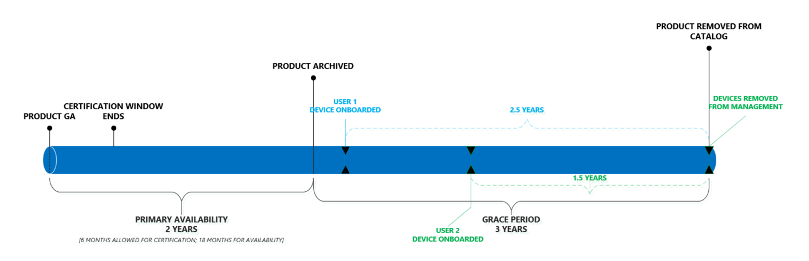

# Ciclo di vita del prodotto Microsoft Managed Desktop

Microsoft Managed Desktop beneficia degli utenti finali assicurando che utilizzino sempre dispositivi che offrono le migliori funzionalità di prestazioni, affidabilità, progettazione e sicurezza (come il supporto di funzionalità come Windows Hello). Per ottenere questo risultato, Microsoft Managed Desktop gestisce un breve catalogo di [dispositivi approvati](device-list.md)continuamente aggiornati. 
 
In questo argomento vengono illustrati in dettaglio il ciclo di vita dei dispositivi che vengono aggiunti e rimossi dal catalogo approvato. 

> [!NOTE]
> In questo argomento, si farà una distinzione tra un "dispositivo" e un "prodotto". Per "dispositivo" si intende un singolo computer specifico. Ad esempio, "serial number 1234", "Bill ' s laptop", "Shared VM XYZ" si riferiscono a dispositivi specifici. Un "prodotto", tuttavia, si riferisce a un insieme o a una famiglia di dispositivi. Ad esempio, "Fabrikam laptop", "adatum ZX450 laptop" e così via. Questo è importante perché i prodotti vengono aggiunti a un elenco o a un catalogo [approvato](device-list.md), mentre i dispositivi vengono registrati in Microsoft Managed Desktop.

## Ciclo di vita del prodotto

 In generale, i prodotti passano attraverso queste fasi del ciclo di vita:

- [Rilascio e valutazione del prodotto](#product-release-and-evaluation)
- [Periodo di disponibilità principale del prodotto](#product-primary-availability-period)
- [Periodo di tolleranza del prodotto](#product-grace-period)
- [Pensionamento del prodotto](#product-retirement)

Nella figura seguente viene illustrata l'intera sequenza:

![Timeline del ciclo di vita: a partire dalla disponibilità generale del prodotto, la "disponibilità primaria" è durata due anni. Durante questo periodo la finestra di certificazione termina e ad un certo punto il dispositivo è onboarded. Al termine della disponibilità primaria, il prodotto viene archiviato e il "periodo di tolleranza" di tre anni inizia. A partire da quando il dispositivo è onboarded, ha un periodo di tre anni di utilizzo fino a quando non viene rimosso dalla gestione. Al termine del periodo di tolleranza, il prodotto viene rimosso dal catalogo.](../../media/non-dark1-edits.PNG)

I prodotti rimangono nel catalogo per un massimo di 24 mesi, ma i <em>dispositivi</em> restano in gestione per 3 anni in base alle date di registrazione individuali. In effetti, ogni prodotto ha tre date importanti, ma ogni dispositivo ne ha uno solo. Per i prodotti, tutte e tre le date vengono calcolate in base alla <em>Data di approvazione</em>e pertanto si pubblicano queste date al momento dell'approvazione, in modo da poter sempre guardare avanti e pianificare adeguatamente l'intero ciclo di vita del prodotto.

In questa tabella vengono riportate le date di esempio per un prodotto teorico:

|Prodotto  |Data approvazione  |Fine della disponibilità principale  |Fine dell'idoneità  |
|---------|---------|---------|---------|
|Computer portatile Fabrikam    | 1/1/2017 | 6/1/2019 | 6/1/2022 |
|Computer portatile adatum   | 1/1/2018 | 6/1/2020 | 6/1/2023  |

In questa tabella vengono illustrate le date di esempio per i *dispositivi*teorici:

|ID dispositivo  |Data di registrazione  |Data di pensionamento  |
|---------|---------|---------|
|#123412 laptop     |  2/3/2018       |  2/3/2021       |
|#321513 desktop     | 6/2/2018        |  6/2/2021       |

## Rilascio e valutazione del prodotto

Il ciclo di vita del prodotto inizia quando un produttore rilascia pubblicamente il prodotto:

Durante questa fase, il team di ingegneri di Microsoft Managed Desktop esegue la valutazione e la certificazione di un prodotto. Il team valuta elementi quali l'affidabilità e le prestazioni di Windows, la conformità con una linea di base hardware, il sentimento di mercato e l'inventario e la preparazione dei canali, tra le altre cose. Questo processo in genere richiede circa 6 settimane.
  
Microsoft Managed Desktop valuterà solo i dispositivi per la certificazione entro i primi 6 mesi di disponibilità. In questo modo, è consigliabile concentrare sempre i propri sforzi sull'hardware di ultima generazione.
 
Al termine di questa fase, Microsoft Managed Desktop aggiunge il prodotto all' [elenco approvato](device-list.md), rilasciando in modo efficace il prodotto per le registrazione dei clienti. Indipendentemente dalla data in cui un dispositivo è certificato, la **Data di approvazione** è tornata datata alla data di disponibilità generale del prodotto. 

## Periodo di disponibilità principale del prodotto

Questo periodo è il fulcro della disponibilità del prodotto:

Qualsiasi dispositivo registrato durante questo periodo riceve tutti i tre anni di supporto di Microsoft Managed Desktop (come mostrato dalla sequenza temporale blu). Questo periodo dura fino a quando una data di fine non è impostata su 24 mesi dalla data di disponibilità generale.

È possibile pensare a questo periodo in modo efficace "registrazione aperta", in modo da massimizzare il valore di Microsoft Managed Desktop, è consigliabile indirizzare i modelli di acquisizione e i prodotti selezionati entro questo periodo. Come piccolo esempio, un cliente deve evitare di accontentarsi di un periodo di due anni per il roll-out utilizzando un prodotto che si trova nel mese finale di disponibilità principale: la maggior parte di questi dispositivi non riceverà i tre anni completi di gestione di Microsoft Managed Desktop (vedere il [periodo di tolleranza](#product-grace-period) per ulteriori informazioni).  

## Periodo di tolleranza del prodotto

Il periodo di tolleranza del prodotto è un periodo di tre anni che segue la disponibilità primaria. Questa fase consente di registrare i dispositivi provenienti da una famiglia di prodotti supportata, mantenendo tuttavia le promesse di Microsoft Managed Desktop per quanto riguarda l'hardware e le prestazioni del dispositivo moderne. Questa fase è l'ideale per i clienti che hanno effettuato le decisioni relative agli appalti prima di sapere di Microsoft Managed Desktop. 

Se si è acquistato di recente un numero di dispositivi approvati prima di effettuare l'iscrizione con Microsoft Managed Desktop, è comunque possibile registrarli, ma non si riceverà un massimo di tre anni di gestione. Al contrario, non conformi alla data di pensionamento, indipendentemente dal momento in cui sono stati registrati. Dietro le quinte, Microsoft Managed Desktop tratterà questi dispositivi come se fossero registrati nell'ultimo giorno di disponibilità principale. In questa figura, è possibile vedere questo scenario osservando che sia il dispositivo blu che quello verde terminano nello stesso giorno, nonostante la differenza di un anno di registrazione:

L'esempio di laptop Fabrikam dalla tabella precedente illustra questa situazione: 

|Prodotto  |Data approvazione  |Fine della disponibilità principale  |Fine dell'idoneità  |
|---------|---------|---------|---------|
|Computer portatile Fabrikam    | 6/1/2017 | 6/1/2019 | 6/1/2022 |

Come cliente, è possibile registrare i laptop Fabrikam fino al 6/1/2022 – tuttavia tutti saranno trattati come se fossero stati registrati su 6/1/2019. Se si registra un computer portatile Fabrikam su 6/1/2021, si otterrà un solo anno di gestione. Questo criterio consente di estrarre i cicli di vita parziali dai prodotti precedentemente supportati, anziché dover procurarsi prematuramente nuovi dispositivi. 

Infine, durante questa fase, il dispositivo viene rimosso dall' [elenco dei dispositivi](device-list.md) e spostato nell' [elenco dei dispositivi archiviati](archived-device-list.md).

## Pensionamento del prodotto

Il pensionamento dei prodotti è la fase finale del ciclo di vita. In questa fase, non è possibile registrare nuovi dispositivi di quel tipo di prodotto in Microsoft Managed Desktop e, per definizione, tutti i dispositivi esistenti sono ora al di fuori del periodo di tre anni consentito. Durante questo periodo, Microsoft Managed Desktop rimuoverà il dispositivo dall'elenco pubblico completamente. È anche durante questa fase, in cui, se non sono già state procurate sostituzioni, si inizierà a visualizzare i servizi decrescenti, in quanto Microsoft Managed Desktop inizia a scendere verso il basso sui dispositivi che non sono conformi. 

## Dispositivi non conformi

Un dispositivo non è in conformità quando è trascorso il relativo Window consentita per la gestione di Microsoft Managed Desktop. Questo problema si verifica quando il dispositivo ha raggiunto i tre anni di gestione o quando il tipo di prodotto viene rimosso dal catalogo del dispositivo, a seconda di quale si verifica per primo. È consigliabile utilizzare sempre i cicli di acquisizione in modo che i nuovi dispositivi vengano distribuiti prima che i dispositivi correnti siano fuori conformità.

Il team di Microsoft Managed Desktop sa che i cicli di approvvigionamento sono lunghi e pianificati in merito ai budget a esecuzione prolungata. Per assicurarsi di essere sempre a conoscenza dello stato della popolazione del dispositivo, viene fornito un [sito Web](https://aka.ms/mmdportal) che elenca tutti i dispositivi in gestione, la sua età e uno stato che ne indica la conformità. Questo significa che le informazioni più aggiornate sull'età del dispositivo sono sempre disponibili e che è possibile utilizzare il report in qualsiasi ciclo di pianificazione degli appalti. 

