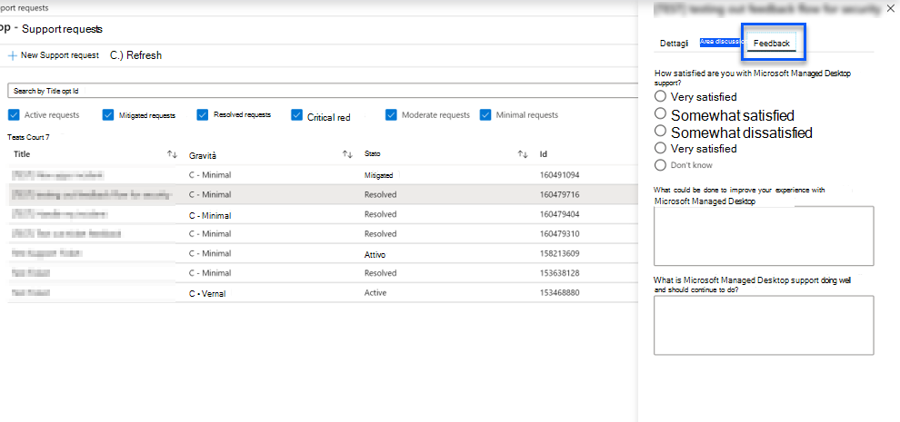

# Supporto amministratore per Microsoft Managed Desktop

È possibile inviare ticket di supporto o richieste di feedback a Microsoft tramite il portale di amministrazione di Microsoft Managed Desktop. Le richieste di supporto vengono sempre classificate in merito agli invii dei commenti e suggerimenti. Le richieste di supporto vengono valutate e gestite in base alla gravità delineata nella [tabella delle definizioni di gravità](#sev). I commenti e suggerimenti vengono esaminati e una risposta fornita se richiesto. 

>[!IMPORTANT]
>Assicurarsi di aver [configurato un contatto di amministratore per l'](../get-started/add-admin-contacts.md) applicazione di pacchetti, dispositivi, sicurezza e altro. Non è possibile inviare una richiesta di supporto in una di queste aree se un contatto di amministratore non è configurato.

**Per inviare una richiesta di supporto**
1. Accedere a [Microsoft Endpoint Manager](https://endpoint.microsoft.com/) e passare al menu **risoluzione dei problemi + supporto** .
2. Cercare la sezione Microsoft Managed Desktop, selezionare **sevice request**.
3. Nelle **richieste di supporto**, selezionare **+ nuovo ticket di supporto**.
4. Selezionare il **tipo di richiesta di supporto** corrispondente alla guida necessaria. La tabella seguente illustra le opzioni. 
5. Selezionare il **livello di gravità**. Per ulteriori informazioni, vedere [definizioni di gravità delle richieste di supporto](#sev). 

Tipo di richiesta di supporto | Quando utilizzare
--- | ---
Operazioni non consentite | È necessario che Microsoft Managed Desktop Operations team analizzi, ad esempio, l'impatto diffuso di una modifica o di un incidente di sicurezza.
Richiesta di informazioni | Si sta pianificando una modifica per la rete, la configurazione del proxy, i sistemi VPN, la scadenza dei certificati o solo alcune informazioni sul servizio. Una risposta dal team di Microsoft Managed Desktop Operations è fortemente consigliata quando si comunica una modifica all'interno dell'organizzazione.
Richiesta di modifica | È necessario che il team delle operazioni di Microsoft Managed Desktop abbia apportato una modifica, ad esempio i dispositivi mobili tra i gruppi di aggiornamento.

## Definizioni di Severity richieste di supporto

Il tempo di risposta iniziale è il periodo da quando si invia la richiesta di supporto a quando un tecnico desktop Microsoft gestito contatta l'utente e inizia a lavorare sulla richiesta di supporto. Il tempo di risposta iniziale varia a seconda dell'impatto aziendale della richiesta, in base alla gravità della richiesta.

Livello di gravità  | Situazione dei clienti |  Tempo di risposta iniziale   | Risposta del cliente prevista
--- | --- | --- | ---
**Gravità A – impatto critico** |  **Impatto aziendale critico**  L'azienda del cliente ha una perdita significativa o un calo dei servizi e richiede attenzione immediata.  **Impatto maggiore sulla compatibilità delle applicazioni**  L'intera azienda del cliente subisce un impatto finanziario a causa di crash o perdita di funzionalità critiche | Iniziale: < 1 ora Aggiornamento: 60 minuti 24x7 disponibile | Quando si seleziona Severity A, si conferma che il problema ha un impatto critico sull'azienda, con grave perdita e degrado dei servizi.   Il problema richiede una risposta immediata e si impegna a una continua operazione 24x7 ogni giorno con il team Microsoft fino alla risoluzione, altrimenti Microsoft può a propria discrezione ridurre la gravità al livello B.   È inoltre necessario verificare che Microsoft disponga di informazioni di contatto accurate. 
**Gravità B-impatto moderato** |  **Impatto aziendale moderato**  L'azienda del cliente ha una perdita o un peggioramento moderato dei servizi, ma il lavoro può ragionevolmente continuare in modo compromessa.  **Impatto moderato sulla compatibilità delle applicazioni**  Un gruppo aziendale specifico non è più produttivo, a causa di un comportamento di crash o di perdita di funzionalità critiche. |  Iniziale: < 4 ore Aggiornamento: 12 ore Orario di ufficio (24x7 disponibile) | Quando si seleziona Severity B, si conferma che il problema ha un impatto moderato sull'azienda con perdita e degrado dei servizi, ma le soluzioni alternative consentono una continuità di business ragionevole, seppur temporanea.   Il problema richiede una risposta urgente. Se si è scelto 24x7 quando si invia la richiesta di supporto, si esegue il commit di un'operazione continua 24x7 ogni giorno con il team di Microsoft fino alla risoluzione, altrimenti Microsoft potrebbe, a propria discrezione, ridurre la gravità al livello C. Se si è scelto il supporto per l'orario di ufficio quando si invia un incidente di gravità B, Microsoft vi contatterà solo durante l'orario di ufficio.  È inoltre necessario verificare che Microsoft disponga di informazioni di contatto accurate.
**Gravità C – impatto minimo** |   **Impatto aziendale minimo**   L'attività del cliente è in funzione con impedimenti minimi dei servizi.  **Impatto di compatibilità delle applicazioni secondarie**  Gli utenti potenzialmente non correlati riscontrano problemi di compatibilità minori che non impediscono la produttività |    Iniziale: < 8 ore Aggiornamento: 24 ore Ore lavorative  | Quando si seleziona gravità C, si conferma che il problema ha un impatto minimo sulla propria azienda con impedimenti minori del servizio.  Per un incidente di gravità C, Microsoft vi contatterà solo durante l'orario di ufficio.  È inoltre necessario verificare che Microsoft disponga delle informazioni di contatto accurate

Dettagli aggiuntivi:
- **Lingue di supporto** : tutto il supporto è disponibile in inglese.
- **Modifiche a livello di gravità** -Microsoft può declassare il livello di gravità se il cliente non è in grado di fornire risorse o risposte adeguate per consentire a Microsoft di proseguire con gli sforzi di risoluzione dei problemi. 
- **Orario di ufficio** -per la maggior parte dei paesi, l'orario di ufficio è compreso tra 9:00 e 5:00, ora solare Pacifico.
- **Compatibilità delle applicazioni** -per un problema di compatibilità delle applicazioni da considerare, deve essere presente un errore riproducente, della stessa versione dell'applicazione, tra la versione precedente e quella corrente di Windows o Office. Per risolvere i problemi di compatibilità delle applicazioni, Microsoft richiede l'utilizzo di un punto di contatto del cliente. L'individuo deve collaborare direttamente con il team di Fast Track per analizzare e risolvere il problema.
- **Tempo di risposta del cliente** Se un cliente non è in grado di soddisfare i requisiti di risposta previsti, Microsoft retrocederà la richiesta di un livello di gravità, a un minimo di gravità C. Se un cliente non risponde alle richieste di azione, Microsoft consentirà di attenuare e chiudere la richiesta di supporto entro 48 ore dall'ultima richiesta.

## Inviare feedback

È possibile apprezzare i propri commenti e utilizzarli per migliorare l'esperienza di supporto dell'amministratore.

Una volta che il ticket è nello stato **attenuato** o **risolto** , è possibile condividere i propri commenti e suggerimenti sulla propria esperienza con quel particolare problema. A tale scopo, andare alla pagina **richieste di servizio** nel menu **risoluzione dei problemi + supporto** del portale MEM. Selezionare il ticket specifico. I dettagli del ticket verranno visualizzati all'interno del Fly-in sul lato destro, selezionare la scheda **commenti e suggerimenti** e fornire le informazioni richieste. Fare attenzione a non includere informazioni personali nel modulo di commenti e suggerimenti. Per ulteriori informazioni sulla privacy, vedere l'informativa [sulla privacy di Microsoft](https://privacy.microsoft.com/privacystatement).

## Risorse aggiuntive
- [Supporto utente per Microsoft Managed Desktop](end-user-support.md). 
- [Supporto per Microsoft Managed Desktop](../service-description/support.md). 
- Se si è già abbonati a Microsoft Managed Desktop, è possibile trovare procedure dettagliate, flussi di processo, istruzioni di lavoro e domande frequenti sulla guida di amministrazione di Microsoft Managed Desktop nella pagina **risorse online** sotto la sezione **Microsoft Managed Desktop** del menu **Amministrazione tenant** in [Microsoft Endpoint Manager](https://endpoint.microsoft.com/).
