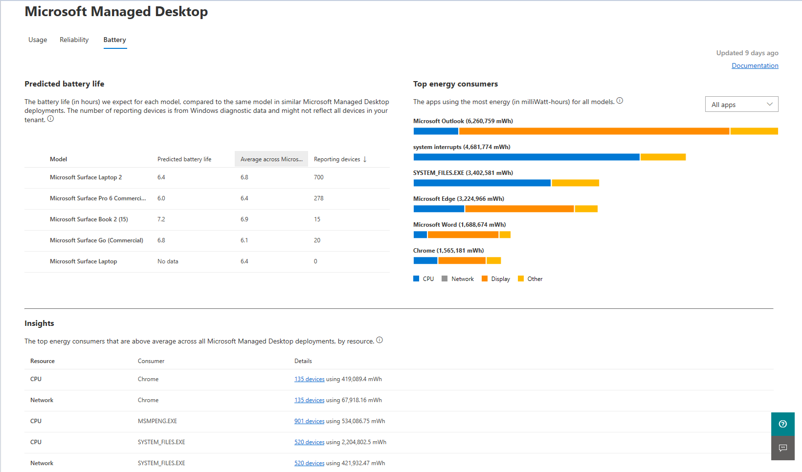

# Dati analitici sulle batterie
Questa visualizzazione fornisce metriche sull'alimentazione, la batteria e l'utilizzo delle app per i dispositivi Microsoft Managed Desktop. Per questi scopi, un'app viene considerata "in uso" se è in esecuzione e ha lo stato attivo.

Per visualizzare i dati di utilizzo, selezionare la **scheda** Batteria.

## Durata della batteria stimata

Nell'area **Durata prevista della** batteria, forniamo previsioni per la durata prevista della batteria per i dispositivi, organizzati in base al modello del dispositivo.

> [!NOTE]
> Questi dati derivano dal campionamento dell'utilizzo dell'energia, del tempo di utilizzo e della capacità della batteria da una selezione casuale dei dispositivi nella distribuzione di Microsoft Managed Desktop che segnalano anche i dati. <em></em>

La tabella fornisce la durata stimata della batteria (in ore), la durata media della batteria per gli stessi modelli in altre distribuzioni di Microsoft Managed Desktop e il numero di dispositivi che segnalano questi dati nell'ambiente. Ordinare i dati selezionando le intestazioni di colonna.

## Principali consumatori di energia

Nell'area **Dei** principali consumatori di energia troverai nel tuo ambiente le app che consumano più energia in milliWatt-hours (mWh). Le app visualizzate sono per dispositivo specifico, che puoi selezionare nella sezione **Durata** stimata della batteria a sinistra. Ad esempio, per vedere il consumo per app per i dispositivi Microsoft Surface Book 2, seleziona la riga nell'area di durata della batteria. Se non si seleziona alcun modello, i dati di consumo dell'app mostrati sono relativi a tutte le app per cui sono presenti dati collettivamente.

 Per ogni app, i segmenti colorati mostrano la distribuzione dell'uso dell'energia dell'app tra queste categorie:

- CPU
- Visualizza
- Rete
- Altro

"Altro" potrebbe includere il consumo di energia da diverse origini, ad esempio attività su disco, utilizzo di banda larga mobile e perdita di energia per resistenza interna. 

Puoi filtrare questa visualizzazione per mostrare solo le app in primo piano, le app in background o entrambe usando il menu in alto a destra. Le app in primo piano sono quelle che hanno avuto interazione con l'utente negli ultimi 28 giorni, ad esempio la selezione di qualcosa con il mouse.

## Dati analitici

**L'area Dati** statistici mostra i primi tre consumatori di energia nelle categorie CPU e rete. Questi elementi consumano energia superiore alla media rispetto a tutte le distribuzioni di Microsoft Managed Desktop. La risorsa di visualizzazione non viene visualizzata perché dipende molto dal tempo di utilizzo del dispositivo e dalle impostazioni di luminosità dello schermo. 

Per ulteriori informazioni, selezionare le **presentazioni** nella colonna Dettagli.

## Ottimizzazione della batteria

Windows 10 offre numerose impostazioni [del dispositivo](https://support.microsoft.com/help/20443/windows-10-battery-saving-tips) per migliorare l'utilizzo dell'alimentazione e aumentare la durata della batteria dei dispositivi Microsoft Managed Desktop. Alcune di queste impostazioni possono ridurre altre funzionalità di Windows, quindi dovrai anche prendere in considerazione altri fattori, ad esempio il ruolo del dispositivo nell'organizzazione. Il supporto di Windows mantiene un elenco di questi suggerimenti [per il risparmio batteria.](https://support.microsoft.com/help/20443/windows-10-battery-saving-tips)

Gli utenti possono modificare alcune impostazioni da soli senza la necessità di elevazione o supporto dell'amministratore. Altre impostazioni richiedono il supporto dell'amministratore IT dell'organizzazione.
