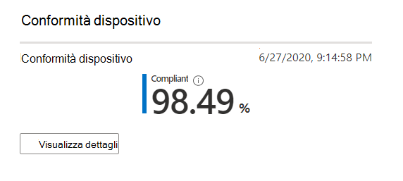
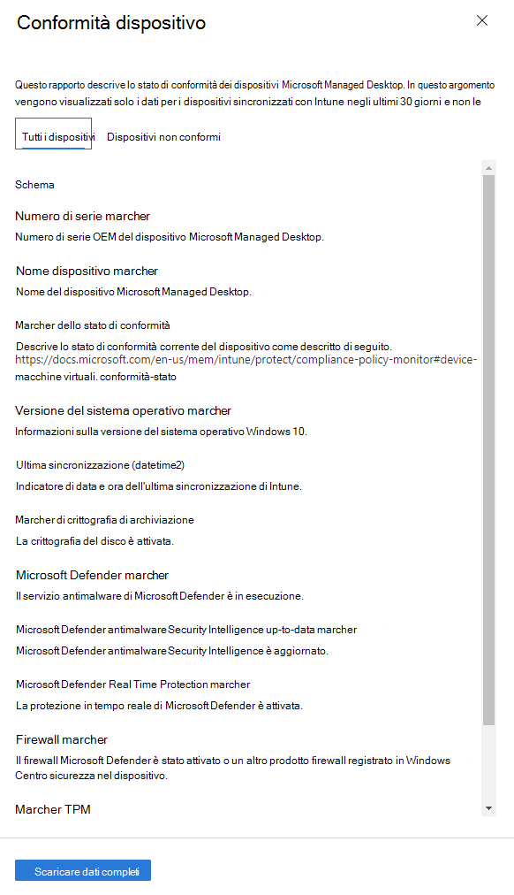

# Rapporto di conformità del dispositivoDevice compliance report

Questa visualizzazione Mostra la percentuale di dispositivi Microsoft Managed Desktop conformi ai criteri di conformità impostati in Microsoft Intune.This view shows the percentage of your Microsoft Managed Desktop devices that conform to compliance policies set in Microsoft Intune.

Selezionare **Visualizza dettagli** per visualizzare informazioni specifiche per tutti i dispositivi Microsoft Managed Desktop o solo per i dispositivi che non sono conformi ai criteri di conformità.Select **View details** to view specific information for either all of your Microsoft Managed Desktop devices or only devices that do not conform to compliance policies. Utilizzare il menu a discesa per passare da una visualizzazione all'altra.Use the pulldown menu to switch between these views. Per essere visualizzato in questa visualizzazione, è necessario che un dispositivo sia un computer fisico e che sia sincronizzato con Intune negli ultimi 30 giorni.To appear in this view, a device must be a physical machine and have synced with Intune in the last 30 days.

Da questa visualizzazione, selezionare **Scarica dati completi** per esportare un file delimitato da virgole con le stesse informazioni.From this view, select **Download full data** to export a comma-delimited file with the same information. Nel file di esportazione le aree visualizzate come **schema** vengono visualizzate come colonne.In the export file, the areas displayed as **Schema** appear as columns.