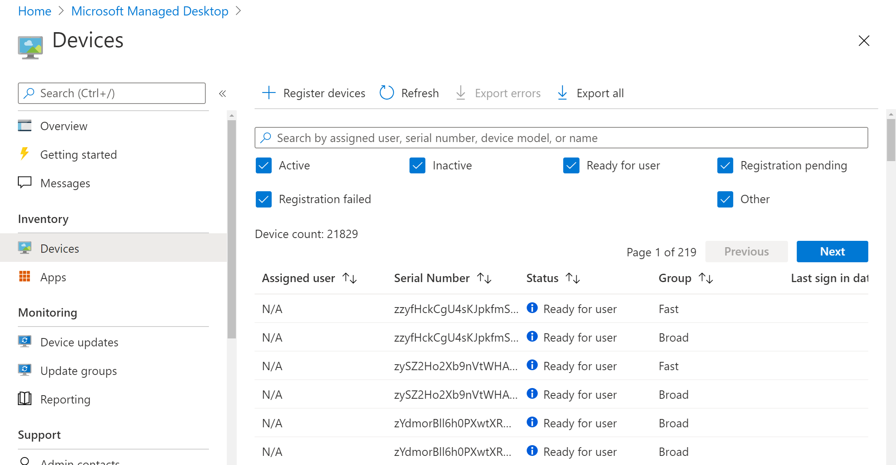

# Report inventario dei dispositiviDevice inventory report

Nella visualizzazione **Dispositivi** puoi selezionare la scheda **Esporta** tutto per scaricare un file delimitato da virgole, incluse queste informazioni:In the **Devices** view, you can select the **Export all** tab to download a comma-delimited file including this information:

- Numero di serieSerial Number
- Nome dispositivoDevice Name
- Ultimo check-in dispositivoDevice Last check-in
- Gestito daManaged By
- ProduttoreManufacturer
- ModelloModel
- Sistema operativoOS
- Licenza del sistema operativoOS License
- Versione del sistema operativoOS Version
- OwnershipOwnership
- Data di registrazioneEnrollment Date
- Nome anelloRing Name
- Archiviazione - Gratuito in GBStorage - Free in GB
- Archiviazione - Totale in GBStorage - Total in GB
- Registrato da UPN utenteEnrolled by User UPN
- Utente assegnatoAssigned User
- StatoStatus
- Età (mesi)Age (Months)
- ProfiloProfile
- Utenti connessiLogged in Users
- Versione TPMTPM version
- Avvio protetto abilitatoSecure Boot Enabled
- Tipo di disco primarioPrimary Disk Type
- Memoria fisica totaleTotal Physical Memory

