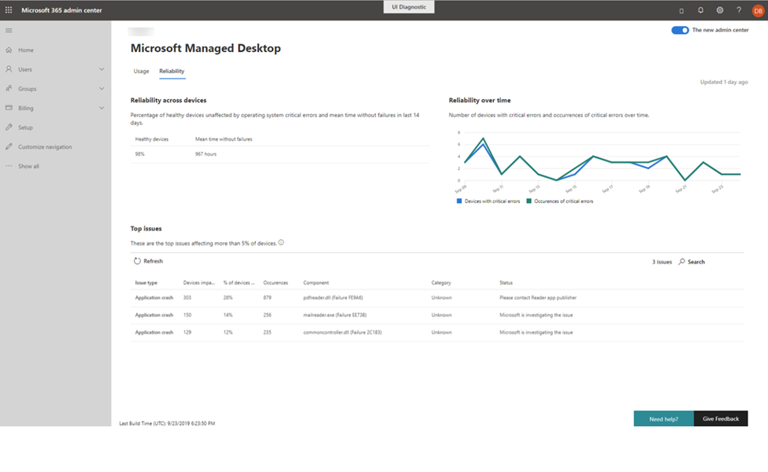

# Intuizioni di affidabilitàReliability insights

Questa visualizzazione fornisce un riepilogo di integrità dei dispositivi gestiti.This view provides you with a health summary of your managed devices. Per visualizzare i dati di attendibilità, selezionare la scheda **affidabilità** .To view reliability data, select the **Reliability** tab.

La sezione **affidabilità tra i dispositivi** offre un riepilogo rapido dell'integrità della distribuzione negli ultimi 14 giorni segnalando la percentuale di dispositivi considerati "integro" e il tempo medio osservato dopo l'ultimo errore segnalato.The **Reliability across devices** section offers a quick health summary of your deployment over the last 14 days by reporting the percentage of devices considered to be “healthy” and the mean time observed since the last reported failure. 

 
Il grafico sull' **affidabilità nel tempo** sulla destra riporta il numero di dispositivi con errori critici e il numero totale di errori critici osservati nel tempo.The **Reliability over time** graph on the right reports the number of devices with critical errors and the total number of observed critical errors over time.

La sezione **problemi principali** specifica i problemi rilevati specifici che incidono almeno sul 5% dei dispositivi gestiti.The **Top issues** section details specific detected issues that affect at least 5% of your managed devices. I dettagli riportati includono:Reported details include:

- Il tipo di problemaThe type of issue
    - Crash dell'applicazione, in cui un'app smette di funzionare o si arresta in modo imprevistoApplication crashes, in which an app stops functioning or unexpectedly stops
    - L'applicazione si blocca, in cui un'applicazione smette di rispondere all'inputApplication hangs, where an application stops responding to input
    - Errori critici, che si verificano quando Windows ha riscontrato un problema di cui non è possibile eseguire il ripristinoCritical errors, which occur when Windows has encountered an issue it can't recover from
- Il numero di dispositivi coinvolti nello stesso problemaThe number of devices affected by the same issue
- La percentuale di dispositivi gestiti che il numero rappresentaThe percentage of managed devices that number represents
- Il numero totale di occorrenze del problema specificoThe total count of occurences of the specific issue
- Il componente software che sembra essere l'origine del problemaThe software component that appears to be the source of the problem
- Lo stato corrente delle operazioni di Microsoft Managed Desktop indaga e rimedia il problemaThe current status as Microsoft Managed Desktop Operations investigates and remediates the issue

