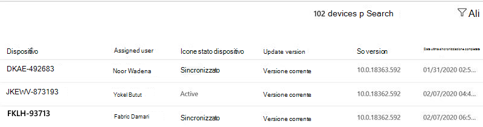

# Dati analitici sugli aggiornamenti della sicurezza di WindowsWindows security update insights
In questa visualizzazione viene fornita una panoramica dello stato degli aggiornamenti della sicurezza per i dispositivi Microsoft Managed Desktop.This view provides an overview of the status of security updates for your Microsoft Managed Desktop devices. 

Per visualizzare i dati di utilizzo, selezionare la scheda aggiornamenti per la <strong>sicurezza di Windows</strong> .To view usage data, select the <strong>Windows security updates</strong> tab.

## Stato del dispositivoDevice status

Affinché i dispositivi vengano aggiornati da Windows Update, è necessario che siano connessi a Internet e che non siano in letargo per un minimo di sei ore, due dei quali devono essere continue.For devices to be updated by Windows Update, they must be connected to the Internet and not hibernating for a minimum of six hours, two of which must be continuous. A condizione che un dispositivo sia connesso e che non sia in modalità ibernazione, viene considerato "in uso".As long as a device is connected and not hibernating, it's considered to be "in use." Anche se è possibile che un dispositivo che non soddisfa questi requisiti venga aggiornato, i dispositivi che li soddisfano hanno la maggiore probabilità di essere aggiornati.Although it's possible that a device that doesn't meet these requirements will be updated, devices that meet them have the highest likelihood of being updated. 

La categorizzazione dell'attività del dispositivo nel contesto di Windows Update viene confrontata con questi termini:We categorize device activity in the context of Windows Update with these terms:

- <strong>Attivo:</strong> Dispositivi che soddisfano i criteri di utilizzo minimi (sei ore, due continue) per la versione più recente dell'aggiornamento della sicurezza e che hanno eseguito l'archiviazione con Microsoft Intune almeno ogni cinque giorni<strong>Active:</strong> Devices that have met the minimum usage criteria (six hours, two continuous) for the most recent security update release and have checked in with Microsoft Intune at least every five days
- <strong>Sincronizzati:</strong> Dispositivi che sono stati archiviati con Intune negli ultimi 28 giorni<strong>Synced:</strong> Devices that have checked in with Intune within the last 28 days
- Non <strong>sincronizzato:</strong> Dispositivi che <i>non</i> sono stati archiviati con Intune negli ultimi 28 giorni<strong>Out of sync:</strong> Devices that have <i>not</i> checked in with Intune in the last 28 days

## Stato versione aggiornamentoUpdate version status

Microsoft rilascia gli aggiornamenti della sicurezza ogni secondo martedi del mese.Microsoft releases security updates every second Tuesday of the month. Ogni versione aggiunge aggiornamenti importanti per vulnerabilità note sulla sicurezza.Each release adds important updates for known security vulnerabilities. Microsoft Managed Desktop garantisce che il 95% dei suoi dispositivi gestiti venga aggiornato con l'aggiornamento della sicurezza più recente disponibile ogni mese.Microsoft Managed Desktop ensures that 95% of its managed devices are updated with the latest available security update every month. Gli aggiornamenti della sicurezza vengono talvolta rilasciati in altri casi per affrontare con urgenza nuove minacce.Security updates are sometimes released at other times to urgently address new threats. Microsoft Managed Desktop distribuisce questi aggiornamenti in modo analogo.Microsoft Managed Desktop deploys these updates in a similar fashion.

Categorizzare lo stato delle versioni degli aggiornamenti per la sicurezza con questi termini:We categorize the status of security update versions with these terms:

- <strong>Corrente:</strong> Dispositivi che eseguono l'aggiornamento rilasciati nel mese corrente<strong>Current:</strong> Devices that are running the update released in the current month
- <strong>Previous:</strong> Dispositivi che eseguono l'aggiornamento rilasciato nel mese precedente<strong>Previous:</strong> Devices running the update that was released in the previous month
- <strong>Precedente:</strong> Dispositivi che eseguono tutti gli aggiornamenti della sicurezza rilasciati prima del mese precedente<strong>Older:</strong> Devices running any security update released prior to the previous month

Si dovrebbe vedere alcuni dispositivi nella categoria <strong>precedente</strong> --una popolazione di grandi dimensioni o in crescita indica probabilmente un problema sistemico che è necessario segnalare a Microsoft Managed Desktop in modo da poter indagare.You should see few devices in the <strong>Older</strong> category--a large or growing population probably indicates a systemic problem that you should report to Microsoft Managed Desktop so we can investigate.

## Stato di avanzamento della distribuzioneDeployment progress

All'inizio di ogni ciclo di rilascio degli aggiornamenti per la sicurezza, Microsoft Managed Desktop acquisisce un'istantanea del popolamento del dispositivo e imposta la propria destinazione di distribuzione al 95% di quella popolazione.At the beginning of each security update release cycle, Microsoft Managed Desktop takes a snapshot of the device population and sets its deployment target at 95% of that population. L'area di <strong>avanzamento della distribuzione</strong> presenta una tendenza storica, aggiornata giornalmente, tracciando la conformità della distribuzione degli aggiornamenti a questa destinazione per ogni versione.The <strong>Deployment progress</strong> area shows a historical trend, updated daily, tracking how closely the update deployment meets this target for each release. Questo grafico Visualizza solo i dispositivi con stato attivo.This graph only shows devices with Active status.

È possibile visualizzare i dati per i cicli di aggiornamento precedenti utilizzando il menu a discesa in alto a destra.You can view this data for previous update cycles by using the dropdown menu in the upper right. Il periodo selezionato in questo menu si applica a tutte le informazioni dell'intera pagina.The period you select in this menu applies to all of the information on the whole page.

L'area dei <strong>dispositivi attivi aggiornati in base al gruppo di distribuzione</strong> offre una visualizzazione diversa mostrando lo stato di avanzamento dell'installazione dell'aggiornamento per ogni gruppo di distribuzione di Microsoft Managed Desktop.The <strong>Updated active devices by deployment group</strong> area offers a different view by showing the progress of the update installation for each of the Microsoft Managed Desktop deployment groups.

I <strong>giorni per raggiungere</strong> l'area di destinazione Visualizza il tempo impiegato per il 95% del numero totale di dispositivi da aggiornare con l'aggiornamento della sicurezza corrente.The <strong>Days to reach target</strong> area displays how long it took for 95% of the total number of devices to be updated with the current security update. Durante la fase di distribuzione, quest'area Visualizza l' <strong>aggiornamento</strong> fino a quando non viene raggiunta la destinazione 95% per l'aggiornamento selezionato.While deployment is underway, this area displays <strong>Still updating</strong> until the 95% target is reached for the selected update.

## Area dettagli dispositivoDevice details area

La parte inferiore del dashboard è una tabella che mostra informazioni dettagliate sui dispositivi, tra cui lo stato del [dispositivo](#device-status) e lo [stato della versione dell'aggiornamento](#update-version-status).The bottom of the dashboard is a table showing detailed information for your devices, including the [Device status](#device-status) and the [Update version status](#update-version-status). È possibile eseguire una ricerca nell'elenco o filtrarlo in base a qualsiasi valore elencato.You can search this list or filter it by any listed value.

