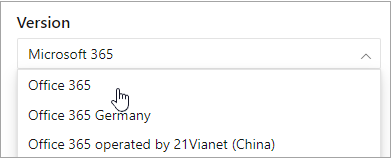

# Microsoft 365 di spostamento documentiMicrosoft 365 docs navigation guide

In questo argomento vengono forniti alcuni suggerimenti e suggerimenti per l'esplorazione del Microsoft 365 documentazione tecnica.This topic provides some tips and tricks for navigating the Microsoft 365 technical documentation space.  

## Pagina HubHub page

La Microsoft 365 hub è disponibile in ed è il punto di ingresso per trovare contenuto Microsoft 365 [https://aka.ms/microsoft365docs](./index.yml) pertinente.The Microsoft 365 hub page can be found at [https://aka.ms/microsoft365docs](./index.yml) and is the entry point for finding relevant Microsoft 365 content.

È sempre possibile tornare a  questa pagina selezionando Microsoft 365 dall'intestazione nella parte superiore di ogni pagina all'interno del Microsoft 365 documentazione tecnica:You can always navigate back to this page by selecting **Microsoft 365** from the header at the top of every page within the Microsoft 365 technical documentation set:

## Documentazione offlineOffline documentation

Se si desidera visualizzare la documentazione di Microsoft 365 in un sistema offline, è possibile creare un PDF ovunque ci si trova nella documentazione Microsoft 365 documentazione tecnica.If you would like to view the Microsoft 365 documentation on an offline system, you can create a PDF wherever you are in the Microsoft 365 technical documentation.

Se si desidera creare un PDF, selezionare il **collegamento Scarica PDF** disponibile nella parte inferiore di ogni sommario.If you'd like to create a PDF, select the **Download PDF** link found at the bottom of every table of contents.

## Ricerca sommarioTOC search 
In docs.microsoft.com, è possibile cercare il contenuto nel sommario utilizzando la casella di ricerca del filtro nella parte superiore:On docs.microsoft.com, you can search the content in the table of contents by using the filter search box at the top:

## Filtro versioneVersion filter
La Microsoft 365 tecnica fornisce contenuto per altri prodotti, tra cui Office 365 Germania e Office 365 gestito da 21 Vianet (Cina).The Microsoft 365 technical documentation provides content for additional products, including Office 365 Germany and Office 365 operated by 21 Vianet (China). Le funzionalità possono variare a seconda di queste versioni e, di conseguenza, a volte il contenuto stesso può variare.Features can vary between these versions, and as such, sometimes the content itself can vary.

Puoi usare il filtro versione per assicurarti di visualizzare il contenuto per la versione appropriata di Microsoft 365:You can use the version filter to ensure that you are seeing content for the appropriate version of Microsoft 365:

## BreadcrumbsBreadcrumbs

I breadcrumb sono disponibili sotto l'intestazione e sopra il sommario e indicano dove si trova l'articolo corrente nel sommario.Breadcrumbs can be found below the header and above the table of contents, and indicate where the current article is located in the table of contents.  Questa procedura non solo consente di impostare il contesto sul tipo di contenuto che si sta leggendo, ma consente anche di spostarsi di nuovo verso l'alto nell'albero del sommario:Not only does this help set the context to what type of content you're reading, but it also allows you to navigate back up the table of contents tree:

## Spostamento sezione articoloArticle section navigation

Il riquadro di spostamento a destra consente di passare rapidamente alle sezioni all'interno di un articolo, nonché di identificare la posizione all'interno dell'articolo.The right-hand navigation pane allows you to quickly navigate to sections within an article, as well as identify your location within the article.  

## Inviare commenti e suggerimenti ai documentiSubmit docs feedback

Se si verificano problemi all'interno di un articolo, è possibile inviare commenti e suggerimenti al team del contenuto di SQL per tale articolo scorrendo verso il basso fino alla parte inferiore della pagina e selezionando **Feedback contenuto.**If you find something wrong within an article, you can submit feedback to the SQL Content team for that article by scrolling down to the bottom of the page and selecting **Content feedback**.

## Contribuire alla Microsoft 365 documentazioneContribute to Microsoft 365 documentation

Lo sai che puoi modificare il contenuto in docs.microsoft.com te stesso?Did you know that you could edit the content on docs.microsoft.com yourself? In questo caso, la documentazione non solo migliorerà, ma ti verrà anche accreditato come collaboratore della pagina.If you do so, not only will our documentation improve, but you'll also be credited as a contributor to the page. Per iniziare, vedi:To get started, see:

- [Guida ai collaboratori di Microsoft DocsMicrosoft Docs contributor guide](/contribute/)

## Passaggi successiviNext steps

- Introduzione alla documentazione [tecnica Microsoft 365 documentazione tecnica.](index.yml)Get started with the [Microsoft 365 technical documentation](index.yml).