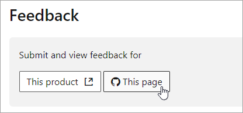

# Guida alla navigazione Microsoft 365 docs

In questo argomento vengono forniti alcuni suggerimenti utili per l'esplorazione dello spazio di documentazione tecnica Microsoft 365.  

## Pagina Hub

È possibile trovare la pagina Hub Microsoft 365 all'indirizzo [https://aka.ms/microsoft365docs](https://aka.ms/microsoft365docs) ed è il punto di ingresso per la ricerca di contenuto microsoft 365 pertinente.

È sempre possibile tornare a questa pagina selezionando **microsoft 365** dall'intestazione nella parte superiore di ogni pagina all'interno del set di documentazione tecnica di Microsoft 365:

## Documentazione offline

Se si desidera visualizzare la documentazione di Microsoft 365 su un sistema offline, è possibile creare un file PDF ovunque si trovi nella documentazione tecnica di Microsoft 365.

Se si desidera creare un file PDF, selezionare il collegamento **Download PDF** trovato nella parte inferiore di ogni sommario.

## Ricerca Sommario 
In docs.microsoft.com, è possibile cercare il contenuto nel sommario utilizzando la casella di ricerca filtro in alto:

## Filtro versione
La documentazione tecnica di Microsoft 365 fornisce contenuti per prodotti aggiuntivi, tra cui Office 365 Germany e Office 365 gestito da 21 Viani (Cina). Le caratteristiche possono variare tra queste versioni e, a volte, il contenuto stesso può variare.

È possibile utilizzare il filtro versione per assicurarsi che venga visualizzato il contenuto per la versione appropriata di Microsoft 365:

## Pangrattato

Le briciole di pane possono essere trovate sotto l'intestazione e sopra il sommario e indicano dove l'articolo corrente si trova nel sommario.  Questa guida non solo consente di impostare il contesto sul tipo di contenuto che si sta leggendo, ma anche di eseguire il backup dell'albero Sommario:

## Sezione di spostamento dell'articolo

Nel riquadro di spostamento destro è possibile accedere rapidamente alle sezioni all'interno di un articolo, nonché identificare la posizione all'interno dell'articolo.  

## Inviare commenti e suggerimenti sui documenti

Se si riscontra qualcosa di sbagliato all'interno di un articolo, è possibile inviare commenti e suggerimenti al team di contenuto SQL per tale articolo scorrendo verso il basso nella parte inferiore della pagina e selezionando **commenti e suggerimenti sul contenuto**.

## Contribuire alla documentazione di Microsoft 365

Lo sapevate che è possibile modificare il contenuto di docs.microsoft.com da soli? In tal caso, non solo la documentazione migliorerà, ma verrà anche accreditata come collaboratore della pagina. Per iniziare, vedere:

- [Guida per i collaboratori di Microsoft docs](https://docs.microsoft.com/contribute/)

## Passaggi successivi

- Iniziare a utilizzare la [documentazione tecnica di Microsoft 365](index.yml).
