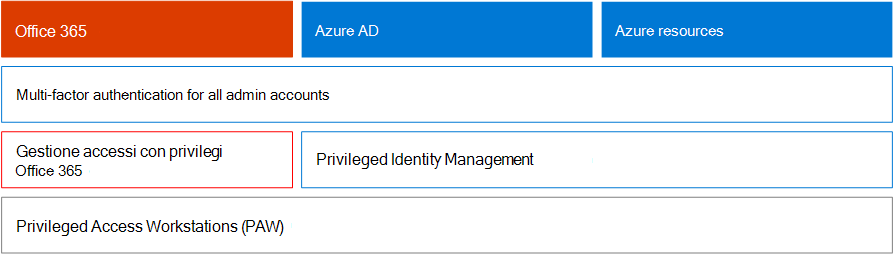
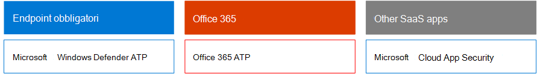
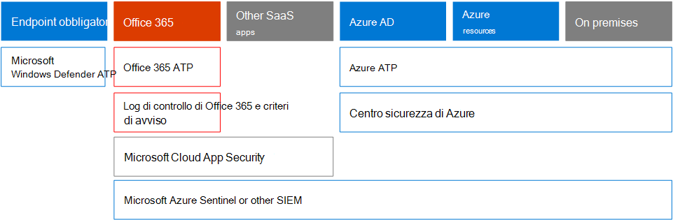

# Microsoft 365 Security for Business Decision Makers (BDMs)

In questo articolo vengono illustrati alcuni degli scenari di minacce e attacchi più comuni attualmente affrontati dalle organizzazioni per gli ambienti Microsoft 365 e le azioni consigliate per attenuare tali rischi. Anche se Microsoft 365 è dotato di una vasta gamma di funzionalità di sicurezza preconfigurate, richiede inoltre che il cliente si assuma la responsabilità di proteggere le proprie identità, i dati e i dispositivi utilizzati per accedere ai servizi cloud. Queste linee guida sono state sviluppate da kozeta Beam (Microsoft Cloud Security Architect) e Thiagaraj Paolo (consulente senior Microsoft).

Questo articolo è organizzato in base alla priorità del lavoro, a partire dalla protezione degli account utilizzati per amministrare i servizi e le risorse più importanti, ad esempio il tenant, la posta elettronica e SharePoint. Questo metodo fornisce una soluzione metodica per la sicurezza e la collaborazione con il foglio di calcolo seguente, in modo da poter monitorare lo stato di avanzamento con i team e le parti interessate nell'organizzazione: [Microsoft 365 Security per il foglio di calcolo di BDMs](https://github.com/MicrosoftDocs/microsoft-365-docs/raw/public/microsoft-365/downloads/Microsoft-365-BDM-security-recommendations-spreadsheet.xlsx). 

Microsoft fornisce lo strumento di valutazione sicura all'interno del tenant per analizzare automaticamente la posizione di sicurezza in base alle attività normali, assegnare un punteggio e fornire suggerimenti per il miglioramento della sicurezza. Prima di prendere le azioni consigliate in questo articolo, prendere nota del punteggio corrente e suggerimenti. Le azioni consigliate in questo articolo aumenteranno il punteggio. L'obiettivo non è quello di ottenere il punteggio massimo, ma di essere a conoscenza delle opportunità di protezione dell'ambiente in modo da non influire negativamente sulla produttività per gli utenti. Vedere [Microsoft Secure Score](mtp/microsoft-secure-score.md).

Un'altra cosa prima di iniziare. . . Assicurarsi di [abilitare il log di controllo](../compliance/search-the-audit-log-in-security-and-compliance.md). Questi dati sono necessari in un secondo momento, nel caso in cui sia necessario indagare su un incidente o una violazione. 

## Proteggere gli account con privilegi

Come primo passaggio, è consigliabile garantire agli account critici nell'ambiente un ulteriore livello di protezione poiché tali account dispongono dell'accesso e delle autorizzazioni necessarie per gestire e modificare i servizi e le risorse critiche che possono influire negativamente sull'intera organizzazione, se compromessi. La protezione degli account privilegiati è uno dei modi più efficaci per proteggersi da un utente malintenzionato che cerca di elevare le autorizzazioni di un account compromesso a quello amministrativo. 

|Consiglio  |E3 |E5  |
|---------|---------|---------|
|Applicare l'autenticazione a più fattori (AMF) per tutti gli account amministrativi.||| 
|Implementare Azure Active Directory (Azure AD) Privileged Identity Management (PIM) per applicare l'accesso privilegiato just-in-time alle risorse di Azure AD e Azure. È inoltre possibile individuare gli utenti autorizzati a accedere e controllare l'accesso con privilegi.|         | |
|Implementare la gestione degli accessi con privilegi per gestire il controllo di accesso granulare sulle attività di amministratore privilegiate in Office 365. |         | |
|Configurare e utilizzare le workstation di accesso privilegiate (PAW) per amministrare i servizi. Non utilizzare le stesse workstation per esplorare Internet e controllare la posta elettronica non correlata all'account amministrativo.|  | | 

Nel diagramma seguente vengono illustrate queste funzionalità.

Suggerimenti aggiuntivi:
- Verificare che gli account sincronizzati da locale non siano assegnati ai ruoli di amministratore per i servizi cloud. Ciò consente di evitare che un utente malintenzionato sfrutti gli account locali per ottenere l'accesso amministrativo ai servizi cloud. 
- Assicurarsi che gli account di servizio non siano assegnati ai ruoli di amministratore. Tali account spesso non vengono monitorati e impostati con password che non scadono. Per iniziare, assicurarsi che gli account di servizio di AADConnect e ADFS non siano amministratori globali per impostazione predefinita.
- Rimuovere le licenze dagli account di amministratore. A meno che non esista un caso di utilizzo specifico per assegnare le licenze a account di amministratore specifici, rimuovere le licenze da tali account. 

## Ridurre la superficie di attacco

L'area di interesse successiva è la riduzione della superficie di attacco. Questa operazione può essere eseguita con il minimo sforzo e l'impatto degli utenti e dei servizi. Riducendo la superficie di attacco, i pirati informatici hanno meno modi per sferrare un attacco all'organizzazione.

Ecco alcuni esempi:
- Disabilitare i protocolli POP3, IMAP e SMTP. La maggior parte delle organizzazioni moderne non utilizza più i protocolli meno recenti. È possibile disabilitarli in modo sicuro e consentire le eccezioni solo in base alle esigenze. 
- Ridurre e mantenere il numero di amministratori globali del tenant al minimo assoluto necessario. Questo riduce direttamente la superficie di attacco per tutte le applicazioni cloud. 
- Ritirare i server e le applicazioni non più utilizzati nell'ambiente. 
- Implementare un processo per disabilitare ed eliminare gli account non più utilizzati. 

## Protezione dalle minacce note

Le minacce note includono malware, account compromessi e phishing. Alcune protezioni contro tali minacce possono essere implementate rapidamente senza un impatto diretto sugli utenti, mentre altre richiedono maggiore pianificazione e formazione degli utenti. 

|Consiglio  |E3  |E5  |
|---------|---------|---------|
|**Configurare l'autenticazione a più fattori e l'utilizzo dei criteri di accesso condizionale consigliati, inclusi i criteri di rischio per la connessione**. Microsoft consiglia e ha testato una serie di criteri che interagiscono per proteggere tutte le app Cloud, inclusi i servizi Office 365 e Microsoft 365. Vedere [identità e configurazioni di accesso ai dispositivi](../enterprise/microsoft-365-policies-configurations.md). | ||
|**Richiedere l'autenticazione a più fattori per tutti gli utenti**. Se non si dispone delle licenze necessarie per implementare i criteri di accesso condizionale consigliati, è necessario almeno richiedere l'autenticazione a più fattori per tutti gli utenti.|||
|**Aumentare il livello di protezione da malware nella posta elettronica**. L'ambiente Office 365 o Microsoft 365 include la protezione da malware, ma è possibile aumentare questa protezione bloccando gli allegati con tipi di file comunemente utilizzati per il malware.|||
|**Proteggere la posta elettronica da attacchi di phishing mirati**. Se sono stati configurati uno o più domini personalizzati per l'ambiente Office 365 o Microsoft 365, è possibile configurare la protezione anti-phishing mirata. La protezione anti-phishing ATP, parte di Office 365 Advanced Threat Protection, può aiutare a proteggere l'organizzazione da attacchi di phishing basati sulla rappresentazione malevola e altri attacchi di phishing. Se non è stato configurato un dominio personalizzato, non è necessario eseguire questa operazione.| ||
|**Protezione contro gli attacchi ransomware nella posta elettronica**. Ransomware rimuove l'accesso ai dati crittografando i file o bloccando gli schermi del computer. Tenta quindi di estorcere denaro dalle vittime chiedendo "riscatto", di solito in forma di cryptocurrencies come Bitcoin, in cambio della restituzione dell'accesso ai dati. È possibile contribuire a difendersi da ransomware creando una o più regole del flusso di posta per bloccare le estensioni di file comunemente utilizzate per il ransomware o per avvisare gli utenti che ricevono questi allegati tramite posta elettronica.|||
|**Blocca le connessioni dei paesi in cui non si esegue l'attività**. Creare un criterio di accesso condizionale di Azure AD per bloccare le connessioni provenienti da questi paesi, creando efficacemente un firewall Geo attorno al tenant.| ||

Nel diagramma seguente vengono illustrate queste funzionalità.

## Protezione da minacce sconosciute

Dopo aver aggiunto protezioni aggiuntive agli account privilegiati e la protezione da attacchi noti, è necessario spostare l'attenzione sulla protezione dalle minacce sconosciute. Gli avversari più determinati e avanzati utilizzano metodi innovativi e sconosciuti per attaccare le organizzazioni. Con la vasta telemetria di Microsoft di dati raccolti su miliardi di dispositivi, applicazioni e servizi, è possibile eseguire una protezione avanzata dalle minacce su Windows, Office 365 e Azure per impedire attacchi di zero giorni, utilizzando ambienti con sabbie e verificarne la validità prima di consentire l'accesso al contenuto. 

|Consiglio  |E3  |E5  |
|---------|---------|---------|
|**Configurare Office 365 Advanced Threat Protection (ATP)**: * Allegati sicuri ATP * Collegamenti sicuri ATP * ATP per SharePoint, OneDrive e Microsoft Teams * Protezione anti-phishing ATP|         | |
|**Configurare le funzionalità di protezione dalle minacce avanzate di Microsoft Defender**: * Windows Defender Antivirus  * Exploit Protection   * Riduzione della superficie di attacco   * Isolamento basato sull'hardware  * Accesso alla cartella controllata     |         | |
|**Utilizzare Microsoft cloud app Security** per individuare le app SaaS e iniziare a utilizzare l'analisi comportamentale e il rilevamento delle anomalie. |         | |

Nel diagramma seguente vengono illustrate queste funzionalità.

Suggerimenti aggiuntivi:
- Garantire comunicazioni di canale partner sicure come i messaggi di posta elettronica tramite TLS.
- Aprire la Federazione teams solo ai partner con cui si comunica.
- Non aggiungere domini mittente, mittenti singoli o IP di origine all'elenco Consenti, in quanto consente di ignorare i controlli di posta indesiderata e antimalware: una prassi comune con i clienti è l'aggiunta di domini accettati o di altri domini in cui potrebbe essere stato segnalato un problema di flusso di posta elettronica nell'elenco Consenti. Non aggiungere domini nell'elenco dei filtri per la posta indesiderata e la connessione perché ciò potenzialmente ignora tutti i controlli di posta indesiderata. 
- Abilitare le notifiche di posta indesiderata in uscita, abilitare le notifiche di posta indesiderata in uscita a una lista di distribuzione internamente all'helpdesk o al team di amministrazione IT per segnalare se un utente interno invia messaggi di posta indesiderata esternamente. Questo potrebbe essere un indicatore del fatto che l'account è stato compromesso.
- Disabilitare Remote PowerShell per tutti gli utenti: Remote PowerShell viene utilizzato principalmente dagli amministratori per accedere ai servizi a fini amministrativi o all'accesso API programmatico. È consigliabile disabilitare questa opzione per gli utenti non amministratori per evitare la ricognizione, a meno che non dispongano di un requisito aziendale per accedervi. 
- Bloccare l'accesso al portale di gestione di Microsoft Azure a tutti gli utenti non amministratori. È possibile eseguire questa operazione creando una regola di accesso condizionale per bloccare tutti gli utenti, ad eccezione degli amministratori. 

## Assumere una violazione

Anche se Microsoft accetta tutte le misure possibili per prevenire minacce e attacchi, è consigliabile utilizzare sempre il concetto di "presumere violazione". Anche se un utente malintenzionato è riuscito a intromettersi nell'ambiente, è necessario assicurarsi che non siano in grado di exfiltrate dati o informazioni sull'identità dall'ambiente. Per questo motivo, si consiglia di abilitare la protezione contro le perdite di dati sensibili, come i numeri di previdenza sociale, i numeri delle carte di credito, ulteriori informazioni personali e altre informazioni riservate a livello organizzativo. 

La mentalità "presumere violazione" richiede l'implementazione di una strategia di rete di trust zero, il che significa che gli utenti non sono completamente considerati attendibili solo perché sono interni alla rete. Invece, come parte dell'autorizzazione di ciò che gli utenti possono fare, vengono specificati insiemi di condizioni e, quando tali condizioni sono soddisfatte, vengono applicati alcuni controlli. Le condizioni possono includere lo stato di integrità del dispositivo, l'accesso all'applicazione, le operazioni eseguite e l'utilizzo dei rischi. Ad esempio, un'azione di registrazione del dispositivo deve sempre attivare l'autenticazione Mae per garantire che non vengano aggiunti dispositivi Rouge all'ambiente. 

Una strategia di rete con zero Trust richiede anche di sapere dove sono archiviate le informazioni e di applicare i controlli adatti per la classificazione, la protezione e la conservazione. Per proteggere in modo efficace le risorse più critiche e sensibili, è necessario innanzitutto identificare la posizione in cui si trovano e fare l'inventario, cosa che può essere difficile. Successivamente, collaborare con l'organizzazione per definire una strategia di governance. La definizione di uno schema di classificazione per un'organizzazione e la configurazione di criteri, etichette e condizioni richiede una pianificazione e una preparazione accurate. È importante tenere presente che non si tratta di un processo basato su IT. Assicurarsi di collaborare con il team di conformità e legali per sviluppare uno schema appropriato di classificazione e etichettatura per i dati dell'organizzazione.

Le funzionalità di protezione delle informazioni di Microsoft 365 consentono di individuare le informazioni in cui sono archiviate e quali informazioni richiedono una maggiore protezione. La protezione delle informazioni è un processo continuo e le funzionalità di Microsoft 365 offrono visibilità sul modo in cui gli utenti utilizzano e distribuiscono informazioni riservate, in cui le informazioni sono attualmente archiviate e dove scorrono. È inoltre possibile vedere come gli utenti gestiscono informazioni regolamentate per assicurarsi che vengano applicate le etichette e le protezioni appropriate.

|Consiglio |E3|E5 |
|---------|---------|---------|
|**Esaminare e ottimizzare l'accesso condizionale e i criteri correlati per allineare i propri obiettivi a una rete con zero Trust**. La protezione da minacce note include l'implementazione di un set di [criteri consigliati](../enterprise/microsoft-365-policies-configurations.md). Esaminare l'implementazione di questi criteri per garantire la protezione delle app e dei dati nei confronti di hacker che hanno acquisito accesso alla rete. Si noti che il criterio di protezione delle app di Intune consigliato per Windows 10 consente di utilizzare la protezione delle informazioni (WIP) di Windows. WIP protegge dalle perdite accidentali dei dati dell'organizzazione tramite app e servizi, come la posta elettronica, i social media e il cloud pubblico. |         ||
|**Disabilitare l'inoltro di posta elettronica esterno**. Gli hacker che accedono alla cassetta postale di un utente possono rubare la posta impostando la cassetta postale in modo da inoltrare automaticamente la posta elettronica. Ciò può verificarsi anche senza la consapevolezza dell'utente. È possibile evitare che ciò accada configurando una regola del flusso di posta.| ||
|**Disabilitare la condivisione di calendari esterni anonimi**. Per impostazione predefinita, la condivisione dei calendari anonimi è consentita. [Disabilitare la condivisione del calendario](https://docs.microsoft.com/exchange/sharing/sharing-policies/modify-a-sharing-policy) per ridurre le potenziali perdite di informazioni riservate.| ||
|**Configurare i criteri di prevenzione della perdita dei dati per i dati sensibili**. Creare un criterio di prevenzione della perdita di dati nel &amp; Centro sicurezza e conformità per individuare e proteggere i dati riservati, ad esempio numeri di carta di credito, numeri di previdenza sociale e numeri di conto corrente bancario. Microsoft 365 include numerosi tipi di informazioni riservate predefinite che è possibile utilizzare nei criteri di prevenzione della perdita di dati. È inoltre possibile creare tipi di informazioni riservate per i dati sensibili personalizzati per l'ambiente. |||
|**Implementare i criteri di classificazione dei dati e di protezione delle informazioni**. Implementare le etichette di riservatezza e utilizzarle per classificare e applicare la protezione ai dati riservati. È inoltre possibile utilizzare queste etichette nei criteri di prevenzione della perdita di dati. Se si utilizzano le etichette di Azure Information Protection, è consigliabile evitare di creare nuove etichette in altri centri di amministrazione.|         ||
|**Proteggere i dati in app e servizi di terze parti utilizzando cloud app Security**. Configurazione dei criteri di sicurezza delle app cloud per proteggere le informazioni riservate nelle app cloud di terze parti, ad esempio Salesforce, box o Dropbox. È possibile utilizzare i tipi di informazioni riservate e le etichette di riservatezza create nei criteri di protezione delle app cloud e applicarle all'interno delle app SaaS.   Microsoft cloud app Security consente di applicare una vasta gamma di processi automatici. I criteri possono essere impostati per fornire analisi di conformità continue, attività legali di eDiscovery, DLP per il contenuto riservato condiviso pubblicamente e altro ancora. Cloud app Security è in grado di monitorare qualsiasi tipo di file basato su più di 20 filtri metadati (ad esempio, livello di accesso, tipo di file). |         ||
|**Utilizzare [Microsoft Defender ATP](https://docs.microsoft.com/windows/security/threat-protection/microsoft-defender-atp/information-protection-in-windows-overview) per identificare se gli utenti archiviano informazioni riservate sui propri dispositivi Windows**. |         ||
|**Utilizzare lo [scanner AIP](https://docs.microsoft.com/azure/information-protection/deploy-aip-scanner) per identificare e classificare le informazioni tra i server e le condivisioni di file**. Utilizzare lo strumento AIP Reporting per visualizzare i risultati e intraprendere le azioni appropriate.|         ||

Nel diagramma seguente vengono illustrate queste funzionalità.

## Monitoraggio continuo e controllo

Ultimo, ma non meno importante, il monitoraggio e il controllo dell'ambiente Microsoft 365 insieme alle finestre e ai dispositivi sono fondamentali per assicurarsi di essere in grado di rilevare e correggere rapidamente eventuali intrusioni. Strumenti quali il Punteggio sicuro, il Centro sicurezza e l'analisi avanzata di Microsoft Intelligent Graph forniscono informazioni preziose sul tenant e collegano enormi quantità di dati di sicurezza e Intelligence per offrire una protezione e un rilevamento delle minacce senza eguali.

|Consiglio |E3 |E5 |
|---------|---------|---------|
|Verificare che il **Registro di controllo** sia attivato.|||
|**Verifica settimanale Punteggio sicuro** -il Punteggio sicuro è una posizione centrale per accedere allo stato di sicurezza della società e intraprendere azioni basate su raccomandazioni di Punteggio sicuro. Si consiglia di eseguire questo controllo settimanalmente.|||
|Utilizzare gli strumenti di **Office 365 ATP** : * Analisi delle minacce e funzionalità di risposta  * Indagine automatizzata e risposta |         ||
|Utilizzare **Microsoft Defender ATP**:  *    [Rilevamento e risposta di endpoint](https://docs.microsoft.com/windows/security/threat-protection/microsoft-defender-atp/overview-endpoint-detection-response)   * Analisi automatizzata e valutazione sicura del Punteggio di correzione  *    [Caccia avanzata](https://docs.microsoft.com/windows/security/threat-protection/microsoft-defender-atp/advanced-hunting-overview)  |         ||
|Utilizzare **Microsoft cloud app Security** per rilevare comportamenti insoliti tra le app cloud per identificare ransomware, utenti compromessi o applicazioni rogue, analizzare l'utilizzo a rischio elevato e correggere automaticamente i rischi per l'organizzazione.|         ||
|Utilizzare **Microsoft Azure Sentinel** o lo strumento Siem corrente per monitorare le minacce nell'ambiente in uso. |         ||
|**Distribuire [Azure ATP](https://docs.microsoft.com/azure-advanced-threat-protection/what-is-atp) ** per monitorare e proteggere dalle minacce mirate all'ambiente Active Directory locale.   |         | |
|Utilizzare il **Centro sicurezza di Azure** per monitorare le minacce tra carichi di lavoro ibridi e cloud. Il Centro sicurezza di Azure include un livello di funzionalità gratuito e un livello standard di funzionalità pagate in base alle ore o alle transazioni delle risorse.|         |         |

Nel diagramma seguente vengono illustrate queste funzionalità.

Operazioni di monitoraggio consigliate principali:
- **Controllare settimanalmente Punteggio Microsoft Secure Score** è una posizione centrale che consente di accedere allo stato di sicurezza del tenant e di eseguire azioni in base ai consigli principali. Si consiglia di eseguire questo controllo settimanalmente. Il Punteggio sicuro include consigli da Azure AD, Intune, cloud app Security e Microsoft Defender Advanced Threat Protection, oltre a Office 365. 
- **Esaminare settimanalmente gli accessi a rischio** : utilizzare l'interfaccia di amministrazione di Azure ad per esaminare settimanalmente i registri di accesso. Le regole di accesso consigliate per l'identità e il dispositivo includono un criterio per applicare la modifica delle password su accessi a rischio.  
- **Esaminare settimanalmente gli utenti principali di malware e phishing** , utilizzare Office Advanced Threat Protection Threat Explorer per esaminare gli utenti più importanti che si rivolgono a malware e phishing e per individuare la causa principale del motivo per cui tali utenti sono interessati.
