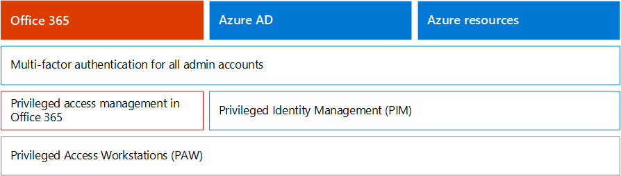

# Microsoft 365 Security for Business Decision Maker (BDM)

Questo articolo illustra alcuni degli scenari di attacco e minacce più comuni attualmente affrontati dalle organizzazioni per i propri ambienti Microsoft 365 e le azioni consigliate per attenuare questi rischi. Sebbene Microsoft 365 sia dotato di un'ampia gamma di funzionalità di sicurezza preconfigurati, richiede anche al cliente di assumersi la responsabilità di proteggere le proprie identità, i dati e i dispositivi usati per accedere ai servizi cloud. Queste indicazioni sono state sviluppate da Kozeta Beam (Microsoft Cloud Security Architect) e Thiagaraj Sundararajan (Microsoft Senior Consultant).

Questo articolo è organizzato per priorità di lavoro, a partire dalla protezione degli account utilizzati per amministrare i servizi e le risorse più importanti, ad esempio il tenant, la posta elettronica e SharePoint. Offre un modo metodico per affrontare la sicurezza e collabora con il foglio di calcolo seguente, in modo da poter tenere traccia dei progressi con le parti interessate e i team dell'organizzazione: foglio di calcolo microsoft [365 security for BDMs.](https://github.com/MicrosoftDocs/microsoft-365-docs/raw/public/microsoft-365/downloads/Microsoft-365-BDM-security-recommendations-spreadsheet.xlsx) 

Microsoft fornisce lo strumento Secure Score all'interno del tenant per analizzare automaticamente il livello di sicurezza in base alle normali attività, assegnare un punteggio e fornire consigli per il miglioramento della sicurezza. Prima di eseguire le azioni consigliate in questo articolo, prendere nota del punteggio corrente e degli elementi consigliati. Le azioni consigliate in questo articolo aumentano il punteggio. L'obiettivo non è raggiungere il punteggio massimo, ma essere consapevoli delle opportunità per proteggere l'ambiente in modo da non influire negativamente sulla produttività degli utenti. Vedere [Microsoft Secure Score.](mtp/microsoft-secure-score.md)

Un'altra cosa prima di iniziare. . . Assicurarsi di [attivare il registro di controllo.](../compliance/search-the-audit-log-in-security-and-compliance.md) Questi dati saranno necessari in un secondo momento, nel caso in cui sia necessario analizzare un evento imprevisto o una violazione. 

## Proteggere gli account con privilegi

Come primo passaggio, è consigliabile garantire che agli account critici nell'ambiente venga assegnato un ulteriore livello di protezione, in quanto questi account dispongono di accesso e autorizzazioni per gestire e modificare i servizi e le risorse critici che possono influire negativamente sull'intera organizzazione, se compromessi. La protezione degli account privilegiati è uno dei modi più efficaci per proteggersi da un utente malintenzionato che cerca di elevare le autorizzazioni di un account compromesso a un account amministrativo. 

|Consiglio  |E3 |E5  |
|---------|---------|---------|
|Applicare l'autenticazione a più fattori (MFA) per tutti gli account amministrativi.||| 
|Implementare Azure Active Directory (Azure AD) Privileged Identity Management (PIM) per applicare l'accesso con privilegi just-in-time alle risorse di Azure AD e Azure. Puoi anche scoprire chi ha accesso ed esaminare l'accesso con privilegi.|         | |
|Implementare la gestione degli accessi con privilegi per gestire il controllo granulare degli accessi sulle attività di amministrazione con privilegi in Office 365. |         | |
|Configurare e utilizzare paw (Privileged Access Workstation) per amministrare i servizi. Non utilizzare le stesse workstation per l'esplorazione di Internet e la verifica della posta elettronica non correlata all'account amministrativo.|  | | 

Nel diagramma seguente vengono illustrate queste funzionalità.

Consigli aggiuntivi:
- Assicurarsi che agli account sincronizzati dall'ambiente locale non siano assegnati ruoli di amministratore per i servizi cloud. In questo modo si impedisce a un utente malintenzionato di sfruttare gli account locali per ottenere l'accesso amministrativo ai servizi cloud. 
- Verificare che agli account di servizio non siano assegnati ruoli di amministratore. Questi account spesso non vengono monitorati e impostati con password che non scadono. Per iniziare, verificare che gli account dei servizi AADConnect e ADFS non siano amministratori globali per impostazione predefinita.
- Rimuovere le licenze dagli account amministratore. A meno che non vi sia un caso d'uso specifico per assegnare licenze a specifici account di amministratore, rimuovere le licenze da questi account. 

## Ridurre la superficie di attacco

L'area di messa a fuoco successiva riduce la superficie di attacco. Questa operazione può essere eseguita con un impegno minimo e un impatto minimo per gli utenti e i servizi. Riducendo la superficie di attacco, gli utenti malintenzionati hanno meno modi per avviare un attacco contro l'organizzazione.

Ecco alcuni esempi:
- Disabilitare i protocolli POP3, IMAP e SMTP. La maggior parte delle organizzazioni moderne non usa più questi protocolli meno recenti. È possibile disabilitare queste eccezioni in modo sicuro e consentire le eccezioni solo se necessario. 
- Ridurre e mantenere il numero di amministratori globali nel tenant al minimo indispensabile. In questo modo si riduce direttamente la superficie di attacco per tutte le applicazioni cloud. 
- Ritirare i server e le applicazioni non più utilizzati nell'ambiente. 
- Implementare un processo per la disabilitazione e l'eliminazione di account non più utilizzati. 

## Protezione da minacce note

Le minacce note includono malware, account compromessi e phishing. Alcune protezioni contro queste minacce possono essere implementate rapidamente senza alcun impatto diretto sugli utenti, mentre altre richiedono una maggiore pianificazione e formazione degli utenti. 

|Consiglio  |E3  |E5  |
|---------|---------|---------|
|**Configurare l'autenticazione a più fattori e utilizzare i criteri di accesso condizionale consigliati, inclusi i criteri di rischio di accesso.** Microsoft consiglia e ha testato una serie di criteri che funzionano insieme per proteggere tutte le app cloud, inclusi i servizi di Office 365 e Microsoft 365. Vedere [Configurazioni di identità e accesso ai dispositivi.](./office-365-security/microsoft-365-policies-configurations.md) | ||
|**Richiedere l'autenticazione a più fattori per tutti gli utenti.** Se non si dispone delle licenze necessarie per implementare i criteri di accesso condizionale consigliati, è necessario almeno l'autenticazione a più fattori per tutti gli utenti.|||
|**Aumentare il livello di protezione dal malware nella posta.** L'ambiente di Office 365 o Microsoft 365 include la protezione dal malware, ma è possibile aumentare questa protezione bloccando gli allegati con tipi di file usati comunemente per il malware.|||
|**Proteggere la posta elettronica da attacchi di phishing mirati.** Se sono stati configurati uno o più domini personalizzati per l'ambiente di Office 365 o Microsoft 365, è possibile configurare la protezione anti-phishing mirata. La protezione anti-phishing, parte di Defender per Office 365, consente di proteggere l'organizzazione da attacchi di phishing dannosi basati sulla rappresentazione e altri attacchi di phishing. Se non è stato configurato un dominio personalizzato, non è necessario eseguire questa operazione.| ||
|**Proteggere da attacchi ransomware nella posta elettronica.** Ransomware consente di rimuovere l'accesso ai dati crittografando i file o bloccando gli schermi del computer. Tenta quindi di estorcere denaro dalle vittime chiedendo un "riscatto", in genere sotto forma di criptovalute come Il Denaro, in cambio del ritorno dell'accesso ai dati. È possibile difendersi dal ransomware creando una o più regole del flusso di posta per bloccare le estensioni di file comunemente utilizzate per ransomware o per avvisare gli utenti che ricevono questi allegati tramite posta elettronica.|||
|**Bloccare le connessioni dai paesi con cui non si ha un'attività commerciale.** Creare un criterio di accesso condizionale di Azure AD per bloccare le connessioni provenienti da questi paesi, creando in modo efficace un firewall geografico attorno al tenant.| ||

Nel diagramma seguente vengono illustrate queste funzionalità.

## Protezione da minacce sconosciute

Dopo aver aggiunto protezioni aggiuntive agli account privilegiati e protetto da attacchi noti, spostare l'attenzione sulla protezione da minacce sconosciute. Gli avversari più determinati e avanzati usano metodi nuovi e nuovi per attaccare le organizzazioni. Con la vasta telemetria di dati di Microsoft raccolta su miliardi di dispositivi, applicazioni e servizi, siamo in grado di eseguire Defender per Office 365 in Windows, Office 365 e Azure per evitare attacchi zero day, utilizzare ambienti di box di sabbiosi e controllare la validità prima di consentire l'accesso ai contenuti. 

|Consiglio  |E3  |E5  |
|---------|---------|---------|
|**Configurare Microsoft Defender per Office 365:** * Allegati sicuri * Collegamenti sicuri * ATP per SharePoint, OneDrive e Microsoft Teams * Anti-phishing in Defender per la protezione di Office 365|         | |
|**Configurare Le funzionalità di Microsoft Defender per endpoint:** * Windows Defender Antivirus  * Protezione da exploit   * Riduzione della superficie di attacco   * Isolamento basato su hardware  * Accesso controllato alle cartelle     |         | |
|**Usare Microsoft Cloud App Security per** individuare le app SaaS e iniziare a usare l'analisi del comportamento e il rilevamento delle anomalie. |         | |

Nel diagramma seguente vengono illustrate queste funzionalità.

Consigli aggiuntivi:
- Proteggere le comunicazioni del canale partner come i messaggi di posta elettronica tramite TLS.
- Aprire la federazione di Teams solo ai partner con cui si comunica.
- Non aggiungere domini del mittente, singoli mittenti o indirizzi IP di origine all'elenco consenti, perché ciò consente di ignorare i controlli di posta indesiderata e malware. Una pratica comune con i clienti consiste nell'aggiungere i propri domini accettati o un certo numero di altri domini in cui potrebbero essere stati segnalati problemi del flusso di posta elettronica all'elenco consenti. Non aggiungere domini nell'elenco Filtro protezione da posta indesiderata e filtro connessioni in quanto questa operazione potrebbe ignorare tutti i controlli della posta indesiderata. 
- Abilitare le notifiche di posta indesiderata in uscita : abilitare le notifiche di posta indesiderata in uscita a una lista di distribuzione internamente al team di supporto tecnico o di amministratore IT per segnalare se uno degli utenti interni invia messaggi di posta indesiderata esternamente. Potrebbe trattarsi di un indicatore che indica che l'account è stato compromesso.
- Disabilitare Remote PowerShell per tutti gli utenti. Remote PowerShell viene utilizzato principalmente dagli amministratori per accedere ai servizi per scopi amministrativi o per l'accesso programmatico alle API. È consigliabile disabilitare questa opzione per gli utenti non amministratori per evitare ricognizioni, a meno che non siano in condizione aziendale di accedervi. 
- Bloccare l'accesso al portale di gestione di Microsoft Azure a tutti gli utenti non amministratori. A tale scopo, è possibile creare una regola di accesso condizionale per bloccare tutti gli utenti, ad eccezione degli amministratori. 

## Presupporre una violazione

Anche se Microsoft adotta tutte le misure possibili per prevenire minacce e attacchi, è consigliabile lavorare sempre secondo la mentalità "Assume Breach". Anche se un utente malintenzionato è riuscito a intromettersi nell'ambiente, è necessario assicurarsi che non sia in grado di esfiltrare i dati o le informazioni sull'identità dall'ambiente. Per questo motivo, è consigliabile abilitare la protezione da perdite di dati sensibili, ad esempio numeri di previdenza sociale, numeri di carte di credito, informazioni personali aggiuntive e altre informazioni riservate a livello di organizzazione. 

L'idea di "presumere una violazione" richiede l'implementazione di una strategia di rete a attendibilità zero, il che significa che gli utenti non sono completamente attendibili solo perché sono interni alla rete. Nell'ambito dell'autorizzazione delle operazioni che gli utenti possono eseguire, vengono specificati set di condizioni e, quando vengono soddisfatte tali condizioni, vengono applicati determinati controlli. Le condizioni possono includere lo stato di integrità del dispositivo, l'accesso all'applicazione, l'esecuzione delle operazioni e il rischio dell'utente. Ad esempio, un'azione di registrazione dei dispositivi deve sempre attivare l'autenticazione a più fattori per garantire che non siano stati aggiunti dispositivi all'ambiente. 

Una strategia di rete zero trust richiede inoltre di sapere dove sono archiviate le informazioni e di applicare i controlli appropriati per la classificazione, la protezione e la conservazione. Per proteggere in modo efficace le risorse più critiche e sensibili, è necessario prima identificare dove si trovano e creare un inventario, che può essere difficile. Successivamente, collaborare con l'organizzazione per definire una strategia di governance. La definizione di uno schema di classificazione per un'organizzazione e la configurazione di criteri, etichette e condizioni richiedono un'attenta pianificazione e preparazione. È importante tenere presente che non si tratta di un processo guidato dall'IT. Assicurarsi di collaborare con il team legale e di conformità per sviluppare uno schema di classificazione ed etichettatura appropriato per i dati dell'organizzazione.

Le funzionalità di protezione delle informazioni di Microsoft 365 consentono di individuare le informazioni disponibili, la posizione di archiviazione e le informazioni che richiedono una protezione aggiuntiva. La protezione delle informazioni è un processo continuo e le funzionalità di Microsoft 365 offrono visibilità sul modo in cui gli utenti usano e distribuiscono informazioni riservate, dove le informazioni sono attualmente archiviate e dove fluiranno. È anche possibile vedere come gli utenti gestino informazioni regolamentate per essere certi che siano applicate le etichette e le protezioni appropriate.

|Consiglio |E3|E5 |
|---------|---------|---------|
|**Esaminare e ottimizzare l'accesso condizionale e i criteri** correlati per allinearsi agli obiettivi per una rete a attendibilità zero. La protezione da minacce note include l'implementazione di una serie [di criteri consigliati.](./office-365-security/microsoft-365-policies-configurations.md) Esamina l'implementazione di questi criteri per assicurarti di proteggere le app e i dati da hacker che hanno ottenuto l'accesso alla rete. Tieni presente che i criteri di protezione delle app di Intune consigliati per Windows 10 abilitaNo Windows Information Protection (WIP). WiP protegge da perdite accidentali dei dati dell'organizzazione tramite app e servizi, come posta elettronica, social media e cloud pubblico. |         ||
|**Disabilitare l'inoltro esterno della posta elettronica.** I pirati informatici che ottengono l'accesso alla cassetta postale di un utente possono rubare la posta impostando la cassetta postale per inoltrare automaticamente la posta elettronica. Questo può accadere anche senza la consapevolezza dell'utente. È possibile evitare questo problema configurando una regola del flusso di posta.| ||
|**Disabilitare la condivisione di calendari esterni anonimi.** Per impostazione predefinita, la condivisione di calendari anonimi esterni è consentita. [Disabilitare la condivisione del](https://docs.microsoft.com/exchange/sharing/sharing-policies/modify-a-sharing-policy) calendario per ridurre potenziali perdite di informazioni riservate.| ||
|**Configurare i criteri di prevenzione della perdita dei dati per i dati sensibili.** Creare un criterio di prevenzione della perdita di dati nel Centro sicurezza e conformità per individuare e proteggere i dati sensibili, ad esempio numeri di carta di credito, numeri di previdenza sociale e &amp; numeri di conto corrente bancario. Microsoft 365 include molti tipi di informazioni riservate predefiniti che è possibile usare nei criteri di prevenzione della perdita dei dati. È inoltre possibile creare tipi di informazioni riservate personalizzati per il proprio ambiente. |||
|**Implementare la classificazione dei dati e i criteri di protezione delle informazioni.** Implementare etichette di riservatezza e usarle per classificare e applicare la protezione ai dati sensibili. È inoltre possibile utilizzare queste etichette nei criteri di prevenzione della perdita dei dati. Se si usano le etichette di Azure Information Protection, è consigliabile evitare di creare nuove etichette in altre centri di amministrazione.|         ||
|**Proteggere i dati in app e servizi di terze parti tramite Cloud App Security.** Configurare i criteri di Cloud App Security per proteggere le informazioni riservate nelle app cloud di terze parti, ad esempio Salesforce, Box o Dropbox. Puoi usare i tipi di informazioni riservate e le etichette di riservatezza create nei criteri di Cloud App Security e applicarlo alle tue app SaaS.   Microsoft Cloud App Security consente di applicare un'ampia gamma di processi automatizzati. I criteri possono essere impostati per fornire analisi di conformità continue, attività di eDiscovery legali, DLP per i contenuti sensibili condivisi pubblicamente e altro ancora. Cloud App Security può monitorare qualsiasi tipo di file in base a più di 20 filtri di metadati (ad esempio, livello di accesso, tipo di file). |         ||
|**Usare [Microsoft Defender for Endpoint](https://docs.microsoft.com/windows/security/threat-protection/microsoft-defender-atp/information-protection-in-windows-overview) per identificare se gli utenti archiviano informazioni riservate nei propri dispositivi Windows.** |         ||
|**Utilizzare [Scanner AIP per](https://docs.microsoft.com/azure/information-protection/deploy-aip-scanner) identificare e classificare le informazioni tra server e condivisioni file.** Utilizzare lo strumento per la creazione di report AIP per visualizzare i risultati ed eseguire le azioni appropriate.|         ||

Nel diagramma seguente vengono illustrate queste funzionalità.

## Monitoraggio e controllo continui

Ultimo, ma non meno importante, il monitoraggio continuo e il controllo dell'ambiente Microsoft 365 insieme a Windows e Dispositivi è fondamentale per essere certi di essere in grado di rilevare e correggere rapidamente eventuali intrusioni. Strumenti come Secure Score, Il Centro sicurezza e l'analisi avanzata di Microsoft Intelligent Graph forniscono informazioni inestimabili nel tenant e collegano grandi quantità di dati di intelligence per le minacce e sicurezza per fornire una protezione e un rilevamento ineguagliabili.

|Consiglio |E3 |E5 |
|---------|---------|---------|
|Verificare che **il registro di controllo** sia attivato.|||
|**Rivedere Secure Score** settimanalmente: Secure Score è una posizione centrale per accedere allo stato di sicurezza dell'azienda ed eseguire azioni in base alle raccomandazioni di Secure Score. È consigliabile eseguire questo controllo ogni settimana.|||
|Usare **gli strumenti di Microsoft Defender per Office 365:** * Funzionalità di analisi e risposta alle minacce  * Analisi e risposta automatizzate |         ||
|Usare **Microsoft Defender per Endpoint:**  *    [Rilevamento e risposta degli endpoint](https://docs.microsoft.com/windows/security/threat-protection/microsoft-defender-atp/overview-endpoint-detection-response)   * Analisi automatizzata e correzione secure score  *    [Ricerca avanzata](https://docs.microsoft.com/windows/security/threat-protection/microsoft-defender-atp/advanced-hunting-overview)  |         ||
|Usare **Microsoft Cloud App Security** per rilevare comportamenti insoliti tra le app cloud per identificare ransomware, utenti compromessi o applicazioni non autorizzate, analizzare l'utilizzo ad alto rischio e correggere automaticamente per limitare i rischi per l'organizzazione.|         ||
|Usare **Microsoft Azure Sentinel** o lo strumento SIEM corrente per monitorare le minacce in tutto l'ambiente. |         ||
|**Distribuire [Microsoft Defender for Identity](https://docs.microsoft.com/azure-advanced-threat-protection/what-is-atp)** per monitorare e proteggere dalle minacce mirate all'ambiente Active Directory locale.   |         | |
|Usare **Azure Defender** _ per monitorare le minacce nei carichi di lavoro ibridi e cloud. Azure Defender_ include un livello gratuito di funzionalità e un livello standard di funzionalità che vengono pagate in base alle ore di risorse o alle transazioni.|         |         |

Nel diagramma seguente vengono illustrate queste funzionalità.

Principali azioni di monitoraggio consigliate:
- **Rivedere Microsoft Secure Score** settimanalmente: Secure Score è una posizione centrale per accedere allo stato di sicurezza del tenant ed eseguire azioni in base ai consigli principali. È consigliabile eseguire questo controllo ogni settimana. Secure Score include consigli di Azure AD, Intune, Cloud App Security e Microsoft Defender for Endpoint, oltre a Office 365. 
- **Esaminare gli accessi rischiosi** settimanalmente: usare l'interfaccia di amministrazione di Azure AD per esaminare gli accessi rischiosi settimanalmente. Il set di regole di identità e accesso ai dispositivi consigliato include un criterio per applicare la modifica della password agli accessi rischiosi.  
- Esaminare i principali malware e gli utenti di **phished** settimanalmente: usare Microsoft Defender per Office 365 Threat Explorer per esaminare i principali utenti interessati da malware e phish e per scoprire la causa principale del motivo per cui questi utenti sono interessati.
