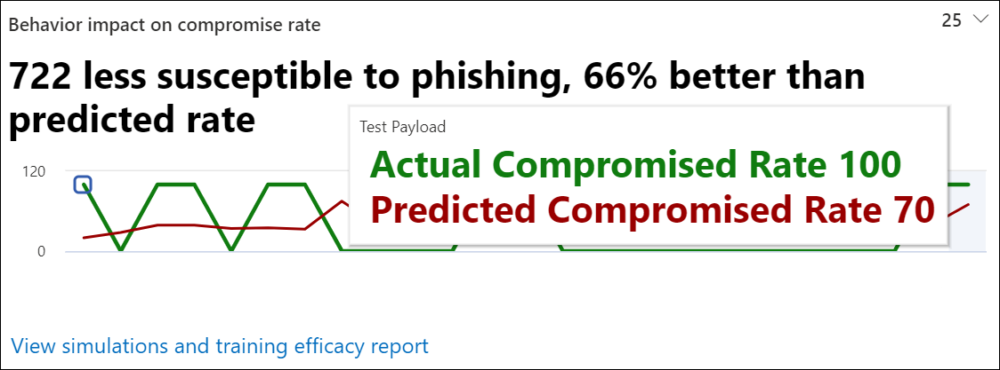

# Acquisire informazioni approfondite attraverso la formazione del Simulatore di attacchi

Nell'ambito della formazione sulla simulazione di attacchi, Microsoft fornisce informazioni dettagliate basate sui risultati delle simulazioni e dei corsi di formazione che i dipendenti hanno seguito. Queste informazioni dettagliate consentono di tenere informati sull'avanzamento della preparazione alle minacce dei dipendenti, nonché di consigliare i passaggi successivi per preparare meglio i dipendenti e l'ambiente per gli attacchi.

Stiamo continuamente lavorando per espandere le informazioni dettagliate disponibili. L'impatto sul comportamento e le azioni consigliate sono attualmente disponibili. Per iniziare, vai alla formazione sulla simulazione degli attacchi nel Centro sicurezza [Microsoft 365.](https://security.microsoft.com/attacksimulator?viewid=overview)

## Impatto del comportamento sulla frequenza di compromissione

Nella scheda **Panoramica del** training di simulazione degli attacchi, è possibile trovare l'impatto sul comportamento sulla scheda tasso **di compromissione.** Questa scheda mostra come i dipendenti hanno gestito le simulazioni che hai eseguito in contrasto con il **tasso di compromissione previsto.** È possibile usare queste informazioni dettagliate per tenere traccia dello stato di avanzamento della preparazione alle minacce dei dipendenti eseguendo più simulazioni con gli stessi gruppi di dipendenti.

Nel grafico è possibile visualizzare:

- **Tasso di compromissione previsto** che riflette la percentuale media di compromissione per le simulazioni che usano lo stesso tipo di payload in altri tenant di Microsoft 365 che usano la formazione di simulazione degli attacchi.
- **Il tasso di compromissione** effettivo riflette la percentuale di dipendenti che sono diminuiti per la simulazione.

Riflette inoltre la differenza tra il numero effettivo di dipendenti compromessi dall'attacco e il `<number> less susceptible to phishing` tasso di compromissione previsto. Questo numero di dipendenti è meno probabile che venga compromesso da attacchi simili in futuro, mentre indica come i dipendenti hanno fatto complessivamente in contrasto con il tasso di compromissione `<percent%> better than predicted rate` previsto.

> [!div class="mx-imgBorder"]
> 

Per visualizzare un report più dettagliato, fare clic su Visualizza simulazioni **e report sull'efficacia della formazione.** Questo report fornisce le stesse informazioni con un contesto aggiuntivo dalla simulazione stessa (ad esempio, la tecnica di simulazione e il totale degli utenti mirati).

## Azioni consigliate

Nella scheda [ **Simulazioni** selezionare](https://security.microsoft.com/attacksimulator?viewid=simulations)una simulazione per visualizzare i dettagli della simulazione, dove è presente la **sezione Azioni consigliate.**

Nella sezione azioni consigliate vengono fornite informazioni dettagliate sui suggerimenti disponibili in [Microsoft Secure Score.](https://docs.microsoft.com/microsoft-365/security/defender/microsoft-secure-score) Questi suggerimenti si basano sul payload usato nella simulazione e consentono di proteggere i dipendenti e l'ambiente. Facendo clic su ogni azione di miglioramento, verranno fornite informazioni dettagliate.

> [!div class="mx-imgBorder"]
> 

## Collegamenti correlati

[Introduzione alla formazione sull’uso di Simulatore di attacchi](attack-simulation-training-get-started.md)

[Creare una simulazione di attacco di phishing](attack-simulation-training.md)

[creare un payload per la formazione delle persone](attack-simulation-training-payloads.md)
