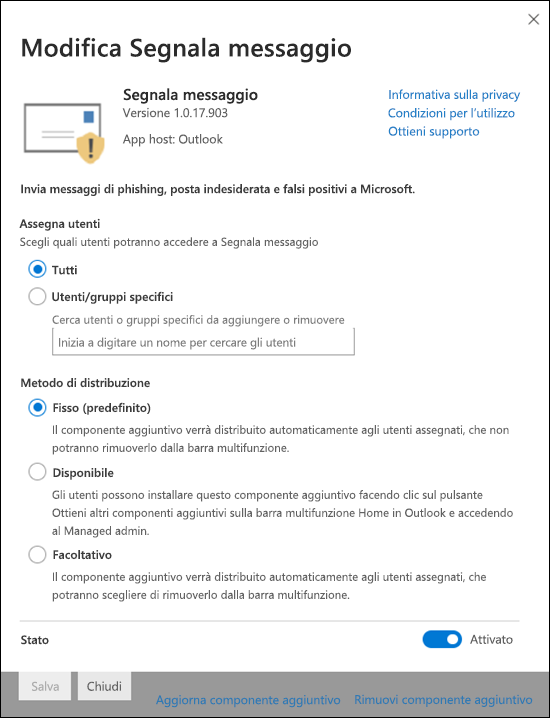

# Abilitare il componente aggiuntivo Segnala messaggioEnable the Report Message add-in

[!INCLUDE [Microsoft 365 Defender rebranding](../includes/microsoft-defender-for-office.md)]

**Si applica a****Applies to**
- [Exchange Online ProtectionExchange Online Protection](exchange-online-protection-overview.md)
- [Microsoft Defender per Office 365 piano 1 e piano 2Microsoft Defender for Office 365 plan 1 and plan 2](defender-for-office-365.md)
- [Microsoft 365 DefenderMicrosoft 365 Defender](../defender/microsoft-365-defender.md)

> [!NOTE]
> Se si è un amministratore in un'organizzazione di Microsoft 365 con cassette postali di Exchange Online, è consigliabile utilizzare il portale invii nel Centro sicurezza & conformità.If you're an admin in a Microsoft 365 organization with Exchange Online mailboxes, we recommend that you use the Submissions portal in the Security & Compliance Center. Per ulteriori informazioni, vedere [Use Admin Submission to submit suspected spam, phish, URLs, and files to Microsoft](admin-submission.md).For more information, see [Use Admin Submission to submit suspected spam, phish, URLs, and files to Microsoft](admin-submission.md).

I componenti aggiuntivi Segnala messaggio e Segnala phishing per Outlook e Outlook sul Web (in precedenza noto come Outlook Web App) consentono agli utenti di segnalare facilmente falsi positivi (buona posta elettronica contrassegnata come non buona) o falsi negativi (posta elettronica non consentita) a Microsoft e alle sue affiliate per l'analisi.The Report Message and Report Phishing add-ins for Outlook and Outlook on the web (formerly known as Outlook Web App) enables people to easily report false positives (good email marked as bad) or false negatives (bad email allowed) to Microsoft and its affiliates for analysis.

Microsoft usa questi invii per migliorare l'efficacia delle tecnologie di protezione della posta elettronica.Microsoft uses these submissions to improve the effectiveness of email protection technologies. Ad esempio, se gli utenti segnalano molti messaggi contrassegnati come posta indesiderata come Non posta indesiderata utilizzando il componente aggiuntivo Segnala messaggio, il team di sicurezza dell'organizzazione potrebbe dover modificare i criteri di protezione da posta [indesiderata.](configure-your-spam-filter-policies.md)For example, if people are reporting a lot of messages that were flagged as junk mail as Not Junk by using the Report Message add-in, your organization's security team might need to adjust [anti-spam policies](configure-your-spam-filter-policies.md).

È possibile installare il componente aggiuntivo Segnala messaggio o Segnala phishing.You can install either the Report Message or Report Phishing add-in. Se si desidera che gli utenti segnalano solo messaggi di phishing, distribuire il componente aggiuntivo Segnala phishing nell'organizzazione.If you want your users to report only phishing messages, deploy the Report Phishing add-in in your organization. Per ulteriori informazioni, vedere [Enable the Report Phishing add-in.](enable-the-report-phish-add-in.md)For more information, see [Enable the Report Phishing add-in](enable-the-report-phish-add-in.md).

Il componente aggiuntivo Segnala messaggio consente di segnalare sia i messaggi di posta indesiderata che i messaggi di phishing.The Report Message add-in provides the option to report both spam and phishing messages. Gli amministratori possono abilitare il componente aggiuntivo Segnala messaggio per l'organizzazione e i singoli utenti possono installarlo automaticamente.Admins can enable the Report Message add-in for the organization, and individual users can install it for themselves.

Se si è un singolo utente, è possibile abilitare il componente aggiuntivo Segnala [messaggio per se stessi.](#get-the-report-message-add-in-for-yourself)If you're an individual user, you can [enable the Report Message add-in for yourself](#get-the-report-message-add-in-for-yourself).

Se si è un amministratore globale o un amministratore di Exchange Online ed Exchange è configurato per l'utilizzo dell'autenticazione OAuth, è possibile abilitare il componente aggiuntivo Segnala messaggio [per l'organizzazione.](#get-and-enable-the-report-message-add-in-for-your-organization)If you're a global administrator or an Exchange Online administrator, and Exchange is configured to use OAuth authentication, you can [enable the Report Message add-in for your organization](#get-and-enable-the-report-message-add-in-for-your-organization). Il report Messaggio Add-In è ora disponibile tramite [distribuzione centralizzata.](../../admin/manage/centralized-deployment-of-add-ins.md)The Report Message Add-In is now available through [Centralized Deployment](../../admin/manage/centralized-deployment-of-add-ins.md).

## Che cosa è necessario sapere prima di iniziareWhat do you need to know before you begin?

- Il componente aggiuntivo Segnala messaggio funziona con la maggior parte delle sottoscrizioni di Microsoft 365 e i prodotti seguenti:The Report Message add-in works with most Microsoft 365 subscriptions and the following products:

  - Outlook sul WebOutlook on the web
  - Outlook 2013 SP1 o versione successivaOutlook 2013 SP1 or later
  - Outlook 2016 per MacOutlook 2016 for Mac
  - Outlook incluso con le app di Microsoft 365 per le aziendeOutlook included with Microsoft 365 apps for Enterprise
  - App Outlook per iOS e AndroidOutlook app for iOS and Android

- Il componente aggiuntivo Segnala messaggio non è disponibile per le cassette postali condivise o le cassette postali nelle organizzazioni exchange locali.The Report Message add-in is not available for shared mailboxes or mailboxes in on-premises Exchange organizations.

- È possibile configurare i messaggi segnalati da copiare o reindirizzare a una cassetta postale specificata.You can configure reported messages to be copied or redirected to a mailbox that you specify. Per ulteriori informazioni, vedere [Criteri di invio degli utenti.](user-submission.md)For more information, see [User submissions policies](user-submission.md).

- Il Web browser esistente dovrebbe funzionare con il componente aggiuntivo Segnala messaggio.Your existing web browser should work with the Report Message add-in. Tuttavia, se si nota che il componente aggiuntivo non è disponibile o non funziona come previsto, provare un browser diverso.But, if you notice the add-in is not available or not working as expected, try a different browser.

- Per le installazioni dell'organizzazione, l'organizzazione deve essere configurata per l'utilizzo dell'autenticazione OAuth.For organizational installs, the organization needs to be configured to use OAuth authentication. Per ulteriori informazioni, vedere [Determine if Centralized Deployment of add-ins works for your organization](../../admin/manage/centralized-deployment-of-add-ins.md).For more information, see [Determine if Centralized Deployment of add-ins works for your organization](../../admin/manage/centralized-deployment-of-add-ins.md).

- Gli amministratori devono essere membri del gruppo di ruoli Amministratori globali.Admins need to be a member of the Global admins role group. Per altre informazioni, vedere [Autorizzazioni nel Centro sicurezza e conformità](permissions-in-the-security-and-compliance-center.md).For more information, see [Permissions in the Security & Compliance Center](permissions-in-the-security-and-compliance-center.md).

## Ottenere il componente aggiuntivo Segnala messaggio per se stessiGet the Report Message add-in for yourself

1. Passare a Microsoft AppSource <https://appsource.microsoft.com/marketplace/apps> all'indirizzo e cercare il componente aggiuntivo Segnala messaggio.Go to the Microsoft AppSource at <https://appsource.microsoft.com/marketplace/apps> and search for the Report Message add-in. Per passare direttamente al componente aggiuntivo Segnala messaggio, passare a <https://appsource.microsoft.com/product/office/wa104381180> .To go directly to the Report Message add-in, go to <https://appsource.microsoft.com/product/office/wa104381180>.

2. Fai **clic su SCARICA ORA**.Click **GET IT NOW**.

   

3. Nella finestra di dialogo visualizzata esaminare le condizioni per l'utilizzo e l'informativa sulla privacy e quindi fare clic su **Continua.**In the dialog that appears, review the terms of use and privacy policy, and then click **Continue**.

4. Accedi usando l'account aziendale o dell'istituto di istruzione (per uso aziendale) o l'account Microsoft (per uso personale).Sign in using your work or school account (for business use) or your Microsoft account (for personal use).

Dopo aver installato e abilitato il componente aggiuntivo, verranno visualizzate le icone seguenti:After the add-in is installed and enabled, you'll see the following icons:

- In Outlook l'icona è simile alla seguente:In Outlook, the icon looks like this:

  

- In Outlook sul Web l'icona è simile alla seguente:In Outlook on the web, the icon looks like this:

  

Per informazioni su come utilizzare il componente aggiuntivo, vedere [Use the Report Message add-in](https://support.microsoft.com/office/b5caa9f1-cdf3-4443-af8c-ff724ea719d2).To learn how to use the add-in, see [Use the Report Message add-in](https://support.microsoft.com/office/b5caa9f1-cdf3-4443-af8c-ff724ea719d2).

## Ottenere e abilitare il componente aggiuntivo Segnala messaggio per l'organizzazioneGet and enable the Report Message add-in for your organization

> [!NOTE]
> La visualizzazione del componente aggiuntivo nell'organizzazione potrebbe richiedere fino a 12 ore.It could take up to 12 hours for the add-in to appear in your organization.

1. Nell'interfaccia di amministrazione di Microsoft 365  passare alla pagina Impostazioni componenti aggiuntivi \>  <https://admin.microsoft.com/AdminPortal/Home#/Settings/AddIns> all'indirizzo  ,  Se la pagina componenti aggiuntivi non è visualizzata, passare al collegamento Impostazioni Componenti aggiuntivi app integrate nella parte superiore della pagina App \>  \>  integrate. In the Microsoft 365 admin center, go to the go to the **Settings** \> **Add-ins** page at <https://admin.microsoft.com/AdminPortal/Home#/Settings/AddIns>, If you don't see the **Add-in** Page, go to the **Settings** \> **Integrated apps** \> **Add-ins** link on the top of the **Integrated apps** page.

2. Selezionare **Distribuisci componente aggiuntivo** nella parte superiore della pagina e quindi selezionare **Avanti.**Select **Deploy Add-in** at the top of the page, and then select **Next**.

   

3. Nel riquadro **a comparsa Distribuisci un** nuovo componente aggiuntivo visualizzato esaminare le informazioni e quindi fare clic su **Avanti.**In the **Deploy a new add-in** flyout that appears, review the information, and then click **Next**.

4. Nella pagina successiva fai clic su **Scegli dallo Store.**On the next page, click **Choose from the Store**.

   

5. Nella pagina **Seleziona componente aggiuntivo visualizzata** fare clic nella casella **Di** ricerca, immettere **Segnala** messaggio e quindi fare clic su **Cerca**  Ricerca.In the **Select add-in** page that appears, click in the **Search** box, enter **Report Message**, and then click **Search** . Nell'elenco dei risultati, trovare **Segnala messaggio e** quindi fare clic su **Aggiungi.**In the list of results, find **Report Message** and then click **Add**.

   

6. Nella finestra di dialogo visualizzata esaminare le informazioni sulla licenza e sulla privacy e quindi fare clic su **Continua.**In the dialog that appears, review the licensing and privacy information, and then click **Continue**.

7. Nella pagina **Configura componente aggiuntivo visualizzata** configurare le impostazioni seguenti:In the **Configure add-in** page that appears, configure the following settings:

   - **Utenti assegnati**: selezionare uno dei valori seguenti:**Assigned users**: Select one of the following values:

     - **Tutti** (impostazione predefinita)**Everyone** (default)
     - **Utenti/gruppi specifici****Specific users / groups**
     - **Solo io****Just me**

   - **Metodo di distribuzione:** selezionare uno dei valori seguenti:**Deployment method**: Select one of the following values:

     - **Risolto (impostazione predefinita):** il componente aggiuntivo viene distribuito automaticamente agli utenti specificati e non può essere rimosso.**Fixed (Default)**: The add-in is automatically deployed to the specified users and they can't remove it.
     - **Disponibile**: gli utenti possono installare il componente aggiuntivo in **Home** \> **Get add-ins** \> **Admin-managed**.**Available**: Users can install the add-in at **Home** \> **Get add-ins** \> **Admin-managed**.
     - **Facoltativo:** il componente aggiuntivo viene distribuito automaticamente agli utenti specificati, ma può scegliere di rimuoverlo.**Optional**: The add-in is automatically deployed to the specified users, but they can choose to remove it.

   

   Al termine, fare clic su **Distribuisci**.When you're finished, click **Deploy**.

8. Nella pagina **Deploy Report Message** visualizzata verrà visualizzato un rapporto sullo stato seguito da una conferma della distribuzione del componente aggiuntivo.In the **Deploy Report Message** page that appears, you'll see a progress report followed by a confirmation that the add-in was deployed. Dopo aver letto le informazioni, fare clic su **Avanti.**After you read the information, click **Next**.

   

9. Nella pagina **Annuncia componente aggiuntivo visualizzata** esaminare le informazioni e quindi fare clic su **Chiudi.**On the **Announce add-in** page that appears, review the information, and then click **Close**.

   

## Informazioni su come utilizzare il componente aggiuntivo Segnala messaggioLearn how to use the Report Message add-in

Gli utenti a cui è assegnato il componente aggiuntivo visualizzano le icone seguenti:People who have the add-in assigned to them will see the following icons:

- In Outlook l'icona è simile alla seguente:In Outlook, the icon looks like this:

  

- In Outlook sul Web l'icona è simile alla seguente:In Outlook on the web, the icon looks like this:

  

Quando si invia una notifica agli utenti sul componente aggiuntivo Segnala messaggio, includere un collegamento a Utilizzare il componente aggiuntivo Segnala [messaggio.](https://support.microsoft.com/office/b5caa9f1-cdf3-4443-af8c-ff724ea719d2)When you notify users about the Report Message add-in, include a link to [Use the Report Message add-in](https://support.microsoft.com/office/b5caa9f1-cdf3-4443-af8c-ff724ea719d2).

## Rivedere o modificare le impostazioni per il componente aggiuntivo Segnala messaggioReview or edit settings for the Report Message add-in

1. Nell'interfaccia di amministrazione di Microsoft 365  passare alla pagina Impostazioni componenti aggiuntivi \>  <https://admin.microsoft.com/AdminPortal/Home#/Settings/AddIns> all'indirizzo  ,  Se la pagina componenti aggiuntivi non è visualizzata, passare al collegamento Impostazioni Componenti aggiuntivi app integrate nella parte superiore della pagina App \>  \>  integrate. In the Microsoft 365 admin center, go to the go to the **Settings** \> **Add-ins** page at <https://admin.microsoft.com/AdminPortal/Home#/Settings/AddIns>, If you don't see the **Add-in** Page, go to the **Settings** \> **Integrated apps** \> **Add-ins** link on the top of the **Integrated apps** page.

   

2. Individuare e selezionare il componente aggiuntivo **Segnala** messaggio.Find and select the **Report Message** add-in.

3. Nel riquadro **a comparsa Modifica messaggio** rapporto visualizzato esaminare e modificare le impostazioni in base alle esigenze dell'organizzazione.In the **Edit Report Message** flyout that appears, review and edit settings as appropriate for your organization. Al termine, scegliere **Salva**.When you're finished, click **Save**.

   

## Visualizzare ed esaminare i messaggi segnalatiView and review reported messages

Per esaminare i messaggi che gli utenti segnalano a Microsoft, sono disponibili le opzioni seguenti:To review messages that users report to Microsoft, you have these options:

- Usa il portale per gli invii di amministratori.Use the Admin Submissions portal. Per ulteriori informazioni, vedere [View user submissions to Microsoft](admin-submission.md#view-user-submissions-to-microsoft).For more information, see [View user submissions to Microsoft](admin-submission.md#view-user-submissions-to-microsoft).

- Creare una regola del flusso di posta (nota anche come regola di trasporto) per inviare copie dei messaggi segnalati.Create a mail flow rule (also known as a transport rule) to send copies of reported messages. Per istruzioni, vedere [Use mail flow rules to see what your users are reporting to Microsoft](use-mail-flow-rules-to-see-what-your-users-are-reporting-to-microsoft.md).For instructions, see [Use mail flow rules to see what your users are reporting to Microsoft](use-mail-flow-rules-to-see-what-your-users-are-reporting-to-microsoft.md).
