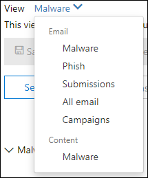

# Analizzare la posta elettronica dannosa recapitata in Office 365Investigate malicious email that was delivered in Office 365

[!INCLUDE [Microsoft 365 Defender rebranding](../includes/microsoft-defender-for-office.md)]

**Si applica a****Applies to**

- [Microsoft Defender per Office 365 piano 1 e piano 2Microsoft Defender for Office 365 plan 1 and plan 2](defender-for-office-365.md)
- [Microsoft 365 DefenderMicrosoft 365 Defender](../defender/microsoft-365-defender.md)

[Microsoft Defender per Office 365](defender-for-office-365.md) consente di analizzare le attività che mettono a rischio le persone nell'organizzazione e di intervenire per proteggere l'organizzazione.[Microsoft Defender for Office 365](defender-for-office-365.md) enables you to investigate activities that put people in your organization at risk, and to take action to protect your organization. Ad esempio, se si fa parte del team di sicurezza dell'organizzazione, è possibile individuare e analizzare i messaggi di posta elettronica sospetti recapitati.For example, if you are part of your organization's security team, you can find and investigate suspicious email messages that were delivered. A tale scopo, puoi usare [Threat Explorer (o rilevamenti in tempo reale).](threat-explorer.md)You can do this by using [Threat Explorer (or real-time detections)](threat-explorer.md).

> [!NOTE]
> Passare all'articolo di correzione [qui](remediate-malicious-email-delivered-office-365.md).Jump to the remediation article [here](remediate-malicious-email-delivered-office-365.md).

## Prima di iniziareBefore you begin

Verificare che vengano soddisfatti i seguenti requisiti:Make sure that the following requirements are met:

- L'organizzazione dispone [di Microsoft Defender per Office 365](defender-for-office-365.md) e le licenze sono assegnate agli [utenti.](../../admin/manage/assign-licenses-to-users.md)Your organization has [Microsoft Defender for Office 365](defender-for-office-365.md) and [licenses are assigned to users](../../admin/manage/assign-licenses-to-users.md).

- [la registrazione di](../../compliance/turn-audit-log-search-on-or-off.md) controllo è attivata per l'organizzazione.[audit logging](../../compliance/turn-audit-log-search-on-or-off.md) is turned on for your organization.

- L'organizzazione dispone di criteri definiti per la protezione da posta indesiderata, antimalware, anti-phishing e così via.Your organization has policies defined for anti-spam, anti-malware, anti-phishing, and so on. Vedere [Protezione dalle minacce in Office 365](protect-against-threats.md).See [Protect against threats in Office 365](protect-against-threats.md).

- Si è un amministratore globale o si dispone del ruolo Amministratore sicurezza o Ricerca ed eliminazione assegnato nel Centro sicurezza & conformità.You are a global administrator, or you have either the Security Administrator or the Search and Purge role assigned in the Security & Compliance Center. Vedere [Autorizzazioni nel Centro sicurezza & conformità](permissions-in-the-security-and-compliance-center.md).See [Permissions in the Security & Compliance Center](permissions-in-the-security-and-compliance-center.md). Per alcune azioni, è inoltre necessario assegnare un nuovo ruolo Anteprima.For some actions, you must also have a new Preview role assigned.

### Autorizzazioni per il ruolo AnteprimaPreview role permissions

Per eseguire determinate azioni, ad esempio la visualizzazione delle intestazioni dei messaggi o il download del contenuto dei messaggi di posta elettronica, è necessario aggiungere un nuovo ruolo denominato *Anteprima* a un altro gruppo di ruoli appropriato.To perform certain actions, such as viewing message headers or downloading email message content, you must have a new role called *Preview* added to another appropriate role group. Nella tabella seguente vengono chiariti i ruoli e le autorizzazioni necessari.The following table clarifies required roles and permissions.

****

|AttivitàActivity|Gruppo di ruoloRole group|Ruolo anteprima necessario?Preview role needed?|
|---|---|---|
|Usare Esplora minacce (e rilevamenti in tempo reale) per analizzare le minacceUse Threat Explorer (and real-time detections) to analyze threats |Amministratore globaleGlobal Administrator 
 Amministratore della sicurezzaSecurity Administrator 
 Ruolo con autorizzazioni di lettura per la sicurezzaSecurity Reader|NoNo|
|Usare Esplora minacce (e rilevamenti in tempo reale) per visualizzare le intestazioni dei messaggi di posta elettronica, nonché visualizzare in anteprima e scaricare i messaggi di posta elettronica in quarantenaUse Threat Explorer (and real-time detections) to view headers for email messages as well as preview and download quarantined email messages|Amministratore globaleGlobal Administrator 
 Amministratore della sicurezzaSecurity Administrator 
 Ruolo con autorizzazioni di lettura per la sicurezzaSecurity Reader|NoNo|
|Usare Esplora minacce per visualizzare le intestazioni, visualizzare in anteprima la posta elettronica (solo nella pagina dell'entità di posta elettronica) e scaricare i messaggi di posta elettronica recapitati alle cassette postaliUse Threat Explorer to view headers, preview email (only in the email entity page) and download email messages delivered to mailboxes|Amministratore globaleGlobal Administrator 
 Amministratore della sicurezzaSecurity Administrator 
 Ruolo con autorizzazioni di lettura per la sicurezzaSecurity Reader 
 AnteprimaPreview|SìYes|
|

> [!NOTE]
> *L'anteprima* è un ruolo e non un gruppo di ruoli. il ruolo Anteprima deve essere aggiunto a un gruppo di ruoli esistente per Office 365 (all'indirizzo <https://protection.office.com> ).*Preview* is a role and not a role group; the Preview role must be added to an existing role group for Office 365 (at <https://protection.office.com>). Passare a **Autorizzazioni** e quindi modificare un gruppo di ruoli esistente o aggiungere un nuovo gruppo di ruoli con il **ruolo Anteprima** assegnato.Go to **Permissions**, and then either edit an existing role group or add a new role group with the **Preview** role assigned.
> Al ruolo Amministratore globale viene assegnata l'interfaccia di amministrazione di Microsoft 365 ( ) e i ruoli Security Administrator e Security Reader vengono assegnati nel <https://admin.microsoft.com> Centro sicurezza & conformità ( <https://protection.office.com> ).The Global Administrator role is assigned the Microsoft 365 admin center (<https://admin.microsoft.com>), and the Security Administrator and Security Reader roles are assigned in the Security & Compliance Center (<https://protection.office.com>). Per ulteriori informazioni sui ruoli e sulle autorizzazioni, vedere [Autorizzazioni nel Centro sicurezza & conformità.](permissions-in-the-security-and-compliance-center.md)To learn more about roles and permissions, see [Permissions in the Security & Compliance Center](permissions-in-the-security-and-compliance-center.md).

Sappiamo che l'anteprima e il download della posta elettronica sono attività sensibili e quindi il controllo è abilitato per queste attività.We understand previewing and downloading email are sensitive activities, and so we auditing is enabled for these. Una volta che un amministratore esegue queste attività sui messaggi di posta elettronica, i log di controllo vengono generati per lo stesso e possono essere visibili nel Centro sicurezza & e conformità di Office 365 ( <https://protection.office.com> ).Once an admin performs these activities on emails, audit logs are generated for the same and can be seen in the Office 365 Security & Compliance Center (<https://protection.office.com>). Passare alla **sezione Ricerca** log di controllo  >  **e** filtrare in base al nome dell'amministratore nella sezione Ricerca.Go to **Search** > **Audit log search** and filter on the admin name in Search section. I risultati filtrati mostreranno l'attività **AdminMailAccess.**The filtered results will show activity **AdminMailAccess**. Selezionare una riga per visualizzare i dettagli nella sezione **Ulteriori informazioni** sulla posta elettronica in anteprima o scaricata.Select a row to view details in the **More information** section about previewed or downloaded email.

## Trovare messaggi di posta elettronica sospetti recapitatiFind suspicious email that was delivered

Esplora minacce è un potente report che può servire a più scopi, come trovare ed eliminare messaggi, identificare l'indirizzo IP di un mittente di posta elettronica dannoso o avviare un evento imprevisto per ulteriori indagini.Threat Explorer is a powerful report that can serve multiple purposes, such as finding and deleting messages, identifying the IP address of a malicious email sender, or starting an incident for further investigation. La procedura seguente è incentrata sull'utilizzo di Esplora risorse per trovare ed eliminare messaggi di posta elettronica dannosi dalle cassette postali del destinatario.The following procedure focuses on using Explorer to find and delete malicious email from recipient's mailboxes.

> [!NOTE]
> Le ricerche predefinite in Esplora risorse non includono attualmente elementi zapped.Default searches in Explorer don't currently include Zapped items.  Questo vale per tutte le visualizzazioni, ad esempio malware o phish views.This applies to all views, for example malware or phish views. Per includere gli elementi zapped, è necessario aggiungere un set **di** azioni di recapito per includere **Rimosso da ZAP.**To include Zapped items you need to add a **Delivery action** set to include **Removed by ZAP**. Se includi tutte le opzioni, vedrai tutti i risultati dell'azione di recapito, inclusi gli elementi zapped.If you include all options, you'll see all delivery action results, including Zapped items.

1. **Passare a Threat Explorer:** accedere a e accedere usando <https://protection.office.com> l'account aziendale o dell'istituto di istruzione per Office 365.**Navigate to Threat Explorer**: Go to <https://protection.office.com> and sign in using your work or school account for Office 365. Verrà quindi accedere al Centro sicurezza & conformità.This takes you to the Security & Compliance Center.

2. Nella barra di avvio veloce di spostamento a sinistra scegliere **Esplora gestione** \> **minacce.**In the left navigation quick-launch, choose **Threat management** \> **Explorer**.

    

    Potresti notare la nuova **colonna Azioni** speciali.You may notice the new **Special actions** column. Questa funzionalità ha lo scopo di inviire agli amministratori il risultato dell'elaborazione di un messaggio di posta elettronica.This feature is aimed at telling admins the outcome of processing an email. È **possibile accedere alla** colonna Azioni speciali nella stessa posizione dell'azione di **recapito** e della posizione **di recapito.**The **Special actions** column can be accessed in the same place as **Delivery action** and **Delivery location**. Le azioni speciali potrebbero essere aggiornate alla fine della sequenza temporale della posta elettronica di Threat Explorer, una nuova funzionalità volta a migliorare l'esperienza di ricerca per gli amministratori.Special actions might be updated at the end of Threat Explorer's email timeline, which is a new feature aimed at making the hunting experience better for admins.

3. **Visualizzazioni in Esplora minacce**: scegliere Tutti **i** messaggi di posta elettronica dal menu **Visualizza.****Views in Threat Explorer**: In the **View** menu, choose **All email**.

    

    La *visualizzazione Malware* è attualmente l'impostazione predefinita e acquisisce i messaggi di posta elettronica in cui viene rilevata una minaccia malware.The *Malware* view is currently the default, and captures emails where a malware threat is detected. La *visualizzazione Phish* funziona nello stesso modo, per Phish.The *Phish* view operates in the same way, for Phish.

    Tuttavia, *nella visualizzazione Tutti i* messaggi di posta elettronica sono elencati tutti i messaggi ricevuti dall'organizzazione, indipendentemente dal fatto che siano state rilevate o meno minacce.However, *All email* view lists every mail received by the organization, whether threats were detected or not. Come puoi immaginare, si tratta di una grande quantità di dati, motivo per cui questa visualizzazione mostra un segnaposto che richiede l'applicazione di un filtro.As you can imagine, this is a lot of data, which is why this view shows a placeholder that asks a filter be applied. Questa visualizzazione è disponibile solo per i clienti di Defender per Office 365 P2.(This view is only available for Defender for Office 365 P2 customers.)

    *La visualizzazione* Invii mostra tutti i messaggi inviati dall'amministratore o dall'utente segnalati a Microsoft.*Submissions* view shows up all mails submitted by admin or user that were reported to Microsoft.

4. **Ricerca e filtro in Esplora** minacce : i filtri vengono visualizzati nella parte superiore della pagina nella barra di ricerca per aiutare gli amministratori nelle indagini.**Search and filter in Threat Explorer**: Filters appear at the top of the page in the search bar to help admins in their investigations. Si noti che è possibile applicare più filtri contemporaneamente e più valori delimitati da virgole aggiunti a un filtro per restringere la ricerca.Notice that multiple filters can be applied at the same time, and multiple comma-separated values added to a filter to narrow down the search. Attenzione:Remember:

    - I filtri corrispondono esattamente alla maggior parte delle condizioni di filtro.Filters do exact matching on most filter conditions.
    - Il filtro dell'oggetto utilizza una query CONTAINS.Subject filter uses a CONTAINS query.
    - I filtri URL funzionano con o senza protocolli (ad esempio,URL filters work with or without protocols (ex. https).https).
    - I filtri dominio URL, percorso URL e dominio URL e percorso non richiedono un protocollo per filtrare.URL domain, URL path, and URL domain and path filters don't require a protocol to filter.
    - È necessario fare clic sull'icona Aggiorna ogni volta che si modificano i valori del filtro per ottenere risultati pertinenti.You must click the Refresh icon every time you change the filter values to get relevant results.

5. **Filtri avanzati:** con questi filtri è possibile creare query complesse e filtrare il set di dati.**Advanced filters**: With these filters, you can build complex queries and filter your data set. Facendo clic *su Filtri avanzati* si apre un riquadro a comparsa con opzioni.Clicking on *Advanced Filters* opens a flyout with options.

   Il filtro avanzato è un'ottima aggiunta alle funzionalità di ricerca.Advanced filtering is a great addition to search capabilities. È stato **introdotto un** filtro NOT booleano nel dominio *Destinatario,*  Mittente e Mittente per consentire agli amministratori di analizzare escludendo i valori. A boolean **NOT** filter has been introduced on *Recipient*, *Sender* and *Sender domain* to allow admins to investigate by excluding values. Questa opzione viene visualizzata nel parametro selection *Non contiene nessuno di*.This option appears under selection parameter *Contains none of*. **NOT** consente agli amministratori di escludere le cassette postali di avviso, le cassette postali di risposta predefinite dalle indagini ed è utile per i casi in cui gli amministratori ricercano un oggetto specifico (subject="Attention") in cui il recipiente può essere impostato su *none di defaultMail \@ contoso.com*.**NOT** will let admins exclude alert mailboxes, default reply mailboxes from their investigations, and is useful for cases where admins search for a specific subject (subject="Attention") where the Recipient can be set to *none of defaultMail\@contoso.com*. Si tratta di una ricerca con valore esatto.This is an exact value search.

   

   *Il filtro in base alle* ore consente al team di sicurezza dell'organizzazione di eseguire rapidamente il drill-down.*Filtering by hours* will help your organization's security team drill down quickly. La durata minima consentita è di 30 minuti.The shortest allowed time duration is 30 minutes. Se è possibile restringere l'azione sospetta in base all'intervallo di tempo (ad esempio, si è verificato 3 ore fa), questo limiterà il contesto e aiuterà a individuare il problema.If you can narrow the suspicious action by time-frame (e.g. it happened 3 hours ago), this will limit the context and help pinpoint the problem.

   

6. **Campi in Esplora** minacce : Threat Explorer espone molte più informazioni relative alla sicurezza della posta, ad esempio l'azione di *recapito,* la posizione di *recapito,* l'azione *speciale,* la direzionalità, le sostituzioni e la minaccia *url.***Fields in Threat Explorer**: Threat Explorer exposes a lot more security-related mail information such as *Delivery action*, *Delivery location*, *Special action*, *Directionality*, *Overrides*, and *URL threat*. Consente inoltre al team di sicurezza dell'organizzazione di analizzare con maggiore certezza.It also allows your organization's security team to investigate with a higher certainty.

    *L'azione* di recapito è l'azione eseguita su un messaggio di posta elettronica a causa di criteri o rilevamenti esistenti.*Delivery action* is the action taken on an email due to existing policies or detections. Ecco le possibili azioni che un messaggio di posta elettronica può eseguire:Here are the possible actions an email can take:

    - **Recapitato:** la posta elettronica è stata recapitata nella posta in arrivo o nella cartella di un utente e l'utente può accedervi direttamente.**Delivered** – email was delivered to inbox or folder of a user and the user can directly access it.
    - **Posta indesiderata** (recapitata nella posta indesiderata): la posta elettronica è stata inviata alla cartella posta indesiderata o eliminata dell'utente e l'utente ha accesso ai messaggi di posta elettronica nella cartella Posta indesiderata o Eliminata.**Junked** (Delivered to junk)– email was sent to either user's junk folder or deleted folder, and the user has access to email messages in their Junk or Deleted folder.
    - **Bloccato:** tutti i messaggi di posta elettronica messi in quarantena, non riusciti o eliminati.**Blocked** – any email messages that are quarantined, that failed, or were dropped. Questo è completamente inaccessibile dall'utente.(This is completely inaccessible by the user.)
    - **Sostituito:** qualsiasi messaggio di posta elettronica in cui gli allegati dannosi vengono sostituiti da file txt che specificano che l'allegato era dannoso**Replaced** – any email where malicious attachments are replaced by .txt files that state the attachment was malicious

    **Posizione di recapito**: il filtro Percorso di recapito è disponibile per consentire agli amministratori di comprendere dove è stata terminata la posta indesiderata sospetta e quali azioni sono state intraprese su di esso.**Delivery location**: The Delivery location filter is available in order to help admins understand where suspected malicious mail ended-up and what actions were taken on it. I dati risultanti possono essere esportati in un foglio di calcolo.The resulting data can be exported to spreadsheet. I possibili percorsi di recapito sono:Possible delivery locations are:

    - **Posta in arrivo o cartella:** il messaggio di posta elettronica si trova nella cartella Posta in arrivo o in una cartella specifica, in base alle regole di posta elettronica.**Inbox or folder** – The email is in the Inbox or a specific folder, according to your email rules.
    - **Locale o esterno:** la cassetta postale non esiste nel cloud ma è locale.**On-prem or external** – The mailbox doesn't exist in the Cloud but is on-premises.
    - **Cartella Posta indesiderata:** il messaggio di posta elettronica si trova nella cartella Posta indesiderata di un utente.**Junk folder** – The email is in a user's Junk mail folder.
    - **Cartella Posta eliminata:** il messaggio di posta elettronica si trova nella cartella Posta eliminata di un utente.**Deleted items folder** – The email is in a user's Deleted items folder.
    - **Quarantena:** messaggio di posta elettronica in quarantena e non nella cassetta postale di un utente.**Quarantine** – The email in quarantine, and not in a user's mailbox.
    - **Failed:** il messaggio di posta elettronica non è riuscito a raggiungere la cassetta postale.**Failed** – The email failed to reach the mailbox.
    - **Eliminato:** il messaggio di posta elettronica è stato perso da qualche parte nel flusso di posta.**Dropped** – The email was lost somewhere in the mail flow.

    **Direzionalità:** questa opzione consente al team delle operazioni di sicurezza di filtrare in base alla "direzione" da cui proviene o sta andando un messaggio di posta elettronica.**Directionality**: This option allows your security operations team to filter by the 'direction' a mail comes from, or is going. I valori di direzionalità sono *Inbound,* *Outbound* e *Intra-org* (corrispondenti alla posta proveniente dall'esterno, inviata dall'esterno dell'organizzazione o inviata internamente all'organizzazione, rispettivamente).Directionality values are *Inbound*, *Outbound*, and *Intra-org* (corresponding to mail coming into your org from outside, being sent out of your org, or being sent internally to your org, respectively). Queste informazioni possono aiutare i team delle operazioni di sicurezza a individuare lo spoofing e la rappresentazione, perché una mancata corrispondenza tra il valore Directionality (ad esempio.This information can help security operations teams spot spoofing and impersonation, because a mismatch between the Directionality value (ex. *In ingresso*) e il dominio del mittente *(che* sembra essere un dominio interno) saranno evidenti.*Inbound*), and the domain of the sender (which *appears* to be an internal domain) will be evident! Il valore Directionality è separato e può essere diverso da Message Trace.The Directionality value is separate, and can differ from, the Message Trace. I risultati possono essere esportati in un foglio di calcolo.Results can be exported to spreadsheet.

    **Sostituzioni:** questo filtro accetta le informazioni visualizzate nella scheda dei dettagli della posta e le utilizza per esporre dove sono stati ignorati i criteri dell'organizzazione o degli utenti per consentire e bloccare i messaggi di *posta elettronica.***Overrides**: This filter takes information that appears on the mail's details tab and uses it to expose where organizational, or user policies, for allowing and blocking mails have been *overridden*. La cosa più importante di questo filtro è che consente al team di sicurezza dell'organizzazione di vedere quanti messaggi di posta elettronica sospetti sono stati recapitati a causa della configurazione.The most important thing about this filter is that it helps your organization's security team see how many suspicious emails were delivered due to configuration. Ciò offre loro l'opportunità di modificare le autorizzazioni e i blocchi in base alle esigenze.This gives them an opportunity to modify allows and blocks as needed. Questo set di risultati di questo filtro può essere esportato in un foglio di calcolo.This result set of this filter can be exported to spreadsheet.

    ****

    |Sostituzioni di Esplora minacceThreat Explorer Overrides|SignificatoWhat they mean|
    |---|---|
    |Consentito dai criteri dell'organizzazioneAllowed by Org Policy|La posta è stata consentita nella cassetta postale come indicato dal criterio dell'organizzazione.Mail was allowed into the mailbox as directed by the organization policy.|
    |Bloccato dai criteri dell'organizzazioneBlocked by Org policy|La posta è stata bloccata dal recapito alla cassetta postale come indicato dal criterio dell'organizzazione.Mail was blocked from delivery to the mailbox as directed by the organization policy.|
    |Estensione di file bloccata dai criteri organizzazioneFile extension blocked by Org Policy|Il recapito del file alla cassetta postale è stato bloccato come indicato dal criterio dell'organizzazione.File was blocked from delivery to the mailbox as directed by the organization policy.|
    |Consentito dai criteri utenteAllowed by User Policy|La posta è stata consentita nella cassetta postale come indicato dal criterio utente.Mail was allowed into the mailbox as directed by the user policy.|
    |Bloccato dai criteri utenteBlocked by User Policy|La posta è stata bloccata dal recapito alla cassetta postale come indicato dal criterio utente.Mail was blocked from delivery to the mailbox as directed by the user policy.|
    |

    **Minaccia URL**: il campo della  minaccia URL è stato incluso nella scheda dei dettagli di un messaggio di posta elettronica per indicare la minaccia presentata da un URL.**URL threat**: The URL threat field has been included on the *details* tab of an email to indicate the threat presented by a URL. Le minacce presentate da un URL possono includere *malware,*  *phish* o *posta* indesiderata e un URL senza minacce dirà *Nessuno* nella sezione minacce.Threats presented by a URL can include *Malware*, *Phish*, or *Spam*, and a URL with *no threat* will say *None* in the threats section.

7. **Visualizzazione sequenza temporale della posta** elettronica: il team delle operazioni di sicurezza potrebbe dover approfondire i dettagli della posta elettronica per analizzare ulteriormente.**Email timeline view**: Your security operations team might need to deep-dive into email details to investigate further. La sequenza temporale della posta elettronica consente agli amministratori di visualizzare le azioni eseguite su un messaggio di posta elettronica dal recapito al post-recapito.The email timeline allows admins to view actions taken on an email from delivery to post-delivery. Per visualizzare una sequenza temporale della posta elettronica, fare clic sull'oggetto di un messaggio di posta elettronica e quindi fare clic su Sequenza temporale della posta elettronica.To view an email timeline, click on the subject of an email message, and then click Email timeline. Viene visualizzata tra le altre intestazioni del pannello, ad esempio Riepilogo o Dettagli. Questi risultati possono essere esportati in un foglio di calcolo.(It appears among other headings on the panel like Summary or Details.) These results can be exported to spreadsheet.

    La sequenza temporale della posta elettronica verrà aperta in una tabella che mostra tutti gli eventi di recapito e post-recapito per il messaggio di posta elettronica.Email timeline will open to a table that shows all delivery and post-delivery events for the email. Se non sono presenti altre azioni nel messaggio di posta elettronica, dovrebbe essere visualizzato un singolo evento per il recapito originale che indica un risultato, ad esempio *Bloccato*, con un verdetto come *Phish.*If there are no further actions on the email, you should see a single event for the original delivery that states a result, such as *Blocked*, with a verdict like *Phish*. Gli amministratori possono esportare l'intera sequenza temporale della posta elettronica, inclusi tutti i dettagli nella scheda e nella posta elettronica (ad esempio, Oggetto, Mittente, Destinatario, Rete e ID messaggio).Admins can export the entire email timeline, including all details on the tab and email (such as, Subject, Sender, Recipient, Network, and Message ID). La sequenza temporale della posta elettronica riduce la casualità perché c'è meno tempo impiegato per controllare posizioni diverse per cercare di comprendere gli eventi che si sono verificati dopo l'arrivo del messaggio di posta elettronica.The email timeline cuts down on randomization because there is less time spent checking different locations to try to understand events that happened since the email arrived. Quando più eventi si verificano nello stesso momento o quasi in un messaggio di posta elettronica, tali eventi vengono visualizzati in una visualizzazione sequenza temporale.When multiple events happen at, or close to, the same time on an email, those events show up in a timeline view.

8. **Anteprima/download:** Threat Explorer fornisce al team delle operazioni di sicurezza i dettagli necessari per analizzare la posta elettronica sospetta.**Preview / download**: Threat Explorer gives your security operations team the details they need to investigate suspicious email. Il team delle operazioni di sicurezza può:Your security operations team can either:

    - [Controllare l'azione di recapito e la posizione](#check-the-delivery-action-and-location).[Check the delivery action and location](#check-the-delivery-action-and-location).

    - [Visualizzare la sequenza temporale del messaggio di posta elettronica.](#view-the-timeline-of-your-email)[View the timeline of your email](#view-the-timeline-of-your-email).

### Controllare l'azione di recapito e la posizioneCheck the delivery action and location

In [Esplora minacce (e rilevamenti](threat-explorer.md)in tempo reale)  ora sono disponibili le colonne **Azione** di recapito e Posizione di recapito anziché la precedente **colonna Stato** recapito.In [Threat Explorer (and real-time detections)](threat-explorer.md), you now have **Delivery Action** and **Delivery Location** columns instead of the former **Delivery Status** column. Ciò consente di ottenere un quadro più completo della posizione dei messaggi di posta elettronica.This results in a more complete picture of where your email messages land. Parte dell'obiettivo di questa modifica è semplificare le indagini per i team delle operazioni di sicurezza, ma il risultato è conoscere rapidamente la posizione dei messaggi di posta elettronica problematici.Part of the goal of this change is to make investigations easier for security operations teams, but the net result is knowing the location of problem email messages at a glance.

Lo stato del recapito è ora suddiviso in due colonne:Delivery Status is now broken out into two columns:

- **Azione di recapito** - Qual è lo stato di questo messaggio di posta elettronica?**Delivery action** - What is the status of this email?

- **Posizione di recapito** - Dove è stato instradato il messaggio di posta elettronica?**Delivery location** - Where was this email routed as a result?

L'azione di recapito è l'azione eseguita su un messaggio di posta elettronica a causa di criteri o rilevamenti esistenti.Delivery action is the action taken on an email due to existing policies or detections. Ecco le possibili azioni che un messaggio di posta elettronica può eseguire:Here are the possible actions an email can take:

- **Recapitato:** la posta elettronica è stata recapitata nella posta in arrivo o nella cartella di un utente e l'utente può accedervi direttamente.**Delivered** – email was delivered to inbox or folder of a user and the user can directly access it.

- **Posta indesiderata:** la posta elettronica è stata inviata alla cartella posta indesiderata o eliminata dell'utente e l'utente ha accesso ai messaggi di posta elettronica nella cartella Posta indesiderata o Eliminata.**Junked** – email was sent to either user's junk folder or deleted folder, and the user has access to email messages in their Junk or Deleted folder.

- **Bloccato:** tutti i messaggi di posta elettronica messi in quarantena, non riusciti o eliminati.**Blocked** – any email messages that are quarantined, that failed, or were dropped. Questo è completamente inaccessibile dall'utente.(This is completely inaccessible by the user.)

- **Sostituito:** qualsiasi messaggio di posta elettronica in cui gli allegati dannosi vengono sostituiti da file txt che specificano che l'allegato era dannoso.**Replaced** – any email where malicious attachments are replaced by .txt files that state the attachment was malicious.

Percorso di recapito mostra i risultati dei criteri e dei rilevamenti eseguiti dopo il recapito.Delivery location shows the results of policies and detections that run post-delivery. È collegato a un'azione di recapito.It's linked to a Delivery Action. Questo campo è stato aggiunto per fornire informazioni dettagliate sull'azione eseguita quando viene trovato un messaggio di posta elettronica problematico.This field was added to give insight into the action taken when a problem mail is found. Ecco i valori possibili della posizione di recapito:Here are the possible values of delivery location:

- **Posta in arrivo o cartella:** il messaggio di posta elettronica si trova nella posta in arrivo o in una cartella (in base alle regole di posta elettronica).**Inbox or folder** – The email is in the inbox or a folder (according to your email rules).

- **Locale o esterno:** la cassetta postale non esiste nel cloud ma è locale.**On-prem or external** – The mailbox doesn't exist on cloud but is on-premises.

- **Cartella Posta indesiderata:** il messaggio di posta elettronica si trova nella cartella Posta indesiderata di un utente.**Junk folder** – The email is in a user's Junk folder.

- **Cartella Posta eliminata:** il messaggio di posta elettronica si trova nella cartella Posta eliminata di un utente.**Deleted items folder** – The email is in a user's Deleted items folder.

- **Quarantena:** messaggio di posta elettronica in quarantena e non nella cassetta postale di un utente.**Quarantine** – The email in quarantine, and not in a user's mailbox.

- **Failed:** il messaggio di posta elettronica non è riuscito a raggiungere la cassetta postale.**Failed** – The email failed to reach the mailbox.

- **Eliminato:** il messaggio di posta elettronica si perde da qualche parte nel flusso di posta.**Dropped** – The email gets lost somewhere in the mail flow.

### Visualizzare la sequenza temporale del messaggio di posta elettronicaView the timeline of your email

**Sequenza temporale della** posta elettronica è un campo in Esplora minacce che semplifica la ricerca per il team delle operazioni di sicurezza.**Email Timeline** is a field in Threat Explorer that makes hunting easier for your security operations team. Quando in un messaggio di posta elettronica si verificano più eventi contemporaneamente o quasi, tali eventi vengono visualizzati in una visualizzazione sequenza temporale.When multiple events happen at or close to the same time on an email, those events show up in a timeline view. Alcuni eventi che si verificano dopo il recapito alla posta elettronica vengono acquisiti nella **colonna Azioni** speciali.Some events that happen post-delivery to email are captured in the **Special actions** column. La combinazione delle informazioni della sequenza temporale di un messaggio di posta elettronica con eventuali azioni speciali intraprese dopo il recapito offre agli amministratori informazioni approfondite sui criteri e sulla gestione delle minacce (ad esempio, dove è stata instradata la posta e, in alcuni casi, qual è stata la valutazione finale).Combining information from the timeline of an email message with any special actions that were taken post-delivery gives admins insight into policies and threat handling (such as where the mail was routed, and, in some cases, what the final assessment was).

> [!IMPORTANT]
> Passare a un argomento di correzione [qui](remediate-malicious-email-delivered-office-365.md).Jump to a remediation topic [here](remediate-malicious-email-delivered-office-365.md).

## Argomenti correlatiRelated topics

[Correggere i messaggi di posta elettronica dannosi recapitati in Office 365Remediate malicious email delivered in Office 365](remediate-malicious-email-delivered-office-365.md)

[Microsoft Defender per Office 365Microsoft Defender for Office 365](office-365-ti.md)

[Proteggere dalle minacce in Office 365Protect against threats in Office 365](protect-against-threats.md)

[Visualizzare i report per Defender per Office 365View reports for Defender for Office 365](view-reports-for-mdo.md)
