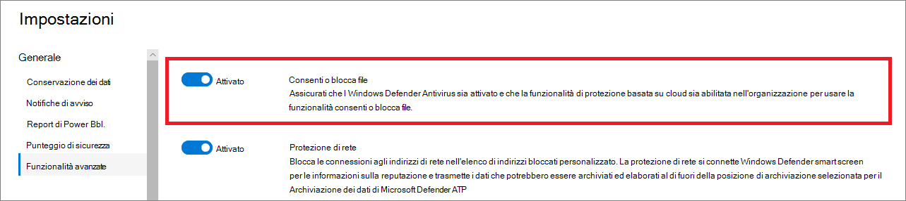

# Configurare le funzionalità avanzate in Defender for EndpointConfigure advanced features in Defender for Endpoint

**Si applica a:****Applies to:**
- [Microsoft Defender per endpointMicrosoft Defender for Endpoint](https://go.microsoft.com/fwlink/p/?linkid=2154037)
- [Microsoft 365 DefenderMicrosoft 365 Defender](https://go.microsoft.com/fwlink/?linkid=2118804)

[!INCLUDE [Microsoft 365 Defender rebranding](../../includes/microsoft-defender.md)]

> Vuoi provare Defender per Endpoint?Want to experience Defender for Endpoint? [Iscriversi per una versione di valutazione gratuita.Sign up for a free trial.](https://www.microsoft.com/microsoft-365/windows/microsoft-defender-atp?ocid=docs-wdatp-advancedfeats-abovefoldlink)

A seconda dei prodotti di sicurezza Microsoft che usi, alcune funzionalità avanzate potrebbero essere disponibili per l'integrazione di Defender per Endpoint con.Depending on the Microsoft security products that you use, some advanced features might be available for you to integrate Defender for Endpoint with.

## Abilitare le funzionalità avanzateEnable advanced features

1. Nel riquadro di spostamento seleziona **Impostazioni preferenze**  >  **Funzionalità avanzate.**In the navigation pane, select **Preferences setup** > **Advanced features**.
2. Selezionare la funzionalità avanzata che si desidera  configurare e attivare o disattivare **l'impostazione.**Select the advanced feature you want to configure and toggle the setting between **On** and **Off**.
3. Fare **clic su Salva preferenze.**Click **Save preferences**.

Utilizzare le funzionalità avanzate seguenti per proteggere meglio i file potenzialmente dannosi e ottenere informazioni più approfondite durante le indagini di sicurezza.Use the following advanced features to get better protected from potentially malicious files and gain better insight during security investigations.

## Indagine automatizzataAutomated investigation

Attivare questa funzionalità per sfruttare le funzionalità di analisi e correzione automatizzate del servizio.Turn on this feature to take advantage of the automated investigation and remediation features of the service. Per ulteriori informazioni, vedere [Analisi automatizzata.](automated-investigations.md)For more information, see [Automated investigation](automated-investigations.md).

## Risposta liveLive response

Attiva questa funzionalità in modo che gli utenti con le autorizzazioni appropriate possano avviare una sessione di risposta in tempo reale nei dispositivi.Turn on this feature so that users with the appropriate permissions can start a live response session on devices.

Per ulteriori informazioni sulle assegnazioni di ruolo, vedere [Create and manage roles](user-roles.md).For more information about role assignments, see [Create and manage roles](user-roles.md).

## Risposta in tempo reale per i serverLive response for servers
Attivare questa funzionalità in modo che gli utenti con le autorizzazioni appropriate possano avviare una sessione di risposta in tempo reale sui server.Turn on this feature so that users with the appropriate permissions can start a live response session on servers.

Per ulteriori informazioni sulle assegnazioni di ruolo, vedere [Create and manage roles](user-roles.md).For more information about role assignments, see [Create and manage roles](user-roles.md).

## Esecuzione di script non firmati in tempo realeLive response unsigned script execution

L'abilitazione di questa funzionalità consente di eseguire script non firmati in una sessione di risposta in tempo reale.Enabling this feature allows you to run unsigned scripts in a live response session.

## Correggere sempre i problemi di protezione dei datiAlways remediate PUA
Le applicazioni potenzialmente indesiderate sono una categoria di software che può causare un'esecuzione lenta del computer, visualizzare annunci imprevisti o, nel peggiore dei casi, installare altro software che potrebbe essere imprevisto o indesiderato.Potentially unwanted applications (PUA) are a category of software that can cause your machine to run slowly, display unexpected ads, or at worst, install other software which might be unexpected or unwanted. 

Attivare questa funzionalità in modo che le applicazioni potenzialmente indesiderate (PUA) siano corretti in tutti i dispositivi del tenant anche se la protezione da accesso client non è configurata nei dispositivi.Turn on this feature so that potentially unwanted applications (PUA) are remediated on all devices in your tenant even if PUA protection is not configured on the devices. Ciò consente di proteggere gli utenti dall'installazione accidentale di applicazioni indesiderate nel dispositivo.This will help protect users from inadvertently installing unwanted applications on their device. Se disattivata, la correzione dipende dalla configurazione del dispositivo.When turned off, remediation is dependent on the device configuration. 

## Limitare la correlazione all'interno di gruppi di dispositivi con ambitoRestrict correlation to within scoped device groups
Questa configurazione può essere usata per scenari in cui le operazioni SOC locali desiderano limitare le correlazioni degli avvisi solo ai gruppi di dispositivi a cui possono accedere.This configuration can be used for scenarios where local SOC operations would like to limit alert correlations only to device groups that they can access. Attivando questa impostazione, un evento imprevisto composto da avvisi che non verranno più considerati un singolo evento imprevisto tra gruppi di dispositivi.By turning this setting on, an incident composed of alerts that cross device groups will no longer be considered a single incident. Il SOC locale può quindi intervenire sull'evento imprevisto perché ha accesso a uno dei gruppi di dispositivi coinvolti.The local SOC can then take action on the incident because they have access to one of the device groups involved. Tuttavia, il SOC globale visualizza diversi incidenti in base al gruppo di dispositivi anziché a un evento imprevisto.However, global SOC will see several different incidents by device group instead of one incident. Non è consigliabile attivare questa impostazione a meno che questa operazione non superi i vantaggi della correlazione degli incidenti nell'intera organizzazioneWe do not recommend turning this setting on unless doing so outweighs the benefits of incident correlation across the entire organization
>[!NOTE]
>La modifica di questa impostazione influisce solo sulle correlazioni degli avvisi futuri.Changing this setting impacts future alert correlations only.

## Abilita EDR in modalità bloccoEnable EDR in block mode
Il rilevamento e la risposta degli endpoint (EDR) in modalità blocco fornisce protezione da artefatti dannosi, anche quando Antivirus Microsoft Defender in esecuzione in modalità passiva.Endpoint detection and response (EDR) in block mode provides protection from malicious artifacts, even when Microsoft Defender Antivirus is running in passive mode. Quando è attivata, EDR in modalità blocco blocca artefatti o comportamenti dannosi rilevati in un dispositivo.When turned on, EDR in block mode blocks malicious artifacts or behaviors that are detected on a device. EDR in modalità blocco funziona dietro le quinte per correggere gli artefatti dannosi rilevati dopo la violazione.EDR in block mode works behind the scenes to remediate malicious artifacts that are detected post breach.

## Risolvere in modo automatico gli avvisi correttiAutoresolve remediated alerts

Per i tenant creati in o dopo Windows 10, versione 1809, la funzionalità di analisi e correzione automatica è configurata per impostazione predefinita per risolvere gli avvisi in cui lo stato dei risultati dell'analisi automatica è "Nessuna minaccia trovata" o "Correzione".For tenants created on or after Windows 10, version 1809, the automated investigation and remediation capability is configured by default to resolve alerts where the automated analysis result status is "No threats found" or "Remediated".  Se non si desidera che gli avvisi vengono risolti automaticamente, è necessario disattivare manualmente la funzionalità.If you don't want to have alerts auto-resolved, you'll need to manually turn off the feature.

> [!TIP]
> Per i tenant creati prima di tale versione, è necessario attivare manualmente questa funzionalità dalla [pagina Funzionalità](https://securitycenter.windows.com/preferences2/integration) avanzate.For tenants created prior to that version, you'll need to manually turn this feature on from the [Advanced features](https://securitycenter.windows.com/preferences2/integration) page.

> [!NOTE]
>
> - Il risultato dell'azione di risoluzione automatica può influire sul calcolo del livello di rischio del dispositivo basato sugli avvisi attivi rilevati in un dispositivo.The result of the auto-resolve action may influence the Device risk level calculation which is based on the active alerts found on a device.
> - Se un analista delle operazioni di sicurezza imposta manualmente lo stato di un avviso su "In corso" o "Risolto", la funzionalità di risoluzione automatica non lo sovrascriverà.If a security operations analyst manually sets the status of an alert to "In progress" or "Resolved" the auto-resolve capability will not overwrite it.

## Consenti o blocca fileAllow or block file

Il blocco è disponibile solo se l'organizzazione soddisfa questi requisiti:Blocking is only available if your organization fulfills these requirements:

- Usa Antivirus Microsoft Defender come soluzione antimalware attiva e,Uses Microsoft Defender Antivirus as the active antimalware solution and,
- La funzionalità di protezione basata su cloud è abilitataThe cloud-based protection feature is enabled

Questa funzionalità consente di bloccare i file potenzialmente dannosi nella rete.This feature enables you to block potentially malicious files in your network. Il blocco di un file ne impedirà la lettura, la scrittura o l'esecuzione nei dispositivi dell'organizzazione.Blocking a file will prevent it from being read, written, or executed on devices in your organization.

Per attivare **Consenti o blocca** file:To turn **Allow or block** files on:

1. Nel riquadro di spostamento selezionare **Impostazioni** Endpoint Funzionalità avanzate  >    >    >  **Consenti**  >  **o blocca file.**In the navigation pane, select **Settings** > **Endpoints** > **General** > **Advanced features** > **Allow or block file**.

1. Attivare o disattivare **l'impostazione.** Toggle the setting between **On** and **Off**.

    

1. Seleziona **Salva preferenze** nella parte inferiore della pagina.Select **Save preferences** at the bottom of the page.

Dopo aver attivata questa funzionalità, puoi [bloccare i file](respond-file-alerts.md#allow-or-block-file) tramite la scheda **Aggiungi** indicatore nella pagina del profilo di un file.After turning on this feature, you can [block files](respond-file-alerts.md#allow-or-block-file) via the **Add Indicator** tab on a file's profile page.

## Indicatori di rete personalizzatiCustom network indicators

L'attivazione di questa funzionalità consente di creare indicatori per indirizzi IP, domini o URL, che determinano se saranno consentiti o bloccati in base all'elenco di indicatori personalizzato.Turning on this feature allows you to create indicators for IP addresses, domains, or URLs, which determine whether they will be allowed or blocked based on your custom indicator list.

Per usare questa funzionalità, i dispositivi devono essere Windows 10 versione 1709 o successiva.To use this feature, devices must be running Windows 10 version 1709 or later. Devono inoltre disporre della protezione di rete in modalità blocco e della versione 4.18.1906.3 o successiva della piattaforma antimalware, vedere [KB 4052623](https://go.microsoft.com/fwlink/?linkid=2099834).They should also have network protection in block mode and version 4.18.1906.3 or later of the antimalware platform [see KB 4052623](https://go.microsoft.com/fwlink/?linkid=2099834).

Per ulteriori informazioni, vedere [Manage indicators.](manage-indicators.md)For more information, see [Manage indicators](manage-indicators.md).

> [!NOTE]
> La protezione di rete sfrutta i servizi di reputazione che elaborano le richieste in posizioni che potrebbero essere esterne alla posizione selezionata per i dati di Defender for Endpoint.Network protection leverages reputation services that process requests in locations that might be outside of the location you have selected for your Defender for Endpoint data.

## Protezione anti-manomissioneTamper protection
Durante alcuni tipi di attacchi informatici, i malinti tentano di disabilitare le funzionalità di sicurezza, ad esempio la protezione antivirus, nei computer.During some kinds of cyber attacks, bad actors try to disable security features, such as anti-virus protection, on your machines. Gli utenti malintenzionati desiderano disabilitare le funzionalità di sicurezza per ottenere un accesso più semplice ai dati, installare malware o sfruttare in altro modo i dati, l'identità e i dispositivi.Bad actors like to disable your security features to get easier access to your data, to install malware, or to otherwise exploit your data, identity, and devices.

La protezione anti-manomissione blocca essenzialmente Antivirus Microsoft Defender e impedisce che le impostazioni di sicurezza vengano modificate tramite app e metodi.Tamper protection essentially locks Microsoft Defender Antivirus and prevents your security settings from being changed through apps and methods.

Questa funzionalità è disponibile se l'organizzazione usa Antivirus Microsoft Defender e la protezione basata su cloud è abilitata.This feature is available if your organization uses Microsoft Defender Antivirus and Cloud-based protection is enabled. Per ulteriori informazioni, vedere [Use next-generation technologies in Antivirus Microsoft Defender through cloud-delivered protection](cloud-protection-microsoft-defender-antivirus.md).For more information, see [Use next-generation technologies in Microsoft Defender Antivirus through cloud-delivered protection](cloud-protection-microsoft-defender-antivirus.md).

Mantenere attivata la protezione anti-manomissione per evitare modifiche indesiderate alla soluzione di sicurezza e alle relative funzionalità essenziali.Keep tamper protection turned on to prevent unwanted changes to your security solution and its essential features.

## Mostra dettagli utenteShow user details

Attivare questa funzionalità per visualizzare i dettagli utente archiviati in Azure Active Directory.Turn on this feature so that you can see user details stored in Azure Active Directory. I dettagli includono l'immagine, il nome, il titolo e le informazioni del reparto di un utente durante l'analisi delle entità dell'account utente.Details include a user's picture, name, title, and department information  when investigating user account entities. Le informazioni sull'account utente sono disponibili nelle visualizzazioni seguenti:You can find user account information in the following views:

- Dashboard delle operazioni di sicurezzaSecurity operations dashboard
- Coda avvisiAlert queue
- Pagina dettagli dispositivoDevice details page

Per ulteriori informazioni, vedere [Investigate a user account](investigate-user.md).For more information, see [Investigate a user account](investigate-user.md).

## Skype for Business integrazioneSkype for Business integration

L'abilitazione Skype for Business'integrazione consente di comunicare con gli utenti tramite Skype for Business, posta elettronica o telefono.Enabling the Skype for Business integration gives you the ability to communicate with users using Skype for Business, email, or phone. Ciò può essere utile quando è necessario comunicare con l'utente e ridurre i rischi.This can be handy when you need to communicate with the user and mitigate risks.

> [!NOTE]
> Quando un dispositivo viene isolato dalla rete, è disponibile un popup in cui è possibile scegliere di abilitare le comunicazioni Outlook e Skype che consentono le comunicazioni all'utente mentre sono disconnesse dalla rete.When a device is being isolated from the network, there's a pop-up where you can choose to enable Outlook and Skype communications which allows communications to the user while they are disconnected from the network. Questa impostazione si applica alle Skype e Outlook quando i dispositivi sono in modalità isolamento.This setting applies to Skype and Outlook communication when devices are in isolation mode.

## Integrazione di Microsoft Defender for IdentityMicrosoft Defender for Identity integration

L'integrazione con Microsoft Defender for Identity consente di eseguire il pivot direttamente in un altro prodotto di sicurezza microsoft Identity.The integration with Microsoft Defender for Identity allows you to pivot directly into another Microsoft Identity security product. Microsoft Defender for Identity aumenta un'indagine con informazioni aggiuntive su un account sospetto compromesso e risorse correlate.Microsoft Defender for Identity augments an investigation with additional insights about a suspected compromised account and related resources. Abilitando questa funzionalità, arricchirai la funzionalità di indagine basata su dispositivo tramite pivot nella rete da un punto di vista di identificazione.By enabling this feature, you'll enrich the device-based investigation capability by pivoting across the network from an identify point of view.

> [!NOTE]
> Per abilitare questa funzionalità, è necessario disporre della licenza appropriata.You'll need to have the appropriate license to enable this feature.

## Office 365 Connessione di Threat IntelligenceOffice 365 Threat Intelligence connection

Questa funzionalità è disponibile solo se si dispone di un Office 365 E5 o del componente aggiuntivo Threat Intelligence.This feature is only available if you have an active Office 365 E5 or the Threat Intelligence add-on. Per ulteriori informazioni, vedere la pagina Office 365 Enterprise prodotto E5.For more information, see the Office 365 Enterprise E5 product page.

Quando abiliti questa funzionalità, potrai incorporare i dati di Microsoft Defender per Office 365 in Microsoft 365 Defender per condurre un'indagine completa sulla sicurezza tra le cassette postali di Office 365 e i dispositivi Windows.When you turn this feature on, you'll be able to incorporate data from Microsoft Defender for Office 365 into Microsoft 365 Defender to conduct a comprehensive security investigation across Office 365 mailboxes and Windows devices.

> [!NOTE]
> Per abilitare questa funzionalità, è necessario disporre della licenza appropriata.You'll need to have the appropriate license to enable this feature.

Per ricevere l'integrazione contestuale dei dispositivi in Office 365 Threat Intelligence, devi abilitare le impostazioni di Defender for Endpoint nel dashboard sicurezza & conformità.To receive contextual device integration in Office 365 Threat Intelligence, you'll need to enable the Defender for Endpoint settings in the Security & Compliance dashboard. Per ulteriori informazioni, vedere [Analisi e risposta alle minacce](/microsoft-365/security/office-365-security/office-365-ti).For more information, see [Threat investigation and response](/microsoft-365/security/office-365-security/office-365-ti).

## Microsoft Threat Experts - Notifiche di attacco miratoMicrosoft Threat Experts - Targeted Attack Notifications

Tra i due componenti Microsoft Threat Expert, la notifica di attacco mirato è in generale disponibile.Out of the two Microsoft Threat Expert components, targeted attack notification is in general availability. La funzionalità esperti su richiesta è ancora in anteprima.Experts-on-demand capability is still in preview. Puoi usare la funzionalità esperti su richiesta solo se hai richiesto l'anteprima e l'applicazione è stata approvata.You can only use the experts-on-demand capability if you have applied for preview and your application has been approved. Puoi ricevere notifiche di attacco mirate da Microsoft Threat Experts tramite il dashboard degli avvisi del portale di Defender for Endpoint e tramite posta elettronica se lo configure.You can receive targeted attack notifications from Microsoft Threat Experts through your Defender for Endpoint portal's alerts dashboard and via email if you configure it.

> [!NOTE]
> La Microsoft Threat Experts in Defender for Endpoint è disponibile con una licenza E5 per [Enterprise Mobility + Security](https://www.microsoft.com/cloud-platform/enterprise-mobility-security).The Microsoft Threat Experts capability in Defender for Endpoint is available with an E5 license for [Enterprise Mobility + Security](https://www.microsoft.com/cloud-platform/enterprise-mobility-security).
## Microsoft Cloud App SecurityMicrosoft Cloud App Security

L'abilitazione di questa impostazione inoltra i segnali di Defender for Endpoint Microsoft Cloud App Security per fornire una visibilità più approfondita sull'utilizzo delle applicazioni cloud.Enabling this setting forwards Defender for Endpoint signals to Microsoft Cloud App Security to provide deeper visibility into cloud application usage. I dati inoltrati vengono archiviati ed elaborati nella stessa posizione dei Cloud App Security dati.Forwarded data is stored and processed in the same location as your Cloud App Security data.

> [!NOTE]
> Questa funzionalità sarà disponibile con una licenza E5 per Enterprise Mobility + Security [nei](https://www.microsoft.com/cloud-platform/enterprise-mobility-security) dispositivi che eseguono Windows 10, versione 1709 (OS Build 16299.1085 con [KB4493441),](https://support.microsoft.com/help/4493441)Windows 10, versione 1803 (OS Build 17134.704 con [KB4493464),](https://support.microsoft.com/help/4493464)Windows 10, versione 1809 (OS Build 17763.379 con [KB4489899)](https://support.microsoft.com/help/4489899)o versioni successive Windows 10.This feature will be available with an E5 license for [Enterprise Mobility + Security](https://www.microsoft.com/cloud-platform/enterprise-mobility-security) on devices running Windows 10, version 1709 (OS Build 16299.1085 with [KB4493441](https://support.microsoft.com/help/4493441)), Windows 10, version 1803 (OS Build 17134.704 with [KB4493464](https://support.microsoft.com/help/4493464)), Windows 10, version 1809 (OS Build 17763.379 with [KB4489899](https://support.microsoft.com/help/4489899)), or later Windows 10 versions.

## Microsoft Secure ScoreMicrosoft Secure Score

Inoltra i segnali di Microsoft Defender for Endpoint a Microsoft Secure Score nel centro sicurezza Microsoft 365 sicurezza.Forwards Microsoft Defender for Endpoint signals to Microsoft Secure Score in the Microsoft 365 security center. L'attivazione di questa funzionalità consente a Microsoft Secure Score di visibilità sulla posizione di sicurezza del dispositivo.Turning on this feature gives Microsoft Secure Score visibility into the device's security posture. I dati inoltrati vengono archiviati ed elaborati nella stessa posizione dei dati di Microsoft Secure Score.Forwarded data is stored and processed in the same location as your Microsoft Secure Score data.

### Abilitare l'integrazione di Microsoft Defender for Endpoint dal portale di Microsoft Defender per l'identitàEnable the Microsoft Defender for Endpoint integration from the Microsoft Defender for Identity portal

Per ricevere l'integrazione contestuale dei dispositivi in Microsoft Defender for Identity, dovrai anche abilitare la funzionalità nel portale di Microsoft Defender per l'identità.To receive contextual device integration in Microsoft Defender for Identity, you'll also need to enable the feature in the Microsoft Defender for Identity portal.

1. Accedere al portale [di Microsoft Defender per l'identità](https://portal.atp.azure.com/) con un ruolo amministratore globale o amministratore della sicurezza.Log in to the [Microsoft Defender for Identity portal](https://portal.atp.azure.com/) with a Global Administrator or Security Administrator role.

2. Fare **clic su Crea l'istanza.**Click **Create your instance**.

3. Attiva l'impostazione Integrazione **e** fai clic su **Salva.**Toggle the Integration setting to **On** and click **Save**.

Dopo aver completato i passaggi di integrazione in entrambi i portali, potrai visualizzare avvisi pertinenti nella pagina dei dettagli del dispositivo o dei dettagli utente.After completing the integration steps on both portals, you'll be able to see relevant alerts in the device details or user details page.

## Filtro contenuti WebWeb content filtering
Bloccare l'accesso ai siti Web contenenti contenuti indesiderati e tenere traccia delle attività Web in tutti i domini.Block access to websites containing unwanted content and track web activity across all domains. Per specificare le categorie di contenuto Web che si desidera bloccare, creare un criterio [di filtro contenuto Web.](https://security.microsoft.com/preferences2/web_content_filtering_policy)To specify the web content categories you want to block, create a [web content filtering policy](https://security.microsoft.com/preferences2/web_content_filtering_policy). Assicurati di avere la protezione di rete in modalità blocco durante la distribuzione di [Microsoft Defender for Endpoint security baseline](https://devicemanagement.microsoft.com/#blade/Microsoft_Intune_Workflows/SecurityBaselineSummaryMenu/overview/templateType/2).Ensure you have network protection in block mode when deploying the [Microsoft Defender for Endpoint security baseline](https://devicemanagement.microsoft.com/#blade/Microsoft_Intune_Workflows/SecurityBaselineSummaryMenu/overview/templateType/2).

## Condividere gli avvisi degli endpoint con Il Centro conformità MicrosoftShare endpoint alerts with Microsoft Compliance Center
Inoltra gli avvisi di sicurezza degli endpoint e il relativo stato di valutazione al Centro conformità Microsoft, consentendo di migliorare i criteri di gestione dei rischi insider con avvisi e correggere i rischi interni prima che questi causano danni.Forwards endpoint security alerts and their triage status to Microsoft Compliance Center, allowing you to enhance insider risk management policies with alerts and remediate internal risks before they cause harm. I dati inoltrati vengono elaborati e archiviati nella stessa posizione dei Office 365 dati.Forwarded data is processed and stored in the same location as your Office 365 data.

Dopo aver configurato gli indicatori di violazione [dei](/microsoft-365/compliance/insider-risk-management-settings#indicators) criteri di sicurezza nelle impostazioni di gestione dei rischi insider, gli avvisi di Defender for Endpoint verranno condivisi con la gestione dei rischi insider per gli utenti applicabili.After configuring the [Security policy violation indicators](/microsoft-365/compliance/insider-risk-management-settings#indicators) in the insider risk management settings, Defender for Endpoint alerts will be shared with insider risk management for applicable users.

## Microsoft Intune connessioneMicrosoft Intune connection

Defender for Endpoint può essere integrato [con](/intune/what-is-intune) Microsoft Intune per abilitare l'accesso condizionale basato sul rischio [del dispositivo.](/intune/advanced-threat-protection#enable-windows-defender-atp-in-intune)Defender for Endpoint can be integrated with [Microsoft Intune](/intune/what-is-intune) to [enable device risk-based conditional access](/intune/advanced-threat-protection#enable-windows-defender-atp-in-intune). Quando [accerti questa funzionalità,](configure-conditional-access.md)potrai condividere le informazioni sul dispositivo Defender for Endpoint con Intune, migliorando l'applicazione dei criteri.When you [turn on this feature](configure-conditional-access.md), you'll be able to share Defender for Endpoint device information with Intune, enhancing policy enforcement.

> [!IMPORTANT]
> Dovrai abilitare l'integrazione sia in Intune che in Defender per Endpoint per usare questa funzionalità.You'll need to enable the integration on both Intune and Defender for Endpoint to use this feature. Per altre informazioni su passaggi specifici, vedi [Configurare l'accesso condizionale in Defender per Endpoint.](configure-conditional-access.md)For more information on specific steps, see [Configure Conditional Access in Defender for Endpoint](configure-conditional-access.md).

Questa funzionalità è disponibile solo se sono disponibili le opzioni seguenti:This feature is only available if you have the following:

- Tenant con licenza per Enterprise Mobility + Security E3 e Windows E5 (o Microsoft 365 Enterprise E5)A licensed tenant for Enterprise Mobility + Security E3, and Windows E5 (or Microsoft 365 Enterprise E5)
- Un ambiente Microsoft Intune, con dispositivi Windows 10 gestiti da Intune [aggiunti ad Azure AD.](/azure/active-directory/devices/concept-azure-ad-join/)An active Microsoft Intune environment, with Intune-managed Windows 10 devices [Azure AD-joined](/azure/active-directory/devices/concept-azure-ad-join/).

### Criteri di accesso condizionaleConditional Access policy

Quando abiliti l'integrazione di Intune, Intune creerà automaticamente un criterio di accesso condizionale (CA) classico.When you enable Intune integration, Intune will automatically create a classic Conditional Access (CA) policy. Questo criterio CA classico è un prerequisito per la configurazione delle relazioni sullo stato in Intune.This classic CA policy is a prerequisite for setting up status reports to Intune. Non deve essere eliminato.It should not be deleted.

> [!NOTE]
> Il criterio CA classico creato da Intune è distinto dai criteri di [accesso](/azure/active-directory/conditional-access/overview/)condizionale moderni, usati per configurare gli endpoint.The classic CA policy created by Intune is distinct from modern [Conditional Access policies](/azure/active-directory/conditional-access/overview/), which are used for configuring endpoints.

## Device discoveryDevice discovery
Consente di individuare i dispositivi non gestiti connessi alla rete aziendale senza la necessità di dispositivi aggiuntivi o modifiche di processo ingombranti.Helps you find unmanaged devices connected to your corporate network without the need for extra appliances or cumbersome process changes. Usando i dispositivi onboarded, puoi trovare dispositivi non gestiti nella rete e valutare vulnerabilità e rischi.Using onboarded devices, you can find unmanaged devices in your network and assess vulnerabilities and risks. Per altre informazioni, vedi [Individuazione dei dispositivi.](device-discovery.md)For more information, see [Device discovery](device-discovery.md).

> [!NOTE]
> Puoi sempre applicare filtri per escludere i dispositivi non gestiti dall'elenco di inventario dei dispositivi.You can always apply filters to exclude unmanaged devices from the device inventory list. Puoi anche usare la colonna dello stato di onboarding nelle query API per filtrare i dispositivi non gestiti.You can also use the onboarding status column on API queries to filter out unmanaged devices. 

## Funzionalità di anteprimaPreview features

Informazioni sulle nuove funzionalità nella versione di anteprima di Defender for Endpoint.Learn about new features in the Defender for Endpoint preview release. Prova le funzionalità future attivando l'esperienza di anteprima.Try upcoming features by turning on the preview experience.

Avrai accesso alle funzionalità future, su cui puoi fornire feedback per migliorare l'esperienza complessiva prima che le funzionalità siano in genere disponibili.You'll have access to upcoming features, which you can provide feedback on to help improve the overall experience before features are generally available.

## Argomenti correlatiRelated topics

- [Aggiornare le impostazioni di conservazione dei datiUpdate data retention settings](data-retention-settings.md)
- [Configurare le notifiche di avvisoConfigure alert notifications](configure-email-notifications.md)
