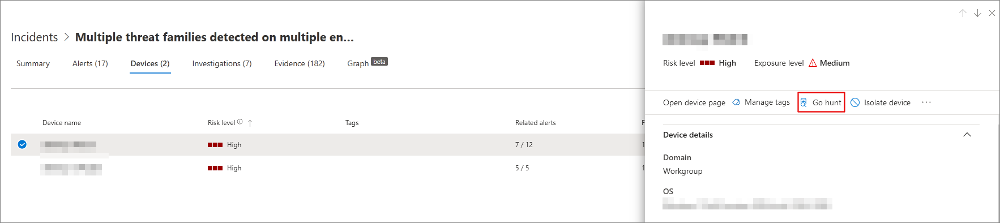
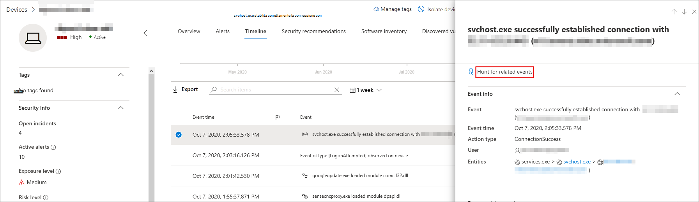

# <a name="quickly-hunt-for-entity-or-event-information-with-go-hunt"></a>Ricerca rapida di informazioni su entità o eventi con go hunt

[!INCLUDE [Microsoft 365 Defender rebranding](../../includes/microsoft-defender.md)]

**Si applica a:**
- [Defender per endpoint](https://go.microsoft.com/fwlink/?linkid=2154037)

>Vuoi provare Defender per Endpoint? [Iscriversi per una versione di valutazione gratuita.](https://www.microsoft.com/microsoft-365/windows/microsoft-defender-atp?ocid=docs-wdatp-advancedhuntingref-abovefoldlink)


Con *l'azione di ricerca* vai, puoi analizzare rapidamente eventi e vari tipi di entità usando potenti funzionalità avanzate [di ricerca basate su](advanced-hunting-overview.md) query. Questa azione esegue automaticamente una query di ricerca avanzata per trovare informazioni rilevanti sull'evento o sull'entità selezionata.

*L'azione di risposta* vai è disponibile in varie sezioni del Centro sicurezza ogni volta che vengono visualizzati i dettagli dell'evento o dell'entità. Ad esempio, è possibile utilizzare *go hunt* dalle sezioni seguenti:

- Nella pagina [dell'evento](investigate-incidents.md)imprevisto è possibile esaminare i dettagli relativi a utenti, dispositivi e molte altre entità associate a un evento imprevisto. Quando si seleziona un'entità, si ottengono informazioni aggiuntive e varie azioni che è possibile eseguire su tale entità. Nell'esempio seguente viene selezionato un dispositivo che mostra i dettagli sul dispositivo e l'opzione per cercare ulteriori informazioni sul dispositivo.

    

- Nella pagina dell'evento imprevisto puoi anche accedere a un elenco di entità nella scheda evidenza. La selezione di una di queste entità offre un'opzione per cercare rapidamente informazioni su tale entità.

    

- Quando visualizzi la sequenza temporale di un dispositivo, puoi selezionare un evento nella sequenza temporale per visualizzare informazioni aggiuntive su tale evento. Dopo aver selezionato un evento, puoi scegliere di cercare altri eventi rilevanti nella ricerca avanzata.

    

Se **si seleziona Vai a** risposta o Cerca per gli eventi correlati, vengono passate query diverse, a seconda che sia stata selezionata un'entità o un evento. 

## <a name="query-for-entity-information"></a>Query per informazioni sulle entità

Quando si *utilizza go hunt* per eseguire una query per ottenere informazioni su un utente, un dispositivo o qualsiasi altro tipo di entità, la query controlla tutte le tabelle dello schema pertinenti per eventuali eventi che coinvolgono tale entità. Per mantenere gestibili i risultati, l'ambito della query è intorno allo stesso periodo di tempo della prima attività degli ultimi 30 giorni che coinvolge l'entità ed è associata all'evento imprevisto.

Ecco un esempio della query di risposta go per un dispositivo:

```kusto
let selectedTimestamp = datetime(2020-06-02T02:06:47.1167157Z);
let deviceName = "fv-az770.example.com";
let deviceId = "device-guid";
search in (DeviceLogonEvents, DeviceProcessEvents, DeviceNetworkEvents, DeviceFileEvents, DeviceRegistryEvents, DeviceImageLoadEvents, DeviceEvents, DeviceImageLoadEvents, IdentityLogonEvents, IdentityQueryEvents)
Timestamp between ((selectedTimestamp - 1h) .. (selectedTimestamp + 1h))
and DeviceName == deviceName
// or RemoteDeviceName == deviceName
// or DeviceId == deviceId
| take 100
```

### <a name="supported-entity-types"></a>Tipi di entità supportati

Puoi usare *vai a risposta* dopo aver selezionato uno di questi tipi di entità:

- File
- Utenti
- Dispositivi
- Indirizzi IP
- URL

## <a name="query-for-event-information"></a>Query per informazioni sull'evento

Quando si *utilizza go hunt* per eseguire una query per ottenere informazioni su un evento della sequenza temporale, la query verifica la presenza di altri eventi in tutte le tabelle dello schema rilevanti al momento dell'evento selezionato. Ad esempio, la query seguente elenca gli eventi in diverse tabelle dello schema che si sono verificati nello stesso periodo di tempo nello stesso dispositivo:

```kusto
// List relevant events 30 minutes before and after selected RegistryValueSet event
let selectedEventTimestamp = datetime(2020-10-06T21:40:25.3466868Z);
search in (DeviceFileEvents, DeviceProcessEvents, DeviceEvents, DeviceRegistryEvents, DeviceNetworkEvents, DeviceImageLoadEvents, DeviceLogonEvents)
    Timestamp between ((selectedEventTimestamp - 30m) .. (selectedEventTimestamp + 30m))
    and DeviceId == "a305b52049c4658ec63ae8b55becfe5954c654a4"
| sort by Timestamp desc
| extend Relevance = iff(Timestamp == selectedEventTimestamp, "Selected event", iff(Timestamp < selectedEventTimestamp, "Earlier event", "Later event"))
| project-reorder Relevance
```

## <a name="adjust-the-query"></a>Modificare la query

Con una certa conoscenza del [linguaggio di query,](advanced-hunting-query-language.md)è possibile modificare la query in base alle proprie preferenze. Ad esempio, puoi regolare questa linea, che determina le dimensioni dell'intervallo di tempo:

```kusto
Timestamp between ((selectedTimestamp - 1h) .. (selectedTimestamp + 1h))
```

Oltre a modificare la query per ottenere risultati più rilevanti, è anche possibile:

- [Visualizzare i risultati come grafici](advanced-hunting-query-results.md#view-query-results-as-a-table-or-chart)
- [Creare una regola di rilevamento personalizzata](custom-detection-rules.md)

## <a name="related-topics"></a>Argomenti correlati

- [Panoramica della ricerca avanzata](advanced-hunting-overview.md)
- [Capire il linguaggio delle query](advanced-hunting-query-language.md)
- [Usare i risultati delle query](advanced-hunting-query-results.md)
- [Regole di rilevamento personalizzate](custom-detection-rules.md)
