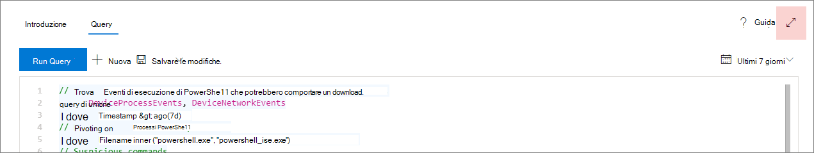
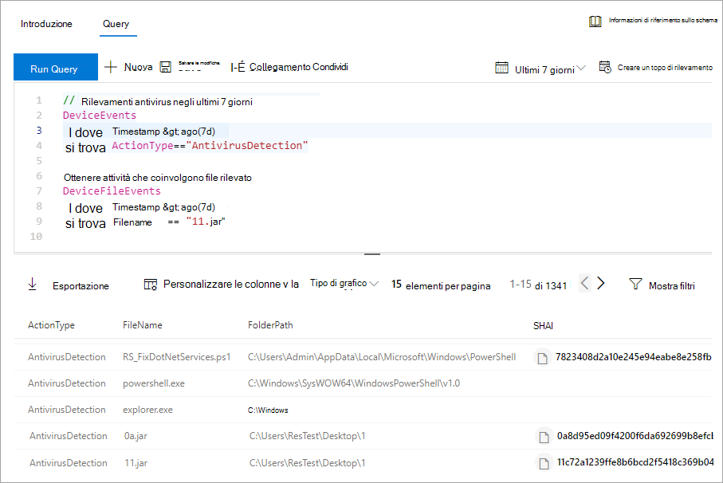
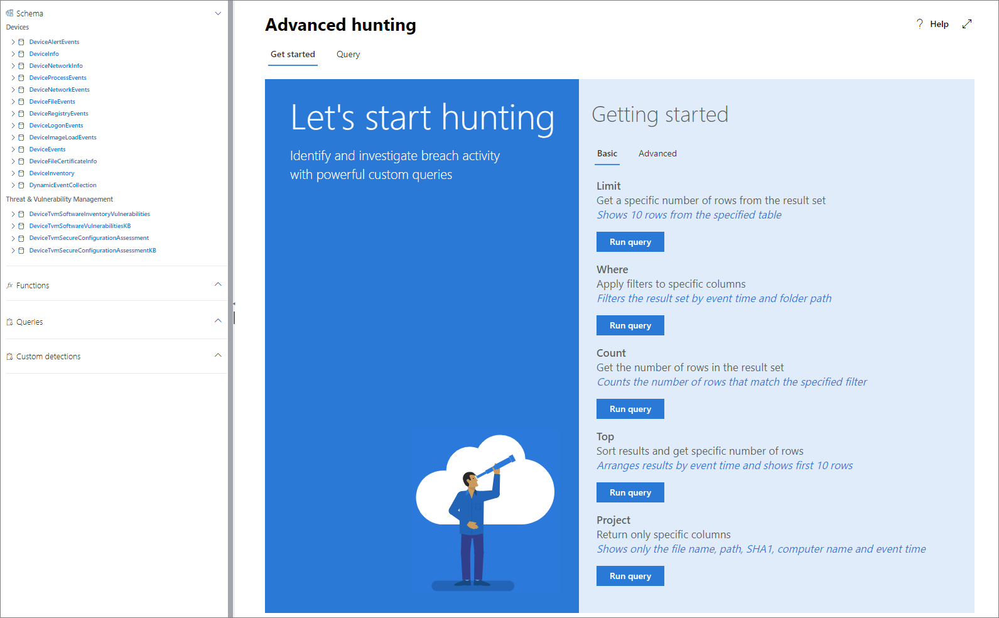

# <a name="learn-the-advanced-hunting-query-language"></a><span data-ttu-id="705f9-104">Scoprire il linguaggio delle query in Ricerca avanzata</span><span class="sxs-lookup"><span data-stu-id="705f9-104">Learn the advanced hunting query language</span></span>

[!INCLUDE [Microsoft 365 Defender rebranding](../../includes/microsoft-defender.md)]

<span data-ttu-id="705f9-105">**Si applica a:**</span><span class="sxs-lookup"><span data-stu-id="705f9-105">**Applies to:**</span></span>
- [<span data-ttu-id="705f9-106">Defender per endpoint</span><span class="sxs-lookup"><span data-stu-id="705f9-106">Defender for Endpoint</span></span>](https://go.microsoft.com/fwlink/?linkid=2154037)

> <span data-ttu-id="705f9-107">Vuoi provare Defender per Endpoint?</span><span class="sxs-lookup"><span data-stu-id="705f9-107">Want to experience Defender for Endpoint?</span></span> [<span data-ttu-id="705f9-108">Iscriversi per una versione di valutazione gratuita.</span><span class="sxs-lookup"><span data-stu-id="705f9-108">Sign up for a free trial.</span></span>](https://www.microsoft.com/microsoft-365/windows/microsoft-defender-atp?ocid=docs-wdatp-advancedhunting-abovefoldlink)

<span data-ttu-id="705f9-109">Ricerca avanzata si basa sul [linguaggio delle query in Esplora dati](https://docs.microsoft.com/azure/kusto/query/).</span><span class="sxs-lookup"><span data-stu-id="705f9-109">Advanced hunting is based on the [Kusto query language](https://docs.microsoft.com/azure/kusto/query/).</span></span> <span data-ttu-id="705f9-110">È possibile utilizzare gli operatori e le istruzioni Kusto per creare query che individuano informazioni in uno [schema specializzato.](advanced-hunting-schema-reference.md)</span><span class="sxs-lookup"><span data-stu-id="705f9-110">You can use Kusto operators and statements to construct queries that locate information in a specialized [schema](advanced-hunting-schema-reference.md).</span></span> <span data-ttu-id="705f9-111">Per comprendere meglio questi concetti, eseguire la prima query.</span><span class="sxs-lookup"><span data-stu-id="705f9-111">To understand these concepts better, run your first query.</span></span>

## <a name="try-your-first-query"></a><span data-ttu-id="705f9-112">Provare la prima query</span><span class="sxs-lookup"><span data-stu-id="705f9-112">Try your first query</span></span>

<span data-ttu-id="705f9-113">In Microsoft Defender Security Center passare a **Ricerca avanzata** per eseguire la prima query.</span><span class="sxs-lookup"><span data-stu-id="705f9-113">In Microsoft Defender Security Center, go to **Advanced hunting** to run your first query.</span></span> <span data-ttu-id="705f9-114">Usare l'esempio seguente:</span><span class="sxs-lookup"><span data-stu-id="705f9-114">Use the following example:</span></span>

```kusto
// Finds PowerShell execution events that could involve a download
union DeviceProcessEvents, DeviceNetworkEvents
| where Timestamp > ago(7d)
// Pivoting on PowerShell processes
| where FileName in~ ("powershell.exe", "powershell_ise.exe")
// Suspicious commands
| where ProcessCommandLine has_any("WebClient",
    "DownloadFile",
    "DownloadData",
    "DownloadString",
    "WebRequest",
    "Shellcode",
    "http",
    "https")
| project Timestamp, DeviceName, InitiatingProcessFileName, InitiatingProcessCommandLine, 
FileName, ProcessCommandLine, RemoteIP, RemoteUrl, RemotePort, RemoteIPType
| top 100 by Timestamp
```
<span data-ttu-id="705f9-115">**[Eseguire questa query nella ricerca avanzata](https://securitycenter.windows.com/hunting?query=H4sIAAAAAAAEAI2TT0vDQBDF5yz4HUJPFcTqyZsXqyCIBFvxKNGWtpo_NVlbC8XP7m8mado0K5Zls8nkzdu3b2Z70pNAbmUmqYyk4D2UTJYyllwGMmWNGQHrN_NNvsSBzUBrbMFMiWieAx3xDEBl4GL4AuNd8B0bNgARENcdUmIZ3yM5liPwac3bN-YZPGPU5ET1rWDc7Ox4uod8YDp4MzI-GkjlX4Ne2nly0zEkKzFWh4ZE5sSuTN8Ehq5couvEMnvmUAhez-HsRBMipVa_W_OG6vEfGtT12JRHpqV064e1Kx04NsxFzXxW1aFjp_djXmDRPbfY3XMMcLogTz2bWZ2KqmIJI6q6wKe2WYnrRsa9KVeU9kCBBo2v7BzPxF_Bx2DKiqh63SGoRoc6Njti48z_yL71XHQAcgAur6rXRpcqH3l-4knZF23Utsbq2MircEqmw-G__xR1TdZ1r7zb7XLezmx3etkvGr-ze6NdGdW92azUfpcdluWvr-aqbh_nofnqcWI3aYyOsBV7giduRUO7187LMKTT5rxvHHX80_t8IeeMgLquvL7-Ak3q-kz8BAAA&runQuery=true&timeRangeId=week)**</span><span class="sxs-lookup"><span data-stu-id="705f9-115">**[Run this query in advanced hunting](https://securitycenter.windows.com/hunting?query=H4sIAAAAAAAEAI2TT0vDQBDF5yz4HUJPFcTqyZsXqyCIBFvxKNGWtpo_NVlbC8XP7m8mado0K5Zls8nkzdu3b2Z70pNAbmUmqYyk4D2UTJYyllwGMmWNGQHrN_NNvsSBzUBrbMFMiWieAx3xDEBl4GL4AuNd8B0bNgARENcdUmIZ3yM5liPwac3bN-YZPGPU5ET1rWDc7Ox4uod8YDp4MzI-GkjlX4Ne2nly0zEkKzFWh4ZE5sSuTN8Ehq5couvEMnvmUAhez-HsRBMipVa_W_OG6vEfGtT12JRHpqV064e1Kx04NsxFzXxW1aFjp_djXmDRPbfY3XMMcLogTz2bWZ2KqmIJI6q6wKe2WYnrRsa9KVeU9kCBBo2v7BzPxF_Bx2DKiqh63SGoRoc6Njti48z_yL71XHQAcgAur6rXRpcqH3l-4knZF23Utsbq2MircEqmw-G__xR1TdZ1r7zb7XLezmx3etkvGr-ze6NdGdW92azUfpcdluWvr-aqbh_nofnqcWI3aYyOsBV7giduRUO7187LMKTT5rxvHHX80_t8IeeMgLquvL7-Ak3q-kz8BAAA&runQuery=true&timeRangeId=week)**</span></span>

### <a name="describe-the-query-and-specify-the-tables-to-search"></a><span data-ttu-id="705f9-116">Descrivere la query e specificare le tabelle in cui eseguire la ricerca</span><span class="sxs-lookup"><span data-stu-id="705f9-116">Describe the query and specify the tables to search</span></span>
<span data-ttu-id="705f9-117">All'inizio della query è stato aggiunto un breve commento per descriverlo.</span><span class="sxs-lookup"><span data-stu-id="705f9-117">A short comment has been added to the beginning of the query to describe what it is for.</span></span> <span data-ttu-id="705f9-118">Questo commento è utile se successivamente si decide di salvare la query e condividerla con altri utenti dell'organizzazione.</span><span class="sxs-lookup"><span data-stu-id="705f9-118">This comment helps if you later decide to save the query and share it with others in your organization.</span></span>

```kusto
// Finds PowerShell execution events that could involve a download
```
<span data-ttu-id="705f9-119">La query stessa inizierà in genere con un nome di tabella seguito da diversi elementi che iniziano con una pipe ( `|` ).</span><span class="sxs-lookup"><span data-stu-id="705f9-119">The query itself will typically start with a table name followed by several elements that start with a pipe (`|`).</span></span> <span data-ttu-id="705f9-120">In questo esempio si inizia creando un'unione di due tabelle e e si aggiungono elementi  `DeviceProcessEvents` tramite pipe in base alle `DeviceNetworkEvents` esigenze.</span><span class="sxs-lookup"><span data-stu-id="705f9-120">In this example, we start by creating a union of two tables,  `DeviceProcessEvents` and `DeviceNetworkEvents`, and add piped elements as needed.</span></span>

```kusto
union DeviceProcessEvents, DeviceNetworkEvents
```
### <a name="set-the-time-range"></a><span data-ttu-id="705f9-121">Impostare l'intervallo di tempo</span><span class="sxs-lookup"><span data-stu-id="705f9-121">Set the time range</span></span>
<span data-ttu-id="705f9-122">Il primo elemento con pipe è un filtro temporale con ambito per i sette giorni precedenti.</span><span class="sxs-lookup"><span data-stu-id="705f9-122">The first piped element is a time filter scoped to the previous seven days.</span></span> <span data-ttu-id="705f9-123">La limitazione dell'intervallo di tempo garantisce che le query funzionino bene, restituiscono risultati gestibili e non si esercitino timeout.</span><span class="sxs-lookup"><span data-stu-id="705f9-123">Limiting the time range helps ensure that queries perform well, return manageable results, and don't time out.</span></span>

```kusto
| where Timestamp > ago(7d)
```

### <a name="check-specific-processes"></a><span data-ttu-id="705f9-124">Controllare processi specifici</span><span class="sxs-lookup"><span data-stu-id="705f9-124">Check specific processes</span></span>
<span data-ttu-id="705f9-125">L'intervallo di tempo è immediatamente seguito da una ricerca di nomi di file di processo che rappresentano l'applicazione PowerShell.</span><span class="sxs-lookup"><span data-stu-id="705f9-125">The time range is immediately followed by a search for process file names representing the PowerShell application.</span></span>

```kusto
// Pivoting on PowerShell processes
| where FileName in~ ("powershell.exe", "powershell_ise.exe")
```

### <a name="search-for-specific-command-strings"></a><span data-ttu-id="705f9-126">Cercare stringhe di comando specifiche</span><span class="sxs-lookup"><span data-stu-id="705f9-126">Search for specific command strings</span></span>
<span data-ttu-id="705f9-127">In seguito, la query cerca le stringhe nelle righe di comando che in genere vengono usate per scaricare i file tramite PowerShell.</span><span class="sxs-lookup"><span data-stu-id="705f9-127">Afterwards, the query looks for strings in command lines that are typically used to download files using PowerShell.</span></span>

```kusto
// Suspicious commands
| where ProcessCommandLine has_any("WebClient",
    "DownloadFile",
    "DownloadData",
    "DownloadString",
    "WebRequest",
    "Shellcode",
    "http",
    "https")
```

### <a name="customize-result-columns-and-length"></a><span data-ttu-id="705f9-128">Personalizzare le colonne dei risultati e la lunghezza</span><span class="sxs-lookup"><span data-stu-id="705f9-128">Customize result columns and length</span></span> 
<span data-ttu-id="705f9-129">Ora che la query identifica chiaramente i dati che si desidera individuare, è possibile definire l'aspetto dei risultati.</span><span class="sxs-lookup"><span data-stu-id="705f9-129">Now that your query clearly identifies the data you want to locate, you can define what the results look like.</span></span> <span data-ttu-id="705f9-130">`project` restituisce colonne specifiche e `top` limita il numero di risultati.</span><span class="sxs-lookup"><span data-stu-id="705f9-130">`project` returns specific columns, and `top` limits the number of results.</span></span> <span data-ttu-id="705f9-131">Questi operatori assicurano che i risultati siano ben formattati e ragionevolmente grandi e facili da elaborare.</span><span class="sxs-lookup"><span data-stu-id="705f9-131">These operators help ensure the results are well-formatted and reasonably large and easy to process.</span></span>

```kusto
| project Timestamp, DeviceName, InitiatingProcessFileName, InitiatingProcessCommandLine, 
FileName, ProcessCommandLine, RemoteIP, RemoteUrl, RemotePort, RemoteIPType
| top 100 by Timestamp
```

<span data-ttu-id="705f9-132">Selezionare **Esegui query** per visualizzare i risultati.</span><span class="sxs-lookup"><span data-stu-id="705f9-132">Select **Run query** to see the results.</span></span> <span data-ttu-id="705f9-133">Utilizzare l'icona di espansione nella parte superiore destra dell'editor di query per concentrarsi sulla query di ricerca e sui risultati.</span><span class="sxs-lookup"><span data-stu-id="705f9-133">Use the expand icon at the top right of the query editor to focus on your hunting query and the results.</span></span> 



>[!TIP]
><span data-ttu-id="705f9-135">È possibile visualizzare i risultati delle query come grafici e regolare rapidamente i filtri.</span><span class="sxs-lookup"><span data-stu-id="705f9-135">You can view query results as charts and quickly adjust filters.</span></span> <span data-ttu-id="705f9-136">Per informazioni dettagliate, [vedere Utilizzo dei risultati delle query](advanced-hunting-query-results.md)</span><span class="sxs-lookup"><span data-stu-id="705f9-136">For guidance, [read about working with query results](advanced-hunting-query-results.md)</span></span>

## <a name="learn-common-query-operators-for-advanced-hunting"></a><span data-ttu-id="705f9-137">Informazioni sugli operatori di query più comuni per la Ricerca avanzata</span><span class="sxs-lookup"><span data-stu-id="705f9-137">Learn common query operators for advanced hunting</span></span>

<span data-ttu-id="705f9-138">È stata appena eseguita la prima query e si ha un'idea generale dei relativi componenti.</span><span class="sxs-lookup"><span data-stu-id="705f9-138">You've just run your first query and have a general idea of its components.</span></span> <span data-ttu-id="705f9-139">È il momento di eseguire il backtracking leggermente e apprendere alcune nozioni di base.</span><span class="sxs-lookup"><span data-stu-id="705f9-139">It's time to backtrack slightly and learn some basics.</span></span> <span data-ttu-id="705f9-140">Il linguaggio delle query di Esplora dati usato in Ricerca avanzata supporta una serie di operatori, di seguito sono elencati i più comuni.</span><span class="sxs-lookup"><span data-stu-id="705f9-140">The Kusto query language used by advanced hunting supports a range of operators, including the following common ones.</span></span>

| <span data-ttu-id="705f9-141">Operatore</span><span class="sxs-lookup"><span data-stu-id="705f9-141">Operator</span></span> | <span data-ttu-id="705f9-142">Descrizione e utilizzo</span><span class="sxs-lookup"><span data-stu-id="705f9-142">Description and usage</span></span> |
|--|--|
| `where` | <span data-ttu-id="705f9-143">Filtrare una tabella nel sottoinsieme di righe che soddisfano un predicato.</span><span class="sxs-lookup"><span data-stu-id="705f9-143">Filter a table to the subset of rows that satisfy a predicate.</span></span> |
| `summarize` | <span data-ttu-id="705f9-144">Creare una tabella che aggrega il contenuto della tabella di input.</span><span class="sxs-lookup"><span data-stu-id="705f9-144">Produce a table that aggregates the content of the input table.</span></span> |
| `join` | <span data-ttu-id="705f9-145">Unire le righe di due tabelle per creare una nuova tabella in base ai valori corrispondenti delle colonne specificate di ogni tabella.</span><span class="sxs-lookup"><span data-stu-id="705f9-145">Merge the rows of two tables to form a new table by matching values of the specified column(s) from each table.</span></span> |
| `count` | <span data-ttu-id="705f9-146">Restituire il numero di record nel set di record di input.</span><span class="sxs-lookup"><span data-stu-id="705f9-146">Return the number of records in the input record set.</span></span> |
| `top` | <span data-ttu-id="705f9-147">Restituire i primi N record ordinati in base alle colonne specificate.</span><span class="sxs-lookup"><span data-stu-id="705f9-147">Return the first N records sorted by the specified columns.</span></span> |
| `limit` | <span data-ttu-id="705f9-148">Tornare al numero specificato di righe.</span><span class="sxs-lookup"><span data-stu-id="705f9-148">Return up to the specified number of rows.</span></span> |
| `project` | <span data-ttu-id="705f9-149">Selezionare le colonne da includere, rinominare o rilasciare e inserire nuove colonne calcolate.</span><span class="sxs-lookup"><span data-stu-id="705f9-149">Select the columns to include, rename or drop, and insert new computed columns.</span></span> |
| `extend` | <span data-ttu-id="705f9-150">Creare colonne calcolate e accodarle al set di risultati.</span><span class="sxs-lookup"><span data-stu-id="705f9-150">Create calculated columns and append them to the result set.</span></span> |
| `makeset` |  <span data-ttu-id="705f9-151">Restituire una matrice dinamica (JSON) del set di valori distinti che Expr accetta nel gruppo.</span><span class="sxs-lookup"><span data-stu-id="705f9-151">Return a dynamic (JSON) array of the set of distinct values that Expr takes in the group.</span></span> |
| `find` | <span data-ttu-id="705f9-152">Trovare le righe che corrispondono a un predicato in un set di tabelle.</span><span class="sxs-lookup"><span data-stu-id="705f9-152">Find rows that match a predicate across a set of tables.</span></span> |

<span data-ttu-id="705f9-153">Per visualizzare un esempio reale di questi  operatori, eseguili dalla sezione Introduzione della pagina di ricerca avanzata.</span><span class="sxs-lookup"><span data-stu-id="705f9-153">To see a live example of these operators, run them from the **Get started** section of the advanced hunting page.</span></span>

## <a name="understand-data-types"></a><span data-ttu-id="705f9-154">Informazioni sui tipi di dati</span><span class="sxs-lookup"><span data-stu-id="705f9-154">Understand data types</span></span>

<span data-ttu-id="705f9-155">La ricerca avanzata supporta i tipi di dati Kusto, inclusi i tipi comuni seguenti:</span><span class="sxs-lookup"><span data-stu-id="705f9-155">Advanced hunting supports Kusto data types, including the following common types:</span></span>

| <span data-ttu-id="705f9-156">Tipo di dati</span><span class="sxs-lookup"><span data-stu-id="705f9-156">Data type</span></span> | <span data-ttu-id="705f9-157">Descrizione e implicazioni delle query</span><span class="sxs-lookup"><span data-stu-id="705f9-157">Description and query implications</span></span> |
|--|--|
| `datetime` | <span data-ttu-id="705f9-158">Informazioni sui dati e sull'ora che in genere rappresentano i timestamp degli eventi.</span><span class="sxs-lookup"><span data-stu-id="705f9-158">Data and time information typically representing event timestamps.</span></span> [<span data-ttu-id="705f9-159">Vedere formati di datetime supportati</span><span class="sxs-lookup"><span data-stu-id="705f9-159">See supported datetime formats</span></span>](https://docs.microsoft.com/azure/data-explorer/kusto/query/scalar-data-types/datetime) |
| `string` | <span data-ttu-id="705f9-160">Stringa di caratteri in FORMATO UTF-8 racchiusa tra virgolette singole ( ) o `'` doppie ( `"` ).</span><span class="sxs-lookup"><span data-stu-id="705f9-160">Character string in UTF-8 enclosed in single quotes (`'`) or double quotes (`"`).</span></span> [<span data-ttu-id="705f9-161">Altre informazioni sulle stringhe</span><span class="sxs-lookup"><span data-stu-id="705f9-161">Read more about strings</span></span>](https://docs.microsoft.com/azure/data-explorer/kusto/query/scalar-data-types/string) |
| `bool` | <span data-ttu-id="705f9-162">Questo tipo di dati supporta `true` o `false` gli stati.</span><span class="sxs-lookup"><span data-stu-id="705f9-162">This data type supports `true` or `false` states.</span></span> [<span data-ttu-id="705f9-163">Vedere operatori e valori letterali supportati</span><span class="sxs-lookup"><span data-stu-id="705f9-163">See supported literals and operators</span></span>](https://docs.microsoft.com/azure/data-explorer/kusto/query/scalar-data-types/bool) |
| `int` | <span data-ttu-id="705f9-164">Numero intero a 32 bit</span><span class="sxs-lookup"><span data-stu-id="705f9-164">32-bit integer</span></span>  |
| `long` | <span data-ttu-id="705f9-165">Numero intero a 64 bit</span><span class="sxs-lookup"><span data-stu-id="705f9-165">64-bit integer</span></span> |

<span data-ttu-id="705f9-166">Per ulteriori informazioni su questi tipi di dati, [vedere Kusto scalar data types](https://docs.microsoft.com/azure/data-explorer/kusto/query/scalar-data-types/).</span><span class="sxs-lookup"><span data-stu-id="705f9-166">To learn more about these data types, [read about Kusto scalar data types](https://docs.microsoft.com/azure/data-explorer/kusto/query/scalar-data-types/).</span></span>

## <a name="get-help-as-you-write-queries"></a><span data-ttu-id="705f9-167">Ottenere assistenza nella scrittura delle query</span><span class="sxs-lookup"><span data-stu-id="705f9-167">Get help as you write queries</span></span>
<span data-ttu-id="705f9-168">Trarre vantaggio dalle seguenti funzionalità per scrivere query più velocemente:</span><span class="sxs-lookup"><span data-stu-id="705f9-168">Take advantage of the following functionality to write queries faster:</span></span>

- <span data-ttu-id="705f9-169">**Autosuggest:** quando si scrivono query, la ricerca avanzata fornisce suggerimenti da IntelliSense.</span><span class="sxs-lookup"><span data-stu-id="705f9-169">**Autosuggest**—as you write queries, advanced hunting provides suggestions from IntelliSense.</span></span>
- <span data-ttu-id="705f9-170">**Albero dello** schema: una rappresentazione dello schema che include l'elenco di tabelle e le relative colonne viene fornita accanto all'area di lavoro.</span><span class="sxs-lookup"><span data-stu-id="705f9-170">**Schema tree**—a schema representation that includes the list of tables and their columns is provided next to your working area.</span></span> <span data-ttu-id="705f9-171">Per altre informazioni, passare il puntatore su un elemento.</span><span class="sxs-lookup"><span data-stu-id="705f9-171">For more information, hover over an item.</span></span> <span data-ttu-id="705f9-172">Fare doppio clic su un elemento per inserirlo nell'editor di query.</span><span class="sxs-lookup"><span data-stu-id="705f9-172">Double-click an item to insert it to the query editor.</span></span>
- <span data-ttu-id="705f9-173">**[Riferimento allo](advanced-hunting-schema-reference.md#get-schema-information-in-the-security-center)** schema: riferimento nel portale con descrizioni di tabelle e colonne, tipi di eventi supportati (valori) `ActionType` e query di esempio</span><span class="sxs-lookup"><span data-stu-id="705f9-173">**[Schema reference](advanced-hunting-schema-reference.md#get-schema-information-in-the-security-center)**—in-portal reference with table and column descriptions as well as supported event types (`ActionType` values) and sample queries</span></span>

## <a name="work-with-multiple-queries-in-the-editor"></a><span data-ttu-id="705f9-174">Utilizzare più query nell'editor</span><span class="sxs-lookup"><span data-stu-id="705f9-174">Work with multiple queries in the editor</span></span>
<span data-ttu-id="705f9-175">È possibile utilizzare l'editor di query per sperimentare più query.</span><span class="sxs-lookup"><span data-stu-id="705f9-175">You can use the query editor to experiment with multiple queries.</span></span> <span data-ttu-id="705f9-176">Per utilizzare più query:</span><span class="sxs-lookup"><span data-stu-id="705f9-176">To use multiple queries:</span></span>

- <span data-ttu-id="705f9-177">Separare ogni query con una riga vuota.</span><span class="sxs-lookup"><span data-stu-id="705f9-177">Separate each query with an empty line.</span></span>
- <span data-ttu-id="705f9-178">Posizionare il cursore su qualsiasi parte di una query per selezionarla prima di eseguire la query.</span><span class="sxs-lookup"><span data-stu-id="705f9-178">Place the cursor on any part of a query to select that query before running it.</span></span> <span data-ttu-id="705f9-179">Verrà eseguita solo la query selezionata.</span><span class="sxs-lookup"><span data-stu-id="705f9-179">This will run only the selected query.</span></span> <span data-ttu-id="705f9-180">Per eseguire un'altra query, spostare il cursore di conseguenza e selezionare **Esegui query**.</span><span class="sxs-lookup"><span data-stu-id="705f9-180">To run another query, move the cursor accordingly and select **Run query**.</span></span>

<span data-ttu-id="705f9-181">
 _query Editor di query con più query_</span><span class="sxs-lookup"><span data-stu-id="705f9-181">
_Query editor with multiple queries_</span></span>

## <a name="use-sample-queries"></a><span data-ttu-id="705f9-182">Usare query di esempio</span><span class="sxs-lookup"><span data-stu-id="705f9-182">Use sample queries</span></span>

<span data-ttu-id="705f9-183">La sezione **Introduzione** presenta alcune semplici query che impiegano operatori di uso comune.</span><span class="sxs-lookup"><span data-stu-id="705f9-183">The **Get started** section provides a few simple queries using commonly used operators.</span></span> <span data-ttu-id="705f9-184">Provare a eseguire queste query e apportare piccole modifiche.</span><span class="sxs-lookup"><span data-stu-id="705f9-184">Try running these queries and making small modifications to them.</span></span>



> [!NOTE]
> <span data-ttu-id="705f9-186">Oltre agli esempi di query di base, è anche possibile accedere [query condivise](advanced-hunting-shared-queries.md) per specifici scenari di ricerca delle minacce.</span><span class="sxs-lookup"><span data-stu-id="705f9-186">Apart from the basic query samples, you can also access [shared queries](advanced-hunting-shared-queries.md) for specific threat hunting scenarios.</span></span> <span data-ttu-id="705f9-187">Esplorare le query condivise sul lato sinistro della pagina o [nell'archivio di query GitHub.](https://aka.ms/hunting-queries)</span><span class="sxs-lookup"><span data-stu-id="705f9-187">Explore the shared queries on the left side of the page or the [GitHub query repository](https://aka.ms/hunting-queries).</span></span>

## <a name="access-comprehensive-query-language-reference"></a><span data-ttu-id="705f9-188">Informazioni di riferimento complete sul linguaggio di query di Access</span><span class="sxs-lookup"><span data-stu-id="705f9-188">Access comprehensive query language reference</span></span>

<span data-ttu-id="705f9-189">Per informazioni dettagliate sul linguaggio di query, vedere [la documentazione relativa al linguaggio di query Kusto.](https://docs.microsoft.com/azure/kusto/query/)</span><span class="sxs-lookup"><span data-stu-id="705f9-189">For detailed information about the query language, see [Kusto query language documentation](https://docs.microsoft.com/azure/kusto/query/).</span></span>

## <a name="related-topics"></a><span data-ttu-id="705f9-190">Argomenti correlati</span><span class="sxs-lookup"><span data-stu-id="705f9-190">Related topics</span></span>
- [<span data-ttu-id="705f9-191">Panoramica della ricerca avanzata</span><span class="sxs-lookup"><span data-stu-id="705f9-191">Advanced hunting overview</span></span>](advanced-hunting-overview.md)
- [<span data-ttu-id="705f9-192">Usare i risultati delle query</span><span class="sxs-lookup"><span data-stu-id="705f9-192">Work with query results</span></span>](advanced-hunting-query-results.md)
- [<span data-ttu-id="705f9-193">Utilizzare le query condivise</span><span class="sxs-lookup"><span data-stu-id="705f9-193">Use shared queries</span></span>](advanced-hunting-shared-queries.md)
- [<span data-ttu-id="705f9-194">Comprensione dello schema</span><span class="sxs-lookup"><span data-stu-id="705f9-194">Understand the schema</span></span>](advanced-hunting-schema-reference.md)
- [<span data-ttu-id="705f9-195">Applicare le procedure consigliate per le query</span><span class="sxs-lookup"><span data-stu-id="705f9-195">Apply query best practices</span></span>](advanced-hunting-best-practices.md)
