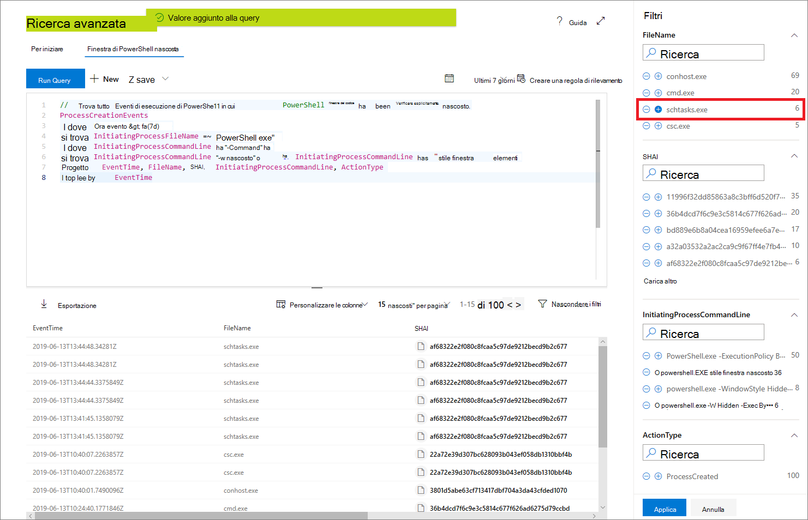

# <a name="work-with-advanced-hunting-query-results"></a><span data-ttu-id="88bc8-104">Utilizzare i risultati delle query di ricerca avanzata</span><span class="sxs-lookup"><span data-stu-id="88bc8-104">Work with advanced hunting query results</span></span>

[!INCLUDE [Microsoft 365 Defender rebranding](../../includes/microsoft-defender.md)]

<span data-ttu-id="88bc8-105">**Si applica a:**</span><span class="sxs-lookup"><span data-stu-id="88bc8-105">**Applies to:**</span></span>
- [<span data-ttu-id="88bc8-106">Microsoft Defender per endpoint</span><span class="sxs-lookup"><span data-stu-id="88bc8-106">Microsoft Defender for Endpoint</span></span>](https://go.microsoft.com/fwlink/?linkid=2154037)

><span data-ttu-id="88bc8-107">Vuoi provare Defender per Endpoint?</span><span class="sxs-lookup"><span data-stu-id="88bc8-107">Want to experience Defender for Endpoint?</span></span> [<span data-ttu-id="88bc8-108">Iscriversi per una versione di valutazione gratuita.</span><span class="sxs-lookup"><span data-stu-id="88bc8-108">Sign up for a free trial.</span></span>](https://www.microsoft.com/microsoft-365/windows/microsoft-defender-atp?ocid=docs-wdatp-advancedhunting-abovefoldlink)

<span data-ttu-id="88bc8-109">Sebbene sia possibile [](advanced-hunting-overview.md) creare query di ricerca avanzate per restituire informazioni molto precise, è anche possibile utilizzare i risultati della query per ottenere ulteriori informazioni e analizzare attività e indicatori specifici.</span><span class="sxs-lookup"><span data-stu-id="88bc8-109">While you can construct your [advanced hunting](advanced-hunting-overview.md) queries to return very precise information, you can also work with the query results to gain further insight and investigate specific activities and indicators.</span></span> <span data-ttu-id="88bc8-110">È possibile eseguire le azioni seguenti sui risultati della query:</span><span class="sxs-lookup"><span data-stu-id="88bc8-110">You can take the following actions on your query results:</span></span>

- <span data-ttu-id="88bc8-111">Visualizzare i risultati come tabella o grafico</span><span class="sxs-lookup"><span data-stu-id="88bc8-111">View results as a table or chart</span></span>
- <span data-ttu-id="88bc8-112">Esportare tabelle e grafici</span><span class="sxs-lookup"><span data-stu-id="88bc8-112">Export tables and charts</span></span>
- <span data-ttu-id="88bc8-113">Drill-down per informazioni dettagliate sulle entità</span><span class="sxs-lookup"><span data-stu-id="88bc8-113">Drill down to detailed entity information</span></span>
- <span data-ttu-id="88bc8-114">Modificare le query direttamente dai risultati o applicare filtri</span><span class="sxs-lookup"><span data-stu-id="88bc8-114">Tweak your queries directly from the results or apply filters</span></span>

## <a name="view-query-results-as-a-table-or-chart"></a><span data-ttu-id="88bc8-115">Visualizzare i risultati della query come tabella o grafico</span><span class="sxs-lookup"><span data-stu-id="88bc8-115">View query results as a table or chart</span></span>
<span data-ttu-id="88bc8-116">Per impostazione predefinita, la ricerca avanzata visualizza i risultati delle query come dati tabulari.</span><span class="sxs-lookup"><span data-stu-id="88bc8-116">By default, advanced hunting displays query results as tabular data.</span></span> <span data-ttu-id="88bc8-117">È inoltre possibile visualizzare gli stessi dati di un grafico.</span><span class="sxs-lookup"><span data-stu-id="88bc8-117">You can also display the same data as a chart.</span></span> <span data-ttu-id="88bc8-118">La ricerca avanzata supporta le visualizzazioni seguenti:</span><span class="sxs-lookup"><span data-stu-id="88bc8-118">Advanced hunting supports the following views:</span></span>

| <span data-ttu-id="88bc8-119">Tipo visualizzazione</span><span class="sxs-lookup"><span data-stu-id="88bc8-119">View type</span></span> | <span data-ttu-id="88bc8-120">Descrizione</span><span class="sxs-lookup"><span data-stu-id="88bc8-120">Description</span></span> |
| -- | -- |
| <span data-ttu-id="88bc8-121">**tavolo**</span><span class="sxs-lookup"><span data-stu-id="88bc8-121">**Table**</span></span> | <span data-ttu-id="88bc8-122">Visualizza i risultati della query in formato tabulare</span><span class="sxs-lookup"><span data-stu-id="88bc8-122">Displays the query results in tabular format</span></span> |
| <span data-ttu-id="88bc8-123">**Istogramma**</span><span class="sxs-lookup"><span data-stu-id="88bc8-123">**Column chart**</span></span> | <span data-ttu-id="88bc8-124">Esegue il rendering di una serie di elementi univoci sull'asse x come barre verticali le cui altezze rappresentano valori numerici di un altro campo</span><span class="sxs-lookup"><span data-stu-id="88bc8-124">Renders a series of unique items on the x-axis as vertical bars whose heights represent numeric values from another field</span></span> |
| <span data-ttu-id="88bc8-125">**Istogramma in pila**</span><span class="sxs-lookup"><span data-stu-id="88bc8-125">**Stacked column chart**</span></span> | <span data-ttu-id="88bc8-126">Esegue il rendering di una serie di elementi univoci sull'asse x come barre verticali in pila le cui altezze rappresentano valori numerici di uno o più campi</span><span class="sxs-lookup"><span data-stu-id="88bc8-126">Renders a series of unique items on the x-axis as stacked vertical bars whose heights represent numeric values from one or more other fields</span></span> |
| <span data-ttu-id="88bc8-127">**Grafico a torta**</span><span class="sxs-lookup"><span data-stu-id="88bc8-127">**Pie chart**</span></span> | <span data-ttu-id="88bc8-128">Esegue il rendering delle torta di sezione che rappresentano elementi univoci.</span><span class="sxs-lookup"><span data-stu-id="88bc8-128">Renders sectional pies representing unique items.</span></span> <span data-ttu-id="88bc8-129">Le dimensioni di ogni torta rappresentano valori numerici di un altro campo.</span><span class="sxs-lookup"><span data-stu-id="88bc8-129">The size of each pie represents numeric values from another field.</span></span> |
| <span data-ttu-id="88bc8-130">**Grafico ad anello**</span><span class="sxs-lookup"><span data-stu-id="88bc8-130">**Donut chart**</span></span> | <span data-ttu-id="88bc8-131">Esegue il rendering di archi di sezione che rappresentano elementi univoci.</span><span class="sxs-lookup"><span data-stu-id="88bc8-131">Renders sectional arcs representing unique items.</span></span> <span data-ttu-id="88bc8-132">La lunghezza di ogni arco rappresenta valori numerici di un altro campo.</span><span class="sxs-lookup"><span data-stu-id="88bc8-132">The length of each arc represents numeric values from another field.</span></span> |
| <span data-ttu-id="88bc8-133">**Grafico a linee**</span><span class="sxs-lookup"><span data-stu-id="88bc8-133">**Line chart**</span></span> | <span data-ttu-id="88bc8-134">Traccia valori numerici per una serie di elementi univoci e connette i valori tracciati</span><span class="sxs-lookup"><span data-stu-id="88bc8-134">Plots numeric values for a series of unique items and connects the plotted values</span></span> |
| <span data-ttu-id="88bc8-135">**Grafico a dispersione**</span><span class="sxs-lookup"><span data-stu-id="88bc8-135">**Scatter chart**</span></span> | <span data-ttu-id="88bc8-136">Traccia valori numerici per una serie di elementi univoci</span><span class="sxs-lookup"><span data-stu-id="88bc8-136">Plots numeric values for a series of unique items</span></span> |
| <span data-ttu-id="88bc8-137">**Grafico ad area**</span><span class="sxs-lookup"><span data-stu-id="88bc8-137">**Area chart**</span></span> | <span data-ttu-id="88bc8-138">Traccia valori numerici per una serie di elementi univoci e riempie le sezioni sotto i valori tracciati</span><span class="sxs-lookup"><span data-stu-id="88bc8-138">Plots numeric values for a series of unique items and fills the sections below the plotted values</span></span> |

### <a name="construct-queries-for-effective-charts"></a><span data-ttu-id="88bc8-139">Creare query per grafici efficaci</span><span class="sxs-lookup"><span data-stu-id="88bc8-139">Construct queries for effective charts</span></span>
<span data-ttu-id="88bc8-140">Durante il rendering dei grafici, la ricerca avanzata identifica automaticamente le colonne di interesse e i valori numerici da aggregare.</span><span class="sxs-lookup"><span data-stu-id="88bc8-140">When rendering charts, advanced hunting automatically identifies columns of interest and the numeric values to aggregate.</span></span> <span data-ttu-id="88bc8-141">Per ottenere grafici significativi, creare le query per restituire i valori specifici che si desidera visualizzare.</span><span class="sxs-lookup"><span data-stu-id="88bc8-141">To get meaningful charts, construct your queries to return the specific values you want to see visualized.</span></span> <span data-ttu-id="88bc8-142">Ecco alcune query di esempio e i grafici risultanti.</span><span class="sxs-lookup"><span data-stu-id="88bc8-142">Here are some sample queries and the resulting charts.</span></span>

#### <a name="alerts-by-severity"></a><span data-ttu-id="88bc8-143">Avvisi per gravità</span><span class="sxs-lookup"><span data-stu-id="88bc8-143">Alerts by severity</span></span>
<span data-ttu-id="88bc8-144">Utilizzare `summarize` l'operatore per ottenere un conteggio numerico dei valori che si desidera creare nel grafico.</span><span class="sxs-lookup"><span data-stu-id="88bc8-144">Use the `summarize` operator to obtain a numeric count of the values you want to chart.</span></span> <span data-ttu-id="88bc8-145">La query seguente utilizza `summarize` l'operatore per ottenere il numero di avvisi in base alla gravità.</span><span class="sxs-lookup"><span data-stu-id="88bc8-145">The query below uses the `summarize` operator to get the number of alerts by severity.</span></span>

```kusto
DeviceAlertEvents
| summarize Total = count() by Severity
```
<span data-ttu-id="88bc8-146">Quando si esegue il rendering dei risultati, un istogramma visualizza ogni valore di gravità come colonna separata:</span><span class="sxs-lookup"><span data-stu-id="88bc8-146">When rendering the results, a column chart displays each severity value as a separate column:</span></span>

<span data-ttu-id="88bc8-147">
 *gravità visualizzati come istogramma*</span><span class="sxs-lookup"><span data-stu-id="88bc8-147">
*Query results for alerts by severity displayed as a column chart*</span></span>

#### <a name="alert-severity-by-operating-system"></a><span data-ttu-id="88bc8-148">Gravità dell'avviso in base al sistema operativo</span><span class="sxs-lookup"><span data-stu-id="88bc8-148">Alert severity by operating system</span></span>
<span data-ttu-id="88bc8-149">È inoltre possibile utilizzare `summarize` l'operatore per preparare i risultati per la creazione di grafici di valori da più campi.</span><span class="sxs-lookup"><span data-stu-id="88bc8-149">You could also use the `summarize` operator to prepare results for charting values from multiple fields.</span></span> <span data-ttu-id="88bc8-150">Ad esempio, potrebbe essere necessario comprendere in che modo le gravità degli avvisi vengono distribuite tra sistemi operativi.</span><span class="sxs-lookup"><span data-stu-id="88bc8-150">For example, you might want to understand how alert severities are distributed across operating systems (OS).</span></span> 

<span data-ttu-id="88bc8-151">Nella query seguente viene utilizzato un operatore per estrarre le informazioni sul sistema operativo dalla tabella e quindi viene utilizzato per contare i valori `join` `DeviceInfo` nelle colonne e `summarize` `OSPlatform` `Severity` :</span><span class="sxs-lookup"><span data-stu-id="88bc8-151">The query below uses a `join` operator to pull in OS information from the `DeviceInfo` table, and then uses `summarize` to count values in both the `OSPlatform` and `Severity` columns:</span></span>

```kusto
DeviceAlertEvents
| join DeviceInfo on DeviceId
| summarize Count = count() by OSPlatform, Severity
```
<span data-ttu-id="88bc8-152">Questi risultati sono visualizzati meglio usando un istogramma in pila:</span><span class="sxs-lookup"><span data-stu-id="88bc8-152">These results are best visualized using a stacked column chart:</span></span>

<span data-ttu-id="88bc8-153">
 *grafico in pila*</span><span class="sxs-lookup"><span data-stu-id="88bc8-153">
*Query results for alerts by OS and severity displayed as a stacked chart*</span></span>

#### <a name="top-ten-device-groups-with-alerts"></a><span data-ttu-id="88bc8-154">Primi dieci gruppi di dispositivi con avvisi</span><span class="sxs-lookup"><span data-stu-id="88bc8-154">Top ten device groups with alerts</span></span>
<span data-ttu-id="88bc8-155">Se si ha a che fare con un elenco di valori non finiti, è possibile utilizzare l'operatore per creare un grafico solo dei valori con la maggior `Top` parte delle istanze.</span><span class="sxs-lookup"><span data-stu-id="88bc8-155">If you're dealing with a list of values that isn’t finite, you can use the `Top` operator to chart only the values with the most instances.</span></span> <span data-ttu-id="88bc8-156">Ad esempio, per ottenere i primi dieci gruppi di dispositivi con il maggior numero di avvisi, usa la query seguente:</span><span class="sxs-lookup"><span data-stu-id="88bc8-156">For example, to get the top ten device groups with the most alerts, use the query below:</span></span>

```kusto
DeviceAlertEvents
| join DeviceInfo on DeviceId
| summarize Count = count() by MachineGroup
| top 10 by Count
```
<span data-ttu-id="88bc8-157">Usa la visualizzazione grafico a torta per mostrare in modo efficace la distribuzione tra i gruppi principali:</span><span class="sxs-lookup"><span data-stu-id="88bc8-157">Use the pie chart view to effectively show distribution across the top groups:</span></span>

<span data-ttu-id="88bc8-158">
 *la distribuzione degli avvisi tra i gruppi di dispositivi*</span><span class="sxs-lookup"><span data-stu-id="88bc8-158">
*Pie chart showing distribution of alerts across device groups*</span></span>

#### <a name="malware-detections-over-time"></a><span data-ttu-id="88bc8-159">Rilevamenti di malware nel tempo</span><span class="sxs-lookup"><span data-stu-id="88bc8-159">Malware detections over time</span></span>
<span data-ttu-id="88bc8-160">Utilizzando `summarize` l'operatore con `bin()` la funzione, è possibile verificare la presenza di eventi che coinvolgono un determinato indicatore nel tempo.</span><span class="sxs-lookup"><span data-stu-id="88bc8-160">Using the `summarize` operator with the `bin()` function, you can check for events involving a particular indicator over time.</span></span> <span data-ttu-id="88bc8-161">La query seguente conta i rilevamenti di un file di test EICAR a intervalli di 30 minuti per mostrare picchi nei rilevamenti di tale file:</span><span class="sxs-lookup"><span data-stu-id="88bc8-161">The query below counts detections of an EICAR test file at 30 minute intervals to show spikes in detections of that file:</span></span>

```kusto
DeviceEvents
| where ActionType == "AntivirusDetection"
| where SHA1 == "3395856ce81f2b7382dee72602f798b642f14140"
| summarize Detections = count() by bin(Timestamp, 30m)
```
<span data-ttu-id="88bc8-162">Il grafico a linee seguente evidenzia chiaramente i periodi di tempo con più rilevamenti del malware di test:</span><span class="sxs-lookup"><span data-stu-id="88bc8-162">The line chart below clearly highlights time periods with more detections of the test malware:</span></span> 

<span data-ttu-id="88bc8-163">
 *un malware di test nel tempo*</span><span class="sxs-lookup"><span data-stu-id="88bc8-163">
*Line chart showing the number of detections of a test malware over time*</span></span>


## <a name="export-tables-and-charts"></a><span data-ttu-id="88bc8-164">Esportare tabelle e grafici</span><span class="sxs-lookup"><span data-stu-id="88bc8-164">Export tables and charts</span></span>
<span data-ttu-id="88bc8-165">Dopo aver eseguito una query, selezionare **Esporta** per salvare i risultati nel file locale.</span><span class="sxs-lookup"><span data-stu-id="88bc8-165">After running a query, select **Export** to save the results to local file.</span></span> <span data-ttu-id="88bc8-166">La visualizzazione scelta determina la modalità di esportazione dei risultati:</span><span class="sxs-lookup"><span data-stu-id="88bc8-166">Your chosen view determines how the results are exported:</span></span>

- <span data-ttu-id="88bc8-167">**Visualizzazione tabella:** i risultati della query vengono esportati in formato tabulare come cartella di lavoro di Microsoft Excel</span><span class="sxs-lookup"><span data-stu-id="88bc8-167">**Table view** — the query results are exported in tabular form as a Microsoft Excel workbook</span></span>
- <span data-ttu-id="88bc8-168">**Qualsiasi grafico:** i risultati della query vengono esportati come immagine JPEG del grafico sottoposto a rendering</span><span class="sxs-lookup"><span data-stu-id="88bc8-168">**Any chart** — the query results are exported as a JPEG image of the rendered chart</span></span>

## <a name="drill-down-from-query-results"></a><span data-ttu-id="88bc8-169">Eseguire il drill-down dai risultati della query</span><span class="sxs-lookup"><span data-stu-id="88bc8-169">Drill down from query results</span></span>
<span data-ttu-id="88bc8-170">Per visualizzare ulteriori informazioni sulle entità, ad esempio dispositivi, file, utenti, indirizzi IP e URL, nei risultati della query fare semplicemente clic sull'identificatore dell'entità.</span><span class="sxs-lookup"><span data-stu-id="88bc8-170">To view more information about entities, such as devices, files, users, IP addresses, and URLs, in your query results, simply click the entity identifier.</span></span> <span data-ttu-id="88bc8-171">Verrà aperta una pagina del profilo dettagliata per l'entità selezionata.</span><span class="sxs-lookup"><span data-stu-id="88bc8-171">This opens a detailed profile page for the selected entity.</span></span>

<span data-ttu-id="88bc8-172">Per esaminare rapidamente un record nei risultati della query, selezionare la riga corrispondente per aprire il pannello Esamina record.</span><span class="sxs-lookup"><span data-stu-id="88bc8-172">To quickly inspect a record in your query results, select the corresponding row to open the Inspect record panel.</span></span> <span data-ttu-id="88bc8-173">Il pannello fornisce le informazioni seguenti in base al record selezionato:</span><span class="sxs-lookup"><span data-stu-id="88bc8-173">The panel provides the following information based on the selected record:</span></span>

- <span data-ttu-id="88bc8-174">**Asset:** visualizzazione riepilogata degli asset principali (cassette postali, dispositivi e utenti) presenti nel record, arricchita da informazioni disponibili, ad esempio livelli di rischio ed esposizione</span><span class="sxs-lookup"><span data-stu-id="88bc8-174">**Assets** — A summarized view of the main assets (mailboxes, devices, and users) found in the record, enriched with available information, such as risk and exposure levels</span></span>
- <span data-ttu-id="88bc8-175">**Albero del processo:** grafico generato per i record con informazioni sul processo e arricchito utilizzando le informazioni contestuali disponibili; in generale, le query che restituiscono più colonne possono comportare alberi di processo più ricchi.</span><span class="sxs-lookup"><span data-stu-id="88bc8-175">**Process tree** — A chart generated for records with process information and enriched using available contextual information; in general, queries that return more columns can result in richer process trees.</span></span>
- <span data-ttu-id="88bc8-176">**Tutti i** dettagli: elenca tutti i valori delle colonne del record</span><span class="sxs-lookup"><span data-stu-id="88bc8-176">**All details** — Lists all the values from the columns in the record</span></span>

## <a name="tweak-your-queries-from-the-results"></a><span data-ttu-id="88bc8-177">Perfezionare le query dai risultati</span><span class="sxs-lookup"><span data-stu-id="88bc8-177">Tweak your queries from the results</span></span>
<span data-ttu-id="88bc8-178">Fare clic con il pulsante destro del mouse su un valore nel set di risultati per migliorare rapidamente la query.</span><span class="sxs-lookup"><span data-stu-id="88bc8-178">Right-click a value in the result set to quickly enhance your query.</span></span> <span data-ttu-id="88bc8-179">È possibile usare le opzioni per:</span><span class="sxs-lookup"><span data-stu-id="88bc8-179">You can use the options to:</span></span>

- <span data-ttu-id="88bc8-180">Cercare in modo esplicito il valore selezionato (`==`)</span><span class="sxs-lookup"><span data-stu-id="88bc8-180">Explicitly look for the selected value (`==`)</span></span>
- <span data-ttu-id="88bc8-181">Escludere il valore selezionato dalla query (`!=`)</span><span class="sxs-lookup"><span data-stu-id="88bc8-181">Exclude the selected value from the query (`!=`)</span></span>
- <span data-ttu-id="88bc8-182">Per aggiungere il valore alla query, è possibile usare gli operatori più avanzati, come `contains`, `starts with` e `ends with`</span><span class="sxs-lookup"><span data-stu-id="88bc8-182">Get more advanced operators for adding the value to your query, such as `contains`, `starts with` and `ends with`</span></span> 


## <a name="filter-the-query-results"></a><span data-ttu-id="88bc8-184">Filtrare i risultati della query</span><span class="sxs-lookup"><span data-stu-id="88bc8-184">Filter the query results</span></span>
<span data-ttu-id="88bc8-185">I filtri visualizzati nel riquadro destro forniscono un riepilogo del set di risultati.</span><span class="sxs-lookup"><span data-stu-id="88bc8-185">The filters displayed in the right pane provide a summary of the result set.</span></span> <span data-ttu-id="88bc8-186">Ogni colonna ha una propria sezione nel riquadro, ognuna delle quali elenca i valori trovati in tale colonna e il numero di istanze.</span><span class="sxs-lookup"><span data-stu-id="88bc8-186">Every column has its own section in the pane, each of which lists the values found in that column, and the number of instances.</span></span>

<span data-ttu-id="88bc8-187">Per affinare la query, selezionare i pulsanti o sui valori `+` che si desidera includere o `-` escludere.</span><span class="sxs-lookup"><span data-stu-id="88bc8-187">Refine your query by selecting the `+` or `-` buttons on the values that you want to include or exclude.</span></span> <span data-ttu-id="88bc8-188">Selezionare quindi **Esegui query**.</span><span class="sxs-lookup"><span data-stu-id="88bc8-188">Then select **Run query**.</span></span>



<span data-ttu-id="88bc8-190">Dopo avere applicato il filtro per modificare la query e aver eseguito la query, i risultati vengono aggiornati di conseguenza.</span><span class="sxs-lookup"><span data-stu-id="88bc8-190">Once you apply the filter to modify the query and then run the query, the results are updated accordingly.</span></span>

## <a name="related-topics"></a><span data-ttu-id="88bc8-191">Argomenti correlati</span><span class="sxs-lookup"><span data-stu-id="88bc8-191">Related topics</span></span>
- [<span data-ttu-id="88bc8-192">Panoramica della rilevazione avanzata</span><span class="sxs-lookup"><span data-stu-id="88bc8-192">Advanced hunting overview</span></span>](advanced-hunting-overview.md)
- [<span data-ttu-id="88bc8-193">Capire il linguaggio delle query</span><span class="sxs-lookup"><span data-stu-id="88bc8-193">Learn the query language</span></span>](advanced-hunting-query-language.md)
- [<span data-ttu-id="88bc8-194">Utilizzare le query condivise</span><span class="sxs-lookup"><span data-stu-id="88bc8-194">Use shared queries</span></span>](advanced-hunting-shared-queries.md)
- [<span data-ttu-id="88bc8-195">Comprensione dello schema</span><span class="sxs-lookup"><span data-stu-id="88bc8-195">Understand the schema</span></span>](advanced-hunting-schema-reference.md)
- [<span data-ttu-id="88bc8-196">Applicare le procedure consigliate per le query</span><span class="sxs-lookup"><span data-stu-id="88bc8-196">Apply query best practices</span></span>](advanced-hunting-best-practices.md)
- [<span data-ttu-id="88bc8-197">Panoramica dei rilevamenti personalizzati</span><span class="sxs-lookup"><span data-stu-id="88bc8-197">Custom detections overview</span></span>](overview-custom-detections.md)
