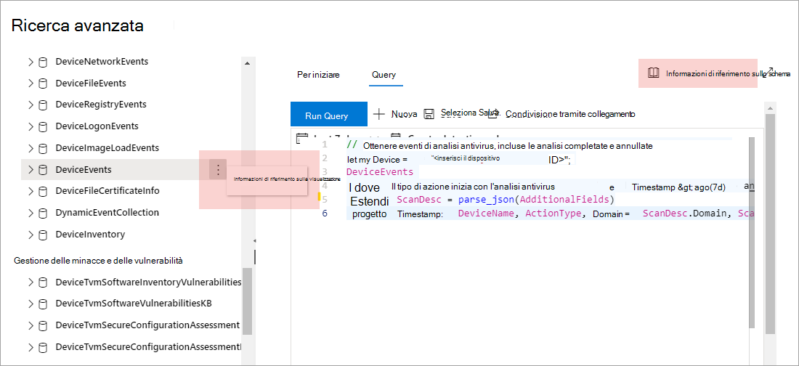

# Informazioni sullo schema di ricerca avanzata in Microsoft Defender for Endpoint

[!INCLUDE [Microsoft 365 Defender rebranding](../../includes/microsoft-defender.md)]

**Si applica a:**
- [Microsoft Defender per endpoint](https://go.microsoft.com/fwlink/?linkid=2154037)

>Vuoi provare Defender per Endpoint? [Iscriversi per una versione di valutazione gratuita.](https://www.microsoft.com/microsoft-365/windows/microsoft-defender-atp?ocid=docs-wdatp-advancedhuntingref-abovefoldlink)

[!include[Prerelease information](../../includes/prerelease.md)]

Lo schema [di ricerca](advanced-hunting-overview.md) avanzata è costituito da più tabelle che forniscono informazioni sull'evento o informazioni su dispositivi e altre entità. Per creare efficacemente query che coprano più tabelle, è necessario capire le tabelle e le colonne nello schema per Ricerca avanzata.

## Ottenere informazioni sullo schema nel Centro sicurezza
Durante la creazione di query, utilizzare il riferimento allo schema predefinito per ottenere rapidamente le informazioni seguenti su ogni tabella nello schema:

- **Descrizione tabelle:** tipo di dati contenuti nella tabella e l'origine di questi dati.
- **Colonne:** tutte le colonne della tabella.
- **Tipi di** azione: valori possibili nella `ActionType` colonna che rappresentano i tipi di evento supportati dalla tabella. Viene fornito solo per le tabelle che contengono informazioni sull'evento.
- **Query di esempio:** query di esempio che illustrano come utilizzare la tabella.

### Accedere al riferimento allo schema
Per accedere rapidamente al riferimento allo schema, selezionare l'azione Visualizza **riferimento** accanto al nome della tabella nella rappresentazione dello schema. È inoltre possibile selezionare **Riferimento allo schema** per cercare una tabella.

## Informazioni sulle tabelle dello schema

Il riferimento seguente elenca tutte le tabelle nello schema di ricerca avanzata. Ogni nome di tabella rimanda a una pagina che descrive i nomi delle colonne di quella tabella.

I nomi delle tabelle e delle colonne sono elencati anche in Microsoft Defender Security Center, nella rappresentazione dello schema nella schermata di ricerca avanzata.

| Nome della tabella | Descrizione |
|------------|-------------|
| **[DeviceAlertEvents](advanced-hunting-devicealertevents-table.md)** | Avvisi in Microsoft Defender Security Center |
| **[DeviceInfo](advanced-hunting-deviceinfo-table.md)** | Informazioni sul dispositivo, incluse le informazioni sul sistema operativo |
| **[DeviceNetworkInfo](advanced-hunting-devicenetworkinfo-table.md)** | Proprietà di rete dei dispositivi, incluse schede, indirizzi IP e MAC, nonché reti e domini connessi |
| **[DeviceProcessEvents](advanced-hunting-deviceprocessevents-table.md)** | Creazione processi ed eventi correlati |
| **[DeviceNetworkEvents](advanced-hunting-devicenetworkevents-table.md)** | Connessione rete ed eventi correlati |
| **[DeviceFileEvents](advanced-hunting-devicefileevents-table.md)** | Creazione e modifica dei file, e altri file evento di sistema |
| **[DeviceRegistryEvents](advanced-hunting-deviceregistryevents-table.md)** | Creazione e modifica di voci del registro di sistema |
| **[DeviceLogonEvents](advanced-hunting-devicelogonevents-table.md)** | Accessi e altri eventi di autenticazione |
| **[DeviceImageLoadEvents](advanced-hunting-deviceimageloadevents-table.md)** | Caricamento eventi DDL |
| **[DeviceEvents](advanced-hunting-deviceevents-table.md)** | Più tipi di eventi, inclusi gli eventi attivati da controlli di sicurezza come Microsoft Defender Antivirus e protezione dagli exploit |
| **[DeviceFileCertificateInfo](advanced-hunting-devicefilecertificateinfo-table.md)** | Informazioni sui certificati dei file firmati ottenuti dagli eventi di verifica dei certificati sugli endpoint |
| **[DeviceTvmSoftwareInventory](advanced-hunting-devicetvmsoftwareinventory-table.md)** | Inventario del software installato nei dispositivi, incluse le informazioni sulla versione e lo stato di fine del supporto |
| **[DeviceTvmSoftwareVulnerabilities](advanced-hunting-devicetvmsoftwarevulnerabilities-table.md)** | Vulnerabilità software riscontrate nei dispositivi e elenco degli aggiornamenti della sicurezza disponibili che affrontano ogni vulnerabilità |
| **[DeviceTvmSoftwareVulnerabilitiesKB](advanced-hunting-devicetvmsoftwarevulnerabilitieskb-table.md)** | Knowledge base sulle vulnerabilità divulgate pubblicamente, anche se il codice di exploit è disponibile pubblicamente |
| **[DeviceTvmSecureConfigurationAssessment](advanced-hunting-devicetvmsecureconfigurationassessment-table.md)** | Eventi di valutazione della gestione delle minacce e della vulnerabilità che indicano lo stato di diverse configurazioni di sicurezza nei dispositivi |
| **[DeviceTvmSecureConfigurationAssessmentKB](advanced-hunting-devicetvmsecureconfigurationassessmentkb-table.md)** | Knowledge base di diverse configurazioni di sicurezza usate dalla gestione delle minacce e vulnerabilità per valutare i dispositivi, inclusa la mappatura a diversi standard e parametri di riferimento |

>[!TIP]
>Usa [la ricerca avanzata in Microsoft 365 Defender](/microsoft-365/security/defender/advanced-hunting-overview) per cercare minacce usando i dati di Defender for Endpoint, Microsoft Defender per Office 365, Microsoft Cloud App Security e Microsoft Defender for Identity. [Attivare Microsoft 365 Defender](/microsoft-365/security/defender/m365d-enable)  
Per altre informazioni su come spostare i flussi di lavoro di ricerca avanzata da Microsoft Defender per Endpoint a Microsoft 365 Defender, vedere [Migrate advanced hunting queries from Microsoft Defender for Endpoint](/microsoft-365/security/defender/advanced-hunting-migrate-from-mde).

## Argomenti correlati
- [Panoramica della rilevazione avanzata](advanced-hunting-overview.md)
- [Capire il linguaggio delle query](advanced-hunting-query-language.md)
- [Usare i risultati delle query](advanced-hunting-query-results.md)
- [Applicare le procedure consigliate per le query](advanced-hunting-best-practices.md)
- [Panoramica dei rilevamenti personalizzati](overview-custom-detections.md)
- [Modifiche avanzate dello schema dei dati di ricerca](https://techcommunity.microsoft.com/t5/microsoft-defender-atp/advanced-hunting-data-schema-changes/ba-p/1043914)
