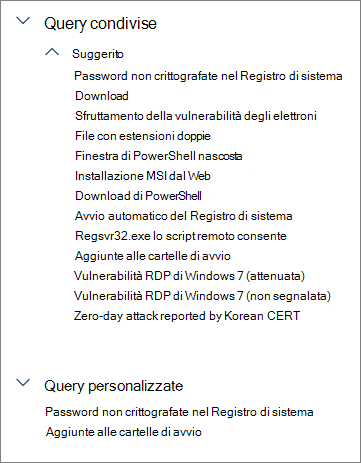
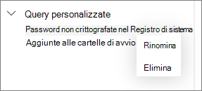

# Usare le query condivise nella ricerca avanzata

[!INCLUDE [Microsoft 365 Defender rebranding](../../includes/microsoft-defender.md)]

**Si applica a:**
- [Microsoft Defender per endpoint](https://go.microsoft.com/fwlink/p/?linkid=2154037)

>Vuoi provare Defender per Endpoint? [Iscriversi per una versione di valutazione gratuita.](https://www.microsoft.com/microsoft-365/windows/microsoft-defender-atp?ocid=docs-wdatp-advancedhunting-abovefoldlink)

[Le query Ricerca avanzata](advanced-hunting-overview.md) possono essere condivise tra con gli utenti della stessa organizzazione. È anche possibile trovare query condivise pubblicamente su GitHub. Queste query consentono di intraprendere rapidamente specifici scenari di ricerca delle minacce senza dover scrivere le query da zero.

## Salvare, modificare e condividere una query
È possibile salvare una query nuova o esistente in modo che sia solo accessibile all'utente o condivisa con altri utenti della propria organizzazione.

1. Digitare una nuova query o caricarne una esistente in **Query condivise** o **Query personalizzate**.

2. Selezionare **Salva** o **Salva con nome** dalle opzioni di salvataggio. Per evitare di sovrascrivere una query esistente, scegliere **Salva con nome.**

3. Immettere un nome per la query.

   

4. Selezionare la cartella in cui si vuole salvare la query.
    - **Query condivise,** condivise con tutti gli utenti dell'organizzazione
    - **Query personali**: query accessibili solo all'utente
    
5. Selezionare **Salva**.

## Eliminare o rinominare una query
1. Fare clic con il pulsante destro del mouse su una query che si vuole rinominare o eliminare.

    

2. Selezionare **Elimina** per confermare l'eliminazione. In alternativa, selezionare **Rinomina** e immettere un nuovo nome per la query.

## Creare un collegamento diretto a una query
Per generare un collegamento che apre la query direttamente nell'editor di query di ricerca avanzata, finalizzare la query e selezionare **Condividi collegamento.**

## Accedere alle query nel repository GitHub  
I ricercatori della sicurezza Microsoft condividono regolarmente query di ricerca avanzata in un [repository pubblico designato in GitHub](https://github.com/Microsoft/WindowsDefenderATP-Hunting-Queries). È possibile collaborare a questo repository. Per collaborare, [iscriversi a GitHub gratuitamente](https://github.com/). 

>[!TIP]
>I ricercatori della sicurezza Microsoft forniscono anche query di ricerca avanzata che è possibile usare per trovare le attività e gli indicatori associati alle minacce emergenti. Queste query sono incluse nei report di [analisi delle minacce](threat-analytics.md) nel Microsoft Defender Security Center.

## Argomenti correlati
- [Panoramica della rilevazione avanzata](advanced-hunting-overview.md)
- [Capire il linguaggio delle query](advanced-hunting-query-language.md)
- [Usare i risultati delle query](advanced-hunting-query-results.md)
- [Comprendere lo schema](advanced-hunting-schema-reference.md)
- [Applicare le procedure consigliate per le query](advanced-hunting-best-practices.md)
- [Panoramica dei rilevamenti personalizzati](overview-custom-detections.md)
