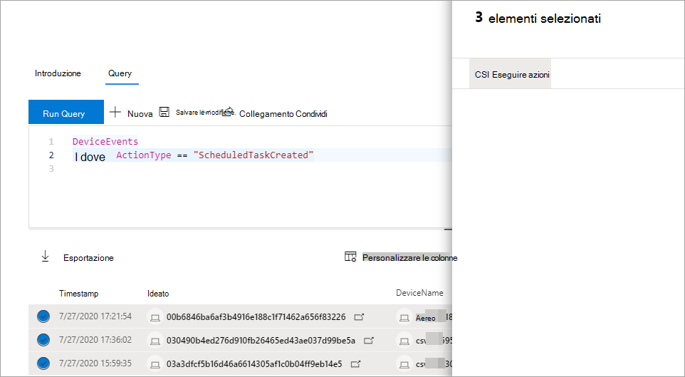

# Eseguire un'azione sui risultati delle query di ricerca avanzataTake action on advanced hunting query results

**Si applica a:****Applies to:**
- [Microsoft Defender ATPMicrosoft Defender for Endpoint](https://go.microsoft.com/fwlink/p/?linkid=2154037)

> Vuoi provare Defender per Endpoint?Want to experience Defender for Endpoint? [Iscriversi per una versione di valutazione gratuita.Sign up for a free trial.](https://www.microsoft.com/microsoft-365/windows/microsoft-defender-atp?ocid=docs-wdatp-advancedhuntingref-abovefoldlink)

Puoi contenere rapidamente minacce o affrontare asset compromessi che trovi nella ricerca [avanzata](advanced-hunting-overview.md) usando opzioni di azione potenti e complete.You can quickly contain threats or address compromised assets that you find in [advanced hunting](advanced-hunting-overview.md) using powerful and comprehensive action options. Con queste opzioni, è possibile:With these options, you can:

- Eseguire varie azioni sui dispositiviTake various actions on devices
- File in quarantenaQuarantine files

## Autorizzazioni necessarieRequired permissions

Per essere in grado di eseguire azioni tramite la ricerca avanzata, è necessario un ruolo in Defender per Endpoint con autorizzazioni per inviare azioni di correzione [nei dispositivi](https://docs.microsoft.com/microsoft-365/security/defender-endpoint/user-roles#permission-options).To be able to take action through advanced hunting, you need a role in Defender for Endpoint with [permissions to submit remediation actions on devices](https://docs.microsoft.com/microsoft-365/security/defender-endpoint/user-roles#permission-options). Se non è possibile eseguire un'azione, contattare un amministratore globale per ottenere l'autorizzazione seguente:If you can't take action, contact a global administrator about getting the following permission:

*Azioni di correzione attive > gestione delle minacce e delle vulnerabilità - Gestione delle correzioni**Active remediation actions > Threat and vulnerability management - Remediation handling*

## Eseguire varie azioni sui dispositiviTake various actions on devices

È possibile eseguire le azioni seguenti nei dispositivi identificati dalla `DeviceId` colonna nei risultati della query:You can take the following actions on devices identified by the `DeviceId` column in your query results:

- Isolare i dispositivi interessati per contenere un'infezione o impedire lo spostamento laterale di attacchiIsolate affected devices to contain an infection or prevent attacks from moving laterally
- Raccogliere un pacchetto di indagine per ottenere ulteriori informazioni forensiCollect investigation package to obtain more forensic information
- Eseguire un'analisi antivirus per trovare e rimuovere le minacce utilizzando gli ultimi aggiornamenti di security intelligenceRun an antivirus scan to find and remove threats using the latest security intelligence updates
- Avviare un'indagine automatizzata per controllare e correggere le minacce nel dispositivo e probabilmente in altri dispositivi interessatiInitiate an automated investigation to check and remediate threats on the device and possibly other affected devices
- Limitare l'esecuzione dell'app solo ai file eseguibili firmati da Microsoft, impedendo attività di minacce successive tramite malware o altri file eseguibili non attendibiliRestrict app execution to only Microsoft-signed executable files, preventing subsequent threat activity through malware or other untrusted executables

Per altre informazioni su come vengono eseguite queste azioni di risposta tramite Defender for Endpoint, [leggi azioni di risposta nei dispositivi](respond-machine-alerts.md).To learn more about how these response actions are performed through Defender for Endpoint, [read about response actions on devices](respond-machine-alerts.md).

## File in quarantenaQuarantine files

È possibile distribuire *l'azione di* quarantena sui file in modo che siano automaticamente messi in quarantena quando vengono rilevati.You can deploy the *quarantine* action on files so that they are automatically quarantined when encountered. Quando si seleziona questa azione, è possibile scegliere tra le colonne seguenti per identificare i file nei risultati della query da mettere in quarantena:When selecting this action, you can choose between the following columns to identify which files in your query results to quarantine:

- `SHA1` — Nella maggior parte delle tabelle di ricerca avanzate, si tratta dell'SHA-1 del file interessato dall'azione registrata.`SHA1` — In most advanced hunting tables, this is the SHA-1 of the file that was affected by the recorded action. Ad esempio, se un file è stato copiato, si tratta del file copiato.For example, if a file was copied, this would be the copied file.
- `InitiatingProcessSHA1` — Nella maggior parte delle tabelle di ricerca avanzate, questo è il file responsabile dell'avvio dell'azione registrata.`InitiatingProcessSHA1` — In most advanced hunting tables, this is the file responsible for initiating the recorded action. Ad esempio, se è stato avviato un processo figlio, si tratta del processo padre.For example, if a child process was launched, this would be the parent process. 
- `SHA256` - Questo è l'equivalente SHA-256 del file identificato dalla `SHA1` colonna.`SHA256` — This is the SHA-256 equivalent of the file identified by the `SHA1` column.
- `InitiatingProcessSHA256` - Questo è l'equivalente SHA-256 del file identificato dalla `InitiatingProcessSHA1` colonna.`InitiatingProcessSHA256` — This is the SHA-256 equivalent of the file identified by the `InitiatingProcessSHA1` column.

Per ulteriori informazioni su come vengono eseguite le azioni di quarantena e su come è possibile ripristinare i file, [vedere Azioni di risposta nei file](respond-file-alerts.md).To learn more about how quarantine actions are taken and how files can be restored, [read about response actions on files](respond-file-alerts.md).

>[!NOTE]
>Per individuare i file e mettereli in quarantena, i risultati della query devono includere `DeviceId` anche valori come identificatori di dispositivo.To locate files and quarantine them, the query results should also include `DeviceId` values as device identifiers.  

## Eseguire un'azioneTake action

Per eseguire una delle azioni descritte, selezionare uno o più record nei risultati della query e quindi fare clic **su Azioni.**To take any of the described actions, select one or more records in your query results and then select **Take actions**. Una procedura guidata ti guiderà nel processo di selezione e invio delle azioni preferite.A wizard will guide you through the process of selecting and then submitting your preferred actions.

## Rivedere le azioni intrapreseReview actions taken

Ogni azione viene registrata singolarmente nel centro notifiche, in **Cronologia centro** notifiche (  >   [security.microsoft.com/action-center/history](https://security.microsoft.com/action-center/history)).Each action is individually recorded in the action center, under **Action center** > **History** ([security.microsoft.com/action-center/history](https://security.microsoft.com/action-center/history)). Passare al centro notifiche per controllare lo stato di ogni azione.Go to the action center to check the status of each action.
 
## Argomenti correlatiRelated topics

- [Panoramica della ricerca avanzataAdvanced hunting overview](advanced-hunting-overview.md)
- [Capire il linguaggio delle queryLearn the query language](advanced-hunting-query-language.md)
- [Comprendere lo schemaUnderstand the schema](advanced-hunting-schema-reference.md)
- [Usare i risultati delle queryWork with query results](advanced-hunting-query-results.md)
- [Applicare le procedure consigliate per le queryApply query best practices](advanced-hunting-best-practices.md)
- [Panoramica dei rilevamenti personalizzatiCustom detections overview](overview-custom-detections.md)
