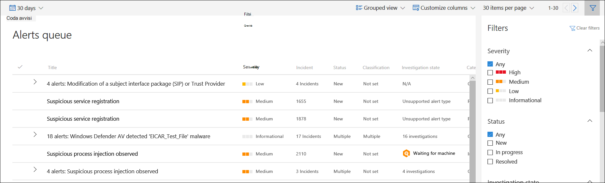

# Visualizzare e organizzare la coda di Microsoft Defender for Endpoint AlertsView and organize the Microsoft Defender for Endpoint Alerts queue

[!INCLUDE [Microsoft 365 Defender rebranding](../../includes/microsoft-defender.md)]

**Si applica a:****Applies to:**
- [Defender per endpointDefender for Endpoint](https://go.microsoft.com/fwlink/?linkid=2154037)

>Vuoi provare Defender per Endpoint?Want to experience Defender for Endpoint? [Iscriversi per una versione di valutazione gratuita.Sign up for a free trial.](https://www.microsoft.com/microsoft-365/windows/microsoft-defender-atp?ocid=docs-wdatp-alertsq-abovefoldlink) 

La **coda Avvisi** mostra un elenco di avvisi contrassegnati dai dispositivi della rete.The **Alerts queue** shows a list of alerts that were flagged from devices in your network. Per impostazione predefinita, la coda visualizza gli avvisi visualizzati negli ultimi 30 giorni in una visualizzazione raggruppata.By default, the queue displays alerts seen in the last 30 days in a grouped view. Gli avvisi più recenti vengono visualizzati all'inizio dell'elenco per visualizzare prima gli avvisi più recenti.The most recent alerts are showed at the top of the list helping you see the most recent alerts first.

> [!NOTE]
> La coda degli avvisi è notevolmente ridotta con l'analisi e la correzione automatizzate, consentendo agli esperti delle operazioni di sicurezza di concentrarsi su minacce più sofisticate e altre iniziative di alto valore.The alerts queue is significantly reduced with automated investigation and remediation, allowing security operations experts to focus on more sophisticated threats and other high value initiatives. Quando un avviso contiene un'entità supportata per l'indagine automatizzata (ad esempio, un file) in un dispositivo con un sistema operativo supportato, è possibile avviare un'indagine e una correzione automatizzate.When an alert contains a supported entity for automated investigation (for example, a file) in a device that has a supported operating system for it, an automated investigation and remediation can start. Per ulteriori informazioni sulle indagini automatizzate, vedere [Overview of Automated investigations](automated-investigations.md).For more information on automated investigations, see [Overview of Automated investigations](automated-investigations.md).

Sono disponibili diverse opzioni tra cui è possibile scegliere per personalizzare la visualizzazione della coda degli avvisi.There are several options you can choose from to customize the alerts queue view. 

Nella barra di spostamento superiore è possibile:On the top navigation you can:

- Selezionare la visualizzazione raggruppata o la visualizzazione elencoSelect grouped view or list view
- Personalizzare le colonne per aggiungere o rimuovere colonneCustomize columns to add or remove columns 
- Selezionare gli elementi da visualizzare per paginaSelect the items to show per page
- Spostarsi tra le pagineNavigate between pages
- Applicazione di filtriApply filters

## Ordinare, filtrare e raggruppare la coda degli avvisiSort, filter, and group the alerts queue

È possibile applicare i filtri seguenti per limitare l'elenco degli avvisi e ottenere una visualizzazione più mirata degli avvisi.You can apply the following filters to limit the list of alerts and get a more focused view the alerts.

### GravitàSeverity

Gravità avvisoAlert severity | DescrizioneDescription
:---|:---
AltoHigh  (Rosso)(Red) | Avvisi comunemente visualizzati associati a minacce persistenti avanzate (APT).Alerts commonly seen associated with advanced persistent threats (APT). Questi avvisi indicano un rischio elevato a causa della gravità dei danni che possono infliggere ai dispositivi.These alerts indicate a high risk because of  the severity of damage they can inflict on devices. Alcuni esempi sono: attività degli strumenti di furto di credenziali, attività ransomware non associate ad alcun gruppo, manomissione di sensori di sicurezza o attività dannose indicative di un avversario umano.Some examples are: credential theft tools activities, ransomware activities not associated with any group, tampering with security sensors, or any malicious activities indicative of a human adversary.
MedioMedium  (Arancione)(Orange) | Avvisi relativi al rilevamento degli endpoint e ai comportamenti di risposta post-violazione che potrebbero far parte di una minaccia persistente avanzata (APT).Alerts from endpoint detection and response post-breach behaviors that might be a part of an advanced persistent threat (APT). Ciò include comportamenti osservati tipici delle fasi di attacco, modifiche anomali del Registro di sistema, esecuzione di file sospetti e così via.This includes observed behaviors typical of attack stages, anomalous registry change, execution of suspicious files, and so forth. Anche se alcuni potrebbero essere parte dei test di sicurezza interni, richiede un'indagine perché potrebbe anche essere parte di un attacco avanzato.Although some might be part of internal security testing, it requires investigation as it might also be a part of an advanced attack.
BassoLow  (Giallo)(Yellow) | Avvisi sulle minacce associate al malware prevalente.Alerts on threats associated with prevalent malware. Ad esempio, strumenti di hacking, strumenti di hacking non malware, come l'esecuzione di comandi di esplorazione, la cancellazione dei registri e così via, che spesso non indicano una minaccia avanzata per l'organizzazione.For example, hack-tools, non-malware hack tools, such as running exploration commands, clearing logs, etc., that often do not indicate an advanced threat targeting the organization. Potrebbe anche derivare da un test isolato degli strumenti di sicurezza da parte di un utente dell'organizzazione.It could also come from an isolated security tool testing by a user in your organization.
InformativaInformational  (Grigio)(Grey) | Avvisi che potrebbero non essere considerati dannosi per la rete, ma che possono aumentare la consapevolezza della sicurezza dell'organizzazione su potenziali problemi di sicurezza.Alerts that might not be considered harmful to the network but can drive organizational security awareness on potential security issues.

#### Informazioni sulla gravità degli avvisiUnderstanding alert severity

Le gravità degli avvisi di Microsoft Defender Antivirus (Microsoft Defender AV) e Defender for Endpoint sono diverse perché rappresentano ambiti diversi.Microsoft Defender Antivirus (Microsoft Defender AV) and Defender for Endpoint alert severities are different because they represent different scopes.

La gravità della minaccia di Microsoft Defender AV rappresenta la gravità assoluta della minaccia rilevata (malware) e viene assegnata in base al potenziale rischio per il singolo dispositivo, se infetto.The Microsoft Defender AV threat severity represents the absolute severity of the detected threat (malware), and is assigned based on the potential risk to the individual device, if infected.

La gravità dell'avviso Defender for Endpoint rappresenta la gravità del comportamento rilevato, il rischio effettivo per il dispositivo, ma soprattutto il potenziale rischio per l'organizzazione.The Defender for Endpoint alert severity represents the severity of the detected behavior, the actual risk to the device but more importantly the potential risk to the organization.

Quindi, ad esempio:So, for example:

- La gravità di un avviso defender per endpoint su una minaccia rilevata da Microsoft Defender AV che è stata completamente impedita e che non ha infettato il dispositivo è classificata come "informativo" perché non si è verificata alcuna minaccia effettiva.The severity of a Defender for Endpoint alert about a Microsoft Defender AV detected threat that was completely prevented and did not infect the device is categorized as "Informational" because there was no actual damage.
- Un avviso su un malware commerciale è stato rilevato durante l'esecuzione, ma è stato bloccato e corretti da Microsoft Defender AV, è classificato come "Basso" perché potrebbe aver causato alcuni danni al singolo dispositivo, ma non rappresenta alcuna minaccia dell'organizzazione.An alert about a commercial malware was detected while executing, but blocked and remediated by Microsoft Defender AV, is categorized as  "Low" because it may have caused some damage to the individual device but poses no organizational threat.
- Un avviso sul malware rilevato durante l'esecuzione che può rappresentare una minaccia non solo per il singolo dispositivo ma per l'organizzazione, indipendentemente dal fatto che sia stato bloccato alla fine, può essere classificato come "Medio" o "Alto".An alert about malware detected while executing which can pose a threat not only to the individual device but to the organization, regardless if it was eventually blocked, may be ranked as "Medium" or "High".
- Gli avvisi comportamentali sospetti, che non sono stati bloccati o corretti, verranno classificati come "Low", "Medium" o "High" seguendo le stesse considerazioni sulle minacce organizzative.Suspicious behavioral alerts, which weren't blocked or remediated will be ranked "Low", "Medium" or "High" following the same organizational threat considerations.

#### Informazioni sulle categorie di avvisoUnderstanding alert categories

Abbiamo ridefinito le categorie di avviso per allinearsi alle [tattiche](https://attack.mitre.org/tactics/enterprise/) di attacco aziendale nella matrice [MITRE ATT&CK](https://attack.mitre.org/).We've redefined the alert categories to align to the [enterprise attack tactics](https://attack.mitre.org/tactics/enterprise/) in the [MITRE ATT&CK matrix](https://attack.mitre.org/). I nuovi nomi di categoria si applicano a tutti i nuovi avvisi.New category names apply to all new alerts. Gli avvisi esistenti manderanno i nomi delle categorie precedenti.Existing alerts will keep the previous category names.

Nella tabella seguente sono elencate le categorie correnti e il modo in cui vengono in genere mappate alle categorie precedenti.The table below lists the current categories and how they generally map to previous categories. 

| Nuova categoriaNew   category       | Nome categoria APIAPI category name   | Attività o componente delle minacce rilevateDetected threat activity or   component                                                                                                 |
|----------------------|---------------------|-----------------------------------------------------------------------------------------------------------------------------------------|
| RaccoltaCollection           | RaccoltaCollection          | Individuazione e raccolta di dati per l'esfiltrazioneLocating   and collecting data for exfiltration                                                                                         |
| Comando e controlloCommand and control  | CommandAndControlCommandAndControl   | Connessione all'infrastruttura di rete controllata da un utente malintenzionato per inoltrare dati o ricevere comandiConnecting   to attacker-controlled network infrastructure to relay data or receive   commands                                          |
| Accesso alle credenzialiCredential access    | CredentialAccessCredentialAccess    | Ottenere credenziali valide per estendere il controllo su dispositivi e altre risorse nella reteObtaining   valid credentials to extend control over devices and other resources in the   network                                       |
| Evasione della difesaDefense evasion      | DefenseEvasionDefenseEvasion      | Evitare i controlli di sicurezza, ad esempio disattivando le app di sicurezza, eliminando gli impianto e eseguendo rootkitAvoiding security controls by, for example, turning off   security apps, deleting implants, and running rootkits                        |
| IndividuazioneDiscovery            | IndividuazioneDiscovery           | Raccolta di informazioni su dispositivi e risorse importanti, ad esempio computer di amministratore, controller di dominio e file serverGathering   information about important devices and resources, such as administrator   computers, domain controllers, and file servers  |
| EsecuzioneExecution            | EsecuzioneExecution           | Avvio di strumenti di attacco e codice dannoso, tra cui RATI e backdoorLaunching   attacker tools and malicious code, including RATs and backdoors                                                             |
| ExfiltrationExfiltration         | ExfiltrationExfiltration        | Estrazione dei dati dalla rete in una posizione esterna controllata da un utente malintenzionatoExtracting   data from the network to an external, attacker-controlled location                                                         |
| ExploitExploit              | ExploitExploit             | Codice di exploit e possibile attività di sfruttamentoExploit   code and possible exploitation activity                                                                                       |
| Accesso inizialeInitial access       | InitialAccessInitialAccess       | Ottenere l'immissione iniziale nella rete di destinazione, in genere con tentativi di indovinare password, exploit o messaggi di posta elettronica di phishingGaining   initial entry to the target network, usually involving password-guessing,   exploits, or phishing emails                      |
| Movimento lateraleLateral movement     | LateralMovementLateralMovement     | Spostamento tra dispositivi nella rete di destinazione per raggiungere risorse critiche o ottenere la persistenza della reteMoving   between devices in the target network to reach critical resources or gain   network persistence                                |
| MalwareMalware              | MalwareMalware             | Backdoor, trojan e altri tipi di codice dannosoBackdoors,   trojans, and other types of malicious code                                                                                 |
| PersistenzaPersistence          | PersistenzaPersistence         | Creazione di punti di estendibilità dell'avvio automatico (ASEP) per rimanere attivi e superare i riavvii del sistemaCreating   autostart extensibility points (ASEPs) to remain active and survive system   restarts                                        |
| Escalation dei privilegiPrivilege escalation | PrivilegeEscalationPrivilegeEscalation | Ottenere livelli di autorizzazione superiori per il codice eseguendolo nel contesto di un processo o di un account con privilegiObtaining   higher permission levels for code by running it in the context of a   privileged process or account                         |
| RansomwareRansomware           | RansomwareRansomware          | Malware che crittografa i file ed estorce il pagamento per ripristinare l'accessoMalware   that encrypts files and extorts payment to restore access                                                                     |
| Attività sospetteSuspicious activity  | SuspiciousActivitySuspiciousActivity  | Attività atipiche che potrebbero essere attività di malware o parte di un attaccoAtypical   activity that could be malware activity or part of an attack                                                                 |
| Software indesideratoUnwanted software    | UnwantedSoftwareUnwantedSoftware    | App e app di bassa reputazione che influiscono sulla produttività e sull'esperienza utente; rilevato come applicazioni potenzialmente indesiderate (PUA)Low-reputation   apps and apps that impact productivity and the user experience; detected as   potentially unwanted applications (PUAs) |

### StatoStatus

È possibile scegliere di limitare l'elenco di avvisi in base al relativo stato.You can choose to limit the list of alerts based on their status.

### Stato dell'indagineInvestigation state

Corrisponde allo stato di analisi automatica.Corresponds to the automated investigation state.

### CategoriaCategory

È possibile scegliere di filtrare la coda per visualizzare tipi specifici di attività dannose.You can choose to filter the queue to display specific types of malicious activity.

### Assegnata aAssigned to

Puoi scegliere tra la visualizzazione degli avvisi assegnati all'utente o l'automazione.You can choose between showing alerts that are assigned to you or automation.

### Origine di rilevamentoDetection source

Selezionare l'origine che ha attivato il rilevamento degli avvisi.Select the source that triggered the alert detection. I partecipanti all'anteprima di Microsoft Threat Experts possono ora filtrare e visualizzare i rilevamenti del nuovo servizio di ricerca gestito da esperti di minacce.Microsoft Threat Experts preview participants can now filter and see detections from the new threat experts-managed hunting service.

>[!NOTE]
>Il filtro Antivirus verrà visualizzato solo se i dispositivi usano Microsoft Defender Antivirus come prodotto antimalware di protezione in tempo reale predefinito.The Antivirus filter will only appear if devices are using Microsoft Defender Antivirus as the default real-time protection antimalware product.

| Origine di rilevamentoDetection source                  | Valore APIAPI value                  |
|-----------------------------------|----------------------------|
| Sensori di terze parti3rd party sensors                 | ThirdPartySensorsThirdPartySensors          |
| AntivirusAntivirus                         | WindowsDefenderAvWindowsDefenderAv          |
| Indagine automatizzataAutomated investigation           | AutomatedInvestigationAutomatedInvestigation     |
| Rilevamento personalizzatoCustom detection                  | CustomDetectionCustomDetection            |
| Ti personalizzatoCustom TI                         | CustomerTICustomerTI                 |
| EDREDR                               | WindowsDefenderAtpWindowsDefenderAtp         |
| Microsoft 365 DefenderMicrosoft 365 Defender            | MTPMTP                        |
| Microsoft Defender per Office 365Microsoft Defender for Office 365 | OfficeATPOfficeATP                  |
| Microsoft Threat ExpertsMicrosoft Threat Experts          | ThreatExpertsThreatExperts              |
| SmartScreenSmartScreen                       | WindowsDefenderSmartScreenWindowsDefenderSmartScreen |

### Piattaforma del sistema operativoOS platform

Limita la visualizzazione della coda degli avvisi selezionando la piattaforma del sistema operativo che vuoi analizzare.Limit the alerts queue view by selecting the OS platform that you're interested in investigating.

### Gruppo di dispositiviDevice group

Se hai gruppi di dispositivi specifici che vuoi controllare, puoi selezionare i gruppi per limitare la visualizzazione della coda degli avvisi.If you have specific device groups that you're interested in checking, you can select the groups to limit the alerts queue view. 

### Minaccia associataAssociated threat

Utilizzare questo filtro per concentrarsi sugli avvisi correlati alle minacce di alto profilo.Use this filter to focus on alerts that are related to high profile threats. È possibile visualizzare l'elenco completo delle minacce di alto profilo in [Analisi delle minacce](threat-analytics.md).You can see the full list of high-profile threats in [Threat analytics](threat-analytics.md).

## Argomenti correlatiRelated topics

- [Gestire gli avvisi di Microsoft Defender for EndpointManage Microsoft Defender for Endpoint alerts](manage-alerts.md)
- [Analizzare gli avvisi di Microsoft Defender for EndpointInvestigate Microsoft Defender for Endpoint alerts](investigate-alerts.md)
- [Analizzare un file associato a un avviso di Microsoft Defender for EndpointInvestigate a file associated with a Microsoft Defender for Endpoint alert](investigate-files.md)
- [Analizzare i dispositivi nell'elenco Di Microsoft Defender per dispositivi endpointInvestigate devices in the Microsoft Defender for Endpoint Devices list](investigate-machines.md)
- [Analizzare un indirizzo IP associato a un avviso di Microsoft Defender for EndpointInvestigate an IP address associated with a Microsoft Defender for Endpoint alert](investigate-ip.md)
- [Analizzare un dominio associato a un avviso di Microsoft Defender for EndpointInvestigate a domain associated with a Microsoft Defender for Endpoint alert](investigate-domain.md)
- [Analizzare un account utente in Microsoft Defender for EndpointInvestigate a user account in Microsoft Defender for Endpoint](investigate-user.md)
