# Distribuzione di Microsoft Defender per Endpoint per Android con Microsoft IntuneDeploy Microsoft Defender for Endpoint on Android with Microsoft Intune 

[!INCLUDE [Microsoft 365 Defender rebranding](../../includes/microsoft-defender.md)]

**Si applica a:****Applies to:**
- [Microsoft Defender per endpointMicrosoft Defender for Endpoint](https://go.microsoft.com/fwlink/p/?linkid=2154037)
- [Microsoft 365 DefenderMicrosoft 365 Defender](https://go.microsoft.com/fwlink/?linkid=2118804)

> Vuoi provare Microsoft Defender per Endpoint?Want to experience Microsoft Defender for Endpoint? [Iscriversi per una versione di valutazione gratuita.Sign up for a free trial.](https://www.microsoft.com/microsoft-365/windows/microsoft-defender-atp?ocid=docs-wdatp-exposedapis-abovefoldlink) 

Scopri come distribuire Defender for Endpoint in Android nei dispositivi registrati nel portale aziendale di Intune.Learn how to deploy Defender for Endpoint on Android on Intune Company Portal enrolled devices. Per altre informazioni sulla registrazione dei dispositivi Intune, vedi [Registrare il dispositivo.](https://docs.microsoft.com/mem/intune/user-help/enroll-device-android-company-portal)For more information about Intune device enrollment, see  [Enroll your device](https://docs.microsoft.com/mem/intune/user-help/enroll-device-android-company-portal).

> [!NOTE]
> **Defender for Endpoint su Android è ora disponibile su [Google Play](https://play.google.com/store/apps/details?id=com.microsoft.scmx)****Defender for Endpoint on Android is now available on [Google Play](https://play.google.com/store/apps/details?id=com.microsoft.scmx)**  
> Puoi connetterti a Google Play da Intune per distribuire l'app Defender for Endpoint tra le modalità di entrollment di Amministratore dispositivo e Android Enterprise.You can connect to Google Play from Intune to deploy Defender for Endpoint app across Device Administrator and Android Enterprise entrollment modes.
Gli aggiornamenti dell'app sono automatici tramite Google Play.Updates to the app are automatic via Google Play.

## Distribuire nei dispositivi registrati dall'amministratore di dispositiviDeploy on Device Administrator enrolled devices

**Distribuire Defender per Endpoint in Android nel portale aziendale di Intune - Dispositivi registrati dall'amministratore del dispositivo****Deploy Defender for Endpoint on Android on Intune Company Portal - Device Administrator enrolled devices**

Informazioni su come distribuire Defender per Endpoint in Android nel portale aziendale di Intune - Dispositivi registrati dall'amministratore del dispositivo.Learn how to deploy Defender for Endpoint on Android on Intune Company Portal - Device Administrator enrolled devices. 

### Aggiungi come app di Android StoreAdd as Android store app

1. [Nell'interfaccia di amministrazione di Microsoft Endpoint Manager,](https://go.microsoft.com/fwlink/?linkid=2109431) vai ad **App** \> **app Android** \> **Aggiungi app di \> Android Store** e scegli **Seleziona**.In [Microsoft Endpoint Manager admin center](https://go.microsoft.com/fwlink/?linkid=2109431) , go to **Apps** \> **Android Apps** \> **Add \> Android store app** and choose **Select**.

   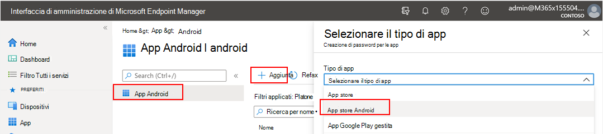

2. Nella pagina **Aggiungi app** e nella sezione *Informazioni app* immetti:On the **Add app** page and in the *App Information* section enter: 

   - **Nome****Name** 
   - **Descrizione****Description**
   - **Publisher** come Microsoft.**Publisher** as Microsoft.
   - **URL dell'App Store** come https://play.google.com/store/apps/details?id=com.microsoft.scmx (DEFENDER for Endpoint app Google Play Store URL)**App store URL** as https://play.google.com/store/apps/details?id=com.microsoft.scmx (Defender for Endpoint app Google Play Store URL) 

   Altri campi sono facoltativi.Other fields are optional. Selezionare **Avanti**.Select **Next**.

   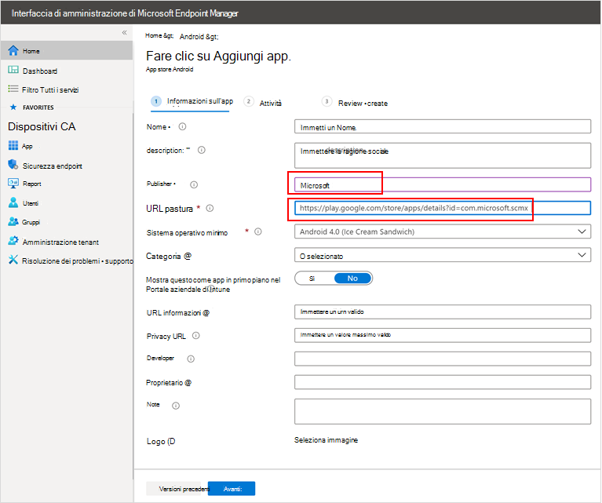

3. Nella sezione *Assegnazioni* passare alla sezione **Obbligatorio** e selezionare **Aggiungi gruppo.**In the *Assignments* section, go to the **Required** section and select **Add group.** Puoi quindi scegliere i gruppi di utenti che vuoi usare come destinazione di Defender per l'app Endpoint su Android.You can then choose the user group(s) that you would like to target Defender for Endpoint on Android app. Scegliere **Seleziona** e quindi **Avanti**.Choose **Select** and then **Next**.

    >[!NOTE]
    >Il gruppo di utenti selezionato deve essere costituito da utenti registrati in Intune.The selected user group should consist of Intune enrolled users.

    > [!div class="mx-imgBorder"]

    > 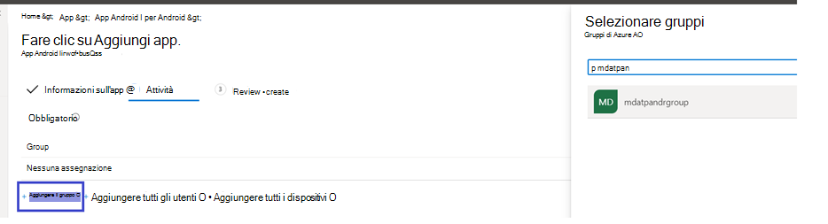

4. Nella sezione **Revisione e creazione** verificare che tutte le informazioni immesse siano corrette e quindi selezionare **Crea**.In the **Review+Create** section, verify that all the information entered is correct and then select **Create**.

    In pochi istanti, l'app Defender for Endpoint viene creata correttamente e viene visualizzata una notifica nell'angolo in alto a destra della pagina.In a few moments, the Defender for Endpoint app would be created successfully, and a notification would show up at the top-right corner of the page.

    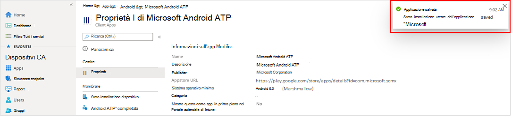

5. Nella pagina delle informazioni sull'app visualizzata, nella sezione **Monitor** seleziona **Stato** installazione dispositivo per verificare che l'installazione del dispositivo sia stata completata correttamente.In the app information page that is displayed, in the **Monitor** section, select **Device install status** to verify that the device installation has completed successfully.

    > [!div class="mx-imgBorder"]
    > 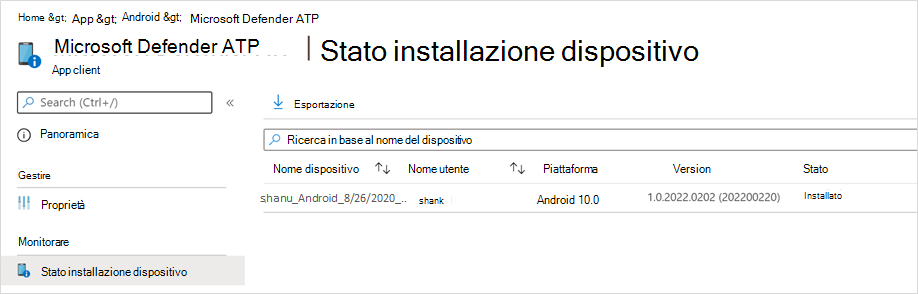

### Completare l'onboarding e controllare lo statoComplete onboarding and check status

1. Dopo aver installato Defender for Endpoint su Android nel dispositivo, vedrai l'icona dell'app.Once Defender for Endpoint on Android has been installed on the device, you'll see the app icon.

    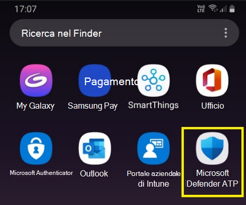

2. Tocca l'icona dell'app Microsoft Defender for Endpoint e segui le istruzioni visualizzate per completare l'onboarding dell'app.Tap the Microsoft Defender for Endpoint app icon and follow the on-screen instructions to complete onboarding the app. I dettagli includono l'accettazione da parte dell'utente finale delle autorizzazioni Android richieste da Defender per Endpoint su Android.The details include end-user acceptance of Android permissions required by Defender for Endpoint on Android.

3. Al completamento dell'onboarding, il dispositivo inizierà a essere visualizzato nell'elenco Dispositivi in Microsoft Defender Security Center.Upon successful onboarding, the device will start showing up on the Devices list in Microsoft Defender Security Center.

    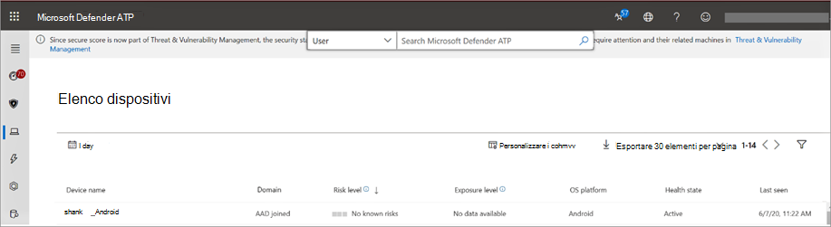

## Distribuire nei dispositivi registrati Android EnterpriseDeploy on Android Enterprise enrolled devices

Defender per Endpoint su Android supporta i dispositivi registrati android Enterprise.Defender for Endpoint on Android supports Android Enterprise enrolled devices.

Per altre informazioni sulle opzioni di registrazione supportate da Intune, vedi [Opzioni di registrazione.](https://docs.microsoft.com/mem/intune/enrollment/android-enroll)For more information on the enrollment options supported by Intune, see [Enrollment Options](https://docs.microsoft.com/mem/intune/enrollment/android-enroll).

**Attualmente, i dispositivi di proprietà personale con profilo di lavoro e le registrazioni di dispositivi utente completamente gestiti di proprietà dell'azienda sono supportati per la distribuzione.****Currently, Personally owned devices with work profile and Corporate-owned fully managed user device enrollments are supported for deployment.**

## Aggiungere Microsoft Defender per Endpoint su Android come app Google Play gestitaAdd Microsoft Defender for Endpoint on Android as a Managed Google Play app

Segui i passaggi seguenti per aggiungere l'app Microsoft Defender for Endpoint al tuo Google Play gestito.Follow the steps below to add Microsoft Defender for Endpoint app into your managed Google Play.

1. [Nell'interfaccia di amministrazione di Microsoft Endpoint Manager,](https://go.microsoft.com/fwlink/?linkid=2109431) vai ad **App** \> **App Android** \> **Aggiungi** e seleziona App Google **Play gestita.**In [Microsoft Endpoint Manager admin center](https://go.microsoft.com/fwlink/?linkid=2109431) , go to **Apps** \> **Android Apps** \> **Add** and select **Managed Google Play app**.

    > [!div class="mx-imgBorder"]
    > 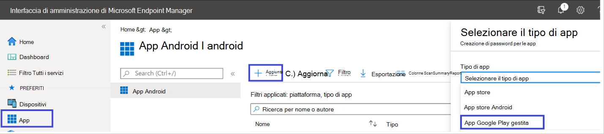

2. Nella pagina gestita di Google Play che viene caricata successivamente, vai alla casella di ricerca e cerca **Microsoft Defender.**On your managed Google Play page that loads subsequently, go to the search box and lookup **Microsoft Defender.** La ricerca dovrebbe visualizzare l'app Microsoft Defender for Endpoint in Managed Google Play.Your search should display the Microsoft Defender for Endpoint app in your Managed Google Play. Fai clic sull'app Microsoft Defender for Endpoint dal risultato della ricerca App.Click on the Microsoft Defender for Endpoint app from the Apps search result.

    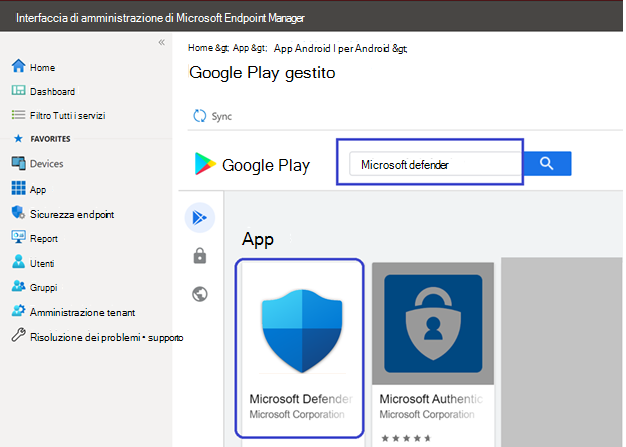

3. Nella pagina Descrizione app che verrà visualizzata successivamente, dovresti essere in grado di visualizzare i dettagli dell'app in Defender for Endpoint.In the App description page that comes up next, you should be able to see app details on Defender for Endpoint. Esaminare le informazioni nella pagina e quindi selezionare **Approva**.Review the information on the page and then select **Approve**.

    > [!div class="mx-imgBorder"]
    > 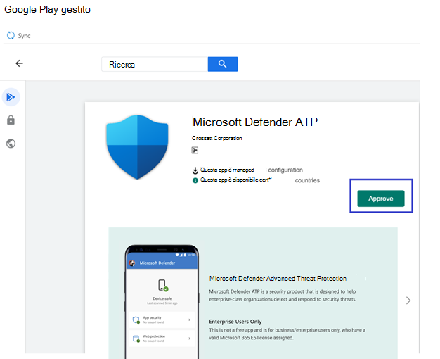

4. Ti verranno presentate le autorizzazioni che Defender for Endpoint ottiene perché funzioni.You'll be presented with the permissions that Defender for Endpoint obtains for it to work. Esaminali e quindi seleziona **Approva**.Review them and then select **Approve**.

    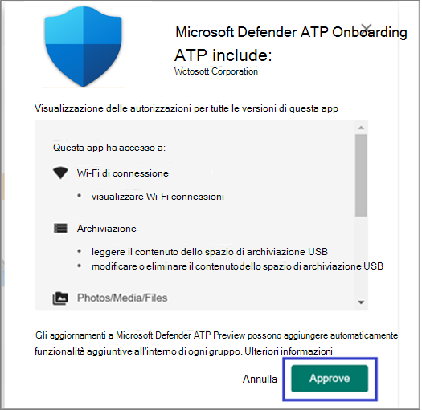

5. Verrà visualizzata la pagina Impostazioni approvazione.You'll be presented with the Approval settings page. La pagina conferma la tua preferenza per gestire le nuove autorizzazioni dell'app che Defender per Endpoint su Android potrebbe richiedere.The page confirms your preference to handle new app permissions that Defender for Endpoint on Android might ask. Esamina le scelte e seleziona l'opzione preferita.Review the choices and select your preferred option. Scegliere **Fatto**.Select **Done**.

    Per impostazione predefinita, google play gestito seleziona *Mantieni approvato quando l'app richiede nuove autorizzazioni*By default, managed Google Play selects *Keep approved when app requests new permissions*

    > [!div class="mx-imgBorder"]
    > 

6. Dopo aver selezionato la gestione delle autorizzazioni, seleziona **Sincronizza** per sincronizzare Microsoft Defender per Endpoint con l'elenco delle app.After the permissions handling selection is made, select **Sync** to sync Microsoft Defender for Endpoint to your apps list.

    > [!div class="mx-imgBorder"]
    > 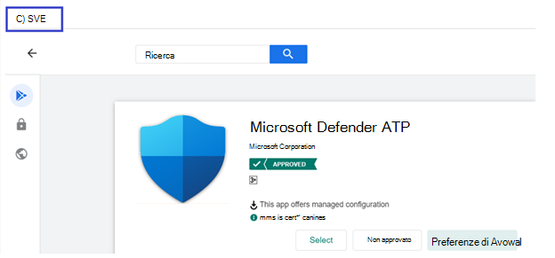

7. La sincronizzazione verrà completata tra pochi minuti.The sync will complete in a few minutes.

    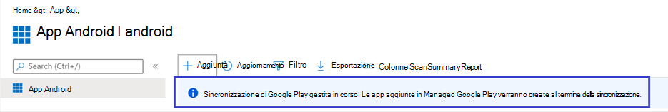

8. Seleziona il **pulsante** Aggiorna nella schermata delle app Android e Microsoft Defender for Endpoint dovrebbe essere visibile nell'elenco delle app.Select the **Refresh** button in the Android apps screen and Microsoft Defender for Endpoint should be visible in the apps list.

    > [!div class="mx-imgBorder"]
    > 

9. Defender for Endpoint supporta i criteri di configurazione delle app per i dispositivi gestiti tramite Intune.Defender for Endpoint supports App configuration policies for managed devices via Intune. Questa funzionalità può essere sfruttata per applicare automaticamente le autorizzazioni Android applicabili, in modo che l'utente finale non deve accettare queste autorizzazioni.This capability can be leveraged to autogrant applicable Android permission(s), so the end user does not need to accept these permission(s).

    1. Nella pagina **App** vai a Criteri > criteri di configurazione **delle app > Aggiungi > dispositivi gestiti**.In the **Apps** page, go to **Policy > App configuration policies > Add > Managed devices**.

       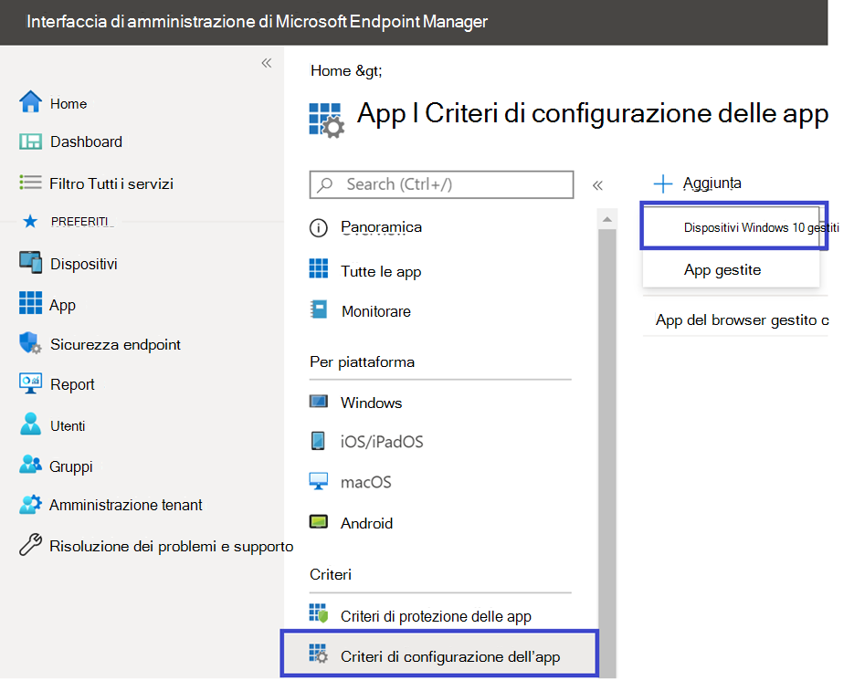

    1. Nella pagina **Crea criteri di configurazione app** immetti i dettagli seguenti:In the **Create app configuration policy** page, enter the following details:
    
        - Nome: Microsoft Defender for Endpoint.Name: Microsoft Defender for Endpoint.
        - Scegli **Android Enterprise** come piattaforma.Choose **Android Enterprise** as platform.
        - Scegliere **Solo profilo di lavoro** come tipo di profilo.Choose **Work Profile only** as Profile Type.
        - Fai **clic su Seleziona app,** scegli Microsoft Defender **ATP,** **seleziona OK** e quindi **Avanti.**Click **Select App**, choose **Microsoft Defender ATP**, select **OK** and then **Next**.
    
        > [!div class="mx-imgBorder"]
        > 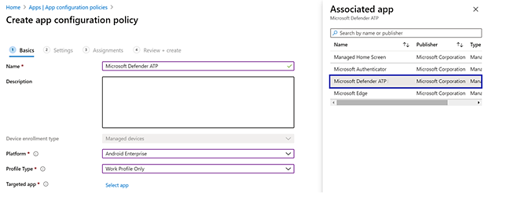

    1. Nella pagina **Impostazioni** passare alla sezione Autorizzazioni fare clic su Aggiungi per visualizzare l'elenco delle autorizzazioni supportate.In the **Settings** page, go to the Permissions section click on Add to view the list of supported permissions. Nella sezione Aggiungi autorizzazioni selezionare le autorizzazioni seguenti:In the Add Permissions section, select the following permissions:

       - Archiviazione esterna (lettura)External storage (read)
       - Archiviazione esterna (scrittura)External storage (write)

       Infine scegliere **OK**.Then select **OK**.

       > [!div class="mx-imgBorder"]
      > 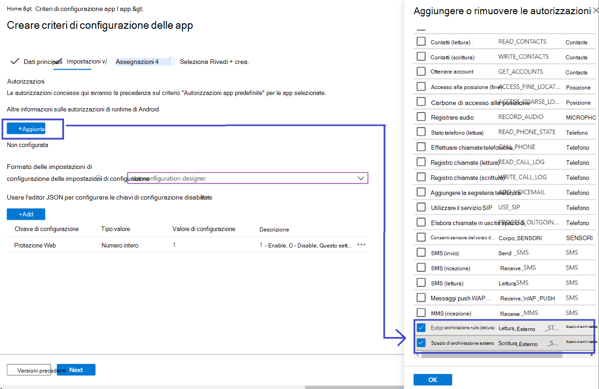

    1. A questo punto dovrebbero essere elencate entrambe le autorizzazioni e ora è possibile eseguire l'autogrant entrambe scegliendo autogrant nell'elenco **a** discesa Stato autorizzazione e quindi **selezionare Avanti.**You should now see both the permissions listed and now you can autogrant both by choosing autogrant in the **Permission state** drop-down and then select **Next**.

       > [!div class="mx-imgBorder"]
       > 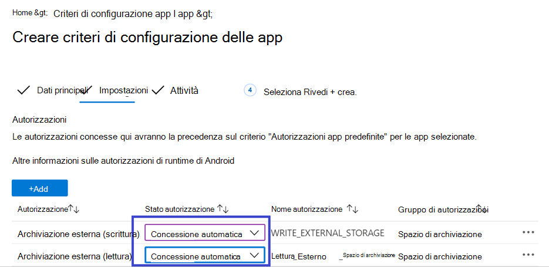

    1. Nella pagina **Assegnazioni** seleziona il gruppo di utenti a cui verrebbe assegnato questo criterio di configurazione dell'app.In the **Assignments** page, select the user group to which this app config policy would be assigned to. Fare **clic su Seleziona gruppi per includere** e selezionare il gruppo applicabile e quindi selezionare **Avanti.**Click **Select groups to include** and selecting the applicable group and then selecting **Next**.  Il gruppo selezionato qui è in genere lo stesso gruppo a cui assegni Microsoft Defender per l'app Endpoint Android.The group selected here is usually the same group to which you would assign Microsoft Defender for Endpoint Android app. 

       > [!div class="mx-imgBorder"]
       > 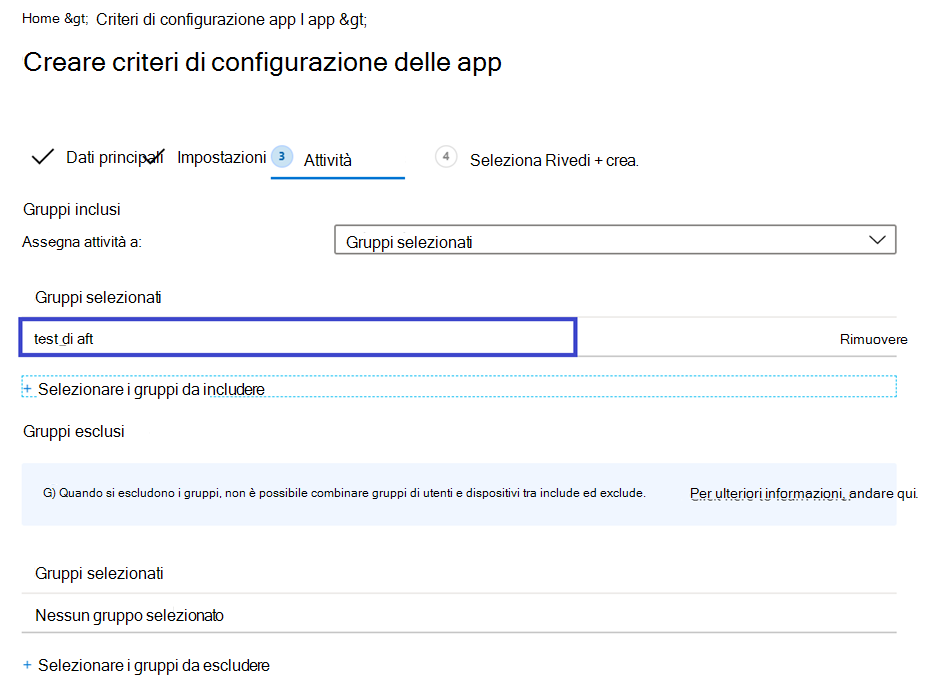
    

     1. Nella pagina **Revisione e creazione** visualizzata successivamente, esaminare tutte le informazioni e quindi selezionare **Crea**.In the **Review + Create** page that comes up next, review all the information and then select **Create**.  
    
        I criteri di configurazione dell'app per Defender per Endpoint che esereranno automaticamente l'autorizzazione di archiviazione vengono ora assegnati al gruppo di utenti selezionato.The app configuration policy for Defender for Endpoint autogranting the storage permission is now assigned to the selected user group.

        > [!div class="mx-imgBorder"]
        > 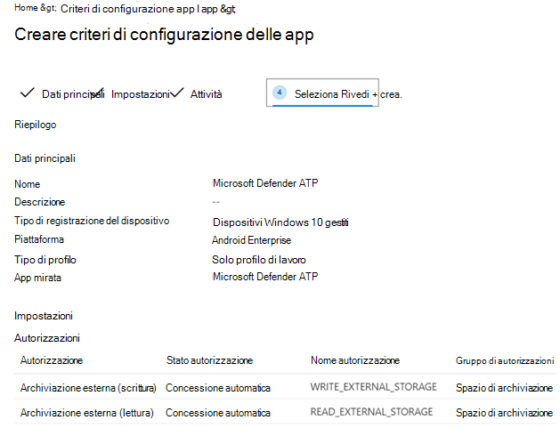

10. Seleziona **App Microsoft Defender ATP** nell'elenco \> **Proprietà** \> **Assegnazioni** \> **Modifica**.Select **Microsoft Defender ATP** app in the list \> **Properties** \> **Assignments** \> **Edit**.

    

11. Assegna l'app come app *Obbligatoria* a un gruppo di utenti.Assign the app as a *Required* app to a user group. Viene installato automaticamente nel profilo *di lavoro* durante la successiva sincronizzazione del dispositivo tramite l'app Portale aziendale.It is automatically installed in the *work profile* during the next sync of the device via Company Portal app. Per eseguire questa assegnazione, passare  alla sezione Obbligatorio \> **Aggiungi,** selezionare il gruppo di utenti e fare clic su **Seleziona.**This assignment can be done by navigating to the *Required* section \> **Add group,** selecting the user group and click **Select**.

    > [!div class="mx-imgBorder"]
    > 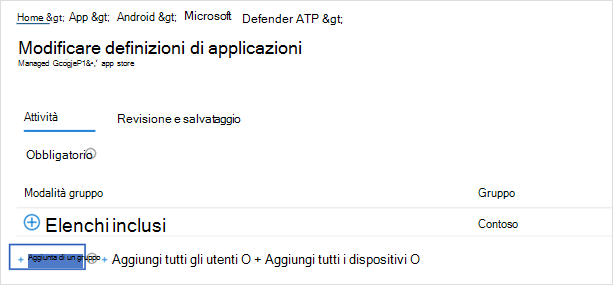

12. Nella pagina **Modifica** applicazione esaminare tutte le informazioni immesse in precedenza.In the **Edit Application** page, review all the information that was entered above. Seleziona quindi **Rivedi + Salva** e quindi **salva di** nuovo per iniziare l'assegnazione.Then select **Review + Save** and then **Save** again to commence assignment.

### Configurazione automatica della VPN always-onAuto Setup of Always-on VPN 
Defender for Endpoint supporta i criteri di configurazione dei dispositivi per i dispositivi gestiti tramite Intune.Defender for Endpoint supports Device configuration policies for managed devices via Intune. Questa funzionalità può essere sfruttata per la configurazione automatica della **VPN Always-on** nei dispositivi registrati android Enterprise, quindi l'utente finale non deve configurare il servizio VPN durante l'onboarding.This capability can be leveraged to **Auto setup of Always-on VPN** on Android Enterprise enrolled devices, so the end user does not need to set up VPN service while onboarding.
1.  In **Dispositivi** seleziona Profili **di configurazione** Crea piattaforma profilo Android Enterprise Seleziona restrizioni dispositivo in una delle seguenti  >    >    >   condizioni, in base al tipo di registrazione del dispositivo On **Devices**, select **Configuration Profiles** > **Create Profile** > **Platform** > **Android Enterprise** Select **Device restrictions** under one of the following, based on your device enrollment type 
- **Profilo di lavoro completamente gestito, dedicato e Corporate-Owned aziendale****Fully Managed, Dedicated, and Corporate-Owned Work Profile**
- **Profilo di lavoro di proprietà personale****Personally owned Work Profile**

Selezionare **Crea**.Select **Create**.
 
   > 
    
2. **Impostazioni di configurazione** Specificare un **nome e** una **descrizione per** identificare in modo univoco il profilo di configurazione.**Configuration Settings** Provide a **Name** and a **Description** to uniquely identify the configuration profile. 

   > 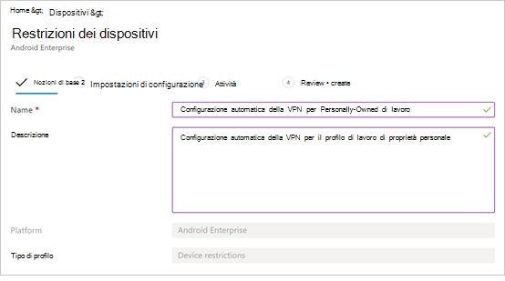
   
 3. Selezionare **Connettività** e configurare VPN:Select **Connectivity** and configure VPN:
- Abilita **Configurazione VPN always-on** un client VPN nel profilo di lavoro per connettersi e riconnettersi automaticamente alla VPN quando possibile.Enable **Always-on VPN** Setup a VPN client in the work profile to automatically connect and reconnect to the VPN whenever possible. È possibile configurare un solo client VPN per la VPN always-on in un determinato dispositivo, quindi assicurati di non distribuire più di un criterio VPN always-on in un singolo dispositivo.Only one VPN client can be configured for always-on VPN on a given device, so be sure to have no more than one always-on VPN policy deployed to a single device. 
- Selezionare **Personalizzato** nell'elenco a discesa client VPN Vpn personalizzata in questo caso è Defender for Endpoint VPN che viene usato per fornire la funzionalità di protezione Web.Select **Custom** in VPN client dropdown list Custom VPN in this case is Defender for Endpoint VPN which is used to provide the Web Protection feature. 
    > [!NOTE]
    > L'app Microsoft Defender for Endpoint deve essere installata nel dispositivo dell'utente per poter funzionare con la configurazione automatica di questa VPN.Microsoft Defender for Endpoint app must be installed on user’s device, in order to functioning of auto setup of this VPN.

- Immetti **l'ID** pacchetto dell'app Microsoft Defender for Endpoint in Google Play Store.Enter **Package ID** of the Microsoft Defender for Endpoint app in Google Play store. Per l'URL dell'app Defender https://play.google.com/store/apps/details?id=com.microsoft.scmx , l'ID pacchetto è **com.microsoft.scmx**For the Defender app URL https://play.google.com/store/apps/details?id=com.microsoft.scmx, Package ID is **com.microsoft.scmx**  
- **Modalità di blocco** Non configurato (predefinito)**Lockdown mode** Not configured (Default) 

     
   
4. **Assegnazione** Nella pagina  **Assegnazioni** seleziona il gruppo di utenti a cui verrebbe assegnato questo criterio   di configurazione dell'app.**Assignment** In the **Assignments** page, select the user group to which this app config policy would be assigned to. Fare **clic su Seleziona gruppi** da includere e selezionare il gruppo applicabile e quindi fare clic su **Avanti.**Click **Select groups** to include and selecting the applicable group and then click **Next**. Il gruppo selezionato qui è in genere lo stesso gruppo a cui assegni Microsoft Defender per l'app Endpoint Android.The group selected here is usually the same group to which you would assign Microsoft Defender for Endpoint Android app. 

     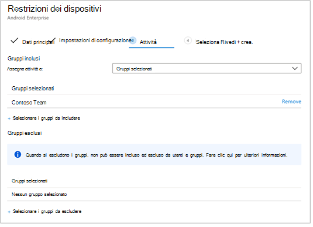

5. Nella pagina **Revisione e creazione** visualizzata successivamente, esaminare tutte le informazioni e quindi selezionare **Crea**.In the **Review + Create** page that comes up next, review all the information and then select **Create**. Il profilo di configurazione del dispositivo è ora assegnato al gruppo di utenti selezionato.The device configuration profile is now assigned to the selected user group.    

    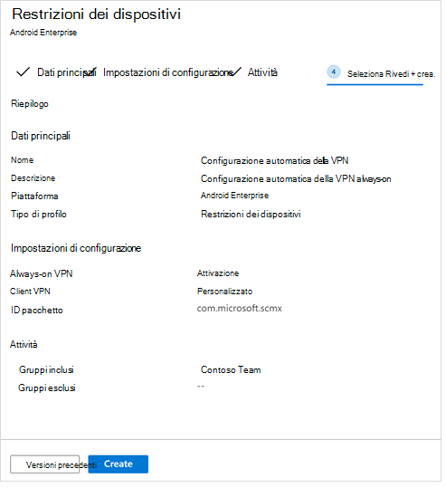

## Completare l'onboarding e controllare lo statoComplete onboarding and check status

1. Confermare lo stato di installazione di Microsoft Defender per Endpoint su Android facendo clic su **Stato installazione dispositivo**.Confirm the installation status of Microsoft Defender for Endpoint on Android by clicking on the **Device Install Status**. Verifica che il dispositivo sia visualizzato qui.Verify that the device is displayed here.

    > [!div class="mx-imgBorder"]
    > 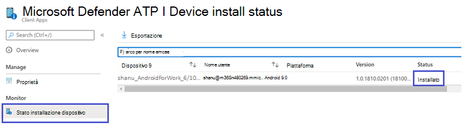

2. Nel dispositivo puoi convalidare lo stato di onboarding andando al **profilo di lavoro**.On the device, you can validate the onboarding status by going to the **work profile**. Verifica che Defender for Endpoint sia disponibile e che tu sia registrato nei dispositivi di proprietà **personale con profilo di lavoro.**Confirm that Defender for Endpoint is available and that you are enrolled to the **Personally owned devices with work profile**.  Se sei registrato in un dispositivo utente completamente gestito di proprietà dell'azienda, nel dispositivo sarà disponibile un singolo profilo in cui puoi verificare che Defender for Endpoint sia disponibile.If you are enrolled to a **Corporate-owned, fully managed user device**, you will have a single profile on the device where you can confirm that Defender for Endpoint is available.

    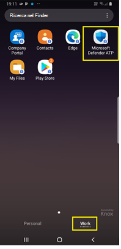

3. Quando l'app è installata, apri l'app e accetta le autorizzazioni e quindi l'onboarding dovrebbe avere esito positivo.When the app is installed, open the app and accept the permissions and then your onboarding should be successful.

    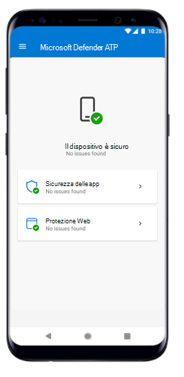

4. In questa fase il dispositivo viene correttamente onboarded su Defender per Endpoint su Android.At this stage the device is successfully onboarded onto Defender for Endpoint on Android. Puoi verificarlo in [Microsoft Defender Security Center](https://securitycenter.microsoft.com) accedendo alla **pagina** Dispositivi.You can verify this on the [Microsoft Defender Security Center](https://securitycenter.microsoft.com) by navigating to the **Devices** page.

    

## Argomenti correlatiRelated topics
- [Panoramica di Microsoft Defender per Endpoint su AndroidOverview of Microsoft Defender for Endpoint on Android](microsoft-defender-endpoint-android.md)
- [Configurare funzionalità di Microsoft Defender per Endpoint su funzionalità AndroidConfigure Microsoft Defender for Endpoint on Android features](android-configure.md)
