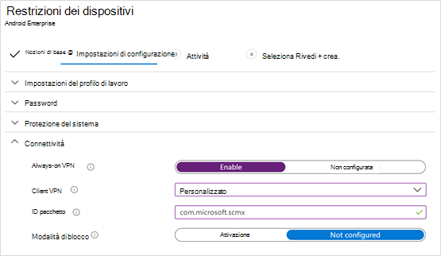

# Distribuzione di Microsoft Defender per Endpoint per Android con Microsoft Intune 

[!INCLUDE [Microsoft 365 Defender rebranding](../../includes/microsoft-defender.md)]

**Si applica a:**
- [Microsoft Defender per endpoint](https://go.microsoft.com/fwlink/p/?linkid=2154037)
- [Microsoft 365 Defender](https://go.microsoft.com/fwlink/?linkid=2118804)

> Vuoi provare Microsoft Defender per Endpoint? [Iscriversi per una versione di valutazione gratuita.](https://www.microsoft.com/microsoft-365/windows/microsoft-defender-atp?ocid=docs-wdatp-exposedapis-abovefoldlink) 

Scopri come distribuire Defender per Endpoint in Android Portale aziendale Intune dispositivi registrati. Per altre informazioni sulla registrazione dei dispositivi Intune, vedi [Registrare il dispositivo.](/mem/intune/user-help/enroll-device-android-company-portal)

> [!NOTE]
> **Defender for Endpoint su Android è ora disponibile su [Google Play](https://play.google.com/store/apps/details?id=com.microsoft.scmx)**  
> Puoi connetterti a Google Play da Intune per distribuire l'app Defender per Endpoint nelle modalità di entrollment Enterprise Android.
Gli aggiornamenti dell'app sono automatici tramite Google Play.

## Distribuire nei dispositivi registrati dall'amministratore di dispositivi

**Distribuire Defender per Endpoint su Android in Portale aziendale Intune - Dispositivi registrati dall'amministratore del dispositivo**

Scopri come distribuire Defender per Endpoint in Android Portale aziendale Intune - Dispositivi registrati dall'amministratore del dispositivo. 

### Aggiungi come app di Android Store

1. In [Microsoft Endpoint Manager di amministrazione,](https://go.microsoft.com/fwlink/?linkid=2109431) vai ad **App** \> **App Android** Aggiungi app di Android \> **\> Store** e scegli **Seleziona**.

   

2. Nella pagina **Aggiungi app** e nella sezione *Informazioni app* immetti: 

   - **Nome** 
   - **Descrizione**
   - **Publisher** microsoft.
   - **URL dell'App Store** come https://play.google.com/store/apps/details?id=com.microsoft.scmx (DEFENDER for Endpoint app Google Play Store URL) 

   Altri campi sono facoltativi. Selezionare **Avanti**.

   

3. Nella sezione *Assegnazioni* passare alla sezione **Obbligatorio** e selezionare **Aggiungi gruppo.** Puoi quindi scegliere i gruppi di utenti che vuoi usare come destinazione di Defender per l'app Endpoint su Android. Scegliere **Seleziona** e quindi **Avanti**.

    >[!NOTE]
    >Il gruppo di utenti selezionato deve essere costituito da utenti registrati in Intune.

    > [!div class="mx-imgBorder"]

    > 

4. Nella sezione **Revisione e creazione** verificare che tutte le informazioni immesse siano corrette e quindi selezionare **Crea**.

    In pochi istanti, l'app Defender for Endpoint viene creata correttamente e viene visualizzata una notifica nell'angolo in alto a destra della pagina.

    

5. Nella pagina delle informazioni sull'app visualizzata, nella sezione **Monitor** seleziona **Stato** installazione dispositivo per verificare che l'installazione del dispositivo sia stata completata correttamente.

    > [!div class="mx-imgBorder"]
    > 

### Completare l'onboarding e controllare lo stato

1. Dopo aver installato Defender for Endpoint su Android nel dispositivo, vedrai l'icona dell'app.

    

2. Tocca l'icona dell'app Microsoft Defender for Endpoint e segui le istruzioni visualizzate per completare l'onboarding dell'app. I dettagli includono l'accettazione da parte dell'utente finale delle autorizzazioni Android richieste da Defender per Endpoint su Android.

3. Al completamento dell'onboarding, il dispositivo inizierà a essere visualizzato nell'elenco Dispositivi Microsoft Defender Security Center.

    

## Distribuire su dispositivi android Enterprise registrati

Defender per Endpoint su Android supporta dispositivi Android Enterprise registrati.

Per altre informazioni sulle opzioni di registrazione supportate da Intune, vedi [Opzioni di registrazione.](/mem/intune/enrollment/android-enroll)

**Attualmente, i dispositivi di proprietà personale con profilo di lavoro e le registrazioni di dispositivi utente completamente gestiti di proprietà dell'azienda sono supportati per la distribuzione.**

## Aggiungere Microsoft Defender per Endpoint su Android come app Google Play gestita

Segui i passaggi seguenti per aggiungere l'app Microsoft Defender for Endpoint al tuo Google Play gestito.

1. In [Microsoft Endpoint Manager di amministrazione,](https://go.microsoft.com/fwlink/?linkid=2109431) vai ad **App** \> **App Android** \> **Aggiungi** e seleziona App Google **Play gestita.**

    > [!div class="mx-imgBorder"]
    > 

2. Nella pagina gestita di Google Play che viene caricata successivamente, vai alla casella di ricerca e cerca **Microsoft Defender.** La ricerca dovrebbe visualizzare l'app Microsoft Defender for Endpoint in Managed Google Play. Fai clic sull'app Microsoft Defender for Endpoint dal risultato della ricerca App.

    

3. Nella pagina Descrizione app che verrà visualizzata successivamente, dovresti essere in grado di visualizzare i dettagli dell'app in Defender for Endpoint. Esaminare le informazioni nella pagina e quindi selezionare **Approva**.

    > [!div class="mx-imgBorder"]
    > 

4. Ti verranno presentate le autorizzazioni che Defender for Endpoint ottiene perché funzioni. Esaminali e quindi seleziona **Approva**.

    

5. Verrà visualizzata la pagina Impostazioni approvazione. La pagina conferma la tua preferenza per gestire le nuove autorizzazioni dell'app che Defender per Endpoint su Android potrebbe richiedere. Esamina le scelte e seleziona l'opzione preferita. Scegliere **Fine**.

    Per impostazione predefinita, google play gestito seleziona *Mantieni approvato quando l'app richiede nuove autorizzazioni*

    > [!div class="mx-imgBorder"]
    > 

6. Dopo aver selezionato la gestione delle autorizzazioni, seleziona **Sincronizza** per sincronizzare Microsoft Defender per Endpoint con l'elenco delle app.

    > [!div class="mx-imgBorder"]
    > 

7. La sincronizzazione verrà completata tra pochi minuti.

    

8. Seleziona il **pulsante** Aggiorna nella schermata delle app Android e Microsoft Defender for Endpoint dovrebbe essere visibile nell'elenco delle app.

    > [!div class="mx-imgBorder"]
    > 

9. Defender for Endpoint supporta i criteri di configurazione delle app per i dispositivi gestiti tramite Intune. Questa funzionalità può essere sfruttata per applicare automaticamente le autorizzazioni Android applicabili, in modo che l'utente finale non deve accettare queste autorizzazioni.

    1. Nella pagina **App** vai a Criteri > criteri di configurazione **delle app > Aggiungi > dispositivi gestiti**.

       

    1. Nella pagina **Crea criteri di configurazione app** immetti i dettagli seguenti:
    
        - Nome: Microsoft Defender for Endpoint.
        - Scegli **Android Enterprise** come piattaforma.
        - Scegliere **Solo profilo di lavoro** come tipo di profilo.
        - Fai **clic su Seleziona app,** scegli **Microsoft Defender ATP,** seleziona **OK** e quindi **Avanti.**
    
        > [!div class="mx-imgBorder"]
        > 

    1. Nella pagina **Impostazioni,** andare alla sezione Autorizzazioni fare clic su Aggiungi per visualizzare l'elenco delle autorizzazioni supportate. Nella sezione Aggiungi autorizzazioni selezionare le autorizzazioni seguenti:

       - Archiviazione esterna (lettura)
       - Archiviazione esterna (scrittura)

       Infine scegliere **OK**.

       > [!div class="mx-imgBorder"]
      > 

    1. A questo punto dovrebbero essere elencate entrambe le autorizzazioni e ora è possibile eseguire l'autogrant entrambe scegliendo autogrant nell'elenco **a** discesa Stato autorizzazione e quindi **selezionare Avanti.**

       > [!div class="mx-imgBorder"]
       > 

    1. Nella pagina **Assegnazioni** seleziona il gruppo di utenti a cui verrebbe assegnato questo criterio di configurazione dell'app. Fare **clic su Seleziona gruppi per includere** e selezionare il gruppo applicabile e quindi selezionare **Avanti.**  Il gruppo selezionato qui è in genere lo stesso gruppo a cui assegni Microsoft Defender per l'app Endpoint Android. 

       > [!div class="mx-imgBorder"]
       > 
    

     1. Nella pagina **Revisione e creazione** visualizzata successivamente, esaminare tutte le informazioni e quindi selezionare **Crea**.  
    
        I criteri di configurazione dell'app per Defender per Endpoint che esereranno automaticamente l'autorizzazione di archiviazione vengono ora assegnati al gruppo di utenti selezionato.

        > [!div class="mx-imgBorder"]
        > 

10. Selezionare **Microsoft Defender ATP app** nell'elenco \> **Proprietà** \> **Assegnazioni** \> **Modifica**.

    

11. Assegna l'app come app *Obbligatoria* a un gruppo di utenti. Viene installato automaticamente nel profilo *di lavoro* durante la successiva sincronizzazione del dispositivo tramite Portale aziendale app. Per eseguire questa assegnazione, passare  alla sezione Obbligatorio \> **Aggiungi,** selezionare il gruppo di utenti e fare clic su **Seleziona.**

    > [!div class="mx-imgBorder"]
    > 

12. Nella pagina **Modifica** applicazione esaminare tutte le informazioni immesse in precedenza. Seleziona quindi **Rivedi + Salva** e quindi **salva di** nuovo per iniziare l'assegnazione.

### Configurazione automatica della VPN always-on 
Defender for Endpoint supporta i criteri di configurazione dei dispositivi per i dispositivi gestiti tramite Intune. Questa funzionalità può essere sfruttata per la configurazione automatica della **VPN Always-on** nei dispositivi registrati Enterprise Android, quindi l'utente finale non deve configurare il servizio VPN durante l'onboarding.
1.  In **Dispositivi** seleziona **Profili** di configurazione Crea piattaforma profilo Android Enterprise Seleziona restrizioni dispositivo in una delle  >    >    >   opzioni seguenti,  in base al tipo di registrazione del dispositivo 
- **Profilo di lavoro completamente gestito, dedicato e Corporate-Owned aziendale**
- **Profilo di lavoro di proprietà personale**

Selezionare **Crea**.
 
   > 
    
2. **Configurazione Impostazioni** Specificare un **nome e** una **descrizione per** identificare in modo univoco il profilo di configurazione. 

   > 
   
 3. Selezionare **Connettività** e configurare VPN:
- Abilita **Configurazione VPN always-on** un client VPN nel profilo di lavoro per connettersi e riconnettersi automaticamente alla VPN quando possibile. È possibile configurare un solo client VPN per la VPN always-on in un determinato dispositivo, quindi assicurati di non distribuire più di un criterio VPN always-on in un singolo dispositivo. 
- Selezionare **Personalizzato** nell'elenco a discesa client VPN Vpn personalizzata in questo caso è Defender for Endpoint VPN che viene usato per fornire la funzionalità di protezione Web. 
    > [!NOTE]
    > L'app Microsoft Defender for Endpoint deve essere installata nel dispositivo dell'utente per poter funzionare con la configurazione automatica di questa VPN.

- Immetti **l'ID** pacchetto dell'app Microsoft Defender for Endpoint in Google Play Store. Per l'URL dell'app Defender https://play.google.com/store/apps/details?id=com.microsoft.scmx , l'ID pacchetto è **com.microsoft.scmx**  
- **Modalità di blocco** Non configurato (predefinito) 

     
   
4. **Assegnazione** Nella pagina  **Assegnazioni** seleziona il gruppo di utenti a cui verrebbe assegnato questo criterio   di configurazione dell'app. Fare **clic su Seleziona gruppi** da includere e selezionare il gruppo applicabile e quindi fare clic su **Avanti.** Il gruppo selezionato qui è in genere lo stesso gruppo a cui assegni Microsoft Defender per l'app Endpoint Android. 

     

5. Nella pagina **Revisione e creazione** visualizzata successivamente, esaminare tutte le informazioni e quindi selezionare **Crea**. Il profilo di configurazione del dispositivo è ora assegnato al gruppo di utenti selezionato.    

    

## Completare l'onboarding e controllare lo stato

1. Confermare lo stato di installazione di Microsoft Defender per Endpoint su Android facendo clic su **Stato installazione dispositivo**. Verifica che il dispositivo sia visualizzato qui.

    > [!div class="mx-imgBorder"]
    > 

2. Nel dispositivo puoi convalidare lo stato di onboarding andando al **profilo di lavoro**. Verifica che Defender for Endpoint sia disponibile e che tu sia registrato nei dispositivi di proprietà **personale con profilo di lavoro.**  Se sei registrato in un dispositivo utente completamente gestito di proprietà dell'azienda, nel dispositivo sarà disponibile un singolo profilo in cui puoi verificare che Defender for Endpoint sia disponibile.

    

3. Quando l'app è installata, apri l'app e accetta le autorizzazioni e quindi l'onboarding dovrebbe avere esito positivo.

    

4. In questa fase il dispositivo viene correttamente onboarded su Defender per Endpoint su Android. Puoi verificarlo nel [Microsoft Defender Security Center](https://securitycenter.microsoft.com) accedendo alla **pagina** Dispositivi.

    

## Argomenti correlati
- [Panoramica di Microsoft Defender per Endpoint su Android](microsoft-defender-endpoint-android.md)
- [Configurare funzionalità di Microsoft Defender per Endpoint su funzionalità Android](android-configure.md)
