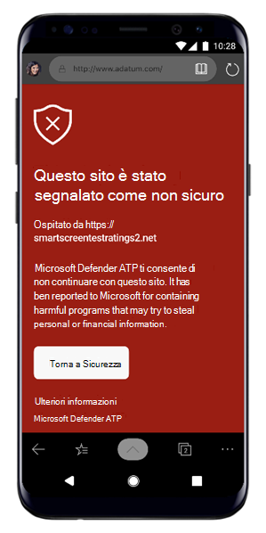

# Risoluzione dei problemi in Microsoft Defender per Endpoint su AndroidTroubleshooting issues on Microsoft Defender for Endpoint on Android

[!INCLUDE [Microsoft 365 Defender rebranding](../../includes/microsoft-defender.md)]

**Si applica a:****Applies to:**
- [Microsoft Defender per endpointMicrosoft Defender for Endpoint](https://go.microsoft.com/fwlink/p/?linkid=2154037)
- [Microsoft 365 DefenderMicrosoft 365 Defender](https://go.microsoft.com/fwlink/?linkid=2118804)

> Vuoi provare Microsoft Defender per Endpoint?Want to experience Microsoft Defender for Endpoint? [Iscriversi per una versione di valutazione gratuita.Sign up for a free trial.](https://www.microsoft.com/microsoft-365/windows/microsoft-defender-atp?ocid=docs-wdatp-exposedapis-abovefoldlink) 

Quando si esegue l'onboarding di un dispositivo, potrebbero verificarsi problemi di accesso dopo l'installazione dell'app.When onboarding a device, you might see sign in issues after the app is installed.

Durante l'onboarding, potresti riscontrare problemi di accesso dopo l'installazione dell'app nel dispositivo.During onboarding, you might encounter sign in issues after the app is installed on your device.

In questo articolo vengono fornite soluzioni per risolvere i problemi di accesso.This article provides solutions to help address the sign-on issues.  

## Accesso non riuscito - Errore imprevistoSign in failed - unexpected error
**Accesso non riuscito: errore** *imprevisto, riprovare in un secondo momento***Sign in failed:** *Unexpected error, try later*

**Messaggio:****Message:**

Errore imprevisto, riprovare in un secondo momentoUnexpected error, try later

**Causa:****Cause:**

Hai una versione precedente dell'app "Microsoft Authenticator" installata nel dispositivo.You have an older version of "Microsoft Authenticator" app installed on your device.

**Soluzione:****Solution:**

Installare la versione più recente [e Microsoft Authenticator](https://play.google.com/store/apps/details?androidid=com.azure.authenticator) da Google Play Store e riprovareInstall latest version and of [Microsoft Authenticator](https://play.google.com/store/apps/details?androidid=com.azure.authenticator) from Google Play Store and try again

## Accesso non riuscito - Licenza non validaSign in failed - invalid license

**Accesso non riuscito: licenza** *non valida, contattare l'amministratore***Sign in failed:** *Invalid license, please contact administrator*

**Messaggio: Licenza** *non valida, contattare l'amministratore***Message:** *Invalid license, please contact administrator*

**Causa:****Cause:**

Non è stata assegnata Microsoft 365 licenza oppure l'organizzazione non dispone di una licenza per Microsoft 365 Enterprise abbonamento.You do not have Microsoft 365 license assigned, or your organization does not have a license for Microsoft 365 Enterprise subscription.

**Soluzione:****Solution:**

Contattare l'amministratore per assistenza.Contact your administrator for help.

## Segnala sito non sicuroReport unsafe site

I siti Web di phishing rappresentano siti Web attendibili allo scopo di ottenere informazioni personali o finanziarie.Phishing websites impersonate trustworthy websites for the purpose of obtaining your personal or financial information. Visitare la [pagina Fornire commenti e](https://www.microsoft.com/wdsi/filesubmission/exploitguard/networkprotection) suggerimenti sulla protezione di rete se si desidera segnalare un sito Web che potrebbe essere un sito di phishing.Visit the [Provide feedback about network protection](https://www.microsoft.com/wdsi/filesubmission/exploitguard/networkprotection) page if you want to report a website that could be a phishing site.

## Le pagine di phishing non vengono bloccate in alcuni dispositivi OEMPhishing pages aren't blocked on some OEM devices

**Si applica a:** Solo OEM specifici**Applies to:** Specific OEMs only

-   **Xiaomi****Xiaomi**

Phishing e minacce Web dannose rilevate da Defender per Endpoint per Android non sono bloccate in alcuni dispositivi Xiaomi.Phishing and harmful web threats that are detected by Defender for Endpoint for Android are not blocked on some Xiaomi devices. La funzionalità seguente non funziona su questi dispositivi.The following functionality doesn't work on these devices.

**Causa:****Cause:**

I dispositivi Xiaomi includono un nuovo modello di autorizzazione.Xiaomi devices include a new permission model. Ciò impedisce a Defender per Endpoint per Android di visualizzare le finestre popup mentre viene eseguito in background.This prevents Defender for Endpoint for Android from displaying pop-up windows while it runs in the background.

Autorizzazione per i dispositivi Xiaomi: "Visualizza le finestre popup durante l'esecuzione in background".Xiaomi devices permission: "Display pop-up windows while running in the background."

**Soluzione:****Solution:**

Abilita l'autorizzazione necessaria nei dispositivi Xiaomi.Enable the required permission on Xiaomi devices.

- Visualizzare le finestre popup durante l'esecuzione in background.Display pop-up windows while running in the background.
