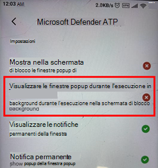

# Risoluzione dei problemi in Microsoft Defender per Endpoint per Android

[!INCLUDE [Microsoft 365 Defender rebranding](../../includes/microsoft-defender.md)]

**Si applica a:**
- [Microsoft Defender ATP](https://go.microsoft.com/fwlink/p/?linkid=2154037)
- [Microsoft 365 Defender](https://go.microsoft.com/fwlink/?linkid=2118804)

> Vuoi provare Microsoft Defender per Endpoint? [Iscriversi per una versione di valutazione gratuita.](https://www.microsoft.com/microsoft-365/windows/microsoft-defender-atp?ocid=docs-wdatp-exposedapis-abovefoldlink) 

Quando si esegue l'onboarding di un dispositivo, potrebbero verificarsi problemi di accesso dopo l'installazione dell'app.

Durante l'onboarding, potresti riscontrare problemi di accesso dopo l'installazione dell'app nel dispositivo.

In questo articolo vengono fornite soluzioni per risolvere i problemi di accesso.  

## Accesso non riuscito - Errore imprevisto
**Accesso non riuscito: errore** *imprevisto, riprovare in un secondo momento*

**Messaggio:**

Errore imprevisto, riprovare in un secondo momento

**Causa:**

Nel dispositivo è installata una versione precedente dell'app "Microsoft Authenticator".

**Soluzione:**

Installare la versione più recente e [di Microsoft Authenticator](https://play.google.com/store/apps/details?androidid=com.azure.authenticator) da Google Play Store e riprovare

## Accesso non riuscito - Licenza non valida

**Accesso non riuscito: licenza** *non valida, contattare l'amministratore*

**Messaggio: Licenza** *non valida, contattare l'amministratore*

**Causa:**

Non si dispone di una licenza di Microsoft 365 assegnata o l'organizzazione non dispone di una licenza per l'abbonamento a Microsoft 365 Enterprise.

**Soluzione:**

Contattare l'amministratore per assistenza.

## Le pagine di phishing non vengono bloccate in alcuni dispositivi OEM

**Si applica a:** Solo OEM specifici

-   **Xiaomi**

Phishing e minacce Web dannose rilevate da Defender per Endpoint per Android non sono bloccate in alcuni dispositivi Xiaomi. La funzionalità seguente non funziona su questi dispositivi.

**Causa:**

I dispositivi Xiaomi includono un nuovo modello di autorizzazione. Ciò impedisce a Defender per Endpoint per Android di visualizzare le finestre popup mentre viene eseguito in background.

Autorizzazione per i dispositivi Xiaomi: "Visualizza le finestre popup durante l'esecuzione in background".

**Soluzione:**

Abilita l'autorizzazione necessaria nei dispositivi Xiaomi.

- Visualizzare le finestre popup durante l'esecuzione in background.
