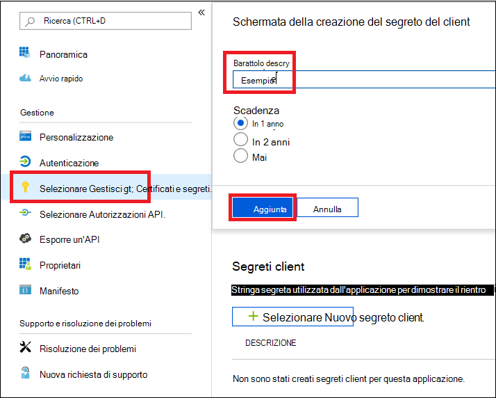

# <a name="microsoft-defender-for-endpoint-api---hello-world"></a>API di Microsoft Defender per endpoint - Hello World 

[!INCLUDE [Microsoft 365 Defender rebranding](../../includes/microsoft-defender.md)]


**Si applica a:** 
- [Microsoft Defender per endpoint](https://go.microsoft.com/fwlink/?linkid=2154037)


- Vuoi provare Microsoft Defender per Endpoint? [Iscriversi per una versione di valutazione gratuita.](https://www.microsoft.com/microsoft-365/windows/microsoft-defender-atp?ocid=docs-wdatp-exposedapis-abovefoldlink) 

[!include[Microsoft Defender for Endpoint API URIs for US Government](../../includes/microsoft-defender-api-usgov.md)]

[!include[Improve request performance](../../includes/improve-request-performance.md)]


## <a name="get-alerts-using-a-simple-powershell-script"></a>Ottenere avvisi con un semplice script di PowerShell

### <a name="how-long-it-takes-to-go-through-this-example"></a>Quanto tempo è necessario per eseguire questo esempio?
L'operazione richiede solo 5 minuti in due passaggi:
- Registrazione dell'applicazione
- Esempi di utilizzo: richiede solo copia/incolla di uno script di PowerShell breve

### <a name="do-i-need-a-permission-to-connect"></a>È necessaria un'autorizzazione per connettersi?
Per la fase di registrazione dell'applicazione, è necessario disporre di un **ruolo di** amministratore globale nel tenant di Azure Active Directory (Azure AD).

### <a name="step-1---create-an-app-in-azure-active-directory"></a>Passaggio 1 - Creare un'app in Azure Active Directory

1. Accedere ad [Azure con](https://portal.azure.com) l'utente **amministratore** globale.

2. Passare ad **Azure Active Directory** App  >  **registrations** Nuova  >  **registrazione**. 

   

3. Nel modulo di registrazione scegliere un nome per l'applicazione e quindi fare clic su **Registra.**

4. Consenti all'applicazione di accedere a Defender per Endpoint e assegnarle **l'autorizzazione "Leggi tutti gli avvisi":**

   - Nella pagina dell'applicazione fai clic su **Autorizzazioni API** Aggiungi API di autorizzazione che l'organizzazione usa > digitare  >    >   **WindowsDefenderATP** e fare clic su **WindowsDefenderATP.**

   - **Nota:** WindowsDefenderATP non viene visualizzato nell'elenco originale. È necessario iniziare a scrivere il nome nella casella di testo per visualizzarlo.

   

   - Choose **Application permissions**  >  **Alert.Read.All >** Click on Add **permissions**

   

   **Nota importante:** è necessario selezionare le autorizzazioni pertinenti. "Leggi tutti gli avvisi" è solo un esempio.

     Ad esempio,

     - Per [eseguire query avanzate,](run-advanced-query-api.md)selezionare l'autorizzazione "Esegui query avanzate"
     - Per [isolare un computer,](isolate-machine.md)selezionare l'autorizzazione "Isola computer"
     - Per determinare l'autorizzazione necessaria, consulta la **sezione Autorizzazioni** nell'API che vuoi chiamare.

5. Fai clic **su Concedi consenso**

    - **Nota:** ogni volta che aggiungi l'autorizzazione, devi fare clic su **Concedi il** consenso perché la nuova autorizzazione sia effettiva.

    

6. Aggiungere un segreto all'applicazione.

    - Fare **clic su & segreti,** aggiungere una descrizione al segreto e fare clic su **Aggiungi.**

    **Importante:** dopo aver fatto clic su Aggiungi, **copia il valore segreto generato.** Non sarà possibile recuperare dopo aver lasciato!

    

7. Annota l'ID applicazione e l'ID tenant:

   - Nella pagina dell'applicazione passare a **Panoramica** e copiare quanto segue:

   


Fatto! L'applicazione è stata registrata correttamente.

### <a name="step-2---get-a-token-using-the-app-and-use-this-token-to-access-the-api"></a>Passaggio 2: ottenere un token usando l'app e usare questo token per accedere all'API.

-   Copiare lo script seguente in PowerShell ISE o in un editor di testo e salvarlo come "**Get-Token.ps1**"
-   L'esecuzione di questo script genererà un token e lo salverà nella cartella di lavoro con il nome "**Latest-token.txt**".

```
# That code gets the App Context Token and save it to a file named "Latest-token.txt" under the current directory
# Paste below your Tenant ID, App ID and App Secret (App key).

$tenantId = '' ### Paste your tenant ID here
$appId = '' ### Paste your Application ID here
$appSecret = '' ### Paste your Application secret here

$resourceAppIdUri = 'https://api.securitycenter.microsoft.com'
$oAuthUri = "https://login.microsoftonline.com/$TenantId/oauth2/token"
$authBody = [Ordered] @{
    resource = "$resourceAppIdUri"
    client_id = "$appId"
    client_secret = "$appSecret"
    grant_type = 'client_credentials'
}
$authResponse = Invoke-RestMethod -Method Post -Uri $oAuthUri -Body $authBody -ErrorAction Stop
$token = $authResponse.access_token
Out-File -FilePath "./Latest-token.txt" -InputObject $token
return $token
```

-   Controllo di sanità mentale:<br>
Eseguire lo script.<br>
Nel browser passare a: https://jwt.ms/ <br>
Copia il token (il contenuto del file Latest-token.txt file).<br>
Incolla nella casella superiore.<br>
Cercare la sezione "ruoli". Individuare il ruolo Alert.Read.All.


### <a name="lets-get-the-alerts"></a>Consente di ottenere gli avvisi.

-   Lo script seguente **userà** Get-Token.ps1per accedere all'API e riceverà gli avvisi delle ultime 48 ore.
-   Salvare lo script nella stessa cartella in cui è stato salvato lo script **precedenteGet-Token.ps1**. 
-   Lo script crea due file (json e csv) con i dati nella stessa cartella degli script.

```
# Returns Alerts created in the past 48 hours.

$token = ./Get-Token.ps1       #run the script Get-Token.ps1  - make sure you are running this script from the same folder of Get-Token.ps1

# Get Alert from the last 48 hours. Make sure you have alerts in that time frame.
$dateTime = (Get-Date).ToUniversalTime().AddHours(-48).ToString("o")       

# The URL contains the type of query and the time filter we create above
# Read more about other query options and filters at   Https://TBD- add the documentation link
$url = "https://api.securitycenter.microsoft.com/api/alerts?`$filter=alertCreationTime ge $dateTime"

# Set the WebRequest headers
$headers = @{ 
    'Content-Type' = 'application/json'
    Accept = 'application/json'
    Authorization = "Bearer $token" 
}

# Send the webrequest and get the results. 
$response = Invoke-WebRequest -Method Get -Uri $url -Headers $headers -ErrorAction Stop

# Extract the alerts from the results. 
$alerts =  ($response | ConvertFrom-Json).value | ConvertTo-Json

# Get string with the execution time. We concatenate that string to the output file to avoid overwrite the file
$dateTimeForFileName = Get-Date -Format o | foreach {$_ -replace ":", "."}    

# Save the result as json and as csv
$outputJsonPath = "./Latest Alerts $dateTimeForFileName.json"     
$outputCsvPath = "./Latest Alerts $dateTimeForFileName.csv"

Out-File -FilePath $outputJsonPath -InputObject $alerts
($alerts | ConvertFrom-Json) | Export-CSV $outputCsvPath -NoTypeInformation 
```

Hai finito. Hai appena avuto successo:
-   Creato e registrato e applicazione
-   Autorizzazione concessa per l'applicazione per la lettura degli avvisi
-   Connesso l'API
-   È stato usato uno script di PowerShell per restituire gli avvisi creati nelle ultime 48 ore


## <a name="related-topic"></a>Argomento correlato
- [API di Microsoft Defender per endpoint](exposed-apis-list.md)
- [Accedere a Microsoft Defender for Endpoint con il contesto dell'applicazione](exposed-apis-create-app-webapp.md)
- [Accedere a Microsoft Defender per Endpoint con contesto utente](exposed-apis-create-app-nativeapp.md)
